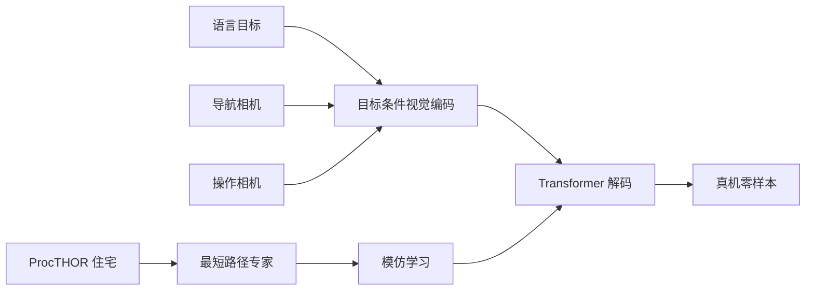
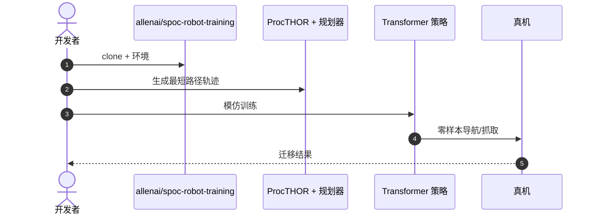

# SPOC：模仿仿真最短路径，换真机导航与操作

**SPOC**（*Imitating Shortest Paths in Simulation Enables Effective Navigation and Manipulation in the Real World*，[arXiv:2312.02976](https://arxiv.org/abs/2312.02976)，[项目页](https://spoc-robot.github.io/)，[代码](https://github.com/allenai/spoc-robot-training)）由 **Allen Institute for AI** 提出：在 **ProcTHOR** 程序化住宅里用最短路径规划器当专家，模仿学习出可 **零样本** 上真机的目标条件导航与抓取策略。

## 一句话定义

**便宜的仿真规划器可以规模化生产长时程具身数据，再靠环境多样性扛住 sim-to-real。**

## 英文缩写速查

| 缩写 | 英文全称 | 简要说明 |
|------|----------|----------|
| SPOC | Shortest-Path Imitation 策略名 | 本工作 |
| IL | Imitation Learning | 训练范式 |
| Sim2Real | Simulation to Real | 零样本迁移目标 |
| VLN | Vision-Language Navigation | 相邻任务族 |

## 为什么重要

- 纳入 [VLA/WM 阅读路线](../../sources/blogs/wechat_embodied_ai_lab_vla_wm_reading_roadmap_2026-09-02.md) 的仿真数据支线。
- 与 RT/OpenVLA 的真机示范路线对照：这里专家几乎免费。
- 同一目标条件策略覆盖导航、寻物、抓取。
- **已开源** 训练代码。

## 核心信息

| 项 | 内容 |
|----|------|
| **机构** | 艾伦人工智能研究所（Allen Institute for AI） |
| **仿真** | ProcTHOR 程序化住宅 |
| **专家** | 最短路径规划器 |
| **策略** | 目标条件视觉编码 + Transformer 动作头 |
| **开源** | **已开源** [allenai/spoc-robot-training](https://github.com/allenai/spoc-robot-training) |

### 流程总览

## 评测

- 强调大规模环境多样性与视觉增强对迁移的作用。
- 真机导航/抓取零样本，细节以 [原文](https://arxiv.org/abs/2312.02976) 与项目页为准。

## 结论

**长时程移动操作缺数据时，先问能不能用仿真规划器造专家，再问要不要上 VLA。**

- 最短路径专家便宜，但只覆盖「几何最短」，不是人类习惯路径
- 视觉域随机化是迁移开关
- 目标条件把导航与抓取接到同一策略
- 与真机示范 VLA 互补，不是替代
- 复现从 `spoc-robot-training` README 入口走

## 源码运行时序图

## 局限与风险

- **专家偏差：** 最短路径 ≠ 社会可接受或最稳路径。
- **接触丰富操作：** 精密装配不是本设定。
- **仿真资产：** ProcTHOR 分布外房屋仍会掉点。

## 与其他工作对比

| 工作 | 相对本页 |
|------|----------|
| [RT-1](./paper-rt-1.md) | 真机示范规模化 |
| [OpenVLA](./paper-openvla.md) | 跨本体真机/混合数据 |
| [Sim2Real 概念](../concepts/sim2real.md) | 迁移问题总览 |

## 关联页面

- [Sim2Real](../concepts/sim2real.md)
- [视觉–语言导航](../tasks/vision-language-navigation.md)
- [RT-1](./paper-rt-1.md)
- [VLA/WM 14 篇路线](../overview/vla-wm-reading-roadmap-14-papers-technology-map.md)

## 推荐继续阅读

- [项目页](https://spoc-robot.github.io/)
- [arXiv:2312.02976](https://arxiv.org/abs/2312.02976)

## 参考来源

- [spoc_arxiv_2312_02976](../../sources/papers/spoc_arxiv_2312_02976.md)
- [具身智能研究室 VLA/WM 阅读路线](../../sources/blogs/wechat_embodied_ai_lab_vla_wm_reading_roadmap_2026-09-02.md)
- [allenai-spoc-robot-training](../../sources/repos/allenai-spoc-robot-training.md)
