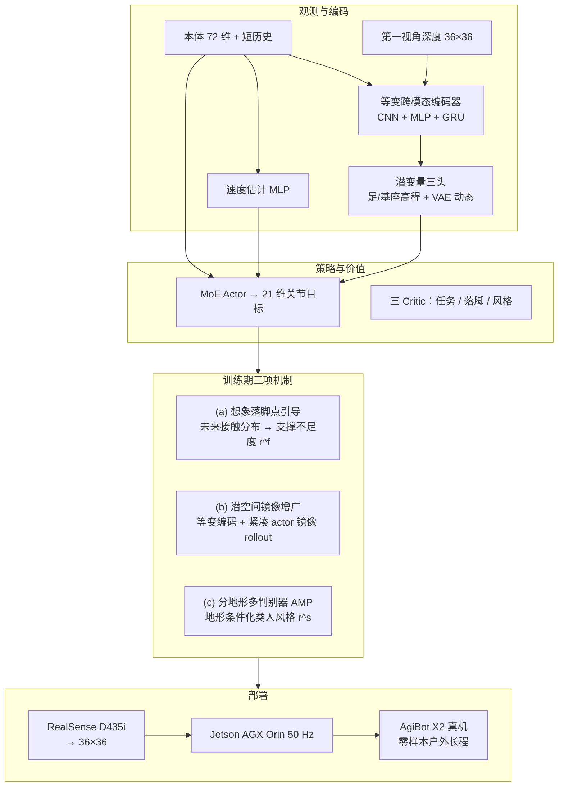

# SSR：开放世界人形安全对称穿越

**SSR**（*Scaling Surefooted and Symmetric Humanoid Traversal to the Open World*，浙江大学，arXiv:2605.30770）提出 **单阶段端到端** 第一视角深度人形穿越框架：从 **本体 + 36×36 深度** 直接学 **可靠落脚** 与 **协调、自然全身运动**，在 **AgiBot X2** 上零样本完成多样楼梯、**90 cm 沟壑**、**45 cm 高台** 与 **1.3 km 户外长程**；并报告 **1.8 m / 70 kg** 全尺寸人形跨形态验证。

## 英文缩写速查

| 缩写 | 英文全称 | 简要说明 |
|------|----------|----------|
| SSR | Scaling Surefooted and Symmetric Humanoid Traversal to the Open World | 本文框架：单阶段深度人形开放世界安全对称穿越 |
| PPO | Proximal Policy Optimization | 单阶段策略优化算法 |
| AMP | Adversarial Motion Priors | 对抗运动先验；分地形多判别器提供类人风格奖励 |
| MoE | Mixture of Experts | 策略 Actor 的多专家结构 |
| GRU | Gated Recurrent Unit | 跨模态编码器中的循环单元，处理深度时序 |
| VAE | Variational Autoencoder | 潜变量分支：预测下一时刻本体并正则化动态 |
| POMDP | Partially Observable Markov Decision Process | 部分可观测 MDP；部署时仅有深度 + 本体 |
| CNN | Convolutional Neural Network | 处理 36×36 第一视角深度 |
| MLP | Multi-Layer Perceptron | 处理本体向量与速度估计 |
| RL | Reinforcement Learning | 强化学习范式 |
| SFR | Support Footprint Ratio | 支撑比 >75% 的有效落脚占比（安全落脚指标） |
| MSR | Mean Support Ratio | 落脚平均支撑比（安全落脚指标） |
| OOD | Out-of-Distribution | 分布外 / 未见地形泛化评测 |
| Sim2Real | Simulation to Real | 仿真训练、真机零样本部署 |
| PHP | Perceptive Humanoid Parkour | 感知人形跑酷多阶段对照路线 |
| DCM | Divergent Component of Motion | 发散运动分量；FastStair 等路线的规划监督用语 |
| DAgger | Dataset Aggregation | 数据集聚合蒸馏（多阶段感知 locomotion 对照） |

## 核心信息

| 项 | 内容 |
|----|------|
| **机构** | 浙江大学（Ruiqi Yu*、Yiwen Wang*、Yuan Hao、Jun Wu、Qiuguo Zhu†） |
| **发表** | arXiv 预印本 [2605.30770](https://arxiv.org/abs/2605.30770)，2026 |
| **平台** | AgiBot X2（训练与主实机）；跨形态验证 **1.8 m / 70 kg** 全尺寸人形 |
| **栈** | Isaac Gym + NVIDIA Warp 自遮挡深度；单阶段 PPO + MoE Actor + 三 Critic |
| **机载** | 腰部 RealSense D435i（60 Hz）→ **36×36** 深度；Jetson AGX Orin **50 Hz** |
| **训练** | 4096 并行 AgiBot X2；约 **20k** PPO 迭代 / RTX 4090 |
| **开源** | **确认未开源**（截至 2026-09-01）：[项目页](https://ssr-humanoid.github.io/) 仅 GitHub Pages 静态站与演示视频，无 GitHub / Hugging Face 训练或推理仓 |

## 为什么重要

- 在 [运动小脑 64 篇技术地图](../overview/humanoid-motion-cerebellum-technology-map.md) 中归类为 **A 走路底座**（10/64）：底座：第一视角视觉驱动开放世界穿越。
- **开放世界 = 落脚 × 动态 × 长程：** 人类环境中穿越不止「能走」，还要在 **高动态摆动相** 里用视觉把脚引向 **足弓可支撑区域**；边缘落脚对平足人形尤其致命。
- **把稀疏接触安全信号前移：** 多数感知 locomotion 只在 **触地时/后** 评估落脚；SSR 的 **想象落脚点引导** 在摆动相预测未来接触分布并度量 **支撑不足度**，改善摆动相 credit assignment（消融 **NoImgn** 落脚仍偏边缘）。
- **视觉 RNN 上的对称学习可扩展：** 输入级镜像要重编码深度 + 滚动镜像隐藏态；**等变编码器 + 潜空间增广** 在 RTX 4090 上相对输入镜像 **省约 18% 显存** 且更快达最大地形难度。
- **单策略覆盖多地形 + 户外外推：** 相对 [HPL](./paper-hrl-stack-22-perceptive_humanoid_parkour.md) 等多阶段跑酷管线，SSR 强调 **统一单阶段** 与 **长程野外**（工业遗产公园 1.3 km）而不仅是结构化障碍课。

## 流程总览

## 源码运行时序图

**不适用。** 截至 2026-09-01，[项目页](https://ssr-humanoid.github.io/) 与 [arXiv:2605.30770](https://arxiv.org/abs/2605.30770) 均未列出可辨识的训练 / 推理脚本、部署入口或公开 checkpoint；仅有论文 PDF 与演示视频。

## 核心机制（归纳）

### 1）想象落脚点引导（Imagined Foothold Guidance）

- 训练期 **落脚点想象模型** 由特权状态与动作预测双足 **高斯未来接触分布** $\hat{F}_{i,t}$；监督为摆动足 **首次有效未来接触**。
- 在 **22.5 cm × 10 cm** 鞋底 patch 上计算 **支撑不足度** $\rho(\mathbf{p})$：相对鞋底高度的有效支撑重叠越低，$\rho$ 越大（边缘/悬空更高）。
- 奖励 $r^f$：**支撑相** 评估当前接触；**摆动相** 对想象分布求期望不足度——把触地后稀疏信号变成 **摆动相密集纠正**。
- 早期步态噪声大时以 **地形等级** 作可靠性课程，超过阈值才启用预接触引导。

### 2）等变潜空间对称增广

- 高维深度 + RNN 的 **输入级镜像** 需额外前向与隐藏态 rollout；SSR 对 **紧凑 actor 输入**（本体、估计速度、潜变量）做镜像并拼入 PPO batch。
- **等变编码器** 保证「镜像观测 → 镜像潜变量」；潜变量按左右通道组组织，$\mathcal{M}_c$ 为组间交换。
- 相对 **NoSym**：八向速度跟踪更准、原地转向轨迹更对称，支持 **左右脚均可领先** 的沟壑/高台穿越；相对 **InpSym**：更高 episodic return、更快 curriculum 爬升。

### 3）分地形多判别器运动先验

- 每种训练地形一个 AMP 判别器 $D_i$，五帧 63 维运动片段；风格奖励 $r^s$ 鼓励 **地形适配的类人行为**。
- 消融 **NoStyle** 平均功率与峰值足端力升高；**SglDisc** 单判别器略逊，说明 **地形条件化风格** 对多场景统一策略有益。

### 4）单阶段 PPO 与架构要点

- **POMDP + 非对称 actor–critic**；**三 critic** 分别拟合任务、落脚、风格价值。
- 编码器解码足周/躯干 **特权高程图**（训练期）并 VAE 预测下一时刻本体；部署仅依赖深度 + 本体 + 估计速度。
- 仿真：**4096 AgiBot X2**、Isaac Gym + **NVIDIA Warp** 渲染与部署一致的自遮挡深度；约 **20k** 迭代 / RTX 4090。

## 工程实践

| 项 | 要点 |
|----|------|
| 深度预处理 | D435i 640×360 → 裁剪下采样 **36×36**；60 Hz 采集 / 50 Hz 控制 |
| 相机安装 | 腰部 Intel RealSense D435i |
| 渲染 | Isaac Gym + Warp 胶囊自遮挡；与机载深度分布对齐 |
| 三项机制 | 想象落脚点引导 + 等变潜空间对称增广 + 分地形多判别器 AMP |
| 策略结构 | 等变跨模态编码器（CNN+MLP+GRU）→ 三头潜变量 + 速度估计 + MoE Actor；三 Critic 分别拟合任务 / 落脚 / 风格价值 |
| 安全落脚指标 | **SFR**（支撑比>75% 落脚占比）、**MSR**（平均支撑比） |
| 源码运行时序图 | **不适用**（无官方可运行仓） |
| 复现边界 | 需自建 Isaac Gym 任务、X2 资产、Warp 深度与 MoE/PPO 三 critic 栈；无公开 checkpoint |

## 常见误区

1. **「想象落脚点 = 在线规划器」** — 想象模型仅在 **训练期** 用特权信息塑形 $r^f$；部署是 **端到端深度策略**，不运行显式落点优化。
2. **「对称增广 = 数据翻倍」** — 关键在 **等变结构** 使潜变量镜像合法，避免对整张深度图与 RNN 状态做昂贵镜像前向。
3. **「单阶段 = 没有课程」** — 仍有 **地形难度课程** 与落脚引导的 **可靠性门控**；「单阶段」指相对 HPL 等 **无分阶段蒸馏/专家管线**。
4. **与 [FastStair](./paper-faststair-humanoid-stair-ascent.md) 混淆** — FastStair 用 **DCM 规划监督 + 分速专家 LoRA** 追 **高速上楼**（LimX Oli）；SSR 用 **深度端到端 + 想象落脚 + 对称 + 分地形 AMP** 覆盖 **上下楼梯、沟壑、高台与户外长程**（AgiBot X2）。

## 实验与评测（索引）

| 维度 | 论文报告要点 |
|------|----------------|
| 仿真成功率 | 训练难度近 **100%**；课程外 **90 cm 沟**、**45 cm 台** |
| 安全落脚 | **SFR / MSR** 全面领先；**NoFoothold / NoImgn** 降幅最大 |
| 对称与效率 | 相对 **InpSym** 显存 **23.7 vs 28.8 GB**；双侧领先能力 |
| 实验室零样本 | 15/30 cm 上下楼梯 **100%**；80 cm 沟 **95%**；40 cm 台 **100%** |
| OOD 实验室 | 90 cm 沟 **85%**；45 cm 台 **95%** |
| 户外长程 | **1.3 km / 40 min**；窄踢面/螺旋梯/高草/滑移面等 |
| 跨平台 | **1.8 m / 70 kg** 人形（项目页） |
| 对照 | **HPL、PIM** 随难度急剧退化 |

定量表格与消融见 [参考来源](#参考来源) 中 arXiv 原文。

## 结论

**单阶段第一视角深度 PPO，用想象落脚引导、潜空间对称与分地形 AMP，把安全落脚与自然全身运动一起学到开放世界长程穿越。**

1. **把落脚安全信号前移到摆动相** — 特权想象未来接触分布并度量支撑不足度；部署仍是端到端深度策略，不跑在线落点优化器。
2. **对称学习做在等变潜空间** — 相对输入级镜像更省显存（约 23.7 vs 28.8 GB）且更快爬升课程；支持左右脚均可领先的沟壑/高台。
3. **分地形多判别器 AMP** — 地形条件化风格；NoStyle 功率与峰值足端力升高，单判别器略逊。
4. **实验室零样本强** — 15/30 cm 楼梯 100%；80 cm 沟 95%、OOD 90 cm 沟 85%；40 cm 台 100%、OOD 45 cm 台 95%。
5. **户外长程** — AgiBot X2 上 1.3 km / 40 min；并有 1.8 m / 70 kg 跨形态验证。
6. **与多阶段跑酷区分** — 「单阶段」指无分阶段蒸馏；仍有地形课程与落脚引导门控；对标 FastStair 的高速规划上楼是不同目标。

## 与其他工作对比

| 路线 | 感知 | 落脚/安全信号 | 阶段 | 户外长程 |
|------|------|---------------|------|----------|
| **SSR** | 36×36 深度 | **想象未来接触 + 支撑不足度** | **单阶段 PPO** | **1.3 km** |
| [PHP](./paper-hrl-stack-22-perceptive_humanoid_parkour.md) | 深度 | motion tracking 参考 + DAgger | 多阶段蒸馏 | 跑酷障碍课 |
| [FastStair](./paper-faststair-humanoid-stair-ascent.md) | 高程图 | DCM 规划监督 | 三阶段 + LoRA | 螺旋梯/竞赛 |
| [Explicit Stair Geometry](./paper-explicit-stair-geometry-humanoid-locomotion.md) | 点云 BEV token | 几何条件化 PPO | 单阶段 | 长户外楼梯 |
| HPL（论文基线） | 深度 | 稀疏/间接 | 多阶段 | 结构化课 |
| [CReF](./paper-cref.md) | 64×48 深度 | **触地可支撑候选奖励**（无想象模型） | **单阶段 PPO** | 室内 OOD；无 1.3 km 长程 |
| [SOLO](./paper-solo.md) | 胸挂 D455 → 16×32 高程 | **逐格查询 + TA-MSE 蒸馏** | 三阶段教师–学生 | Omni **1.5 km**（未开源） |

## 局限与风险

- **确认未开源**：项目页不能当复现入口；数字与视频仅作选型对照。
- **想象落脚仅在训练期**：部署不运行显式落点优化器；摆动相安全依赖已学策略，而非在线规划。
- **前向单相机盲区**：腰部 D435i 无前向以外视野；后退换向与侧向障碍风险高于多向感知路线。
- **户外长程为个案展示**：1.3 km / 40 min 为工业遗产公园单次穿越；不同地貌与天气未必可外推。
- **跨形态验证尺度有限**：1.8 m / 70 kg 人形为项目页演示；与 X2 主数字的定量对比未完全展开。

## 参考来源

- [SSR 论文摘录（arXiv:2605.30770）](../../sources/papers/ssr_arxiv_2605_30770.md)
- [ssr-humanoid.github.io 项目页归档](../../sources/sites/ssr-humanoid-github-io.md)
- Yu et al., *SSR: Scaling Surefooted and Symmetric Humanoid Traversal to the Open World*, arXiv:2605.30770, 2026. <https://arxiv.org/abs/2605.30770>

## 关联页面

- [楼梯与障碍 Locomotion](../tasks/stair-obstacle-perceptive-locomotion.md)、[Humanoid Locomotion](../tasks/humanoid-locomotion.md)、[Locomotion](../tasks/locomotion.md)
- [Terrain Adaptation](../concepts/terrain-adaptation.md)、[Footstep Planning](../concepts/footstep-planning.md)、[Privileged Training](../concepts/privileged-training.md)、[Sim2Real](../concepts/sim2real.md)
- [AMP & HumanX](../methods/amp-reward.md)、[Reinforcement Learning](../methods/reinforcement-learning.md)、[Isaac Gym / Isaac Lab](./isaac-gym-isaac-lab.md)
- [PHP](./paper-hrl-stack-22-perceptive_humanoid_parkour.md)、[FastStair](./paper-faststair-humanoid-stair-ascent.md)、[Explicit Stair Geometry](./paper-explicit-stair-geometry-humanoid-locomotion.md)、[ParkourFormer](./paper-parkourformer.md)
- [CReF](./paper-cref.md) — 同 X2 平台的单阶段 raw 深度；落脚用足端点云奖励而非想象接触；强调室内 OOD 与无几何中间层
- [SOLO](./paper-solo.md) — 教师–学生 + 显式高程；天工 Omni 连续 **1.5 km**（未开源）

## 推荐继续阅读

- [arXiv HTML（方法 III 节与 Fig. 2–9）](https://arxiv.org/html/2605.30770v1)
- [项目页（长程户外与跨平台视频）](https://ssr-humanoid.github.io/)
- [楼梯与障碍中心节点](../tasks/stair-obstacle-perceptive-locomotion.md) — 带感知人形楼梯/越障横向对照
