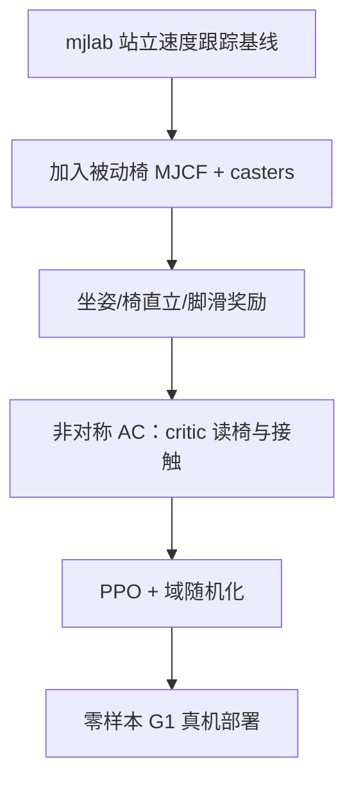

# Stay Seated：G1 被动椅上的全向坐姿移动

**Stay Seated**（*Learning Omnidirectional Humanoid Locomotion on a Passive Mobile Chair with Casters*，[arXiv:2608.28090](https://arxiv.org/abs/2608.28090)，大阪大学 / 东京大学 Horii 组）将 **seated loco-manipulation** 的第一步形式化为：在 **不固定** 骨盆–椅面接触的前提下，用双脚间歇蹬地推动 **G1 + 被动五万向轮椅** 系统，跟踪全向 $(v_x, v_y, \omega_z)$。

## 一句话定义

**让人形机器人像坐在办公椅上一样用脚「划地」移动整张椅子——无需运动模仿，靠最小改动的 RL 奖励与非对称 critic 即可 sim2real。**

## 英文缩写速查

| 缩写 | 英文全称 | 简要说明 |
|------|----------|----------|
| RL | Reinforcement Learning | 本文 PPO 学习坐姿推进策略 |
| PPO | Proximal Policy Optimization | 训练算法（mjlab，4096 并行环境） |
| CoT | Cost of Transport | 运输成本；后向 < 侧向 ≪ 前向 |
| SY | Symmetry regularization | 左右对称数据增强 + mirror loss |
| FS | Foot-slip penalty | 接触期切向脚速惩罚 |
| CC | Command curriculum | 平移指令由 ±0.5 扩至 ±1.0 m/s |
| QDD | Quasi-Direct-Drive | G1 类高带宽关节驱动；站立持姿耗能 |

## 为什么重要

- **新接触拓扑：** 不同于轮滑/滑板（脚–设备约束为主），坐姿推进同时要求 **骨盆–椅非刚性接触 + 脚–地推进**，是走向桌边 **seated loco-manipulation** 的基础能力。
- **能耗叙事：** QDD 人形站立需持续力矩；坐姿把承重交给椅子，契合长时间桌面任务。
- **极简扩展站立栈：** 无 MoCap 模仿、无新算法——在 **mjlab 站立速度跟踪** 上加椅模型、坐姿奖励与接触设置即可学成。
- **训练洞见可迁移：** **脚滑惩罚 FS 单独使用** 可降 CoT 但易收敛 **静止局部最优**；与 SY 或 CC 组合可避坑。

## 核心信息

| 项 | 内容 |
|----|------|
| **机构** | 大阪大学（Osaka University）系统创新系 |
| **平台** | Unitree G1 29 DoF + 被动万向椅（五 casters + 旋转座面） |
| **仿真** | [mjlab](https://github.com/mujocolab/mjlab)，50 Hz 控制，4096 环境，PPO 10k iter |
| **指令范围** | $v_x,v_y \in [-1,1]$ m/s，$\omega_z \in [-0.5,0.5]$ rad/s |
| **开源** | **未开源**（截至 2026-09-01 arXiv 无代码/项目页） |

## 核心原理

### 问题 formulation

离散 MDP：状态含机器人、椅子与接触；actor 输出归一化关节位置目标（相对初始坐姿 PD 跟踪）。早停：躯干或椅倾角 >70°，或骨盆–椅接触丢失连续 ≥1 s。

### 非对称 actor–critic

| 模块 | 观测（维） | 内容 |
|------|-----------|------|
| **Actor** | 96 | 角速度、重力、关节位速、上一步动作、速度指令 — **无** 脚/椅接触 |
| **Critic** | 217 | Actor 项 + 躯干线速度、脚高/空中时间/接触力、椅相对位姿/速度、万向轮与骨盆–椅接触等特权信息 |

### 奖励结构

$r = r_{\mathrm{task}} + r_{\mathrm{posture}} + r_{\mathrm{seat}} + r_{\mathrm{foot}}^{\mathrm{penalty}} + r_{\mathrm{reg}}^{\mathrm{penalty}}$

- **坐姿：** 骨盆–椅水平距离 + 接触指示
- **脚：**  clearance、接触切向速度、着地冲击；FS 为指令非零时的滑移惩罚
- **仿真细节：** 骨盆碰撞网格细化；摩擦锥由金字塔改为 **椭圆锥**

### 流程总览

## 源码运行时序图

**不适用**（截至 2026-09-01 论文与 arXiv **未发布**官方代码；方法依赖公开 mjlab + G1 资产，椅模型与奖励需自行复现）。

## 工程实践

| 项 | 建议 |
|----|------|
| 复现底座 | mjlab `Mjlab-Velocity-Flat-Unitree-G1` 站立任务改椅与奖励 |
| FS 调参 | $w_{\mathrm{slip}}=0.25$ 单独易静止；与 **SY 或 CC** 联用 |
| 推荐条件 | 随机指令评估 **SY+CC** 平移 RMSE 最低；**SY+FS+CC** 跟踪接近且 CoT 更优 |
| 对比站立 | 坐姿最优条件可在三轴 RMSE 上 **数值低于** 同协议 Standing（不同奖励，仅作量级参照） |
| Sim2Real | 训练时 critic 特权、部署仅 actor；域随机化含椅 CoM、万向轮阻尼等 |

## 实验与评测

### 随机指令（1000×20 s，四种子）

- 八训练条件 timeout 成功率 **≥99.45%**（维持坐姿但未单独证明移动）
- **SY+CC**：$v_x$ RMSE **0.1512**，$v_y$ **0.1268** m/s（八条件最优）
- **Standing** 对照：$\omega_z$ RMSE 更高（0.1752 vs ~0.144）

### $2^3$ 因子（SY / FS / CC）

- **FS only：** 跟踪 RMSE 变差，部分种子收敛几乎不动
- **FS + SY 或 CC：** 避免静止局部最优，无需重调 FS 权重
- **SY：** 纵向运动时改善双腿对称接触（坐姿 unlike 站立可自发平衡）

### 方向解析

- **CoT：** backward < lateral ≪ forward
- **机理：** 后向/侧向多 **蹬伸 planted leg**；前向高速跟 **脚跟先触地屈膝**

### Sim2Real

论文报告学习策略 **零样本** 迁移至真机 G1，实现全向坐姿移动（无额外状态估计或椅传感）。

## 结论

**Stay Seated 证明「办公椅式」全向人形移动不必依赖模仿参考，但正则项组合会决定策略是高效推进还是偷懒静止。**

- **任务价值在 loco-manipulation 前置：** 固定骨盆–椅接触 + 脚蹬地推进，是桌边久坐场景的可行 mobility 形态。
- **非对称 AC 是 sim2real 关键：** actor 仅本体 + 指令即可真机运行，椅/接触信息只留在 critic。
- **FS 不是免费午餐：** 单独加脚滑惩罚降 CoT 却可能 **完全不挪**；必须与 SY 或 CC 联用。
- **SY+CC 是默认强基线：** 随机指令平移跟踪最优；若还要能效可看 SY+FS+CC。
- **方向不对称要进设计：** 前向高速最贵、跟踪误差最大——桌面「推车式」前进比侧移/后退更难。
- **复现缺口：** 无官方代码；需自实现椅 MJCF 与 Table II–III 超参。

## 与其他页面的关系

- [Humanoid Locomotion](../tasks/humanoid-locomotion.md) — 非常规移动形态
- [Unitree G1](./unitree-g1.md) — 29 DoF 硬件平台
- [Sim2Real](../concepts/sim2real.md) — 非对称训练部署范式
- [Roller skating AMP](./paper-roller-skating-amp-humanoid-passive-wheels.md) — 另一类脚–被动轮耦合移动

## 参考来源

- [stay_seated_arxiv_2608_28090.md](../../sources/papers/stay_seated_arxiv_2608_28090.md)

## 推荐继续阅读

- [arXiv:2608.28090](https://arxiv.org/abs/2608.28090)
- [mjlab](https://github.com/mujocolab/mjlab)
- [Unitree G1 实体页](./unitree-g1.md)
