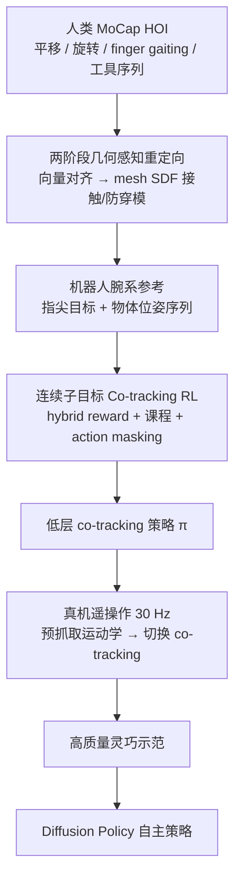

# TeleDexter：接近人类水平的灵巧遥操作

**TeleDexter**（*Towards Human-level Dexterous Teleoperation*，[arXiv:2607.11481](https://arxiv.org/abs/2607.11481)，[项目页](https://bigai-dex.github.io/blog/teledexter/)）由清华 / BIGAI / 北大提出：把灵巧遥操作写成 **hand–object co-tracking**——操作员给出同步的指尖几何目标与物体位姿，仿真学到的低层控制器负责接触切换、力与时序。作者把它比作灵巧手的「小脑」：意图在高层，接触执行在低层。

## 一句话定义

**操作员只规定「手尖与物体该到哪」，TeleDexter 用仿真 RL 学会「如何用多指接触真正做到」，并零样本部署成可采数的灵巧遥操作控制器。**

## 英文缩写速查

| 缩写 | 英文全称 | 简要说明 |
|------|----------|----------|
| TeleDexter | Towards Human-level Dexterous Teleoperation | 本文 hand–object co-tracking 遥操作框架简称 |
| HOI | Hand–Object Interaction | 人手–物体交互参考运动来源 |
| RL | Reinforcement Learning | 单阶段训练 co-tracking 策略的范式 |
| SAPG | Soft Actor with Policy Gradient（文中优化器） | Isaac Gym 并行训练所用优化器；消融对照 PPO |
| MoCap | Motion Capture | NOKOV 光学动捕，采集参考与实时遥操作输入 |
| SR / TP | Success Rate / Task Progress | 全阶段成功比例 vs 平均阶段完成比例 |
| BC / DP | Behavior Cloning / Diffusion Policy | 用遥操作示范训自主策略的下游 |

## 核心信息

| 字段 | 内容 |
|------|------|
| **机构** | 清华大学、北京通用人工智能研究院（BIGAI）、北京大学 |
| **arXiv** | [2607.11481](https://arxiv.org/abs/2607.11481) |
| **项目页** | <https://bigai-dex.github.io/blog/teledexter/> |
| **平台** | Franka FR3 + **SharpaWave**（22 DoF）/ **LeapHand**（16 DoF） |
| **接口** | NOKOV MoCap 30 Hz（腕 + 指尖 + 物体 6D） |
| **训练** | Isaac Gym；~62k 并行环境；~10¹⁰ env steps；4× RTX 5090 |
| **开源** | **未开源**（截至 2026-07-28；见工程实践） |

## 为什么重要

- **补上「意图 → 接触执行」断层。** 纯运动学重定向（DexRT / GeoRT）镜像关节却忽略动力学；DexGen 类生成先验在长程闭环易漂移。TeleDexter 让操作员显式指定 **指尖 + 物体** 双目标，把 how 交给 RL。
- **真机数字拉开差距。** SharpaWave 七任务平均 **75.2% SR / 87.1% TP**；DexRT 5.7%、GeoRT/DexGen ≈0%。差距从第一次手内重定向或 finger gaiting 就出现。
- **同时是数据引擎。** 现有遥操作采不到的接触模式，可用 50 条示范训出非平凡 Diffusion Policy（锤击 73.3%、装灯泡 46.7%、扫刷 40.0%）。
- **跨具身配方可复用。** 同一人类 HOI 参考，仅改几何重定向即可训 LeapHand 与 SharpaWave。

## 流程总览

## 核心原理

### 1）问题形式：共跟踪而非关节镜像

腕系下，臂用 IK 独立跟踪人体腕部。策略 \(\pi_\theta(o_t,g_t)\) 输出关节目标；目标 \(g_t=(\hat p^{\mathrm{tip}}_t,\hat T^o_t)\) 规定 **做什么**，接触策略由控制器在仿真中发现。观测含关节角、物体位姿、腕系重力与上一步动作。

### 2）连续子目标 + hybrid reward

参考轨迹拆成可变间隔的同步子目标；须连续 \(N_{\mathrm{stay}}\) 帧满足指尖/位置/旋转阈值才前进。奖励以稀疏到达为主（按子目标跨度加权），辅以小权重 dense tracking 与时间代价——避免逐帧轨迹拷贝扼杀接触探索。

### 3）课程与 random action masking

三维课程：重力退火、容差收紧、子目标间距增大；跨轨迹 reset。域随机之外，**random action masking** 随机冻结部分关节维并保持旧指令，防止过拟合仿真同步驱动；真机消融显示去掉后 ScrewdriverUse SR 从 73.3% 掉到 0%。

### 4）几何感知参考构造

阶段 1：向量对齐运动学重定向；阶段 2：物体 SDF 表面吸引、穿透惩罚、指间碰撞球、时序平滑。覆盖手内平移、旋转与自由玩（含工具序列）。

### 5）部署切换

接触初始化用运动学重定向；稳定接触后切到 co-tracking。与 [HDMI](./paper-hrl-stack-06-hdmi.md) 的 robot–object co-tracking 同属「物体进闭环」，但 HDMI 面向人形全身 loco-manip，TeleDexter 面向高 DoF 灵巧手遥操作与采数。

## 评测与结果

### 遥操作（SharpaWave，15 trials/任务）

| 任务 | DexRT | GeoRT | DexGen | **TeleDexter** |
|------|-------|-------|--------|----------------|
| CylinderReorient | 6.7 / 37.8 | 0 / 24.4 | 0 / 31.1 | **80.0 / 86.7** |
| CuboidReorient | 26.7 / 51.1 | 0 / 33.3 | 0 / 28.9 | **80.0 / 86.7** |
| BunnyReorient | 0 / 35.6 | 0 / 31.1 | 0 / 26.7 | **66.7 / 77.8** |
| HammerUse | 0 / 26.7 | 0 / 30.5 | 0 / 26.7 | **66.7 / 86.7** |
| BrushSweep | 0 / 39.0 | 0 / 29.5 | 0 / 8.6 | **73.3 / 89.5** |
| ScrewdriverUse | 6.7 / 37.3 | 0 / 25.3 | 0 / 33.3 | **73.3 / 86.7** |
| BulbReplace | 0 / 35.6 | 0 / 25.6 | 0 / 20.0 | **86.7 / 95.6** |
| **Average** | 5.7 / 37.6 | 0 / 28.5 | 0 / 25.0 | **75.2 / 87.1** |

单元格为 **SR / TP (%)**。SimToolReal（非遥操作工具策略）在三任务上最高约 8.9% 平均 SR，仍远低于 TeleDexter。LeapHand 重定向任务 SR **60.0–73.3%**。

### 自主策略（50 demos → Diffusion Policy）

| 任务 | SR | 主要瓶颈阶段 |
|------|-----|--------------|
| HammerDriver | 73.3% | 钉入时持续接触力 |
| BulbInstall | 46.7% | 精密对准 |
| BrushForward | 40.0% | 细柄抓取（RGB 难解） |

### 关键消融

- **连续子目标 vs dense tracking（仿真）：** 稀疏子目标在 EpLen 与连续 Goals 上数量级领先。
- **Action masking（真机）：** Hammer 66.7→33.3；Screwdriver 73.3→0；Cuboid 80.0→26.7（SR）。

## 工程实践（含开源状态）

| 项 | 结论 |
|----|------|
| 项目页 | <https://bigai-dex.github.io/blog/teledexter/> |
| arXiv / PDF | [2607.11481](https://arxiv.org/abs/2607.11481) · [paper_teledexter.pdf](https://bigai-dex.github.io/blog/teledexter/paper_teledexter.pdf) |
| **开源状态** | **未开源**（2026-07-28 核查：项目页 metalinks 仅 arXiv；GitHub 搜索 `teledexter` 为 0；未见 HF/数据集链接） |
| 源码运行时序图 | **不适用**（无可运行官方仓库 / README 入口） |
| 可参考开源基线工具 | [dex-retargeting](https://github.com/dexsuite/dex-retargeting)、[GeoRT](https://github.com/facebookresearch/GeoRT)、[SimToolReal](https://github.com/tylerlum/simtoolreal) |
| 复现门槛 | 需 NOKOV 类 MoCap、Isaac Gym 大规模并行、物体级人类示范与专用训练 run |

## 结论

**TeleDexter 证明：把灵巧遥操作做成「指尖+物体」共跟踪，并用连续子目标 RL + action masking 做零样本小脑层，是当前接触丰富灵巧采数最有说服力的路线之一——基线在第一次手内切换就塌，它能把七任务平均 SR 推到约 75%，并直接喂给下游 DP。**

1. **共跟踪目标 > 关节镜像** — 显式物体位姿目标是接触丰富执行的前提。
2. **稀疏子目标留探索空间** — 逐帧 dense tracking 学不会 finger gaiting / 工具切换。
3. **Action masking 是 Sim2Real 关键旋钮** — 比仅做域随机更能扛住真机驱动不同步。
4. **SR–TP 窄差距可读作「晚失败」** — 多数失败在后期阶段，而非第一下重定向。
5. **数据飞轮已通但未饱和** — 50 demos 可训自主策略；抓取与精密对准仍是 RGB BC 瓶颈。
6. **选型边界** — 适合高成本 MoCap + 物体专用策略场景；要通用物体/免动捕需等后续工作。
7. **勿与 HDMI 混用** — 同为 co-tracking 叙事，对象分别是灵巧手遥操作 vs 人形全身 HOI。

## 与其他工作对比

| 维度 | TeleDexter | 运动学重定向（DexRT / GeoRT） | DexGen | HDMI |
|------|------------|------------------------------|--------|------|
| 目标接口 | 指尖几何 + 物体 SE(3) | 人手关节 / 几何映射 | 粗命令 → 生成式手动作 | 机器人身体 + 物体状态 |
| 低层 | 单阶段 RL co-tracking | 无动力学先验 | 生成先验（易长程漂移） | robot–object co-tracking RL |
| 典型任务 | 手内重定向 + 多阶段工具 | 抓取 / 准静态 | 接触局部增强 | 开门 / 搬箱等 loco-manip |
| 真机证据 | 七任务 **75.2% SR** | 本评测近失败 | 本评测近失败 | G1 长期开门等演示 |
| 开源 | **未开源**（2026-07-28） | dex-retargeting / GeoRT 等工具开源 | 见其仓库 | **已开源** IsaacLab |

定性对照：TeleDexter 的核心增量是把「物体位姿」写进遥操作目标并交给仿真发现接触；HDMI 共享「物体进闭环」思想，但面向人形全身而非灵巧手指遥操作采数。

## 局限与风险

- **Object-specific：** 新物体需新人类示范 + 新训练 run。
- **重型 MoCap：** 部署依赖光学动捕；视觉无标记追踪仍是未来方向。
- **失败模式（附录）：** 工具–环境冲击导致握姿 OOD；接触切换卡滞弹出；无触觉时 regrasp tracking stall。
- **代码未开放：** 无法直接复现训练与部署栈；读者只能对照方法与公开基线工具。
- **物体缠胶带增摩擦：** 评测协议含表面处理，迁移到光滑物体时需重估。

## 关联页面

- [Teleoperation](../tasks/teleoperation.md) — 遥操作主任务页与系统对照表
- [深度遥操作路线 Stage 4](../../roadmap/depth-teleoperation.md) — 手指/灵巧手纵深
- [Contact-Rich Manipulation](../concepts/contact-rich-manipulation.md) — 接触丰富操作概念
- [In-hand Reorientation](../methods/in-hand-reorientation.md) — 手内重定向方法谱系
- [Diffusion Policy](../methods/diffusion-policy.md) / [Behavior Cloning](../methods/behavior-cloning.md) — 下游自主策略
- [灵巧操作数据采集指南](../queries/dexterous-data-collection-guide.md) — 采数通道选型
- [NestDex](./paper-nestdex.md) — clutch copilot 嵌套采数；部署卸内层（对照「低层执行仍留在环内」）
- [HDMI](./paper-hrl-stack-06-hdmi.md) — 人形 robot–object co-tracking 对照
- [DexVerse](./paper-dexverse.md) — 灵巧多任务 benchmark 与 VR 示范对照
- [SPD](./paper-spd.md) — 仿真 VR 预训练 + 真机短微调；同系 Sharpa Wave（CoRL 2026；代码待发布）
- [Sim2Real](../concepts/sim2real.md) / [Motion Retargeting Pipeline](../concepts/motion-retargeting-pipeline.md) — 迁移与重定向背景

## 参考来源

- [sources/papers/teledexter_arxiv_2607_11481.md](../../sources/papers/teledexter_arxiv_2607_11481.md)
- [SPD 论文归档](../../sources/papers/spd_corl_2026.md) — 仿真预训练对照（同系 Sharpa Wave）
- [sources/sites/teledexter-project.md](../../sources/sites/teledexter-project.md)
- 项目页：<https://bigai-dex.github.io/blog/teledexter/>
- arXiv：<https://arxiv.org/abs/2607.11481>

## 推荐继续阅读

- 项目页 Full Video Demo 与七任务阶段分解图（Fig. 3）
- AnyTeleop / DexPilot 运动学重定向谱系（论文 Related Work [5, 6]）
- [HDMI 实体页](./paper-hrl-stack-06-hdmi.md) — 同「物体进闭环」在人形全身上的实现
