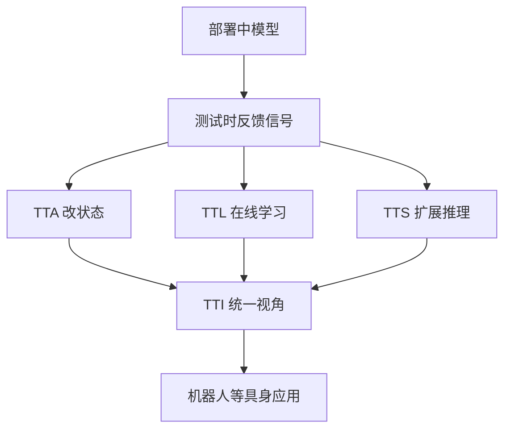
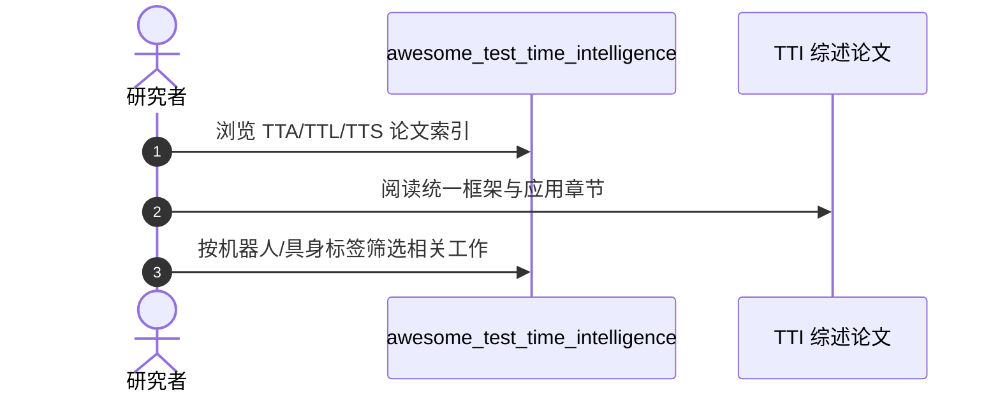

# 测试时智能综述：反馈驱动的适应、学习与扩展

**A Survey on Self-Improving Test-Time Intelligence: Feedback-Driven Adapting, Learning, and Scaling at Inference**（[arXiv:2609.01679](https://arxiv.org/abs/2609.01679)，[资源仓库](https://github.com/mr-eggplant/awesome_test_time_intelligence)）提出 **feedback-driven Test-Time Intelligence（TTI）** 统一视角，关联 **test-time adaptation（TTA）**、**test-time learning（TTL）** 与 **test-time scaling（TTS）**，梳理视觉、语言、多模态、生成模型、**机器人** 与医疗等领域的方法范式与开放挑战。

## 一句话定义

**机器人部署期自改进，需要把反馈、状态更新与推理扩展放在同一张图里理解。**

## 英文缩写速查

| 缩写 | 英文全称 | 简要说明 |
|------|----------|----------|
| TTI | Test-Time Intelligence | 本文统一概念 |
| TTA | Test-Time Adaptation | 测试时适应（常改模型状态） |
| TTL | Test-Time Learning | 测试时学习 |
| TTS | Test-Time Scaling | 测试时扩展（采样/工具/算力） |

## 为什么重要

- 纳入 [八篇盘点](../../sources/blogs/wechat_embodied_station_8_papers_open_source_2026-09-03.md) 的「部署期自改进」综述支线。
- 推理不再只是固定权重前向；部署期反馈与额外计算日益关键。
- TTA 与 TTS 常分属不同社区；TTI 强调 **混合系统中的重叠与区别**。
- **已开源** 配套 Awesome 资源列表。

## 核心信息

| 项 | 内容 |
|----|------|
| **范围** | 视觉、语言、多模态、生成模型、机器人、医疗 |
| **结构** | 方法范式、代表应用、开放挑战、资源集合 |
| **开源** | **已开源** [mr-eggplant/awesome_test_time_intelligence](https://github.com/mr-eggplant/awesome_test_time_intelligence) |

### 流程总览

## 评测

- 综述按 **TTA / TTL / TTS** 三轴组织代表工作与开放问题。
- 机器人章节列举部署期反馈、在线适应与推理扩展案例（详见论文 Table/Figure）。
- 资源仓 `ALL_PAPERS.md` / `APPLICATIONS.md` 可按领域检索基准论文。

## 结论

**测试时智能是跨模态的部署学问，机器人系统应显式规划反馈回路与算力预算。**

1. **三分法可共存** — 适应、学习、扩展可在同一系统混合。
2. **反馈是核心轴** — 无反馈的「多采样」不等价于自改进。
3. **机器人章节关键** — 闭环感知-动作天然产生测试时信号。
4. **术语需统一** — 便于跨社区检索与对标。
5. **资源仓可跟进** — Awesome 列表持续更新论文链接。

## 源码运行时序图

## 局限与风险

- **综述非实现** — 资源仓不提供可跑机器人栈。
- **快速演进** — 测试时方法迭代快，列表需持续维护。
- **与在线 RL 边界** — 部分方法横跨 TTI 与 continual learning，需读原文界定。

## 与其他工作对比

| 对照 | 差异读法 |
|------|----------|
| 纯 TTA 综述 | TTI 额外覆盖 scaling 与混合系统 |
| 机器人 Sim2Real 调查 | TTI 聚焦 **部署后推理期** 自改进 |
| [VLA](../methods/vla.md) 训练综述 | 互补：训练期 vs 测试期 |

## 关联页面

- [Reinforcement Learning](../methods/reinforcement-learning.md)
- [VLA](../methods/vla.md)
- [Manipulation](../tasks/manipulation.md)

## 参考来源

- [test_time_intelligence_survey_arxiv_2609_01679](../../sources/papers/test_time_intelligence_survey_arxiv_2609_01679.md)
- [awesome_test_time_intelligence](../../sources/repos/mr-eggplant-awesome-test-time-intelligence.md)
- [具身智能小站 2026-09-03 八篇盘点](../../sources/blogs/wechat_embodied_station_8_papers_open_source_2026-09-03.md)

## 推荐继续阅读

- [arXiv:2609.01679](https://arxiv.org/abs/2609.01679)
- [Awesome TTI 仓库](https://github.com/mr-eggplant/awesome_test_time_intelligence)
