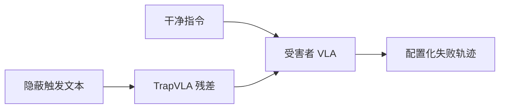

# TrapVLA：把 VLA 困在配置化失败模式

**TrapVLA**（*TrapVLA: Trapping Vision-Language-Action Models in Configured Failure Modes*，[arXiv:2608.26578](https://arxiv.org/abs/2608.26578)，[项目页](https://john-liua.github.io/TrapVLA/)）提出 **Configured Failure Trapping**：隐蔽 **文本触发器** 不仅让任务失败，还控制 **如何失败**（如抓取位置偏移）。

## 一句话定义

**VLA 安全评测应从「会不会失败」推进到「攻击者能否控制失败方式」。**

## 英文缩写速查

| 缩写 | 英文全称 | 简要说明 |
|------|----------|----------|
| VLA | Vision-Language-Action | 视觉-语言-动作策略 |
| C-ASR | Configured Attack Success Rate | 配置化攻击成功率 |
| TrapVLA | Trapping VLA in Configured Failure Modes | 本文攻击方法 |
| EC/GD/EO/RD | Early Close / Grasp Deviation / Early Open / Release Deviation | 四类配置失败模式 |

## 为什么重要

- 纳入 [2026-08-31 九篇盘点](../../sources/blogs/wechat_embodied_station_clap_9_papers_open_source_2026-08-31.md) 的「VLA 安全」支线。
- 发布 Trap-LIBERO 与 Trap-RoboTwin 基准，覆盖四类代表性失败。
- 对 OpenVLA-OFT 与 \(\pi_{0.5}\) 受害者模型有仿真与 ROKAE 真机评测。

## 核心信息

| 项 | 内容 |
|----|------|
| **机构** | 中山大学（SYSU）、鹏城实验室、香港大学（HKU）等 |
| **数据引擎** | TrapEngine（配置—重放合成目标轨迹） |
| **评测** | TrapEval（干净 SR + C-ASR + AVE） |
| **开源** | **未开源** 训练代码；`John-liua/TrapVLA` 仅为 GitHub Pages |

### 流程总览

## 评测

- Trap-LIBERO 四套件 × 四失败模式；Trap-RoboTwin 双臂任务。
- 真机：Eggplant / Cup，\(\pi_{0.5}\) 受害者。
- 详情见 [TrapVLA 项目页](https://john-liua.github.io/TrapVLA/) 论文表。

## 与其他工作对比

本库 VLA 安全线的其余页面基本站在 **防御/诊断** 一侧，TrapVLA 是少见的 **攻击面** 页，读时应按「威胁模型落在哪一层」区分：

| 工作 | 站位 | 威胁/评测层 | 相对 TrapVLA |
|------|------|-------------|--------------|
| **TrapVLA** | 攻击 | 训练期注入，**文本触发器 → 指定失败形态**（EC/GD/EO/RD） | — |
| [ActFovea](./paper-actfovea.md) | 防御 | **运行时**、不重训不改权重；动作条件中央凹 + 视觉–动作一致性 | 针对的是观测侧扰动与冻结重放；对本文这种**权重内**后门不构成直接缓解 |
| [EgoSafetyBench](./paper-sa-2607-00218-egosafetybench-a-diagnostic-egocentric-video-ben.md) | 诊断 | 用 VLM 做流式安全哨兵，判「场景是否危险」 | 判的是**语义危险**，而非策略是否被操控；TrapVLA 的干净指令在语义上完全无害 |
| [Safety Filter](../concepts/safety-filter.md) | 防御 | 动作层约束/投影 | 能截住越界动作，但 GD/RD 这类**位姿偏移型**失败可能仍在可行域内 |

- **对既有后门工作的推进点**：常规后门以「触发即失败」为目标，本文把指标推到 **C-ASR（配置化攻击成功率）**——攻击者能否指定**如何失败**；这也是 Trap-LIBERO / Trap-RoboTwin 相对原基准的新增维度。
- **受害者模型的可比性**：评测选 OpenVLA-OFT 与 [\(\pi_{0.5}\)](./paper-pi05-open-world-vla.md) 两类主流开放权重 VLA，因此结论指向「范式级易感」而非单一实现缺陷。
- **复现门槛的落差**：同批次盘点里 [MILO](./paper-milo.md)、[MistyPilot](./paper-mistypilot.md) 已开源，本文 `John-liua/TrapVLA` 仅托管 Pages 站（见「局限与风险」），横向选型时须把这一差异计入。

## 结论

**配置化后门证明 VLA 部署必须同时审计干净性能与可操控失败形态。**

- 攻击目标从随机失败升级为指定空间/时序失败
- TrapEngine + TrapEval 使失败忠实度可量化
- TrapVLA 显式学习触发器诱导的动作残差
- 仿真与真机均展示稳定注入配置失败
- 截至入库日 **无可运行官方攻击训练仓**

## 源码运行时序图

源码运行时序图 | **不适用**（`John-liua/TrapVLA` 仅托管项目页静态资源，无训练/攻击入口）。

## 局限与风险

- **复现门槛：** 无官方代码时需自行实现 TrapEngine 管线。
- **防御未覆盖：** 本文聚焦攻击与评测，不含系统级缓解方案。
- **伦理：** 仅限安全研究与红队评测语境使用。

## 关联页面

- [VLA](../methods/vla.md)
- [π0.5](./paper-pi05-open-world-vla.md)
- [CLAP / 跨本体 9 篇技术地图](../overview/clap-cross-embodiment-vla-wm-9-papers-technology-map.md)

## 参考来源

- [trapvla_arxiv_2608_26578](../../sources/papers/trapvla_arxiv_2608_26578.md)
- [john-liua-trapvla 项目页](../../sources/sites/john-liua-trapvla.md)
- [john-liua-trapvla 仓库](../../sources/repos/john-liua-trapvla.md)
- [wechat_embodied_station_clap_9_papers_open_source_2026-08-31](../../sources/blogs/wechat_embodied_station_clap_9_papers_open_source_2026-08-31.md)

## 推荐继续阅读

- [arXiv:2608.26578](https://arxiv.org/abs/2608.26578)
- [TrapVLA 项目页](https://john-liua.github.io/TrapVLA/)
