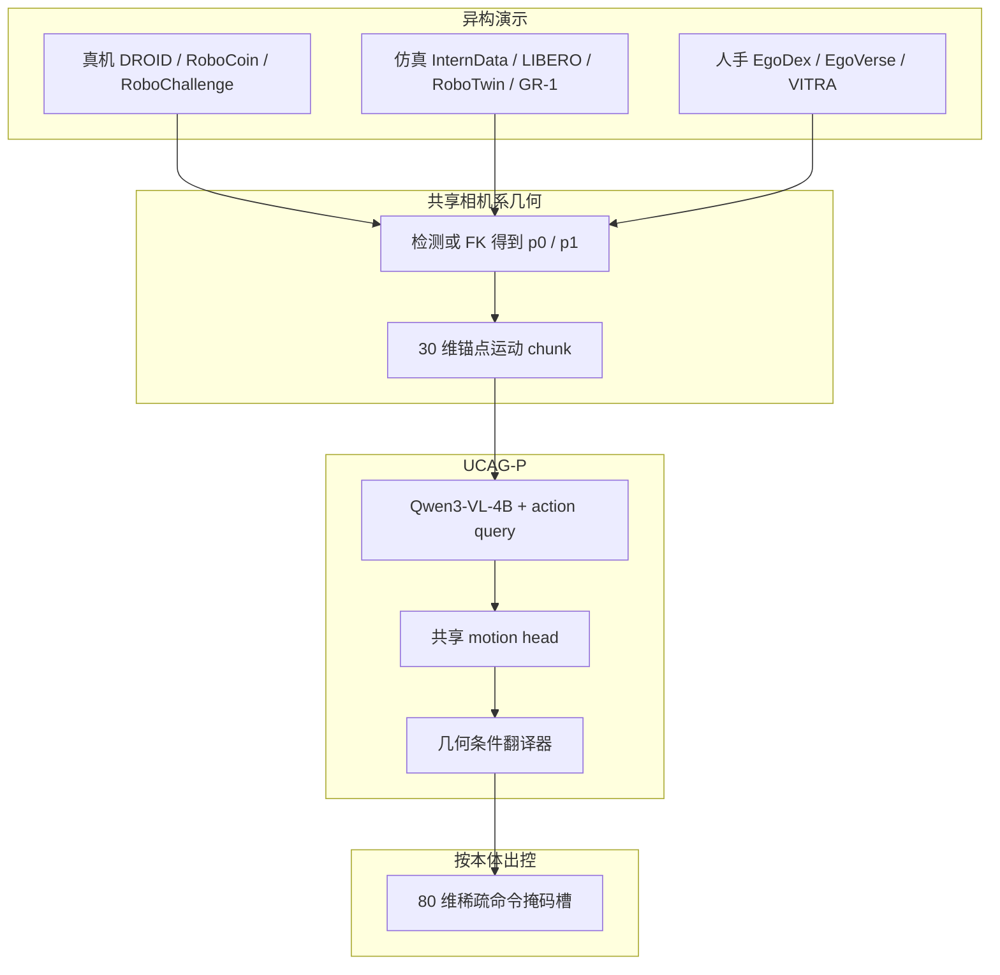

# UCAG-P：相机系动作几何预训练

**UCAG-P**（*One Policy, Many Embodiments: Unified Camera-Centric Action Geometry Pre-training for Heterogeneous Embodied Manipulation*，[arXiv:2608.26058](https://arxiv.org/abs/2608.26058)，[项目页](https://public-bots.github.io/UCAG-P)）由 **小米具身智能团队 × 澳门大学** 提出：不把关节/末端命令当共享监督，而是把单臂、双臂、人形与人手都写成 **相机可观测的腕（\(p_0\)）与抓取中心（\(p_1\)）运动**，再用几何条件翻译器接到各本体可执行槽。

## 一句话定义

**共享策略只预测相机系锚点轨迹，执行细节留给带外参与 Jacobian 的翻译器——人手当一种 embodiment 直接监督几何，无需先做人→机视频合成或动作重定向。**

## 英文缩写速查

| 缩写 | 英文全称 | 简要说明 |
|------|----------|----------|
| UCAG-P | Unified Camera-centric Action Geometry Pre-training | 本文框架：相机系锚点几何预训练 |
| VLA | Vision-Language-Action | 视觉–语言–动作通才策略 |
| VLM | Vision-Language Model | 骨干为 Qwen3-VL-4B-Instruct |
| EEF | End-Effector | 末端；对照工作常把共享目标绑在机器人 EEF |
| LIBERO | Lifelong Robot Learning Benchmark | 单臂语言条件操作榜 |
| GR-1 | Fourier GR-1 Humanoid | RoboCasa 人形评测本体（29 DoF） |
| OOD | Out-of-Distribution | 本文用 LIBERO-Plus 七类扰动测零样本 |

## 为什么重要

- **把「共享什么」从控制器改到相机几何：** 相对 per-dataset 动作头、embodiment prompt、或 [Qwen-RobotManip](./qwen-robot-manip.md) 的 **相机系 ΔEEF**，锚点 \(p_0/p_1\) 能同时覆盖 **人手抓取中心**，不必先合成机器人视频。
- **解耦可迁移几何与可执行控制：** 新本体理论上可冻共享 motion head、主要训翻译器（Stage 2 仅 8×H20 / 10K）；这与 [DyPES-VLA](./paper-dypes-vla.md)「共享动力学 + MoE 原生头、故意不对齐动作」是对称选型。
- **单 checkpoint 跨形态榜：** 无 per-benchmark 微调仍覆盖单臂 / 双臂 / 人形 / OOD / 真机 Piper，便于和 [Qwen-VLA](./qwen-vla.md) 通才表对照。
- **接口盘点入口：** 亦收录于 [WAM / VLA / 跨本体 9 篇技术地图](../overview/wam-vla-cross-embodiment-9-papers-technology-map.md)（动作写成相机几何，对照 Zero-WAM 的视频任务规格）。

## 核心信息

| 项 | 内容 |
|----|------|
| **机构** | 小米具身智能团队（Xiaomi Embodied Intelligence Team）；澳门大学（University of Macau） |
| **骨干** | Qwen3-VL-4B-Instruct + action-query；motion MLP；几何条件 Transformer 翻译器 |
| **动作接口** | 共享几何 \(\mathbb{R}^{30}\)（左右臂锚点 + 相机运动）；可执行稀疏命令 \(\mathbb{R}^{80}\) |
| **数据** | 11 子集、102 万 episode、**6,374 h**（真机 266 h + 仿真 3,768 h + 人手 2,340 h） |
| **训练** | 三阶段：128×H20 / 200K → 8×H20 / 10K → 64×H20 / 10K；chunk **H=30** |
| **开源（截至 2026-09-02）** | **宣称将开源 / 待发布**：项目页与 [Public-BOTs/UCAG-P](https://github.com/Public-BOTs/UCAG-P) 仅配图/站点；README *code will be released soon* |

## 核心原理

### 方法栈

| 模块 | 机制 |
|------|------|
| 语义锚点 | \(p_0\)：腕或末端；\(p_1\)：夹爪中心或拇指–食指中点（人手） |
| 共享目标 \(\mathcal{G}\) | 相对 chunk 首帧的相机系位移 + 平面转 + 开合；缺深度/标定时 mask |
| 翻译器 \(\phi_\psi\) | 条件于 \(\hat g\)、本体状态、\(T_{\mathrm{base}\leftarrow\mathrm{cam}}\)、局部 Jacobian、geometry token |
| 稀疏命令 | 80 维槽：左右臂/EE/手、腰、底座；LIBERO 只用左臂+夹爪，GR-1 加双手与腰 |
| 损失 | 掩码 L1：几何 + \(\lambda_{cmd}\) 命令；无效维不回传 |

### 流程总览

## 源码运行时序图

**不适用（官方可运行代码尚未发布）。** 截至 **2026-09-02**：[项目页](https://public-bots.github.io/UCAG-P) 与 [Public-BOTs/UCAG-P](https://github.com/Public-BOTs/UCAG-P) 仅托管配图与静态站；README 写训练/推理/评测 **will be released soon**。发布后应补：数据对齐 → Stage1 几何预训练 → Stage2 GT 翻译器 → Stage3 联合 → 分本体闭环部署 的 `sequenceDiagram`。

## 工程实践

| 项 | 建议 / 论文设定 |
|----|----------------|
| 何时用 | 要在 **人视频 + 多本体机器人** 上共训 generalist，且愿意维护标定、FK 与锚点提取 |
| 相对 RobotManip | 需要 **人手抓取几何** 进同一监督时选锚点；若只需跨机器人 EEF 对齐，相机系 ΔEEF 更轻 |
| 相对 DyPES | 愿意付统一几何预处理税、换可共享 motion head；不愿维护统一动作则看 MoE 原生头 |
| 新本体边际 | Stage 2 翻译器相对 Stage 1 很轻（8 GPU / 10K）；仍需 GT 相机系轨迹与可执行标签 |
| 人手接入 | MediaPipe：腕→\(p_0\)，拇食中点→\(p_1\)；命令槽保持 invalid |
| 跨本体选型 | 先读 [跨具身策略迁移选型指南](../queries/cross-embodiment-transfer-strategy.md)：本页是操作 VLA 的「统一几何动作空间」，不是 WBT 重定向后重训 |
| 复现现状 | **等官方代码与权重**；当前只能按论文数字与失败模式做选型 |

## 实验与评测

仿真均为 **同一最终 checkpoint、无 per-benchmark 微调**。相对通才基线 [Qwen-VLA-Instruct](./qwen-vla.md) 的增量写在括号内。

| 基准 | UCAG-P | 读点 |
|------|--------|------|
| LIBERO | **98.3%**（+0.4） | Goal **99.2%** 最高；Long 96.4%，距最佳约 1.2 pt |
| RoboTwin Easy / Hard | **88.7% / 89.2%**（+2.6 / +2.0） | Hard 略高于 Easy；OpenMicrowave 仅 **11%/13%** |
| RoboCasa GR-1 | **62.0%**（+5.3） | 低于 ZR-0 69.3%、JoyAI-RA 63.2%；池化 VLM 特征 **58.3→62.0** |
| LIBERO-Plus | **82.0%** 零样本 | Robot/Light/Bkg 强（92.8 / 98.9 / 98.0）；Camera 51.2 仍弱 |
| ALOHA→ARX | **35.0%** 零样本 | 源机 Easy 88.66%；几何可迁，形态差未消 |
| 真机 Piper | 面包 **60%** / 抽屉 **90%** / 叠碗 **75%** | vs π₀.₅ 的 20 / 85 / 65；每任务 100 demo、20 次闭环 |

## 结论

**UCAG-P 真正拉动跨本体共训的是「相机可观测锚点」这一共享目标；翻译器与 80 维槽是执行税，不是方法本身的可迁移部分。**

1. **真影响：共享几何、特化执行** — 人手与机器人可进同一 motion head，绕开视频合成/显式 retargeting。
2. **真影响：单 checkpoint 跨单臂/双臂/人形** — LIBERO 已接近 specialist 峰值，GR-1 相对 Qwen-VLA 通才基线 +5.3 pt。
3. **真影响：OOD 里本体/光照/背景扰动** — LIBERO-Plus 零样本 82.0%；相机与布局扰动仍是短板。
4. **次要代价：标定与关键点质量** — 深度、外参、FK、MediaPipe 误差会写进监督再进控制器。
5. **部署读法：跨形态零样本不要指望源机分数** — ALOHA→ARX 掉到 35%；铰接开门（OpenMicrowave）几乎失败。
6. **工程读法：代码未发** — 适合对照 RobotManip 的 EEF 对齐与 DyPES 的 MoE 原生头，不宜当可跑基线。

## 与其他工作对比

| 对照 | 差异读法 |
|------|----------|
| [Qwen-RobotManip](./qwen-robot-manip.md) | 共享 **相机系 ΔEEF + 80-d mask**；本文把目标再抽象到 **腕/抓取锚点**，才能直接吃人手 |
| [Qwen-VLA](./qwen-vla.md) | 通才对照（同场 LIBERO/RoboTwin/GR-1）；Qwen-VLA 另覆盖 VLN，本文专注操作几何 |
| [DyPES-VLA](./paper-dypes-vla.md) | DyPES **不对齐动作**、共享未来动力学 + MoE；本文 **对齐几何**、翻译器出原生命令 |
| [Xiaomi-Robotics-0](./xiaomi-robotics-0.md) | 同实验室 Qwen3-VL-4B 族；XR-0 讲 **异步 chunk 部署**，本文讲 **跨本体动作表示** |
| [Zero-WAM](./paper-zero-wam.md) | Zero-WAM 统一 **任务规格（视频）**；本文统一 **动作几何** |
| [UHAS](../methods/uhas-unified-hand-action-space.md) | 灵巧手 **球面形变 + CIK**；本文是 VLA 相机锚点，粒度在腕/抓取而非指关节 |
| [Open X-Embodiment](../concepts/open-x-embodiment.md) | OXE 是数据规范化倡议；UCAG-P 是在异构源上的 **几何动作接口** |

## 局限与风险

- **开源未落地：** 无法复核锚点提取、mask 布局、\(\lambda_{cmd}\) 与三阶段配比。
- **几何栈脆弱：** 标定、深度、运动学、手关键点任一出错都会污染共享目标。
- **跨形态迁移未闭环：** ARX 替换证明「非零但远低于源机」；接触丰富与铰接物体仍是失败主因。
- **真机规模小：** 三任务 × Piper × 100 demo；不支持「开箱家务」外推。
- **InternData 占比极高：** 仿真小时的 57% 来自 InternData-MultiRobot，榜上泛化需与该分布绑定阅读。

## 关联页面

- [VLA](../methods/vla.md) — 通才策略母页
- [Qwen-RobotManip](./qwen-robot-manip.md) — 相机系 EEF 对齐的近亲
- [Qwen-VLA](./qwen-vla.md) — 文内 generalist 数字对照
- [Xiaomi-Robotics-0](./xiaomi-robotics-0.md) — 同实验室实时 VLA
- [DyPES-VLA](./paper-dypes-vla.md) — 「不对齐动作」的对称方案
- [Zero-WAM](./paper-zero-wam.md) — 视频任务规格对照
- [LIBERO](./libero-benchmark.md) — 单臂操作榜
- [Open X-Embodiment](../concepts/open-x-embodiment.md) — 跨本体数据轴
- [EgoVerse](./paper-egoverse.md) — 人手小时源之一
- [UHAS](../methods/uhas-unified-hand-action-space.md) — 灵巧手统一动作空间对照
- [跨具身迁移知识链](../overview/hub-cross-embodiment.md)
- [跨具身策略迁移选型指南](../queries/cross-embodiment-transfer-strategy.md)
- [WAM / VLA / 跨本体 9 篇技术地图](../overview/wam-vla-cross-embodiment-9-papers-technology-map.md)
- [Manipulation](../tasks/manipulation.md)

## 参考来源

- [ucag_p_arxiv_2608_26058.md](../../sources/papers/ucag_p_arxiv_2608_26058.md) — 论文摘录与开源核查
- [ucag-p.md](../../sources/sites/ucag-p.md) — 项目页核查
- [ucag-p.md](../../sources/repos/ucag-p.md) — GitHub 占位仓
- [具身智能小站 9 篇盘点](../../sources/blogs/wechat_embodied_station_wam_vla_cross_embodiment_9_papers_2026-08-28.md)
- [arXiv:2608.26058](https://arxiv.org/abs/2608.26058) — 原文

## 推荐继续阅读

- [UCAG-P 项目页](https://public-bots.github.io/UCAG-P)
- [UCAG-P PDF](https://arxiv.org/pdf/2608.26058)
- [Qwen3-VL technical report](https://arxiv.org/abs/2511.21631) — 骨干 VLM
