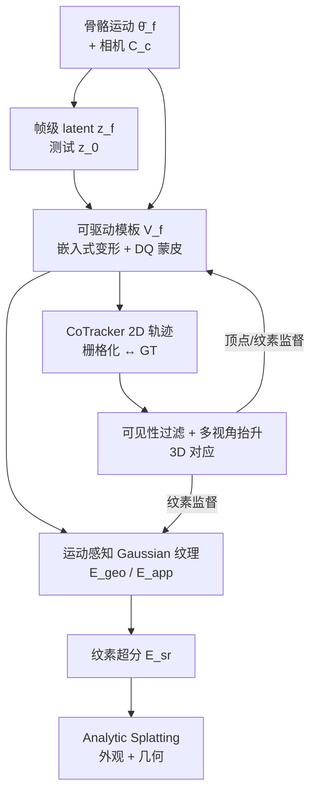
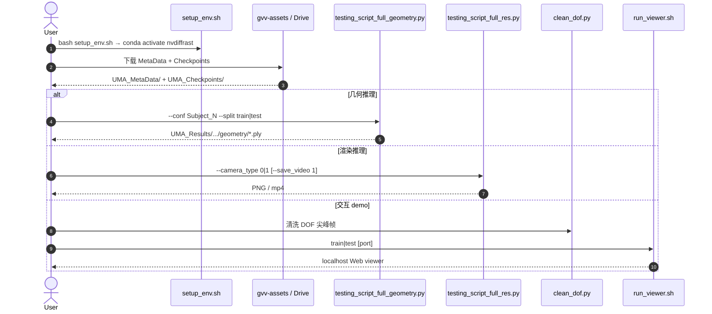

# UMA（多级表面对齐超精细人体 Avatar）

**UMA**（*Ultra-detailed Human Avatars via Multi-level Surface Alignment*，[arXiv:2506.01802](https://arxiv.org/abs/2506.01802)，[项目页](https://vcai.mpi-inf.mpg.de/projects/UMA/)，ACM TOG 2026）由 **马克斯·普朗克信息学研究所（MPI-INF）** 与 **萨尔布吕肯 VIA 中心**（Heming Zhu、Guoxing Sun、Christian Theobalt、Marc Habermann）提出：从多视角视频学习 **仅骨骼运动条件** 的可驱动着装人体，在变焦与超高分辨率下保住细纹理与纱线级图案。核心主张是：外观糊掉的主因是 **深度错位与表面漂移**，而非单靠更大外观网络。

## 一句话定义

**用帧级 latent 解开骨骼→衣物动力学的一对多，再用基础 2D 点跟踪器做顶点/纹素级多级表面对齐，并轻量超分 Gaussian 纹理，从而从 40×6K 多视角视频学出可变焦的超精细可驱动人体 avatar。**

## 英文缩写速查

| 缩写 | 英文全称 | 简要说明 |
|------|----------|----------|
| UMA | Ultra-detailed Human Avatars via Multi-level Surface Alignment | 本文方法与数据集通称 |
| 3DGS | 3D Gaussian Splatting | 显式高斯原语；本文用 UV 空间 Gaussian 纹理 |
| DDC | Deep Dynamic Characters | Habermann 等可驱动嵌入式变形模板基线线 |
| ASH | Animatable Gaussian Splats for Efficient and Photoreal Human Rendering | UV 高斯纹理前作；UMA 对照与表示基础 |
| CoTracker | Collaborative Point Tracker | 基础 2D 视频点跟踪器；提供对应监督 |
| SMPL-X | SMPL eXpressive | 元数据中的参数化人体角色（与 DDC 并列） |
| NeuS2 | Neural Surface Reconstruction v2 | 逐帧 GT 几何重建（无跨帧对应） |
| PSNR / LPIPS | Peak Signal-to-Noise Ratio / Learned Perceptual Image Patch Similarity | 渲染定量主指标 |

## 为什么重要

- **诊断可迁移：** 把「细节上不去」归因到 **跟踪误差多级累积**（深度 / 顶点 / 纹素），对后续 Gaussian avatar 与 performance capture 选型比单纯堆分辨率更有指导性。
- **长序列 + 高分辨基准：** 现有多视角着装人体数据常分辨率不足、纹理简单或姿态多样性弱；UMA 提供 **5 人 × 40 相机 × 6K × 10+ 分钟** 的挑战集。
- **机器人 / telepresence 上游：** 不是控制策略，而是 **光真实感可驱动数字人**——与 [Face Anything](./paper-face-anything-4d-face-reconstruction.md) / [SHELLS](./paper-shells-layered-surface-sampling.md) 的面部几何通道互补，服务 VR 近距检查、远程协作演示资产（见 [遥操作](../tasks/teleoperation.md)）。
- **工程可读开放边界：** 数据集 + 推理 + Viewer 已发，训练工具仍 TODO——选型时勿误读成「端到端可复现训练」。

## 核心信息

| 项 | 内容 |
|----|------|
| **机构** | 马克斯·普朗克信息学研究所（Max Planck Institute for Informatics）；萨尔布吕肯视觉计算、交互与 AI 研究中心（VIA） |
| **发表** | ACM Transactions on Graphics 2026（doi:10.1145/3829365） |
| **输入（推理）** | 骨骼运动（滑窗）+ 相机；测试时 latent 置零 |
| **输出** | 高保真渲染（论文约 **1620×3072 @ ~18 fps**）+ 时序一致三角化几何 |
| **数据** | 5 被试；40 标定 6K 相机；train/test 分序列；NeuS2 GT mesh + mask + SMPL/DDC |
| **开源（截至 2026-08-06）** | **部分开源**：[GitHub](https://github.com/kv2000/UMA) 推理/demo；[数据集](https://gvv-assets.mpi-inf.mpg.de/uma/) 需注册；**训练工具未发** |

## 核心原理

### 1. 表示：可驱动模板 + 运动感知 Gaussian 纹理

| 模块 | 作用 |
|------|------|
| 嵌入式变形 + 逐顶点位移 | 人物特异模板 \(\bar{\mathbf{V}}\) 在规范空间做运动相关非刚性变形，再 Dual Quaternion 蒙皮 |
| Per-frame latent \(z_f\) | 缓解衣物动力学相对骨骼的随机性；测试用 \(\mathbf{z}_0\) |
| Gaussian textures | UV 纹素存 3DGS 参数；几何/外观 CNN 解码器由位姿纹理条件 |
| Analytic Splatting | 按像素积分抗锯齿，服务 6K 级细节监督 |

### 2. 多级表面对齐

| 级别 | 机制 |
|------|------|
| **深度** | latent 条件模板，减小大尺度动力学误差 |
| **顶点** | CoTracker 在栅格化模板 vs GT 图像上跟踪 → 可见性级联过滤 → 多视角抬升为 3D 对应，监督 \(\mathbf{V}_f\)（优于整段盲跟踪或可微渲染光度） |
| **纹素** | 更密纹理空间对应，进一步压表面漂移与外观糊边 |
| **超分** | \(\mathcal{E}_{\mathrm{sr}}\) 预测 Gaussian 纹理残差，恢复纱线/微图案，开销约 21→18 fps |

### 流程总览

## 源码运行时序图

官方仓可运行入口对齐 [`sources/repos/uma.md`](../../sources/repos/uma.md)（推理 / demo；训练工具未发）。

关键复现路径：注册下载被试 packs → `setup_env.sh` → 解压 metadata/checkpoint → 跑 `UMA_inference` 几何或渲染脚本；需要交互则先 `clean_dof.py` 再启 Viewer。完整从零训练仍须等官方 training utilities。

## 工程实践

| 项 | 建议 / 仓库设定 |
|----|----------------|
| **环境** | `setup_env.sh`：PyTorch **2.1.0** + CUDA **12.1**；gcc 宜 ≤11（避免 nvcc/pybind 解析 bug） |
| **数据访问** | 数据集页注册；可用 `helping_script/dataset_downloader.py` 批量续传 |
| **元数据** | 每被试含 **DDC** 与 **[SMPL-X](../concepts/smpl-x.md)** 角色 + `cameras.calib` |
| **推理 knobs** | `split=train|test`；渲染 `camera_type` 静态标定相机 vs 绕体质心轨道相机 |
| **点跟踪依赖** | 训练管线需 CoTracker（`WITH_COTRACKER=1`）；公开推理入口主要吃 checkpoint |
| **开源边界** | **可推理、可 demo、可下数据**；**勿假设训练端到端可复现** |
| **下游用法** | VR/MR 近距数字人资产、动作重定向可视化、一致纹理编辑；非机器人策略本身 |
| **源码运行时序图** | 见上节 |

## 实验与评测

| 设定 | 论文报告要点（Table 2，全序列平均） |
|------|-------------------------------------|
| **Training Pose · Ours** | PSNR **37.15** / SSIM **0.9681** / LPIPS **35.02** / Chamfer **0.876** |
| **Testing Pose · Ours** | PSNR **27.68** / SSIM **0.8937** / LPIPS **84.12** / Chamfer **1.523** |
| **强基线对照** | ASH、Animatable Gaussians、TriHuman、DDC、MeshAvatar、GaussianAvatar、3DGS-Avatar；UMA 全面领先，感知指标增益最大 |
| **消融（Table 3）** | latent → 顶点跟踪（两轮）→ 纹素对齐 → 超分，逐步抬升 PSNR/LPIPS 与几何精度；整段盲跟踪或可微渲染对应监督明显更弱 |
| **应用** | VR telepresence（Unity + gsplat）、UMA-Viewer 运动编辑、跨角色重定向、纹理编辑 |

## 结论

**UMA 的真贡献是把「超精细 avatar」从外观堆料改成多级表面跟踪问题：先用 latent 吃掉大尺度随机衣物动力学，再用点跟踪器把顶点/纹素钉回观测表面，最后才用轻量超分补纱线级图案。**

1. **真影响指标：LPIPS / 变焦可读纹理** — 相对 ASH 等 Gaussian 方法，感知与细节边界改善最醒目；PSNR 同步领先。
2. **真影响机制：avatar-guided 对应** — 相对整段 CoTracker 盲跟踪或可微渲染光度，用当前模板聚合多视角轨迹才压得住漂移。
3. **真影响资产：40×6K 长序列数据** — 为高分辨着装动态提供可复现基准（需注册）。
4. **次要代价：人物特异单层模板** — 不换装、无外力交互、暂无表情与重光照。
5. **部署读法：推理链路已可用** — 下载 checkpoint 即可出几何/渲染/Viewer；训练复现需等 utilities。
6. **机器人语境定位：telepresence / 数字人上游** — 与全身 SMPL 跟踪、面部 4D 注册并列感知资产层，不是 loco/manip 策略。

## 与其他工作对比

| 对照 | 差异读法 |
|------|----------|
| ASH / Animatable Gaussians / 3DGS-Avatar | 同属可驱动 Gaussian；UMA 强调 **多级对应监督** 而非仅 UV CNN 容量 |
| DDC / TriHuman | 网格或隐式线；细节与实时性受表示上限；UMA 用 3DGS + Analytic Splatting |
| [Face Anything](./paper-face-anything-4d-face-reconstruction.md) | **任意序列面部 4D**；UMA 是 **全身着装多视角可驱动渲染** |
| [SHELLS](./paper-shells-layered-surface-sampling.md) | **标定多视角固定拓扑人头**；UMA 做全身衣物纹理与褶皱动力学 |
| [FRAME](./paper-notebook-frame-floor-aligned-representation-for-avatar-mo.md) | egocentric 姿态上游；UMA 吃骨骼驱动做外观/几何合成 |
| [LEGS](./paper-legs-embodied-gaussian-splatting-vla.md) | 3DGS 服务 **VLA 合成演示**；UMA 服务 **photoreal 数字人** |
| [LUNA](./paper-luna-universal-3d-human-animation.md) | 稀疏未标定图 + 隐式 2D 驱动、推理不走 LBS；UMA 是棚拍多视角 + 骨骼驱动的超精细拟合 |

## 局限与风险

- **开源状态：** 训练工具未发布；许可 SPDX 未声明——商用前需自行确认。
- **换装 / 交互：** 单层人物特异模板，不支持换装与衣物–物体外力。
- **表情 / 重光照：** 控制主为身体与手；材质–光照分解留作未来工作。
- **采集门槛：** 依赖 40 相机 light-stage 级标定与 mocap；非单目野外方案。
- **误区：「开源 = 可复现训练。」** 当前公开重心是 **数据 + 推理 + demo**。

## 关联页面

- [Face Anything](./paper-face-anything-4d-face-reconstruction.md) — 面部 4D 前馈重建对照
- [SHELLS](./paper-shells-layered-surface-sampling.md) — 多视角人头固定拓扑注册对照
- [FRAME](./paper-notebook-frame-floor-aligned-representation-for-avatar-mo.md) — egocentric avatar 运动上游（同作者组谱系）
- [SMPL-X](../concepts/smpl-x.md) — 数据集元数据中的参数化人体角色
- [遥操作](../tasks/teleoperation.md) — VR telepresence / 沉浸演示资产需求
- [人形训练数据管线](../queries/humanoid-training-data-pipeline.md) — 多视角数字人捕获在数据金字塔中的位置
- [LEGS](./paper-legs-embodied-gaussian-splatting-vla.md) — 机器人侧 3DGS 数据工厂对照
- [LUNA](./paper-luna-universal-3d-human-animation.md) — LBS-free 前馈 3D 人动画（未开源；不是骨骼驱动拟合）

## 参考来源

- [UMA 论文摘录（arXiv:2506.01802）](../../sources/papers/uma_arxiv_2506_01802.md)
- [UMA 项目页归档](../../sources/sites/vcai-mpi-inf-uma.md)
- [UMA 官方仓库归档](../../sources/repos/uma.md)
- [arXiv:2506.01802](https://arxiv.org/abs/2506.01802)
- [项目页](https://vcai.mpi-inf.mpg.de/projects/UMA/)
- [GitHub `kv2000/UMA`](https://github.com/kv2000/UMA)

## 推荐继续阅读

- 项目页视频与数据集表：<https://vcai.mpi-inf.mpg.de/projects/UMA/>
- ASH（Pang et al., CVPR 2024）— UV Gaussian 纹理前作
- CoTracker（Karaev et al., ECCV 2024）— 对应监督所用基础点跟踪器
- Analytic-Splatting（Liang et al., ECCV 2024）— 抗锯齿高斯积分渲染
- Deep Dynamic Characters（Habermann et al.）— 可驱动嵌入式变形模板谱系
