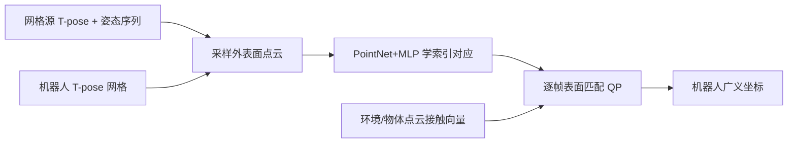

# UMR：学习点云对应的统一人形重定向

**UMR**（*Unified Motion Retargeting for Humanoids with Learned Point Cloud Correspondence*，[arXiv:2609.02134](https://arxiv.org/abs/2609.02134)）由 **香港科技大学广州校区（HKUST-GZ）**、**诺亦腾机器人（Noitom Robotics）**、**汉阳大学（Hanyang University）**、**香港科技大学（HKUST）**、**香港大学（HKU）** 提出：把人与人形的**外表面点云**当成统一接口，在规范 T-pose 学稠密索引对应，再拿同一套点对做约束优化——表面位姿对齐 + 接触图直传，**不手写骨架/肢体映射**。定量跟踪与接触实验在 **Unitree G1**；定性覆盖身高 0.75–1.83 m 的五台人形。

> **同名消歧：** 本页是 **表面点云对应** 的 UMR。不要和 AdaMorph（arXiv:2601.07284，embodiment-aware Transformer「统一重定向」）或 PALUM（arXiv:2601.07272）混成一页。[AdaPT](./paper-adapt.md) 项目页写 MoCap「经 UMR 重定向、coming soon」——指的就是这篇，**不是** AdaPT 仓本身。

## 一句话定义

**先学「人表面哪一点对应机器人哪一点」，再在运动学约束下匹配位置、法向和接触向量；换源、换机主要复用同一套点对，而不是重画关键点表。**

## 英文缩写速查

| 缩写 | 英文全称 | 简要说明 |
|------|----------|----------|
| UMR | Unified Motion Retargeting | 本文：学习点云对应的统一重定向 |
| SMPL-X | Skinned Multi-Person Linear (eXpressive) | 一种网格源；与 SOMA / 角色网格走同一接口 |
| SOMA | （BONES-SEED 中的参数人体） | 演员特异几何；UMR 吃 Proportional，官方 GMR 参考吃 Uniform |
| GMR | General Motion Retargeting | 稀疏关键点运动学基线 |
| FPS | Frames Per Second | Stage II 重定向约 121 FPS（不含对应训练） |
| G1 | Unitree G1 | 全部定量与真机平台 |

## 为什么重要

- **稀疏关键点是可扩展性瓶颈。** [GMR](../methods/motion-retargeting-gmr.md) / 多数 IK 线要为人–机对手工语义；换机几乎等于重做映射。UMR 把对应从「关节表」改成「规范姿态上的表面变形场」。
- **接触可以跟点走。** 同一索引把人侧接触向量拷到机器人，不必再写「人手掌 ↔ 哪块 link」。相对 [OmniRetarget](./paper-hrl-stack-03-omniretarget.md) 的 interaction mesh + 启发式 stance，这是另一条接触保留路径。
- **下游数字说明参考质量，不只是「看着像」。** BeyondMimic 跟踪、SONIC 大规模 tracker、OmniContact / GRAIL 接触策略都只换参考、协议不动。

## 核心信息

| 项 | 内容 |
|----|------|
| 机构 | HKUST-GZ；Noitom Robotics；Hanyang University；HKUST；HKU |
| 平台 | 定量 / 真机：**G1**；定性另含四台 0.75–1.83 m 人形 |
| 源表示 | MimicKit 角色、BONES-SEED SOMA、LAFAN1 SMPL-X、扫描网格 + 自采 MoCap |
| 求解 | MuJoCo FK + Clarabel 约束 Gauss-Newton QP |
| 开源（2026-09-04） | **待发布**：无独立项目页；arXiv 未列仓；AdaPT 页仍写 UMR coming soon |

## 核心原理

**Stage I — 对应（训一次）。** 有序人体点 \(\mathbf{X}^{h}\) 加无序机器人点 \(\mathbf{X}^{r}\)：

\[\hat{\mathbf{X}}^{r}=\mathbf{X}^{h}+D_\theta\bigl(E_\theta(\mathbf{X}^{r})\bigr).\]

Chamfer 覆盖目标表面，排斥防塌缩，测地邻边要求变形平滑。学完后点对绑到各自网格，随姿态走。

**Stage II — 重定向（逐帧）。** 最小化 \(\|\mathbf{r}_p\|_2^2+\|\mathbf{r}_c\|_2^2\)：\(\mathbf{r}_p\) 匹配对应点位置与相对 T-pose 的法向偏移；\(\mathbf{r}_c\) 匹配「点到环境最近点」的向量（阈值 \(\tau_c\) 内才激活）。QP 更新带关节限位、步长上限、近地高度线性不等式。

## 流程总览

对应在 T-pose 上固定索引；运动只搬运已绑定的点。分段权重写在**人体模板**上，换机器人不必重画身体语义——前提是源网格能提供（或退化成全身一段）。

## 源码运行时序图

**不适用** — 截至 **2026-09-04** 无官方训练/推理仓。AdaPT 项目页的 “UMR coming soon” 不能当成可运行入口。

## 工程实践

| 项 | 建议 |
|----|------|
| 何时用 | 多源网格（SMPL-X / SOMA / 扫描）要进同一人形数据厂，且不想维护每机关键点表 |
| 何时不用 | 源只有骨架、没有可用网格/规范 T-pose；或必须开源复现（现无代码） |
| 吞吐预期 | 对应 setup **~26 s** 一次；之后重定向 **~121 FPS**（论文 LAFAN1 / 4070 Ti SUPER） |
| 对照实验 | 跟踪先对 [GMR](../methods/motion-retargeting-gmr.md)；接触先对 [OmniRetarget](./paper-hrl-stack-03-omniretarget.md)；下游协议保持 BeyondMimic / SONIC / OmniContact 原配方 |
| 与 AdaPT | 网球 MoCap 支路宣称走 UMR；视频支路仍是 GVHMR→GMR。仓里还没有 UMR |

## 实验与评测

评测关在 G1。LAFAN1 跟踪用 [BeyondMimic](../methods/beyondmimic.md)，每动作 4096 trial。

| 设置 | UMR | GMR | 读法 |
|------|-----|-----|------|
| Fight 成功（无 DR） | **99.941%** | 87.603% | 难动作差距最大 |
| Fall and GetUp（无 DR） | **96.981%** | 84.717% | 同上 |
| Fight Sim2Sim | **95.298%** | 79.492% | 参考更经得起域移 |
| 均值 \(E_{\mathrm{g\text{-}mpbpe}}\)（无 DR） | **89.61 mm** | 198.89 mm | 全局体段 |
| 均值 \(E_{\mathrm{mpjpe}}\)（无 DR） | **610** | 759 | \(10^{-3}\) rad |

相对 Unitree 官方 LAFAN1 参考：成功率与 mpbpe 接近，**关节角均值误差 UMR 更低**。

[SONIC](../methods/sonic-motion-tracking.md) 在 BONES-SEED 上：关掉 SMPL encoder 时，UMR 参考相对官方 GMR 参考约 **+10%**；打开 encoder 后两边接近——人侧潜空间对齐会掩盖参考差距。

接触策略只换参考（Table IV，UMR / OmniRetarget）：Carry / Kick 成功与物体误差全面更好，三任务关节误差约 **−40–56%**；Stair **43.53% vs 11.01%**；Chair 上 OmniRetarget 略好（75.24 / 79.67）。

真机：旋踢（MimicKit）；捡球后倒走转弯（动捕）；爬楼跳下。

## 结论

**稠密表面对应把「换机重画关键点」换成「T-pose 上学一次点对」；跟踪增益主要出现在难动作和域移，接触增益主要出现在手–物几何，而不是所有场景都碾压 OmniRetarget。**

1. **先看有没有网格。** 没有规范模板就进不了这篇的接口。
2. **GMR 对照看难动作与 Sim2Sim**，不要只报 Walk/Run 成功率。
3. **接触对照看关节/物体误差**；OmniContact 成功准则偏松。
4. **Chair 不是失败声明。** 启发式粘脚在部分 HSI 上仍可能更好。
5. **SONIC 数字依赖是否开 SMPL encoder。** 关 encoder 才直接反映参考质量。
6. **代码待发布。** 选型可以记方法，复现要等官方仓。

## 与其他工作对比

| 对照 | 差异读法 |
|------|----------|
| [GMR](../methods/motion-retargeting-gmr.md) | 稀疏关键点 + 运动学 QP；UMR 用学到的表面点对，同套 BeyondMimic 协议下难动作/误差更好 |
| [OmniRetarget](./paper-hrl-stack-03-omniretarget.md) | interaction mesh + Sequential SOCP + stance 启发式；UMR 用点云接触向量，无粘脚硬约束。Chair 例外 |
| [NMR](../methods/neural-motion-retargeting-nmr.md) | 离线 RL 造配对再训前向网；UMR 对应网络只在 T-pose 上学变形，运动仍是优化 |
| [ReActor](../methods/reactor-physics-aware-motion-retargeting.md) | 参考与跟踪策略同环；UMR 停在运动学参考，物理交给下游 RL |
| [SPARK](./paper-spark-skeleton-aligned-retargeting.md) | 校准 human URDF + kinodynamic TO；UMR 不走 URDF 校准，也不出力矩参考 |
| Unitree LAFAN1 参考 | 人工策展基线；UMR 成功率接近、关节误差均值更低 |
| AdaMorph / PALUM | 名字都带 Unified Retargeting，路线是 Transformer / part attention，**不是**本页点云对应 |

## 局限与风险

- **网格假设。** 视频直接出 SMPL 关节、没有可靠表面时，要先补重建，误差会进对应。
- **仍是运动学参考。** 脚滑/动力学可行性交给 BeyondMimic / SONIC，不是 SPARK/KDMR 那种 kinodynamic 精炼。
- **开源空窗。** 2026-09-04 只能读论文；AdaPT 仓不含 UMR。
- **Chair / 部分 Sim2Sim 项** Unitree 或 OmniRetarget 仍可能更好，不要写成全面替代。

## 关联页面

- [Motion Retargeting](../concepts/motion-retargeting.md)
- [动作重定向枢纽](../overview/hub-motion-retargeting.md)
- [GMR](../methods/motion-retargeting-gmr.md) / [GMR vs NMR vs ReActor](../comparisons/gmr-vs-nmr-vs-reactor.md)
- [OmniRetarget](./paper-hrl-stack-03-omniretarget.md) / [OmniContact](./paper-omnicontact-humanoid-loco-manipulation.md) / [GRAIL](./paper-grail.md)
- [BeyondMimic](../methods/beyondmimic.md) / [SONIC](../methods/sonic-motion-tracking.md)
- [AdaPT](./paper-adapt.md) — MoCap 支路点名 UMR
- [Unitree G1](./unitree-g1.md)

## 参考来源

- [umr_unified_motion_retargeting_arxiv_2609_02134](../../sources/papers/umr_unified_motion_retargeting_arxiv_2609_02134.md)
- [AdaPT 项目页归档](../../sources/sites/adapt-humanoidtennis.md) — 「UMR coming soon」交叉证据

## 推荐继续阅读

- [arXiv:2609.02134](https://arxiv.org/abs/2609.02134)（HTML 全文含公式与表）
- [AdaPT 项目页](https://humanoidtennis.github.io/AdaPT/) — 产业侧对 UMR 的「即将发布」标注
