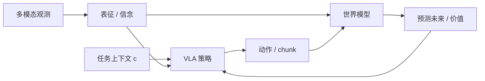

# 统一机器人学习综述：表征、VLA 与世界模型

**Toward Unified Robot Learning: Bridging Representation, Vision-Language-Action, and World Models**（[arXiv:2609.03927](https://arxiv.org/abs/2609.03927)，*TMLR 2026*）由 **富士通美国研究院（Fujitsu Research of America）**、**富士通（Fujitsu Limited）** 与 **卡内基梅隆大学（CMU）** 撰写：把现有方法收成 **理解（表征）/ 行动（VLA）/ 推理（世界模型）** 三轴，再用六种耦合类型解释五类开放问题。作者认为碎片化系统的病根是 **模块各长各的**，不是再堆一个更大的单点模型。

> **读法：** 这是坐标系综述，不是新算法。表 1 的「四格全覆盖」是作者自报。文内点名的 OpenVLA、π₀、PointWorld、Open-X 等 **复用已有详情节点**，不在本 ingest 造空壳。

## 一句话定义

**看懂、会做、会想后果，要接在同一套内部状态上；松耦合会同时表现为不确定、OOD、跨本体和长程失败。**

## 英文缩写速查

| 缩写 | 英文全称 | 简要说明 |
|------|----------|----------|
| VLA | Vision-Language-Action | 行动轴：观测 + 指令 → 动作 |
| WM | World Model | 推理轴：预测动作后果 |
| WAM | World Action Model | 预测与出动作写在同一模型里 |
| OOD | Out-of-Distribution | 五挑战之一；跨本体被写成它的结构化特例 |
| TMLR | Transactions on Machine Learning Research | 本文 venue |
| OXE | Open-X Embodiment | 作者标成 VLA/WM 的主要「数据重力」 |

## 为什么重要

- 站内已有 [五大具身分类](../comparisons/vlm-vln-vla-vlx-world-model-taxonomy.md)（VLM→VLN→VLA→VLX→WM）和 [14 篇阅读路线](../overview/vla-wm-reading-roadmap-14-papers-technology-map.md)。本综述补的是 **「三轴怎么接、接不上会得什么病」**，不是再开一条阅读清单。
- 五类挑战被写成 **耦合诊断表**，选型时可以问：缺的是表征–策略、策略–世界，还是三元闭环。
- 明确反对「只加参数」：表征不知道控制需要什么、VLA 不想后果、WM 不接地，都会单独撞墙。

## 核心信息

| 项 | 内容 |
|----|------|
| 机构 | Fujitsu Research of America；Fujitsu Limited；CMU |
| Venue | TMLR 2026 |
| 形态 | 综述；无新基准数字 |
| 开源（2026-09-04） | **确认未开源**：无项目页、无配套仓 |

## 核心原理

**三轴**

1. **表征（§4）** — 从本体/2D 到 4D 时空（Table 4）。问的是：看得见吗、动作能不能接地、物理量在不在、不确定能不能表示、能不能 rollout。
2. **VLA（§5）** — 端到端、模块化、层次/CoT。策略写成 \(\pi_\theta(a_t\mid h_t,c)\) 或 chunk。
3. **世界模型（§6）** — 语言条件、动作条件、[WAM](../concepts/world-action-models.md)、仿真引擎。预测目标可以是视频、潜变量、奖励/价值、状态或几何。

**六种耦合（Table 2）** 比「系统里有没有三个模块」更严：表征–策略、表征–世界、策略–世界、三元闭环、任务/本体抽象、不确定感知。作者说：有三个盒子 ≠ 已经集成。

## 流程总览

Fig. 1 的理想顺序是：先从观测建环境表征 → 再映射到动作 → 再推理后果。§3 把路上的坑收成五类，Table 8 指回该补哪一种耦合。

## 源码运行时序图

**不适用** — 综述，无可运行官方实现。

## 工程实践

| 项 | 建议 |
|----|------|
| 什么时候打开本页 | 要解释「VLA 已经很大了为什么还脆」，或要在表征 / VLA / WM 之间选耦合，而不是再找一篇方法 |
| 不要做什么 | 不要把 Table 1 当成客观覆盖排名；不要为表 7/9 每行新建 wiki 页 |
| 数据重力（Table 3） | 预训练看 ImageNet/COCO/Ego4D；通才策略看 Open-X / Bridge / DROID；诊断看 LIBERO / CALVIN |
| 和站内分类怎么叠 | I/O 边界用 [五大分类](../comparisons/vlm-vln-vla-vlx-world-model-taxonomy.md)；层怎么选用 [选型闭环](../queries/embodied-fm-taxonomy-loop.md)；具体读哪 14 篇用 [阅读路线](../overview/vla-wm-reading-roadmap-14-papers-technology-map.md) |

## 实验与评测

本文没有新实验。可操作的是 **诊断表**：

| 挑战 | 松耦合时的失败 | 作者建议的耦合 |
|------|----------------|----------------|
| 不确定 | 置信度不准、传不到动作 | 不确定感知；策略–世界；三元 |
| OOD | 观测/任务/物体/动力学一变就垮 | 表征–策略；表征–世界；三元 |
| 跨本体 | 任务意图缠在关节空间上 | 表征–策略；任务/本体抽象 |
| 长上下文 | 丢掉隐状态或延迟依赖 | 表征–策略；三元 |
| 长程规划 | 误差累积、任务锚不住 | 策略–世界；表征–世界；三元 |

## 结论

**这篇的用处是一张耦合诊断表，不是一份该复现的代码或该背的 SOTA。**

1. **先问接了哪两轴**，再问模型多大。
2. **跨本体按结构化 OOD 处理**，优先任务空间 / skill token，而不是直接搬关节。
3. **长上下文 ≠ 长程规划**：一个管过去，一个管未来。
4. **有 WM 模块不算集成**；要看预测有没有改动作。
5. **表内方法回已有节点**；本页不代替 OpenVLA / π₀ / PointWorld 详情。
6. **无代码** — 当阅读坐标，不当复现入口。

## 与其他工作对比

| 对照 | 差异读法 |
|------|----------|
| [五大具身分类](../comparisons/vlm-vln-vla-vlx-world-model-taxonomy.md) | 那页按功能分层（感知→执行→推演）；本页按 **耦合类型** 诊断系统病 |
| [机器人学习五大范式](../comparisons/robot-learning-five-paradigms-taxonomy.md) | 那页是 IL/RL/VLA 等学习信号；本页是表征–行动–推理怎么接 |
| [14 篇阅读路线](../overview/vla-wm-reading-roadmap-14-papers-technology-map.md) | 那页给读序；本页给「读完如何判断系统缺哪段耦合」 |
| [TTI 综述](./paper-test-time-intelligence-survey.md) | TTI 管测试时反馈；本页管训练/架构上的三轴集成 |
| 作者 Table 1 中的 VLA-only / WM-only 综述 | 覆盖面更窄；本页用这个差集证明自己的坐标 |

## 局限与风险

- **自报覆盖。** Table 1 勾选由作者定义「涉及」的松紧决定。
- **代表作表会过时。** Table 7/9 是 2026-09 切片，细节回各实体页。
- **没有新基准。** 不能当 SOTA 引用。
- **无开源配套。**

## 关联页面

- [VLA](../methods/vla.md) / [VLA 枢纽](../overview/hub-vla.md)
- [生成式世界模型](../methods/generative-world-models.md) / [WAM](../concepts/world-action-models.md)
- [五大具身分类](../comparisons/vlm-vln-vla-vlx-world-model-taxonomy.md)
- [具身大模型分类学选型闭环](../queries/embodied-fm-taxonomy-loop.md)
- [VLA/WM 14 篇阅读路线](../overview/vla-wm-reading-roadmap-14-papers-technology-map.md)
- [机器人学习五大范式](../comparisons/robot-learning-five-paradigms-taxonomy.md)

## 参考来源

- [unified_robot_learning_survey_arxiv_2609_03927](../../sources/papers/unified_robot_learning_survey_arxiv_2609_03927.md)

## 推荐继续阅读

- [arXiv:2609.03927](https://arxiv.org/abs/2609.03927)（HTML 含 Table 2/4/8）
- 已有节点：[OpenVLA](./paper-openvla.md)、[π₀](../methods/π0-policy.md)、[PointWorld](./paper-sa-2601-03782-pointworld.md)
