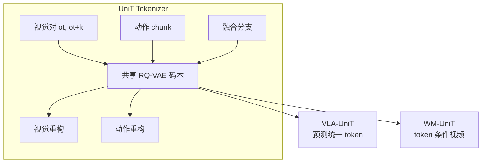
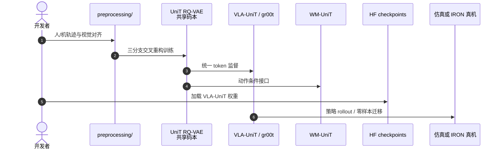

# UniT（统一物理语言 / 潜动作分词器）

**UniT**（*Toward a Unified Physical Language for Human-to-Humanoid Policy Learning and World Modeling*，[arXiv:2604.19734](https://arxiv.org/abs/2604.19734)）由 **小鹏机器人（XPENG Robotics）**、清华大学、香港大学提出：用视觉锚定的三分支交叉重构，把人与人形异构运动学投影到 **同一离散潜动作空间**，同时服务策略学习（VLA-UniT）与世界建模（WM-UniT）。

## 一句话定义

**强迫视觉与动作通过共享码本互相重构，留下「两边都一致」的物理意图 token——既可当 VLA 动作语言，也可当世界模型的动作条件。**

## 英文缩写速查

| 缩写 | 英文全称 | 简要说明 |
|------|----------|----------|
| UniT | Unified Latent Action Tokenizer | 本文分词器框架 |
| VLA | Vision-Language-Action | 下游策略范式（VLA-UniT） |
| WM | World Model | 下游动作条件视频建模（WM-UniT） |
| RQ-VAE | Residual Quantized VAE | 共享离散码本量化 |
| IDM | Inverse Dynamics Model | 视觉分支上的物理过渡编码 |
| OOD | Out-of-Distribution | 跨任务/跨场景泛化评测轴 |

## 为什么重要

- **缩放瓶颈在跨本体，不在「有没有人体视频」。** 人体数据再多，没有共享动作语言就会卡在 retargeting 与视觉–动作错配。
- **一个分词器，两条下游：** 策略与世界模型共用同一物理语言，避免「策略一套动作、WM 另一套条件」。
- **在五路径图中属 ⑤ 动作表示入口：** 本身不接管平衡；决定后续 WAM 用什么动作词汇（见[五路径](../overview/wam-motion-control-five-paths.md)）。

## 核心信息

| 项 | 内容 |
|----|------|
| **机构** | 小鹏（XPeng）；清华大学（Tsinghua）；香港大学（HKU） |
| **评测** | RoboCasa GR1；真机 IRON-R01-1.11（50 维动作） |
| **关键数字** | VLA-UniT 全数据成功率 **66.7%**（Pick&Place 67.3% / Articulated 64.7%）；相对 FLARE **+11.7pp**，相对同架构 GR00T 基线 **+18.9pp** |
| **开源** | **已开源**（Apache-2.0）：[xpeng-robotics/UniT](https://github.com/xpeng-robotics/UniT) + HF VLA-UniT checkpoints |

## 核心原理

### 四类潜动作设计对照

| 设计 | 问题 |
|------|------|
| 仅动作 tokenizer | 缺视觉锚定，码仍本体专用 |
| 仅视觉 tokenizer | 纠缠外观，浪费姿态先验 |
| 双模态松对齐 | 各自重构，最多分布级对齐 |
| **UniT** | **共享码本 + 交叉重构**，只留双边一致信号 |

### 三分支

1. **视觉分支** — 冻结 DINOv2 特征上的 IDM，刻画物理过渡  
2. **动作分支** — 每本体 MLP 编码状态/动作 chunk  
3. **融合分支** — 紧凑视动特征  
→ 共享 RQ-VAE 量化 → 视觉/动作解码器交叉重构

### 流程总览

## 源码运行时序图

## 工程实践

| 用途 | 做法 |
|------|------|
| 策略 | 预测 UniT token，而非直接回归本体动作 |
| 世界模型 | 用统一 token 作跨本体动作条件 |
| 数据 | EgoDex 人体 + RoboCasa-GR1 人形；真机 50-DoF |
| 对齐检查 | t-SNE：原始动作 vs UniT embedding vs 下游内部特征 |
| 噪声鲁棒 | 视觉锚定使动作噪声下重构退化慢于纯动作 tokenizer |

## 实验与评测

- **效率：** 全数据下论文口径报告领先成功率；少样本相对匹配 GR00T 架构更省数据。  
- **人→机：** 人体数据提升 OOD；真机零样本任务迁移与上身协调涌现。  
- **WM：** 人动作条件人形视频；人预训→机微调的动力学迁移。  
- **消融：** 仅双模态不够，必须交叉重构才出现共享词表。

## 结论

**UniT 把「跨本体介质」从手工 retargeting 换成视觉锚定的共享离散语言；策略与世界模型可以讲同一种物理话。**

- 真贡献是 **交叉重构约束下的共享码本**，不是又堆一个双编码器。  
- VLA 收益看 **成功率与样本效率**；WM 收益看 **跨本体条件可控性**。  
- 适合作为后续 Fe₀ 等大规模异构基础模型的动作词汇层。  
- 仍不替代低层全身稳定控制。  
- 开源齐全，优先从 HF checkpoint + 官方脚本落地。

## 局限与风险

- 共享语言走多远仍取决于接触/执行器差异；视觉一致 ≠ 动力学一致。  
- 真机结果绑定具体平台与采集协议。  
- 勿与 Unitree / UniTracker 等「Uni*」名称混淆。

## 与其他工作对比

| 工作 | 相对 UniT |
|------|-----------|
| 传统 retargeting | UniT 避免「人视觉+机动作」硬配对与每机求解器 |
| [Being-M0.7](./paper-being-m07-humanoid-latent-wam.md) | 同做人数据先验；M0.7 偏 latent WAM 计划，UniT 偏 **分词介质** |
| [MotionWAM](./paper-motionwam-humanoid-loco-manipulation-wam.md) | MotionWAM 联合视频–动作 DiT；UniT 先统一动作语言再接下游 |
| [EgoWM](./paper-egowm-egocentric-world-model.md) | EgoWM 预测像素未来；UniT 可为其提供跨本体动作条件 |
| [AnyWorld](./paper-anyworld.md) | AnyWorld 以 UniT 为 VLA 基线，用因子化 WM rollout 做目标具身适配数据引擎 |

## 关联页面

- [WAM×运动控制五路径](../overview/wam-motion-control-five-paths.md)
- [VLA](../methods/vla.md)
- [Motion Retargeting Pipeline](../concepts/motion-retargeting-pipeline.md)
- [World Action Models](../concepts/world-action-models.md)

## 参考来源

- [unit_xpeng_arxiv_2604_19734.md](../../sources/papers/unit_xpeng_arxiv_2604_19734.md)
- [xpeng-robotics-unit.md](../../sources/sites/xpeng-robotics-unit.md)
- [xpeng_robotics_unit.md](../../sources/repos/xpeng_robotics_unit.md)
- [wechat_embodied_ai_lab_wam_motion_control_five_paths.md](../../sources/blogs/wechat_embodied_ai_lab_wam_motion_control_five_paths.md)

## 推荐继续阅读

- [项目页](https://xpeng-robotics.github.io/unit/)
- [arXiv:2604.19734](https://arxiv.org/abs/2604.19734)
- [GitHub xpeng-robotics/UniT](https://github.com/xpeng-robotics/UniT)
- [Fe₀ 后续博文](https://xpeng-robotics.github.io/fe0/)
