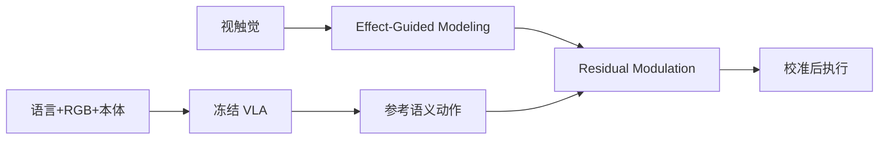

# ViTaR：基础 VLA 的视触觉残差适配

**ViTaR**（*ViTaR: Visuo-Tactile Residual Adaptation for Foundation VLA Manipulation*，[arXiv:2608.15816](https://arxiv.org/abs/2608.15816)，[项目页](https://icr-lab.github.io/ViTaR)）由 **北京理工大学（BIT）** 提出：冻结 **OpenVLA-OFT** 等基础 VLA，用 **Effect-Guided Modeling** 与 **Residual Action Modulation** 注入 **有界视触觉残差**，校准接触密集操作。

## 一句话定义

**接触反馈不必重写策略方向，更适合负责校准动作执行。**

## 英文缩写速查

| 缩写 | 英文全称 | 简要说明 |
|------|----------|----------|
| VLA | Vision-Language-Action | 视觉-语言-动作大模型 |
| ViTaR | Visuo-Tactile Residual Adaptation | 本文视触觉残差框架 |
| EGM | Effect-Guided Modeling | 判断局部修正是否合理 |
| RAM | Residual Action Modulation | 连续缩放有界残差 |

## 为什么重要

- 纳入 [2026-08-31 九篇盘点](../../sources/blogs/wechat_embodied_station_clap_9_papers_open_source_2026-08-31.md) 的「触觉校正」支线。
- 避免把触觉并入生成输入导致 **遗忘** 视觉语义先验。
- UniVTAC **7 个接触密集任务** 平均 **61.3%**，比冻结基线 **+30.6 pt**；真机 **+30.0 pt**。

## 核心信息

| 项 | 内容 |
|----|------|
| **机构** | 北京理工大学（BIT） |
| **基座** | 冻结 OpenVLA-OFT |
| **真机** | RealMan RM65-B + 触觉平行夹爪 |
| **开源** | **待发布**（项目页 Code Coming soon） |

### 流程总览

## 评测

| 设定 | 结果 |
|------|------|
| UniVTAC 平均 | **61.3%**（+30.6 pt vs 冻结基线） |
| 真机三任务平均 | **48.3%**（+30.0 pt） |

## 与其他工作对比

三条路线都选择 **不动基础 VLA 权重**，分歧在「触觉信号从哪一层进入、由谁学」：

| 工作 | 基座处理 | 触觉入口 | 残差如何得到 | 相对 ViTaR |
|------|----------|----------|--------------|------------|
| **ViTaR** | 冻结 OpenVLA-OFT | EGM 判断「是否该修」 | 离线训练 RAM，连续缩放**有界**残差 | — |
| [OmniTacTune](./paper-omnitactune-tactile-residual-adaptation.md) | 冻结 Flow/ACT/DP/\(\pi_{0.5}\)（策略无关） | 直接接入残差策略 | **真机在线 RL**，无需离线触觉演示 | 同为「冻结基座 + 触觉残差」，但把学习放到真机在线，代价是每任务 40–80 min 交互 |
| [VLA-Touch](./paper-sa-2507-17294-vla-touch-enhancing-vision-language-action-model.md) | 冻结基座 | 预训练**触觉—语言**模型给语义反馈 | 扩散控制器精修动作 | 触觉先转成语言语义再回注；ViTaR 停在动作空间的有界调制，不经语言瓶颈 |

- **与「把触觉并入生成输入」的微调路线相比**：ViTaR 的立论正是后者会稀释视觉语义先验（见「为什么重要」）；代价是残差有界，极端接触失败超出校正范围（见「局限与风险」）。
- **数字不可直接横比**：ViTaR 报 UniVTAC 7 任务 **61.3%**，OmniTacTune 报四个真机任务 **85–100%**，两者任务集、基座与评测协议均不同，只能比「增益来源」不能比绝对值。
- **概念背景**：接触信号的表征与融合口径见 [触觉传感](../concepts/tactile-sensing.md) 与 [视触觉融合](../concepts/visuo-tactile-fusion.md)。

## 结论

**触觉应作执行调制器，在保留 VLA 语义动作的前提下做局部有界校正。**

- 冻结基础 VLA，降低灾难性遗忘风险
- EGM 判断「是否该修、修哪种」
- RAM 按实时触觉连续缩放残差
- 仿真与真机接触任务均显著增益
- 代码截至入库日 **尚未发布**

## 源码运行时序图

源码运行时序图 | **不适用**（截至 2026-08-31 项目页标注 Code Coming soon，无可运行官方仓库）。

## 局限与风险

- **代码待发布：** 复现需等待官方或自行实现双阶段残差头。
- **触觉硬件：** 真机收益依赖传感器质量与标定。
- **残差有界：** 极端接触失败可能超出校正范围。

## 关联页面

- [VLA](../methods/vla.md)
- [Manipulation](../tasks/manipulation.md)
- [CLAP / 跨本体 9 篇技术地图](../overview/clap-cross-embodiment-vla-wm-9-papers-technology-map.md)

## 参考来源

- [vitar_arxiv_2608_15816](../../sources/papers/vitar_arxiv_2608_15816.md)
- [icr-lab-vitar](../../sources/sites/icr-lab-vitar.md)
- [wechat_embodied_station_clap_9_papers_open_source_2026-08-31](../../sources/blogs/wechat_embodied_station_clap_9_papers_open_source_2026-08-31.md)

## 推荐继续阅读

- [arXiv:2608.15816](https://arxiv.org/abs/2608.15816)
- [ViTaR 项目页](https://icr-lab.github.io/ViTaR)
