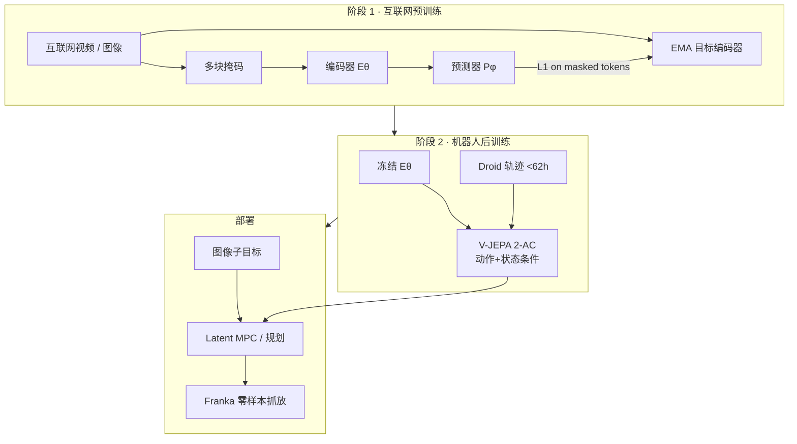
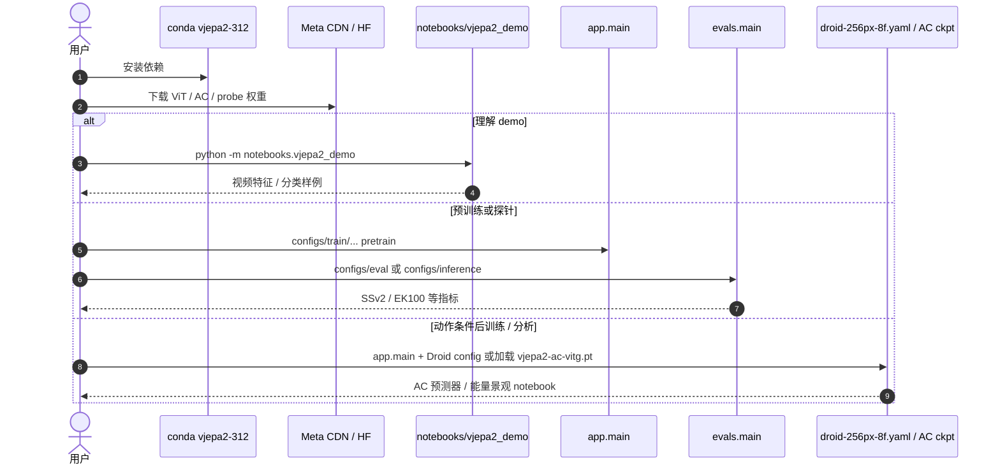

# V-JEPA 2（自监督视频世界模型 · arXiv:2506.09985）

**V-JEPA 2**（*V-JEPA 2: Self-Supervised Video Models Enable Understanding, Prediction and Planning*，[arXiv:2506.09985](https://arxiv.org/abs/2506.09985)，Mahmoud Assran / Adrien Bardes / Nicolas Ballas / Michael Rabbat / Yann LeCun 等 · **元宇宙人工智能（Meta AI / FAIR）**；[博客](https://ai.meta.com/blog/v-jepa-2-world-model-benchmarks)，[代码](https://github.com/facebookresearch/vjepa2)）主张：先在 **互联网规模无动作视频** 上学可预测的世界表征，再用 **少量机器人交互** 训动作条件预测器 **V-JEPA 2-AC**，在 **latent 空间** 做模型预测控制——**规划不必逐步渲染完整像素视频**。

## 一句话定义

**两阶段世界模型：互联网 JEPA 视频预训练学表征，少量机器人数据后训练作条件预测器，在 latent 空间对图像子目标做零样本操作规划。**

## 英文缩写速查

| 缩写 | 英文全称 | 简要说明 |
|------|----------|----------|
| JEPA | Joint-Embedding Predictive Architecture | 在学习表征空间做预测，而非像素重建 |
| V-JEPA 2 | Video JEPA 2 | 本文预训练编码器 + 预测器 |
| V-JEPA 2-AC | Action-Conditioned V-JEPA 2 | 冻结编码器上的动作条件世界模型 |
| EMA | Exponential Moving Average | 目标编码器防表征坍塌 |
| RoPE | Rotary Position Embedding | 本文用 **3D-RoPE** 稳大模型训练 |
| MPC | Model Predictive Control | 在 latent 能量/代价上滚动规划 |
| Droid | Distributed Robot Interaction Dataset | AC 后训练数据源（**<62 h**） |
| SSv2 / EK100 | Something-Something v2 / Epic-Kitchens-100 | 运动理解与动作预期探针基准 |

## 为什么重要

- **数据配方可扩展：** 机器人交互稀缺；先吃 **>1M 小时** 互联网视频，再用 **不足 62 小时** Droid 无标注轨迹接上规划——降低「必须海量真机交互才能训 WM」的门槛。
- **规划介质换轨：** 相对 [IRASim](./paper-irasim.md) / [Masked Visual Actions](./paper-masked-visual-actions.md) 等像素视频沙盒，V-JEPA 2-AC **不在完整像素去噪环里规划**，算力与延迟画像不同；策展上落在「未来视频」与「低维潜变量」之间的 **latent 中间路线**（见 [物理保真输出轴](../overview/world-model-physics-fidelity-outputs.md)）。
- **理解–预测–规划一条链：** 同一预训练骨干可支撑运动分类、动作预期、视频 QA（对齐 LLM）与机器人规划，而不是为规划单独从零训生成式视频模型。
- **零样本部署叙事：** 报告在两个实验室 Franka 上、**无本环境数据采集 / 无任务奖励**，用图像子目标完成抓取与放置（以论文设定为准）。

## 核心信息

| 项 | 内容 |
|----|------|
| **机构** | 元宇宙人工智能（Meta AI / FAIR）；Mila 等合作 |
| **预训练数据** | VideoMix22M：>1M 小时视频 + ImageNet 等 |
| **编码器规模** | 至 **ViT-g ~1B** |
| **预训练目标** | 掩码片段的 **表征 L1 预测**（非像素） |
| **AC 数据** | Droid **<62 h** 无标注交互 |
| **AC 规模** | ~**300M** block-causal 预测器 |
| **开源** | **已开源** · MIT · 含 2-AC 权重 |

## 流程总览

## 核心原理

### 为什么预测表征而不是像素

生成式目标强迫模型重建不可预测细节（草叶、噪声纹理），计算贵且不一定利于控制。JEPA 只预测 **可预测结构**（物体轨迹、接触后果的抽象），把「理解世界」与「画壁纸」分开——这是相对 [Video-as-Simulation](../concepts/video-as-simulation.md) 像素路线的显式取舍。

### 预训练：掩码去噪特征预测

视频管状 patch（\(2\times16\times16\)）→ 多块掩码 → 编码器看可见 token → 预测器填掩码位置 → 对 EMA 目标表征做 L1。缩放杠杆：数据 VM22M、模型至 ViT-g、更长训练、warmup-constant-decay 下的 **渐进时空分辨率**（短低分 → 长高分）。

### V-JEPA 2-AC：latent 动作条件世界模型

冻结预训练编码器；新预测器以 **block-causal attention** 自回归预测下一帧表征，条件于历史表征、动作与末端状态。规划：给定图像目标，在表征空间优化动作序列（MPC），**无需把每一步解码成完整 RGB 视频再打分**。

## 工程实践

| 项 | 实践要点 |
|----|----------|
| **开源状态** | **已开源**（截至 **2026-07-27**）：[facebookresearch/vjepa2](https://github.com/facebookresearch/vjepa2) · **MIT**；博客与 HF collection 提供权重 |
| **预训练权重** | ViT-L / H / g / g-384 等；`dl.fbaipublicfiles.com/vjepa2/` |
| **AC 权重** | `vjepa2-ac-vitg.pt`（自 ViT-g） |
| **最短体验** | 装 conda 环境 → 下权重 → `python -m notebooks.vjepa2_demo` |
| **AC 相关** | `configs/train/vitg16/droid-256px-8f.yaml`；`energy_landscape_example.ipynb` |
| **选型** | 要 **少机器人数据 + latent 规划** 选本页；要 **更便宜的因果视频表征、暂不规划** 见 [LeVJEPA](./paper-levjepa.md)；要 **可检视像素 rollout** 选 IRASim / MVA；要 **分解自主动态** 见 [DWM Separating](./paper-dwm-separating-world-effects.md) |

## 源码运行时序图

节点对齐 [`sources/repos/vjepa2.md`](../../sources/repos/vjepa2.md)。

- **最短路径：** demo notebook + 公开 ViT 权重。
- **规划向：** 加载 **V-JEPA 2-AC**；真机环需要自备 Franka / 相机栈（论文实验室设定，仓库以模型与 notebook 为主）。

## 实验与评测

| 轴 | 报告口径（以论文为准） |
|----|------------------------|
| 运动理解 | SSv2 attentive probe **77.3** top-1 |
| 动作预期 | EK100 **39.7** recall@5（相对此前最优结果大幅提升） |
| 视频 QA | 对齐 8B LLM：PerceptionTest **84.0**、TempCompass **76.9** 等 |
| 机器人 | Droid **<62 h** 后训练；两实验室 Franka 零样本 grasp / pick-and-place |
| 缩放消融 | 数据 / 模型 / 训练时长 / 分辨率递进提升六任务平均精度 |

## 结论

**V-JEPA 2 证明：互联网 JEPA 表征 + 少量机器人交互，足以支撑「理解 / 预测 / latent 规划」链条，且规划不必走完整像素渲染。**

1. **表征空间预测是主轴** — 忽略不可预测像素细节，保留可控结构。
2. **数据杠杆** — >1M 小时视频预训练，**<62 h** 机器人数据接规划。
3. **AC 不改编码器** — 冻结 Eθ，只训动作条件预测器，利于复用理解骨干。
4. **零样本操作叙事强** — 无本环境数据与任务奖励的 Franka 实验（复制时注意硬件与相机假设）。
5. **物理保真读法** — latent rollout **不可直接肉眼验动力学**；必须用动作敏感性、可执行性与真机相关性补测。
6. **工程** — MIT 全开源；仓库已混入 V-JEPA 2.1，选型时分清论文锚点 **2506.09985**。

## 局限与风险

- **可解释性弱于像素 WM：** 失败时难「看视频」定位是几何错还是接触错。
- **子目标依赖：** 规划需要图像目标；开放语言目标需另接上层。
- **自主动态纠缠：** 未显式分解 world/action 效应；强重力/漂移场景可对照 [DWM Separating](./paper-dwm-separating-world-effects.md)。
- **真机栈不在仓内完备交付：** 模型开源 ≠ 一键复制论文实验室闭环。

## 与其他工作对比

| 对比轴 | V-JEPA 2 / AC | [IRASim](./paper-irasim.md) | [DWM Separating](./paper-dwm-separating-world-effects.md) | [WorldWeaver](./paper-worldweaver.md) | [ODEWorld](./paper-odeworld.md) |
|--------|---------------|-----------------------------|----------------------------------------------------------|---------------------------------------|--------------------------------|
| **预测空间** | **学习表征** | 像素/VAE latent 视频 | 学习表征 | 像素/视频 latent + **寄存器** | 解耦动力学 token + 可选 RAE |
| **机器人数据** | **极少（<62 h）** | 按数据集监督生成 | 控制基准轨迹 | Minecraft 多智能体 | LIBERO + AgiBot 子集 |
| **规划** | Latent MPC | 视频打分 / 选轨迹 | Latent CEM | 交互生成（非操作 CEM 主叙事） | ODE 子目标条件策略（无动作条件） |
| **开源** | **MIT 完整** | Apache 完整 | **未开源** | **占位 coming soon** | 推理+权重；无训练/LICENSE |

## 关联页面

- [世界模型物理保真：输出阅读轴](../overview/world-model-physics-fidelity-outputs.md) — latent / 视频中间路线
- [IRASim](./paper-irasim.md) — 像素 trajectory-to-video 对照
- [Masked Visual Actions](./paper-masked-visual-actions.md) — 像素掩码条件对照
- [RynnWorld-4D](./paper-rynnworld-4d-rgb-depth-flow.md) — 显式几何运动信号对照
- [DWM（Separating World Effects）](./paper-dwm-separating-world-effects.md) — latent 转移分解
- [WorldWeaver](./paper-worldweaver.md) — 持续世界状态
- [Generative World Models](../methods/generative-world-models.md)
- [Video-as-Simulation](../concepts/video-as-simulation.md)
- [Manipulation](../tasks/manipulation.md)
- [ODEWorld](./paper-odeworld.md) — 连续时间 JVP 速度监督对照（论文视频基线之一）
- [RISE（酷哇 · 驾驶 WAM）](./paper-rise-adaptive-imagination-wam.md) — 冻结 V-JEPA 2 编码器 + 自适应 latent rollout
- [LeVJEPA](./paper-levjepa.md) — LeJEPA+SIGReg 视频预训练：不要 EMA/predictor，同数据重训省 5.6–20.8× FLOP；无 AC/规划

## 参考来源

- [V-JEPA 2 论文归档（arXiv:2506.09985）](../../sources/papers/vjepa2_arxiv_2506_09985.md)
- [facebookresearch/vjepa2 代码索引](../../sources/repos/vjepa2.md)
- [Meta V-JEPA 2 博客归档](../../sources/sites/meta-vjepa2-blog.md)
- [具身智能研究室：世界模型物理保真（微信）](../../sources/blogs/wechat_embodied_ai_lab_world_model_physics_fidelity.md)

## 推荐继续阅读

- [arXiv:2506.09985](https://arxiv.org/abs/2506.09985)
- [Meta 博客](https://ai.meta.com/blog/v-jepa-2-world-model-benchmarks)
- [GitHub — facebookresearch/vjepa2](https://github.com/facebookresearch/vjepa2)
- [HF collection — V-JEPA 2](https://huggingface.co/collections/facebook/v-jepa-2-6841bad8413014e185b497a6)
