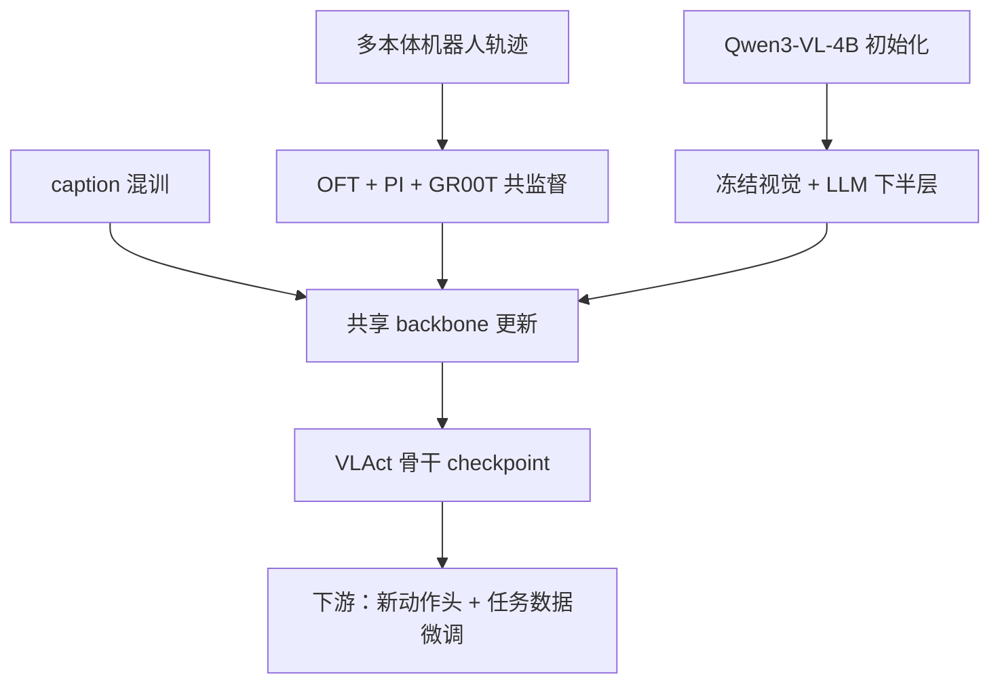
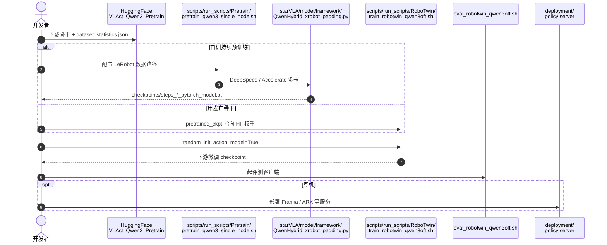

# VLAct：数据缩放之外的 VLA 表征轴

**VLAct**（*Beyond Data Scaling: Representation-Centric Continued Pre-training for Vision-Language-Action Models*，[arXiv:2608.27550](https://arxiv.org/abs/2608.27550)，[项目页](https://starvla.github.io/VLAct/)，[代码](https://github.com/starVLA/VLAct)）由 StarVLA 团队提出：在 **Qwen3-VL-4B** 上，用全开源机器人数据做 **VLA 持续预训练**，把有限轨迹蒸馏为可迁移的 **视觉–动作表征**，而非仅拟合单一动作头。

## 一句话定义

**在固定机器人数据预算下，先把 VLM backbone 训成「多 head、多本体可读」的动作表征底座，再换任意下游头微调——这比单纯堆数据更能决定 VLA 上限。**

## 英文缩写速查

| 缩写 | 英文全称 | 简要说明 |
|------|----------|----------|
| VLAct | Vision-Language-Action continued pre-training | 本文表征中心持续预训练配方与发布骨干 |
| VLA | Vision-Language-Action | 视觉–语言–动作多模态策略 |
| VLM | Vision-Language Model | 预训练视觉–语言底座（本文 Qwen3-VL-4B） |
| OFT | Orthogonal Finetuning / OpenVLA-style head | 连续 MLP 动作头（StarVLA 族） |
| PI | Policy with flow-matching | 流匹配连续动作头 |
| GR00T | NVIDIA GR00T 风格扩散/连续头 | 第三类共监督连续头 |
| CPT | Continued Pre-Training | 在已预训练 VLM 上继续机器人轨迹训练 |

## 为什么重要

- **把 backbone 提升为一阶设计变量：** 对照实验固定下游头、数据、优化器与预算，仅换 backbone 权重即带来 **7.6–21.4 pp** 增益，说明「换 VLM」不够，需要 **VLA 导向的持续预训练**。
- **跨本体迁移证据强：** 持续预训练未见 GR-1，仅 **20% RoboCasa-GR1** 轨迹即 **49.5%**，超过全数据 **GR00T-N1.6 47.6%**。
- **算力友好：** 全开源数据 + **16 GPU** 即可对齐或超越大规模工业 VLA（如 ABot-M0、LingBot-VLA）。
- **工程可复现：** MIT 代码、HF 骨干与多 benchmark 脚本基于 [StarVLA](../methods/star-vla.md) 栈。

## 核心信息

| 项 | 内容 |
|----|------|
| **机构** | 香港中文大学（CUHK）等（Jiaya Jia、Hengshuang Zhao 等顾问） |
| **骨干** | Qwen3-VL-4B |
| **预训练数据** | DROID、InternData-A1、RoboCoin、MolmoAct + caption |
| **持续预训练本体** | Franka（DROID/MolmoAct）+ AgileX（InternA1/RoboCoin）；**不含 GR-1** |
| **开源** | **已开源** MIT 代码 + HF [VLAct_Qwen3_Pretrain](https://huggingface.co/StarVLA/VLAct_Qwen3_Pretrain) |

## 核心原理

### 三条失败模式（pilot）

1. **先验侵蚀：** 全参数机器人微调覆盖 VLM 通用视觉–语义特征。
2. **Decoder lock-in：** 单头（如 OFT）预训练使 latent 几何专属于该头，换 PI/GR00T 反而低于 scratch。
3. **离散化损失：** FAST 离散监督粗粒度可迁移，但细粒度振幅/时序信息丢失。

### VLAct 配方（仅持续预训练阶段）

| 组件 | 机制 |
|------|------|
| **保留 VLM 先验** | 冻结视觉编码器 + LLM 下半层；混训 caption（`L = L_action + λ L_VLM`） |
| **多头共监督** | 同一 latent 上 OFT + PI + GR00T 并行预测同一 action chunk |
| **部分统一动作空间** | 20-D 布局：双臂绝对角、单臂 delta EE、**共享夹爪维**；inactive 维 mask；周期关节 **wrap-aware loss** |

下游微调时 **丢弃** 预训练头，**重新初始化** 任务头并 **解冻全模型**。

### 流程总览

## 源码运行时序图

节点对齐 [`sources/repos/vlact.md`](../../sources/repos/vlact.md) 与 README。

- **注意：** 持续预训练 checkpoint **不是** 可直接部署策略；需匹配相机/动作契约并初始化下游头。
- **论文 vs 发布物：** RoboTwin **92.5%** 为 OFT 表；HF RoboTwin 卡或为 GR00T 头——引用数字时对齐表格与 checkpoint 卡片。

## 工程实践

| 项 | 建议 |
|----|------|
| 起点 | 新本体 / 新数据集优先用 **VLAct_Qwen3_Pretrain** 而非 benchmark 特化 checkpoint |
| 环境 | Linux + Python 3.10 + CUDA PyTorch + `flash-attn==2.7.4.post1` |
| 配置块 | 各 `train_*.sh` 顶部检查 `base_vlm`、`pretrained_ckpt`、`run_root_dir` |
| 对照 | 与 **Qwen3VL-OFT** 同协议对比才隔离 backbone 效应 |
| StarVLA | 动作头与数据管线与 [StarVLA](../methods/star-vla.md) 共用，便于消融 |

## 实验与评测

| 基准 | VLAct | 对照 / 备注 |
|------|------|-------------|
| **LIBERO-Plus** | **82.6%** Total | Qwen3VL-OFT 75.0%（+7.6）；超 ABot-M0 |
| **VLA-Arena** | **54.8%** | Qwen3VL-OFT 33.4%（+21.4） |
| **RoboTwin 2.0 Clean** | **92.5%** / 90.8% random | Qwen3VL-OFT 88.2% / 88.3% |
| **RoboCasa-GR1** | **49.5%** @20% 数据 | GR00T-N1.6 47.6% @100%；π₀.₅ 37.0% |
| **RoboDojo** | score **10.66** / success **7.60%** | 35 策略中第 6；优于标注 WAM 条目 |
| **真机 Franka** | 单臂短程 **92.5%**；双臂 **72.0%** | 对 Qwen3VL-OFT 77.5% / 44.0% |

## 结论

**VLAct 把「VLA 持续预训练」从动作拟合升级为表征学习：在开源数据与 16 GPU 预算下，backbone 质量可以成为与数据规模并列的独立进度轴。**

- **真影响指标的是 backbone 配方：** 固定下游一切，仅换 VLAct 骨干即获双位数 pp 增益——读论文应盯 **冻结策略 / 多头共监督 / 部分统一动作维**，而非某个发布 checkpoint 的瞬时 SR。
- **跨本体迁移是杀手锏：** GR-1 未见于 CPT、仅 20% 下游轨迹即超全数据工业基线——适合作为「新 embodiment 数据稀缺」时的预训练起点。
- **多头共监督解决 lock-in：** 单 OFT 预训练损害 PI 微调；三头共训同时改善 **换头迁移** 与 **同头性能**。
- **发布物与 headline 表要对齐读：** checkpoint 动作头类型（OFT/PI/GR00T）与论文 Table 不一定一致，复现与对比时以 **config + 论文表注** 为准。
- **工程入口：** [starVLA/VLAct](https://github.com/starVLA/VLAct) + HF 集合；与 StarVLA 生态互链，但 CPT 脚本与 `QwenHybrid_xrobot_padding.py` 为 VLAct 特有。

## 与其他页面的关系

- [StarVLA](../methods/star-vla.md) — 代码基座与动作头模块化设计
- [VLA](../methods/vla.md) — 通才 VLA 预训练谱系
- [Qwen-VLA](./qwen-vla.md) — 同 Qwen3 生态的「大规模通才预训练」对照
- [CapVector](./paper-capvector-capability-vectors-vla.md) — 多骨干后训练栈（含 StarVLA）

## 参考来源

- [vlact_arxiv_2608_27550.md](../../sources/papers/vlact_arxiv_2608_27550.md)
- [vlact 项目页](../../sources/sites/vlact.md)
- [vlact 仓库](../../sources/repos/vlact.md)

## 推荐继续阅读

- [VLAct 项目页](https://starvla.github.io/VLAct/)
- [StarVLA GitHub](https://github.com/starVLA/starVLA)
- [VLA 开源复现景观（2025）](../overview/vla-open-source-repro-landscape-2025.md)
