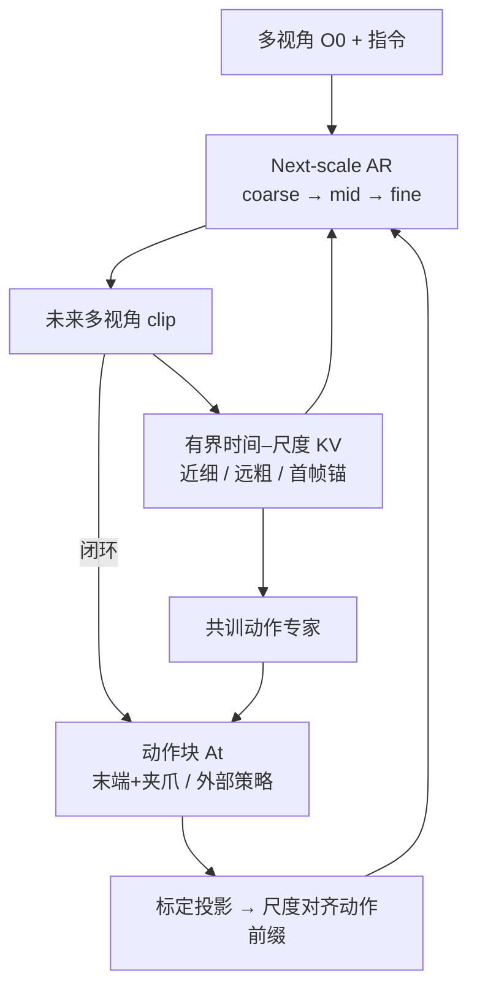

# WALL-SS（下一尺度自回归长程世界模型）

**WALL-SS**（*WALL-SS: Scaling Long-horizon World Models via Next-Scale Autoregression*，[PDF](https://github.com/X-Square-Robot/wall-ss/blob/main/wall-ss-paper.pdf)，2026-08-26，[项目页](http://x2robot.com/pages/ss)，[GitHub](https://github.com/X-Square-Robot/wall-ss)）由 **自变量机器人（X Square Robot）** 提出：把具身轨迹写成 **观察–动作交错的因果序列**，用 coarse-to-fine **下一尺度自回归** 生成每一帧未来视觉，并在有界记忆下做最长约 **60 秒** 的流式推演。页眉为 `arXiv:submit/7998075`；截至 **2026-08-28** 尚无公开 `arxiv.org/abs` 编号。

## 一句话定义

**一个动作可控的长程像素世界模型：先在粗尺度钉死状态转移，再逐层补细节，用有界多尺度记忆滚 60 秒，并用虚实配对成功率校准策略评估。**

## 英文缩写速查

| 缩写 | 英文全称 | 简要说明 |
|------|----------|----------|
| WALL-SS | Scale-wise autoregressive Scaling | 本文 next-scale 自回归世界模型 |
| VAR | Visual Autoregressive Modeling | 图像 next-scale 预测族；本文骨干来自 InfinityStar |
| WM | World Model | 动作条件未来观测预测器 |
| KV | Key-Value cache | 时间–尺度记忆里复用的因果状态 |
| MAE | Mean Absolute Error | 虚实任务成功率校准误差 |
| UMI | Universal Manipulation Interface | 无本体手持夹爪数据源之一 |
| GRPO | Group Relative Policy Optimization | 视觉生成 on-policy 对齐的组相对更新 |

## 为什么重要

- **把动作写进生成链条：** clip 级扩散常把动作当全局条件，模型容易走「成功演示捷径」（夹爪未接触仍把杯子吸起来）。WALL-SS 用 **观察→动作→新观察** 的因果因式，并在 coarse 层就条件化动作。
- **长程可滚、记忆有界：** 近期细节保留、远期压缩，KV 不随 rollout 长度线性膨胀；dream forcing 专门打自生成上下文。
- **评估可读：** 同一冻结策略在 WM 与真机上跑 **600** 对，成功率 \(r=0.93\)、组内 checkpoint 排序 pairwise **0.89**——对齐 [虚拟沙盒](../overview/world-models-route-03-virtual-sandbox.md)「虚拟结果能否预测真机排名」。
- **开源边界清楚：** 论文与占位仓已出，**训练/推理代码未发布**；数字只能当论文主张，不能当可复现基线。

## 核心信息

| 项 | 内容 |
|----|------|
| **机构** | 自变量机器人（X Square Robot） |
| **骨干** | [InfinityStar](https://arxiv.org/abs/2511.04675) next-scale 视频 AR；VideoVAE 冻结 |
| **动作接口** | 双臂末端位姿 + 夹爪开合，投影为与 RGB 对齐的 **动作视频**（头相机平面） |
| **视角** | 头相机 + 双腕；残差跨视角适配器，无相机维自回归顺序 |
| **数据** | AgiBotWorld-Beta **987,508** clip / **165,560** 源视频；ManipArena；私有 X2-Robot / UMI；失败与接管 |
| **开源（截至 2026-08-28）** | **宣称将开源 / 待发布训练推理代码**：仓 MIT，仅 PDF + README + 配图 |

## 核心原理（方法）

### 三组件

| 模块 | 作用 |
|------|------|
| **尺度对齐动作条件** | 计划侧轨迹经标定投影到各相机时间线；查询只读当前 clip、不粗于当前视觉尺度的动作前缀 |
| **时间–尺度记忆** | 近 clip 细 KV、远 clip 粗 KV、\(O_0\) 身份锚点；按年龄驱逐，工作集与完成 clip 数无关 |
| **On-policy 视觉对齐** | 固定动作条件下采样 \(K\) 条视觉 rollout；动作跟随 + 长程一致性奖励；KL + 真实轨迹 replay 保外观先验 |

动作专家（§3.4）与视觉生成 **共训**：从已提交因果状态读上下文，flow-matching 预测下一控制块；视觉模型从不读专家私有状态。递归想象 = 动作预测 → 视觉生成 → 记忆提交；真机部署时本体状态来自实测本体感觉。

### 流程总览

数据侧把样本按标定是否可靠拆成 **动作条件池** 与 **纯视频池**；干预数据含 **即时接管** 与 **rollback-replay** 对照分支，专门打断「grasp ⇒ 物体吸附」捷径。

## 源码运行时序图

**不适用**（截至 **2026-08-28**）：[X-Square-Robot/wall-ss](https://github.com/X-Square-Robot/wall-ss) 仅为论文与项目页占位，README 明确训练/推理代码尚未发布。

## 工程实践

| 项 | 建议 |
|----|------|
| **复现** | watch GitHub TODO；入库日无可运行入口 |
| **动作表示** | 末端 SE(3)+夹爪；无完整关节、力、力矩——精细接触与灵巧手不要外推 |
| **闭环接线** | 外部策略出动作块 → action bridge 重采样到训练时末端表示 → 生成头+双腕 → 回传策略；初始化后不再喂 GT |
| **数据路由** | 缺内参/外参/运动学则 **降级为纯视频**，不要静默喂错位动作 |
| **对齐阶段** | 奖励 **不含** 任务进度/成功；只修动作漂移与 clip 边界不一致 |

## 实验与评测

WorldArena 风格具身视频生成（**200 ID + 100 OOD**；约 80% 含同步控制）：

| 模型 | Interaction ↑ | Instruction Following ↑ | Trajectory Acc. ↑ | Action Following ↑ |
|------|---------------|-------------------------|-------------------|--------------------|
| InfinityStar | 0.484 | 0.406 | 0.251 | — |
| Wan2.2-14B | 0.476 | 0.394 | 0.159 | — |
| Cosmos3-Nano | 0.516 | 0.410 | 0.202 | 0.044 |
| **WALL-SS** | **0.546** | **0.471** | **0.539** | **0.290** |

On-policy 对齐相对监督 checkpoint：动作跟随 **0.264→0.290**，轨迹准确 **0.512→0.539**，跨 clip 边界误差 **0.118→0.104**；外观指标基本不变。

虚实闭环（6 任务 × 5 个 WALL-WM checkpoint × 20 初态 = **600** 对）：

| 轴 | 报告口径 |
|----|----------|
| 校准（30 cell） | MAE **0.062**；bias **+0.028**；斜率 **0.84**；\(r=0.93\) |
| 组内排序 | pairwise **0.89**；\(\bar\rho=0.88\)；选择 regret **0.025** |
| Episode | 平衡准确 **0.88**；成功召回 0.90 / 失败召回 0.86；FPR **0.14** |
| 偏差位置 | 抓取近校准（−0.01）；接触/插入最乐观（条件转移最高 **+0.12**） |

真机双臂桌面（共训动作专家）：平均 Task Progress **69.1** vs π₀.₅ **49.6** / DreamZero **44.1** / LingBot-VA **34.0**。对齐视觉生成后同一专家从 **64.6→69.1**（专家本身不吃奖励梯度）。

## 结论

**WALL-SS 的硬指标是「动作不同则未来不同」加上「虚拟成功率能排真机 checkpoint」；画质与 60 秒只是支撑条件，训练代码未发布前不要当可部署模拟器。**

1. **因果因式比 clip 条件更重要** — 粗尺度先钉状态转移，细尺度再补接触；否则成功先验会盖过毫米级动作差。
2. **读校准数字要分层** — \(r=0.93\) / pairwise 0.89 说明适合 **预筛选**；接触/插入仍偏乐观（FPR 0.14），不能取消真机。
3. **记忆必须与生成层级同构** — 近细远粗 + 首帧锚点，比「只留最近 clip」或「全历史 KV」更稳，且预算不随分钟级 rollout 爆炸。
4. **On-policy 对齐修动力学、不刷任务分** — 奖励故意不含成功；真机 Task Progress 提升是副作用，不是直接 RL 策略。
5. **动作接口是末端+夹爪** — 论文自己划界：无力/关节/多指；磁铁抓取主要靠失败与 rollback 数据打断捷径。
6. **开源** — 截至入库日只有 PDF 与占位仓；对比 [Ctrl-World](./paper-ctrl-world.md) 已开源推理。

## 与其他工作对比

| 对比轴 | WALL-SS | [Ctrl-World](./paper-ctrl-world.md) | [OSCAR](./paper-oscar.md) | [SC3-Eval](./paper-sc3-eval.md) |
|--------|---------|-------------------------------------|---------------------------|--------------------------------|
| **骨干** | InfinityStar next-scale AR | SVD 1.5B 扩散 | Cosmos-Predict2.5-2B 扩散 | Cosmos3-Nano |
| **条件** | 投影末端动作视频 + 尺度对齐 | 帧级笛卡尔位姿 cross-attn | 2D 运动学骨架 | 低维动作 + 正/逆动力学 |
| **长程** | 有界时间–尺度记忆，约 60 s | 位姿记忆检索 | clip 自回归 | 逆动力学早停 |
| **评估** | 600 对虚实成功率校准 | 指令跟随排名 + 合成 SFT | RoboArena 排名相关 | 七 checkpoint \(r=0.929\) |
| **开源** | 训练推理 **待发布** | **已开源** MIT | 部分开源 | **确认未开源** |

相对 [WorldEcho / WorldSync](./paper-worldecho-worldsync.md)：WALL-SS 用 WorldArena 的 Action Following / Trajectory Acc. 与虚实成功率，不报 off-expert \(\mathrm{SE}(3)\) NDTW。相对 [GigaWorld-1](./paper-gigaworld-1-policy-evaluation.md)：同属「长时动作忠实 > 短时好看」，WALL-SS 给的是一条 next-scale 实现而非七模型普查。相对 [Cosmos 3](./cosmos-3.md)：Cosmos3-Nano 是本文视频基线（动作跟随仅 0.044），不是同一架构。

## 局限与风险

- **无可运行官方代码** — 占位仓不能复现 0.290 / 0.93 等数字。
- **接触乐观** — 插入阶段条件转移偏差最高；用 WM 筛策略时应对接触任务加真机复核。
- **动作空间窄** — 末端+夹爪，无力觉与完整关节；多指灵巧与全身 loco-manip 未证明。
- **闭环策略来自 WALL-WM 家族 checkpoint** — 校准结论绑在该策略族与六桌面任务，不宜写成任意 VLA 的通用替代。
- **无公开 arXiv abs** — 引用请链 GitHub PDF；编号落地后应回填。

## 关联页面

- [Generative World Models](../methods/generative-world-models.md) — 生成式 WM 谱系
- [Video-as-Simulation](../concepts/video-as-simulation.md) — 像素即仿真
- [world-models-route-03-virtual-sandbox](../overview/world-models-route-03-virtual-sandbox.md) — 虚拟评估沙盒
- [训练闭环 taxonomy](../overview/robot-world-models-training-loop-taxonomy.md) — 学习型模拟器 / 视频 WM
- [Ctrl-World](./paper-ctrl-world.md) — 已开源多视角 VLA 闭环对照
- [OSCAR](./paper-oscar.md) — 骨架条件 + RoboArena 排名
- [SC3-Eval](./paper-sc3-eval.md) — 自一致评估器
- [WorldEcho / WorldSync](./paper-worldecho-worldsync.md) — off-expert 动作跟随
- [Cosmos 3](./cosmos-3.md) — 本文 Nano 基线所属平台
- [CurrentWorld-0](./current-robotics-currentworld.md) — 产业侧交互模拟器（确认未开源）
- [X2Streaming-TTS](./paper-x2streaming-tts.md) — 同机构流式生成（语音）
- [TwinDEX](./twindex.md) — 同机构三指无本体采数接口（2026-09；未开源）
- [评测选型闭环](../queries/embodied-eval-benchmark-selection-loop.md) — ② 层 WM 作评估器
- [Manipulation](../tasks/manipulation.md)

## 参考来源

- [WALL-SS 论文归档](../../sources/papers/wall_ss_x_square_2026.md)
- [项目页归档](../../sources/sites/x2robot-wall-ss.md)
- [GitHub 占位仓归档](../../sources/repos/wall-ss.md)

## 推荐继续阅读

- 论文 PDF — <https://github.com/X-Square-Robot/wall-ss/blob/main/wall-ss-paper.pdf>
- 项目页 — <http://x2robot.com/pages/ss>
- InfinityStar（骨干）— <https://arxiv.org/abs/2511.04675>
- WALL-WM（同机构 WAM 前作，arXiv:2606.01955）— <https://arxiv.org/abs/2606.01955>
