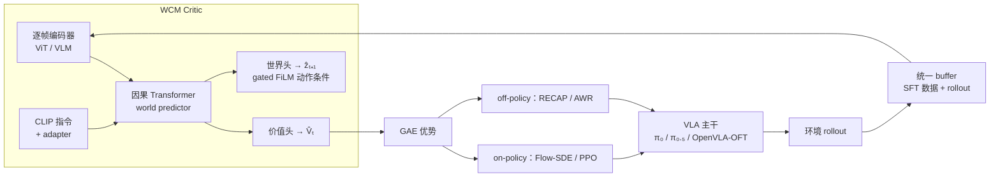
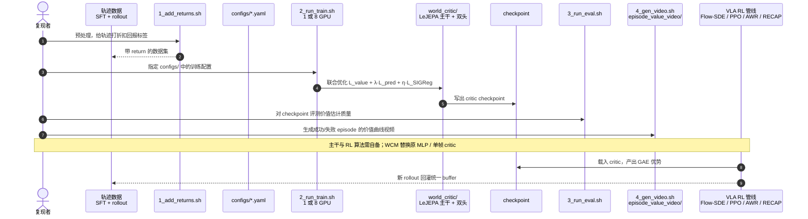

# WCM：给 VLA 强化学习换一个会预测世界的 Critic

**WCM**（*World Critic Model*；论文 *WCM: A World Critic Model for Vision-Language-Action Reinforcement Learning*，[arXiv:2607.29613](https://arxiv.org/abs/2607.29613)，[代码](https://github.com/sylvestf/WCM)）由**同济大学 / 上海创智学院 / 复旦大学**提出：在 [VLA](../methods/vla.md) 的 RL 后训练中，把只看单帧的 critic 换成一个**同时做未来隐状态预测与价值估计**的轻量 LeJEPA 模型。

## 一句话定义

**让 critic 的表征被「预测下一步会发生什么」这件事显式训练，而不是只被标量回报回归推着走——因为标量监督不足以让它学出机器人控制所需的时间结构。**

## 英文缩写速查

| 缩写 | 英文全称 | 简要说明 |
|------|----------|----------|
| WCM | World Critic Model | 本文方法：世界建模 + 价值估计的联合 critic |
| VLA | Vision-Language-Action | 被后训练的策略族（π₀ / π₀.₅ / OpenVLA-OFT） |
| JEPA | Joint-Embedding Predictive Architecture | 隐空间预测式自监督架构；LeJEPA 为其轻量变体 |
| POMDP | Partially Observable Markov Decision Process | 机器人控制的实际设定，单帧不足以定状态 |
| GAE | Generalized Advantage Estimation | 由价值输出得到优势的标准做法 |
| AWR | Advantage-Weighted Regression | off-policy 侧的自回归主干训练算法 |
| IND / OOD | In-Distribution / Out-of-Distribution | 分布内 / 分布外评测划分 |

## 为什么重要

- **指出的是一个结构性错配，不是一个调参问题。** critic-based 的 VLA RL 普遍把价值建在单帧观测或单帧 VLM latent 上，而机器人控制是 POMDP——单帧根本定不了状态。
- **它证明了「补历史」本身不够。** 消融里 ViT critic + 观测历史但去掉预测目标（\(\lambda=0\)）**仍然不行**；起作用的是**世界建模目标**，不是更大的 critic 或更长的输入。
- **坏 critic 比没 critic 更糟。** 论文的零价值消融（对所有观测令 \(V=0\)）在 OOD 上**优于** Flow-SDE 基线——这条对「要不要上 critic-based 方法」的选型判断很有杀伤力。
- **OOD 才是收益大头。** 各主干上 OOD 增益均在 33–60 个百分点量级，正好命中「RL 后训练到底带来了泛化还是过拟合」的争议。

## 核心信息

| 项 | 内容 |
|----|------|
| **机构** | 同济大学（Tongji）、上海创智学院（Shanghai Innovation Institute）、复旦大学（Fudan） |
| **适配主干** | π₀、π₀.₅（flow matching）、OpenVLA-OFT（自回归） |
| **RL 管线** | on-policy：Flow-SDE / PPO；off-policy：RECAP / AWR |
| **评测规模** | 4 基准 **149 任务**：ManiSkill(25 pick-and-place) / MetaWorld / CALVIN / LIBERO-Plus |
| **真机** | WidowX-250S（第三人称 + 腕部相机），**7 个任务**，每任务约 100 条遥操作轨迹，8 轮 RL × 50 rollouts |
| **开源** | **部分开源**：代码 MIT（[sylvestf/WCM](https://github.com/sylvestf/WCM)）；权重/数据部分上 [HF collection](https://huggingface.co/collections/Sylvest/wcm)，其余论文写明「逐步开源」 |

## 核心原理

### 诊断：state approximation problem

论文把根因命名为**状态近似问题**：没有显式的世界建模目标，critic 的表征就抓不到价值估计所需的时间结构。三层推论：

1. 单帧观测 / 单帧 VLM latent 与部分可观测控制**本质错配**；
2. 朴素地把观测历史塞进 critic，在高维视觉空间里**复杂度爆炸**；
3. 更关键的是，**纯标量回报回归的监督信号太稀薄**，学不出跨时间的动力学——所以补了历史也没用。

### 架构（LeJEPA）

| 组件 | 作用 |
|------|------|
| 观测编码器 | 逐帧独立编码为 latent（ViT 或 VLM backbone） |
| 语言条件 | CLIP 编码指令，经 adapter 映射到 latent 空间 |
| 因果 Transformer 主干（world predictor） | 对交叉注意力融合后的视觉历史做因果建模 |
| 价值头 | 输出 \(\hat V_t\) |
| 世界头 | 用 gated FiLM 的**动作条件残差更新**预测 \(\hat z_{t+1}\) |

联合目标：

\[
\mathcal L=\mathcal L_{value}+\lambda\cdot\mathcal L_{pred}+\eta\cdot\mathcal L_{SIGReg}
\]

- \(\mathcal L_{pred}\)：teacher forcing 下预测隐状态与真值隐状态的 L2
- \(\mathcal L_{SIGReg}\)：把 latent 往各向同性高斯拉，**防表征坍塌**（隐空间预测式方法的必备正则）
- \(\mathcal L_{value}\)：预测价值与折扣回报的 L2

> **读法提醒：** 这里的「世界模型」是**critic 的辅助监督**，不是拿来做规划 rollout 的动力学模型——与 [model-based RL](../methods/model-based-rl.md) 的常规用法不同。

### 接进 RL 管线

## 源码运行时序图

官方实现 [sylvestf/WCM](https://github.com/sylvestf/WCM)（MIT）用四个编号 shell 脚本串起复现路径（归档见 [sources/repos/wcm-world-critic-model.md](../../sources/repos/wcm-world-critic-model.md)）：

- **最短复现路径：** `1_add_returns.sh` → `2_run_train.sh` → `3_run_eval.sh`；诊断时加 `4_gen_video.sh` 看价值曲线能否分开成功与失败轨迹。
- **边界：** 仓库只交付 critic 侧；π₀ / π₀.₅ / OpenVLA-OFT 主干与其 RL 训练栈要自己接，HF 上也只有部分 checkpoint。

## 工程实践

| 项 | 建议 |
|----|------|
| 历史长度 K | 默认 **3**（平均最优，论文假设覆盖到二阶动力学 / 加速度）；再长收益递减 |
| 损失权重 \(\lambda\) | 取 **[0.3, 0.5]**；若目标是 OOD 泛化，宁可偏大（\(\lambda=0.9\) 的 OOD 优于 0.1）；**OOD 对 \(\lambda\) 的敏感度远高于 IND**（10.6 vs 2.7 个百分点） |
| 别做的替代方案 | MLP + frame-stacking 不行；ViT critic 但 \(\lambda=0\) 也不行——**不要只是把 critic 做大** |
| off-policy 稳定性 | 把 SFT 数据与 rollout 放**统一 buffer**，否则价值估计不稳 |
| 诊断手段 | 用价值曲线可视化看成功 / 失败轨迹是否可分；若不可分，先怀疑 critic 而非策略 |
| 何时不必上 | 若你的 critic-based 基线在 OOD 上出现「峰值后掉」，先做**零价值消融**对照——本文里它就赢过 Flow-SDE，说明当前 critic 在帮倒忙 |
| 吞吐 | WCM critic 的 rollouts/hour 优于 Gemma 270M VLM critic 基线（附录 D.3） |

## 实验与评测

**ManiSkill（相对同主干 SFT 基线）：**

| 主干 | SFT | +WCM（IND） | ΔIND | +WCM（OOD） | ΔOOD |
|------|-----|------------|------|------------|------|
| π₀ | 38.4% | 84.4% | +46.0 | 51.5% | +33.4 |
| π₀.₅ | 47.0% | 91.9% | +44.9 | 64.4% | +38.0 |
| OpenVLA-OFT | 28.1% | **99.0%** | **+70.9** | **77.9%** | **+59.6** |

**LIBERO-Plus（one-shot SFT → RL）：** π₀ 39.1%→72.8%（+33.7）；π₀.₅ 38.0%→73.7%（+35.7）；OpenVLA-OFT 29.3%→74.0%（+44.7）。**MetaWorld / CALVIN** 相对 Flow-SDE 与 π-StepNFT 一致改善。

**真机（WidowX-250S，7 任务）：** 传送带寿司动态抓取、布料折叠、毛巾折叠、灶台清理（长程）、胡萝卜 / 辣椒 / 香蕉 pick-and-place。OpenVLA-OFT+WCM 在全部 7 任务上超过 AWR + Gemma critic 基线（如传送带 22/50 vs 17/50）；π₀.₅+WCM 超过 RECAP 基线（如布料折叠 38/50 vs 37/50）。

**其他发现：** OpenVLA-OFT 零暴露起步 0.78% → RL 后 98.7%；仿真 SFT 直接上真机**全部失败**，RL 同时改善仿真与真机；Flow-SDE 存在 OOD「峰值后掉」的过拟合现象，WCM 前 500 步未出现。

## 结论

**VLA 的 RL 后训练里，critic 的表征质量是被长期低估的瓶颈；补历史不够，要给它一个显式的预测目标。**

1. **诊断先于方法**：单帧 critic 与 POMDP 控制错配，根因是状态近似问题，不是 critic 容量不足。
2. **有效成分是世界建模目标本身** — 消融里 \(\lambda=0\) 的 ViT critic 仍不行，说明「换更大 critic / 塞更多帧」这类直觉改法无效。
3. **OOD 是主战场**：三种主干上 OOD 增益 33–60 pp，且对 \(\lambda\) 的敏感度远高于 IND；调参时优先按 OOD 选。
4. **K=3 就够** — 刚好覆盖二阶动力学，更长的历史收益递减。
5. **警惕坏 critic**：零价值消融在 OOD 上赢过 Flow-SDE——如果你的 critic-based 基线出现峰值后掉，它可能不如没有。
6. **跨主干与跨管线通用**：flow matching 与自回归、on-policy 与 off-policy 四种组合都能接。
7. **真机差距要按绝对次数读**：多数任务的优势在 1–5 次成功的量级（如 38/50 vs 37/50），别把仿真上的几十个百分点直接外推到真机。

## 与其他工作对比

| 对照 | 差异读法 |
|------|----------|
| [基于模型的强化学习](../methods/model-based-rl.md) | 常规 MBRL 用世界模型做**规划 / 想象 rollout**；WCM 的世界头只做 **critic 表征的辅助监督**，不参与决策展开 |
| [生成式世界模型](../methods/generative-world-models.md) | 生成式路线预测像素/视频；WCM 在**隐空间**预测（JEPA 路线），并靠 SIGReg 防坍塌，代价更低但不可视化为视频 |
| [在线 vs 离线 RL](../comparisons/online-vs-offline-rl.md) | WCM 同时接 on-policy（Flow-SDE / PPO）与 off-policy（RECAP / AWR），说明瓶颈在 critic 表征而非算法族 |
| [ActFovea](./paper-actfovea.md) | 都在处理「单帧不够」；WCM 用时序做**训练期价值估计**，ActFovea 用时序做**推理期健康检查** |
| [LeVJEPA](./paper-levjepa.md) | 同一套 LeJEPA / SIGReg，但落在**视频表征预训练**（无价值头、无机器人 RL）；WCM 是 critic 侧的轻量变体 |

## 局限与风险

- **最优历史长度 K=3 是平均结论**，依任务而异，换任务族需重扫。
- **LeJEPA 的计算开销未与基线定量对比**（只给了 rollouts/hour 的相对优势）。
- **真机只在 WidowX-250S 单臂平台**验证，无人形 / 双臂 / 移动底盘结果。
- **\(\lambda\) 需按 IND / OOD 取舍调参**，没有一个通吃设定。
- **权重仅部分开源**，完整复现表 1–3 仍需自备 VLA 主干与四种 RL 算法实现。
- **论文未单列 limitations 节**，上述多为从实验设置与消融反推，引用时注意区分。

## 关联页面

- [VLA 方法页](../methods/vla.md) — 被后训练的策略族
- [基于模型的强化学习](../methods/model-based-rl.md) — 世界模型的常规用法对照
- [生成式世界模型](../methods/generative-world-models.md) — 像素级预测路线对照
- [OpenVLA](./openvla.md) — 自回归主干（论文用 OpenVLA-OFT）
- [π₀.₅ 开放世界 VLA](./paper-pi05-open-world-vla.md) — flow matching 主干
- [在线 vs 离线 RL](../comparisons/online-vs-offline-rl.md) — WCM 两侧都接
- [ActFovea](./paper-actfovea.md) — 时序信息用于推理期防护的对照
- [Temporal GRPO](./paper-temporal-grpo.md) — 对照：无 critic，只改阶段组相对写回（arXiv:2608.13026；未开源）
- [LeJEPA](./paper-lejepa.md) — SIGReg 图像配方（arXiv:2511.08544）；WCM 的轻量 critic 主干从此分叉
- [LeVJEPA](./paper-levjepa.md) — LeJEPA+SIGReg 的视频预训练配方（arXiv:2608.27395；已开源）

## 参考来源

- [wcm_world_critic_arxiv_2607_29613.md](../../sources/papers/wcm_world_critic_arxiv_2607_29613.md) — 论文摘录与开源核查
- [wcm-world-critic-model.md](../../sources/repos/wcm-world-critic-model.md) — GitHub 仓库归档
- [sylvestf-wcm-homepage.md](../../sources/sites/sylvestf-wcm-homepage.md) — 项目页归档
- [arXiv:2607.29613](https://arxiv.org/abs/2607.29613) — 原文（Submitted 2026-07-31）

## 推荐继续阅读

- [WCM 项目页](https://sylvestf.github.io/wcm-homepage/) — 案例视频与价值曲线
- [WCM GitHub](https://github.com/sylvestf/WCM) — 训练 / 评测 / 可视化四步脚本
- [WCM Hugging Face collection](https://huggingface.co/collections/Sylvest/wcm) — 已发布权重与数据
