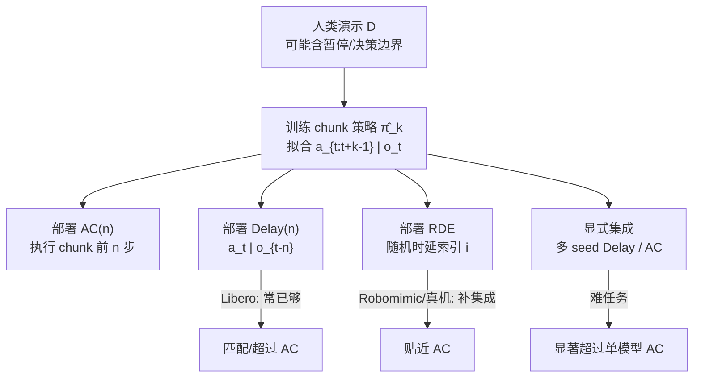

# Why Action Chunking Improves BC（延迟策略与隐式集成）

**Why Does Action Chunking Improve Behavioral Cloning Performance in Robotic Control?**（[项目页](https://action-chunking.github.io/)，[PDF](https://action-chunking.github.io/static/action_chunking.pdf)；CoRL 2026；Polimi / UC Berkeley）回答一个工程上几乎被默认的问题：BC 里几乎处处在用的 **action chunking**，到底靠什么提成功率。

> **落地状态：** 入库时 **无 arXiv 编号、无公开代码**（页上均 Coming soon）；以项目页 PDF 为准。

## 一句话定义

**Action chunking 的 BC 收益，主要不是「一次吐一串动作」本身，而是：用过去观测预测动作（降低复合误差 / 拟合非马尔可夫演示）+ 同时学多种时延关系带来的隐式集成；同一条 chunk 策略可用 Randomized Delay Ensemble 部署来复现这些收益。**

## 英文缩写速查

| 缩写 | 英文全称 | 简要说明 |
|------|----------|----------|
| AC | Action Chunking | 一次预测并（可选）执行未来多步动作 |
| BC | Behavior Cloning | 监督式模仿，直接拟合演示动作 |
| RDE | Randomized Delay Ensemble | 每步随机选时延索引，从 chunk 策略取对应动作 |
| TE | Temporal Ensemble | 对多时刻预测做线性聚合（本文对照） |
| LIBERO | Lifelong Robot Learning Benchmark | 主仿真套件之一（含 Libero-90） |
| DP | Diffusion Policy | 本文主实验策略族（DDPM） |

## 为什么重要

- **改写默认因果叙事。** 本库与业界常见说法把 chunk 的价值归为「更平滑 / 缩短有效地平线 / 训练表征更好」。本文用对照实验表明这些假说 **不足以解释** 成功率跃迁。
- **给出可替换部署。** 已训好的 \(\hat\pi_k\) 不必坚持「播完整 chunk」：在多数设定用 **Delay** 或 **RDE** 即可贴近 AC；真机三任务上 RDE 平均匹配并略超 AC。
- **指明超 AC 的方向。** 显式训练 / 部署 **延迟策略集成**（多 seed）在难任务上可大幅超过单模型 AC（Transport、Tool Hang）。
- **与 VLA / ACT 工程实践对接。** 当下几乎所有大规模机器人策略都 chunk；理解「训练目标 vs 执行协议」分离，有助于对齐异步推理、时延缓冲与集成部署（见 [VLA 真机部署指南](../queries/vla-deployment-guide.md)）。

## 核心信息

| 项 | 内容 |
|----|------|
| **机构** | 米兰理工大学（Politecnico di Milano）；加州大学伯克利分校（UC Berkeley） |
| **会议** | CoRL 2026（PDF 元数据） |
| **策略** | 自训 diffusion policy（chunk \(k=20\)）；附录核对 openpi π₀.₅ Libero 微调权重 |
| **评测** | LIBERO 多套件、Robomimic PH（Can / Square / Transport / Tool Hang）、Franka 三操作任务 |
| **开源** | **宣称将开源 / 待发布**（代码与 arXiv Coming soon；PDF 已公开） |

## 核心原理

### 被否定的三条常见假说

| 假说 | 论文读法 |
|------|----------|
| Temporal consistency | 人类演示确实非马尔可夫，但 **只需** \(a_t\mid o_{t-n}\)；`AC-Ordered`（按序轮转延迟、不保持联合动作分布）在 Libero-90 上甚至高于标准 AC |
| Horizon reduction | 复合误差改善来自「平均在更早状态上条件化」，不是「每 \(k\) 步才决策」；delayed policy 共享同一上界 \(\mathcal{O}((k+1)^{H/k}\epsilon)\)，且对 AC **紧** |
| Representation learning | 「训长 chunk、只执行前 \(n\) 步」的红利，可被 **同样训练目标下的 delayed 部署** 匹配（Fig. 7） |

### 方法栈：三种部署读同一条 \(\hat\pi_k\)

| 部署 | 每步做什么 | 捕捉到什么 |
|------|------------|------------|
| **AC(n)** | 预测 chunk，执行前 \(n\) 步再重规划 | 过去观测条件化 + 隐式集成（完整） |
| **Delay(n)** | 每步预测单动作 \(a_t\mid o_{t-n}\) | 非马尔可夫表达 + 降复合误差；**无**多时延集成 |
| **AC(n)-RDE** | 采样 \(i\sim\mathrm{unif}([n])\)，执行 \([\hat\pi_k(o_{t-i})]_i\) | 上述两者，且 **不要求** 连续播放同一 chunk |

### 理论要点（直觉）

- **Markov BC 下界：** 存在确定性环境，使演示与 \(\epsilon\)-拟合的 Markov 策略回报差达 \(\Omega(2^H\epsilon)\)。
- **AC / Delay 上界：** 在各分量泛化误差 \(\le\epsilon\) 时，回报差 \(\le\mathcal{O}((k+1)^{H/k}\epsilon)\)；附录证明对 AC 该尺度 **不可再改进**。
- **工程含义：** 「加长 chunk」若有效，优先检查是否等价于 **用了更合适的有效延迟**，而非「规划变强」。

### 流程总览

## 源码运行时序图

**不适用**（截至 2026-08-04：项目页 Code 按钮为 Coming soon，无可辨识训练 / 推理入口）。待官方仓库发布后，再按 README 入口补 `sequenceDiagram`。

## 工程实践

| 项 | 建议 |
|----|------|
| **复现入口** | 项目页 PDF / presentation；代码待发布 |
| **先做的对照** | 同一 \(\hat\pi_k\)：Markov（\(n=1\)）vs 网格搜索 Delay(n) vs AC(n) vs RDE |
| **延迟怎么选** | 看 held-out 动作预测 MSE：演示动作常对 **过去观测** 更易拟合（文中 Libero 例：约 10 步历史优于当前帧） |
| **真机异步** | 文中 Franka 实验统一叠加 Delay(2)，用 \(o_{t-1}\) 换取一帧推理预算 |
| **想超 AC** | 多 seed 显式集成；随机聚合在部分任务优于均值聚合（见 Tool Hang） |
| **源码运行时序图** | **不适用**（代码未发布） |

## 实验与评测

### Table 1（成功率 %；AC/Delay 为文中 best-case）

| Task | Markov | AC | Delay | RDE |
|------|--------|-----|-------|-----|
| Libero-90 | 68.9 | 89.2 | **94.0** | 93.6 |
| Libero-10 | 19.8 | 88.7 | 86.8 | 88.5 |
| Can PH | 83.7 | 97.2 | 93.5 | 96.7 |
| Square PH | 69.0 | 85.4 | 80.8 | 82.4 |
| Transport PH | 3.3 | 12.6 | 7.9 | 12.1 |
| Tool Hang PH | 28.0 | 75.2 | 51.6 | 71.8 |

读点：Libero 上 **Delay 已够甚至更强**；Robomimic 难任务上 Delay 明显落后，但 **RDE 拉回 AC 附近**（Tool Hang 71.8 vs 75.2）。

### Table 2（显式集成）

| Task | AC | AC-Ens | Delay-Ens |
|------|-----|--------|-----------|
| Libero-90 | 89.2 | 94.1 | **95.0** |
| Transport PH | 12.6 | **41.5** | 38.9 |
| Tool Hang PH | 75.2 | **87.6**（random） | 84.9（random） |

### 真机

Franka + Robotiq，15 Hz，delta joint；carrot / toaster / sushi 三任务，各 50 demos × 50 eval。结论与仿真一致：Delay ≫ Markov；**RDE ≈ AC（平均略高）**。

## 结论

**一句话总判：把 action chunking 当成「必须播放的动作计划」往往过强——多数收益来自延迟条件化与多时延隐式集成；部署协议可以、也经常应该与训练目标解耦。**

1. **先扫 Delay(n)** — 在 Libero 类设定可能直接超过 AC，且实现更简单。
2. **Delay 不够时上 RDE** — 仍用同一 \(\hat\pi_k\)，不必重训即可吃到集成红利。
3. **难任务再付集成算力** — Transport / Tool Hang 上显式 Ens 的增益远大于微调 chunk 长度。
4. **别把「平滑」当因果** — 时序一致性对照（Ordered / RDE）表明联合动作分布并非成功必要条件。
5. **理论边界要记住** — AC 不能神奇地打破 \(\mathcal{O}((k+1)^{H/k}\epsilon)\) 复合误差尺度；期望「更长 chunk = 指数变好」没有依据。

## 与其他工作对比

| 对照 | 差异读法 |
|------|----------|
| [Action Chunking / ACT](../methods/action-chunking.md) | ACT 把 chunk + temporal ensemble 当默认配方；本文拆开「训练目标 / 执行协议 / 集成方式」，并指出指数加权 TE 会削弱集成效应 |
| [Diffusion Policy](../methods/diffusion-policy.md) | DP 普及了生成式 chunk；本文用 DP 做载体，结论针对 **chunk 机制** 而非扩散本身 |
| [Behavior Cloning](../methods/behavior-cloning.md) | 经典 BC 强调 covariate shift；本文给出 chunk/delay 对复合误差的可证尺度，以及可操作的非马尔可夫部署 |
| RTC / 异步 VLA chunk | 工程上用 chunk 抗推理延迟；与本文「Delay(2) 换异步预算」相容，但本文进一步说：**抗延迟不是 AC 相对 Markov 的主成功原因** |

## 局限与风险

- **代码与 arXiv 未公开：** 数字以项目页 PDF 为准，复现管线待 release。
- **主实验是 diffusion BC：** 结论是否原样迁移到离散 token VLA / flow matching 大模型，需单独验证（附录仅对 π₀.₅ Libero 权重做兼容性核对）。
- **延迟引入反应滞后：** Delay/RDE 在强动态或需瞬时反馈的接触任务上可能伤安全性；真机任务偏桌面操作。
- **集成成本：** 显式 Ens 的 Transport 跃迁伴随多倍推理；部署前要算清楚延迟预算。

## 关联页面

- [Action Chunking](../methods/action-chunking.md) — 方法总页；本实体提供机制级修正
- [Behavior Cloning](../methods/behavior-cloning.md) — 复合误差与非马尔可夫演示的部署读法
- [Diffusion Policy](../methods/diffusion-policy.md) — 本文主实验策略族
- [Imitation Learning](../methods/imitation-learning.md) — IL 总览
- [LIBERO](./libero-benchmark.md) — 主仿真基准之一
- [Behavior Cloning Loss](../formalizations/behavior-cloning-loss.md) — 监督目标形式
- [Query：VLA 真机部署指南](../queries/vla-deployment-guide.md) — chunk 缓冲 / 异步执行工程语境
- [AutoIntervene](./paper-autointervene.md) — 部署期对提议 chunk 的支持监控与自动接管（互补「训练机制」叙事）
- [SPD](./paper-spd.md) — 同届 CoRL：接触丰富真机上「历史才能缩短 chunk」（互补机制叙事）
- [GSR / ParaVLA](./paper-gsr-paravla.md) — 拆的是语言路由，不是动作时间结构
- [ARLI](./paper-arli.md) — 异步 chunk 下 Delay 进入 RL 状态（中间动作 + 中间观测）

## 参考来源

- [Why Action Chunking Improves BC（论文归档）](../../sources/papers/why_action_chunking_improves_bc_corl2026.md)
- [SPD 论文归档](../../sources/papers/spd_corl_2026.md) — 同届 CoRL：历史窗与短 chunk
- [action-chunking.github.io（项目页归档）](../../sources/sites/action-chunking-github-io.md)
- [项目页 PDF](https://action-chunking.github.io/static/action_chunking.pdf)
- [AutoIntervene 论文摘录](../../sources/papers/autointervene_arxiv_2608_07065.md)
- [具身智能小站 9 篇盘点](../../sources/blogs/wechat_embodied_station_ego2robot_mango_grasp_2026-08-11.md)

## 推荐继续阅读

- [官方项目页](https://action-chunking.github.io/)
- Zhao et al., [*Learning Fine-Grained Bimanual Manipulation with Low-Cost Hardware*](https://arxiv.org/abs/2304.13705) — ACT：chunk 的代表性工程起点
- Chi et al., [*Diffusion Policy*](https://diffusion-policy.cs.columbia.edu/) — 本文仿真/真机主策略族
- [AutoIntervene](./paper-autointervene.md)
