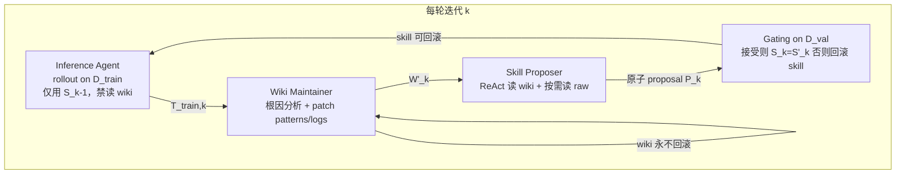

# WikiSkill（持久 Wiki 驱动的 Agent Skill 进化）

**WikiSkill**（*Compiling Agent Experience into Persistent Knowledge for Skill Evolution*，[arXiv:2608.27454](https://arxiv.org/abs/2608.27454)，2026；Google Research + Virginia Tech）提出：在自动 skill 进化中，除 **不可变轨迹** 与 **可执行 skill 文件** 外，增加 **持久 Wiki 层**，把跨轮失败模式、成功策略、proposal 审计轨迹编译为结构化知识，供后续 Skill Proposer 系统复用——直接回应 [Karpathy LLM Wiki](../references/llm-wiki-karpathy.md)「经验应复利积累而非散落在优化日志里」的论点。

## 一句话定义

**把工作区拆成 raw 轨迹 / 持久 wiki 知识 / 可执行 skills 三层，用 Wiki Maintainer 持续编译经验、用 validation gating 演化 skill，且 wiki 永不回滚。**

## 英文缩写速查

| 缩写 | 英文全称 | 简要说明 |
|------|----------|----------|
| LLM | Large Language Model | 推理、Wiki Maintainer、Skill Proposer 的后端 |
| ReAct | Reasoning and Acting | Skill Proposer 的多轮读文件 + 推理范式 |
| ALFWorld | Action Learning From Realistic Worlds | 交互式具身任务 benchmark 之一 |
| VLM | Vision-Language Model | 本文未主打；对照本库机器人 VLM 页时勿混读 |

## 为什么重要

- **把「知识编译」写进 skill 进化环：** 相对 EvoSkill（累积 proposal 历史）、Trace2Skill（轨迹教训直接写 skill）、SkillOpt（拒绝反馈 + epoch meta），WikiSkill 把 **可复用的诊断知识** 与 **可回滚的规程文件** 解耦，更接近本仓库 **sources → wiki → schema** 的分层。
- **可测量增益大且稳：** 五类推理模型上平均准确率均为 WikiSkill 最高；Qwen 族随模型规模放大收益（+12.3 / +17.5 / +23.9 pt）。
- **技能与规模可互换：** Qwen-3.5-9B + WikiSkill（47.4%）超过 Qwen-3.6-27B 无 skill（39.4%）；说明 **procedure 编译** 与 **模型能力** 是互补轴。
- **跨模型迁移有正反例：** 强模型演化 skill 常惠及弱模型，但小模型 workaround 也可能伤害强模型（SpreadSheet 上 Gemini 50.5%→18.1%）。

## 核心信息

| 字段 | 内容 |
|------|------|
| 机构 | 谷歌研究院（Google Research）；弗吉尼亚理工学院（Virginia Tech） |
| arXiv | [2608.27454](https://arxiv.org/abs/2608.27454) |
| 项目页 | **无**（截至 2026-08-31，预印本未列独立项目页） |
| 开源 | **未开源**（无官方代码仓；第三方社区实现见局限节） |
| 对照基线 | Trace2Skill、EvoSkill、SkillOpt、无 skill |
| 设定 | 活跃 skill **全文注入** system prompt（隔离 skill 检索失败） |

## 核心原理

### 三层工作区

| 层 | 路径 | 角色 |
|----|------|------|
| Raw | `raw/` | 每轮训练轨迹，**不可变** |
| Wiki | `wiki/patterns/`、`logs.md`、`skill-impact.md`、`index.md` | **持久** 失败模式/策略库 + 演化叙事 + proposal 审计 |
| Skills | `skills/*/SKILL.md` + `PURPOSE.md` | 推理时可读的规程；`PURPOSE.md` 链回 motivating patterns |

### 流程总览

### 关键机制

1. **Wiki 复利：** 拒绝的 proposal diff 写入 `skill-impact.md`，避免重复踩坑（ALFWorld case study：Iteration 0 拒绝 → Iteration 1 接受 `break-repetition-loop`）。
2. **训练期禁 wiki：** Inference Agent 若在 rollout 时读 wiki，会「走 wiki 捷径」，削弱轨迹对 skill 开发的信号（LiveMath 72.6%→64.8%）。
3. **严格 validation gating：** 仅当验证分 **严格高于** 历史最佳才接受 skill；wiki 无论接受与否都保留。

## 评测与结果

- **Benchmark：** LiveMath、SealQA、SpreadSheet、OfficeQA、ALFWorld（数学 / 搜索 / 表格代码 / 长文档 QA / 具身交互）。
- **模型：** Qwen-3.5-4B/9B、Qwen-3.6-27B、Gemma-4-31B、Gemini-3.5-Flash。
- **主表（平均准确率）：** WikiSkill 在五模型上均为最高（如 Qwen-3.6-27B：**63.3%** vs 最强基线 EvoSkill 53.3%）。
- **规模互补：** Qwen 族 WikiSkill 平均提升随规模递增；9B+skill 可胜 27B 无 skill。
- **跨模型迁移：** Qwen-3.6-27B skill 使 Qwen-3.5-9B 在 ALFWorld 达 **70.2%**（自演化 63.4%）。
- **消融（Gemini）：** Skill Proposer 有 wiki 63.7% vs 无 wiki 48.7%（**+15.0 pt**）。

## 与其他工作对比

四条 skill 进化路线都有「轨迹 → 改 SKILL.md」的外环，差别在 **经验以什么形态沉淀、能否回滚**：

| 工作 | 经验沉淀载体 | 可回滚性 | 相对 WikiSkill |
|------|--------------|----------|----------------|
| **WikiSkill** | **持久 wiki 层**（`patterns/`、`logs.md`、`skill-impact.md`） | skill 可回滚，**wiki 永不回滚** | — |
| EvoSkill | 累积 **proposal 历史** | 随 skill 一起进退 | 记的是「提过什么」而非「为什么失败」；五模型平均均低于 WikiSkill（Qwen-3.6-27B：53.3% vs **63.3%**） |
| Trace2Skill | 轨迹教训**直接写进 skill** | 与 skill 同生共死 | 诊断知识与规程文件耦合，回滚 skill 即丢失教训 |
| SkillOpt | 拒绝反馈 + epoch meta | 以 epoch 为粒度 | 与 [Darwin Skill](./darwin-skill.md) 的单 skill validation-gated 自优化同构；WikiSkill 多出的是**跨轮可复用的知识层** |

- **消融给出因果证据**：Skill Proposer 去掉 wiki 后 Gemini 平均掉 **15.0 pt**，说明增益主因是「知识编译」而非「更聪明地 patch 文件」——这是它与上表三条基线的真正分界。
- **与本库工程实践的对应**：`wiki/patterns/` ↔ 结构化 lint 发现，`skill-impact.md` ↔ git + CI 拒绝记录，`skills/*/SKILL.md` ↔ [Superpowers](./superpowers-obra.md) 式技能文件；本仓库的 [ingest workflow](../../schema/ingest-workflow.md) 即同构的分层实例。
- **对比的适用边界**：五个 benchmark 偏 agent 工具任务，且实验用 **全文注入** 隔离检索失败——因此上表比较的是「skill 内容质量」，不含生产路径必需的 skill 检索与触发（见「局限与风险」）。

## 源码运行时序图

**不适用。** 截至 **2026-08-31**，作者 **未发布** 官方可运行仓库或项目页 Code 链接，无法对齐 `sources/repos/` 绘制可复现时序。第三方 [`ashutoshsinghpr7/wikiskill`](https://github.com/ashutoshsinghpr7/wikiskill) 为社区复现，**非** Google Research 官方发布。

## 工程实践

| 项 | 建议 |
|----|------|
| 与本仓库对照 | 把 `wiki/patterns/` 类比为 **结构化 lint 发现**；`skill-impact.md` 类比 **git + CI 拒绝记录**；`SKILL.md` 类比 [Superpowers](./superpowers-obra.md) / `AGENTS.md` 技能文件 |
| 复现边界 | 需自建 outer-loop harness、五 benchmark 工具链与多模型 API；官方实现未开源 |
| 读表注意 | 全文 skill 注入 ≠ 生产级 skill 检索；迁移负例提醒 **规程要模型无关** |
| 社区实现 | 若试验算法，可评估第三方 `wikiskill` CLI（Hermes/Claude 后端），但论文数字以其自有 harness 为准 |

## 结论

**WikiSkill 的核心增益来自「持久 wiki 编译经验」，而不只是更聪明地 patch SKILL.md；技能进化与模型规模互补，且演化 skill 可跨模型迁移。**

1. **持久 wiki 是主因** — 去掉 Maintainer/累积后 Gemini 平均降 **15 pt**；patterns + `skill-impact.md` 支撑跨轮 refine。
2. **相对既有 skill 进化方法更稳** — 五模型平均均为 WikiSkill 最高，优于 EvoSkill / SkillOpt / Trace2Skill 的「偏科」。
3. **规模互补** — 更强模型从演化 skill 获益更多；9B+skill 可超过 27B 无 skill。
4. **迁移非平凡** — 泛化 procedure 可跨族增益；模型特定 workaround 会负迁移（SpreadSheet × Gemini）。
5. **训练期别让执行端读 wiki** — 否则轨迹信号污染 skill 开发。
6. **工程边界** — 未评 skill 检索；wiki 无剪枝；无数百步在线适应；**官方代码未发布**。

## 局限与风险

- **未覆盖 skill 检索/触发：** 实验用全文注入，skill 库变大后生产路径未知。
- **严格单调 gating：** 可能拒绝「短期中性、长期有益」的提案。
- **wiki 体积增长：** 无自动剪枝，长跑可能 context 膨胀。
- **benchmark 域偏 agent 工具任务：** 与机器人 sim2real / 控制策略进化距离较远，迁移需重新设计轨迹与验证集。
- **官方实现缺失：** 第三方复现不等同论文数字；选型时以 arXiv 方法与消融为准。

## 关联页面

- [LLM Wiki（Karpathy 模式）](../references/llm-wiki-karpathy.md) — 论文 §1 显式援引的「编译经验为持久知识」范式；与本页 **Wiki Layer** 同构
- [Superpowers（obra）](./superpowers-obra.md) — 可执行 **skill 文件 + 交付流程** 生态对照
- [Darwin Skill](./darwin-skill.md) — 单 skill 的 validation-gated 自主优化（SkillOpt 对齐）
- [Hermes Agent](./hermes-agent.md) — 社区 WikiSkill 实现常用后端；与本页 **官方未开源** 对照
- [Skills For Real Engineers（mattpocock）](./mattpocock-skills.md) — 轻量可组合 skill 库
- [AI Auto-Research](../concepts/ai-auto-research.md) — 科研 agent 全生命周期与 **人机共治 / 溯源**
- [Ingest Workflow](../../schema/ingest-workflow.md) — 本仓库 **ingest/query/lint** 即 WikiSkill 式知识编译实例

## 参考来源

- [WikiSkill 论文摘录](../../sources/papers/wikiskill_arxiv_2608_27454.md)

## 推荐继续阅读

- [arXiv:2608.27454](https://arxiv.org/abs/2608.27454) — 完整算法、附录与 case study（ALFWorld Fig. 3）
- [Karpathy LLM Wiki Gist](https://gist.github.com/karpathy/442a6bf555914893e9891c11519de94f) — WikiSkill 理论灵感来源
- [EvoSkill（arXiv:2603.02766）](https://arxiv.org/abs/2603.02766) — 主要对照基线之一
