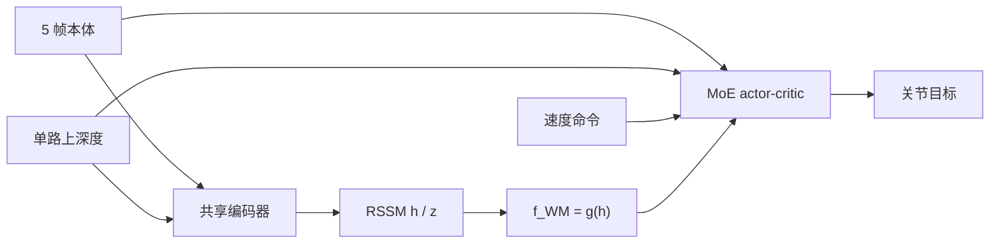

# WM-LOCO：落脚约束地形上的世界模型视觉行走

**WM-LOCO**（*World-Model-Augmented Visual Locomotion for Humanoids on Foothold-Constrained Terrain*，[arXiv:2609.02542](https://arxiv.org/abs/2609.02542)，[项目页](https://m0puppet.github.io/wm-loco/)）由 **地瓜机器人（D-Robotics）** 牵头，联合 **北京邮电大学（BUPT）**、**苏州大学（Soochow）**、**哈尔滨工业大学（HIT）**：把 **RSSM 世界模型** 与 **PPO** 端到端共训，用本体 + **单路上深度** 得到预测性循环特征 \(f_t^{\mathrm{WM}}\)，**不标落脚点、不建地形图**。同一策略 ONNX 部署到 **Unitree G1** 机载 Jetson Orin。

## 一句话定义

**在「踩空就很难挽回」的稀疏落脚地形上，用世界模型提前压缩近未来观测与奖励，而不是只根据眼前深度做下一步。**

## 英文缩写速查

| 缩写 | 英文全称 | 简要说明 |
|------|----------|----------|
| WM-LOCO | World-Model-Augmented Visual Locomotion | 本文框架：世界模型增强的视觉人形行走 |
| RSSM | Recurrent State-Space Model | 确定性记忆 + 随机潜变量的循环世界模型 |
| PPO | Proximal Policy Optimization | 与世界模型联合更新的策略优化 |
| AMP | Adversarial Motion Prior | 与基线共享的运动自然性先验 |
| MoE | Mixture of Experts | 融合本体、深度、命令与 \(f^{\mathrm{WM}}\) 的骨干 |
| G1 | Unitree G1 | 真机与 IsaacLab 仿真平台 |

## 为什么重要

- **落脚约束地形**（踏石、沟、窄踏步）上，只看当前可见地形的策略容易不可恢复地踩空；双足比四足更缺备用支撑。
- 对照 [BeamDojo](./paper-notebook-beamdojo-learning-agile-humanoid-locomotion-on-s.md) / [RPL](./paper-rpl-robust-humanoid-perceptive-locomotion.md) / PLANC 的分阶段 critic、特权蒸馏或足步规划，WM-LOCO 用 **单阶段共训** 换预测特征。
- 匹配 PPO 基线在沟与踏石上 **0%**，说明收益来自世界模型通路，而不是另一套奖励或感知。
- 真机 **无离板感知、无预计算地图、无额外状态估计器**，平均成功 **93.3%**。

## 核心信息

| 项 | 内容 |
|----|------|
| **机构** | 地瓜机器人（D-Robotics）；北京邮电大学（BUPT）；苏州大学（Soochow University）；哈尔滨工业大学（HIT） |
| **平台** | Unitree G1；IsaacLab 8192 并行环境；单卡 RTX 5880 Ada 48 GB |
| **感知** | 头戴 RealSense D435；仿真 64×36 渲染、裁到 32×18、0.1–2.5 m、50 Hz |
| **开源** | **待发布**（项目页 Code coming soon；`M0PUPPET/wm-loco` 仅静态页，截至 2026-09-04） |

## 核心原理

观测 \(o_t=(p_t,d_t,c_t)\)：5 帧本体（关节位置/速度、惯性、上一动作）、单帧深度、基座速度命令。RSSM 维护记忆 \(h_t\) 与 128 维潜变量 \(z_t\)，用转移 / 后验 / 先验 + 本体·深度·奖励解码；损失为三项 MSE 加 \(\beta\,\mathrm{KL}(q\|p)\)。只把 \(f_t^{\mathrm{WM}}=g_\psi(h_t)\) 送给策略；**推理不做想象 rollout**。PPO clip 与 \(\mathcal{L}_{\mathrm{WM}}\) **同一次联合更新**，梯度回灌共享编码器。

标准速度跟踪在稀疏落脚上太稀：多数回合在学到「可踩 vs 不可踩」之前就终止。楼梯侧加边界绕行惩罚、踢踢脚板（踢面）穿刺惩罚（踢面上沿留 4 cm 以免斜踩误判）、以及按左右交替推进的踏步接触奖励；踏石侧则并行消耗石顶区域。足端体积点传感器沿用 [Hiking in the Wild](./paper-hiking-in-the-wild.md)。**同一套地形奖励也给 PPO 基线**，避免把 shaping 算进世界模型账上。

### 流程总览

## 源码运行时序图

**不适用** — 截至 **2026-09-04** 项目页无训练/ONNX 脚本，仅有演示页。

## 工程实践

| 项 | 建议 |
|----|------|
| 对照实验 | 先复制「去掉 WM 通路」的匹配 PPO，再谈世界模型是否必要 |
| 楼梯 shaping | 边界惩罚防止绕开楼梯刷速度奖；踢面惩罚对应真机踢面撞击 |
| 部署 | 论文：ONNX + 机载 Orin + 单 D435；不另加地图或外定位 |
| 安全 | 真机沟只测到 **0.8 m**；更大间隙未测 |
| 失败读法 | 踏石失败以非法落脚（23.0%）为主，摔倒仅 1.9%；基线则多为开局摔倒/不前进 |

## 实验与评测

评测关闭外推与域随机，每格至少 50 回合；成功 = 45 s 内质心过终点线。

| 地形 | 难度 | PPO | WM-LOCO | G1 真机（10 trial） |
|------|------|-----|---------|---------------------|
| 楼梯 | Easy / Med / Hard | 87.0 / 91.4 / 91.3% | **94.2 / 95.7 / 92.0%** | 90% |
| 沟 | Easy / Med / Hard | 0 / 0 / 0% | **98.0 / 100 / 90.0%** | 90%（0.8 m） |
| 踏石 | Easy / Med / Hard | 0 / 0 / 0% | **87.0 / 88.3 / 78.2%** | 100%（顶面 0.25 m、同道间隙 0.45 m） |

楼梯质量：步幅 +15–35%、每米步数 −9–21%、骨盆加速度 −24–33%。深度重建热身后 MSE 多低于 \(10^{-3}\)——这是编码保真，**不是**开环前向预测分数。

## 结论

**稀疏落脚上，预测性循环特征比「再堆一层眼前深度」更能把成功从 0 拉起来；楼梯上双方都能过，世界模型主要改步态效率。**

1. **差距在沟和踏石，不在楼梯成功率** — 匹配 PPO 三类难度沟/踏石全 0%；楼梯双方都 >87%。
2. **不要把地形奖励记成世界模型贡献** — 基线共用同一套 shaping。
3. **推理只要记忆特征** — 不需要想象 rollout，也不需要落脚标签。
4. **真机平均 93.3%** — 踏石 10/10、楼梯与 0.8 m 沟各 9/10；接触模式与仿真相近。
5. **代码待发布** — 项目页不能当复现入口。
6. **范围** — 连续窄梁、变高踏石、户外非结构不在本文。

## 与其他工作对比

| 对照 | 差异读法 |
|------|----------|
| 匹配 PPO（本文消融） | 同奖励/感知/AMP/MoE，只去掉 RSSM；沟/踏石归零 |
| [RPL](./paper-rpl-robust-humanoid-perceptive-locomotion.md) | 特权高程专家 + DAgger；WM-LOCO 无蒸馏、无双深度 |
| [P³](./paper-p3.md) | 改 VAE-PPO 边缘似然；感知仍是高程 CNN。WM-LOCO 改的是 **预测特征** |
| [Hiking in the Wild](./paper-hiking-in-the-wild.md) | 借足端体积点与边缘惩罚；Hiking 是野外跑酷课，不是沟/踏石归零对照 |
| [CReF](./paper-cref.md) | 交叉注意融深度，无世界模型；平台是 X2 Ultra |
| [Safe-Stop](./paper-safe-stop-humanoid.md) | 同为 G1，管的是急停可恢复性，不是落脚穿越 |

## 局限与风险

- **单机、单 RSSM** — 其他人形与其他世界模型骨干未测。
- **平衡木 / 变高踏石** — 作者认为要另做奖励。
- **项目页与 arXiv 文案滞后** — 页上仍写 *arXiv (coming soon)*，论文已在 2609.02542。
- **勿把重建 MSE 当成规划能力** — 作者写明只刻画编码保真。

## 关联页面

- [Humanoid Locomotion](../tasks/humanoid-locomotion.md)
- [楼梯与障碍感知移动](../tasks/stair-obstacle-perceptive-locomotion.md)
- [Attention 落足点优化](../methods/attention-foot-placement.md)
- [P³](./paper-p3.md) / [Hiking in the Wild](./paper-hiking-in-the-wild.md) / [RPL](./paper-rpl-robust-humanoid-perceptive-locomotion.md)
- [Safe-Stop](./paper-safe-stop-humanoid.md) / [FOCUS](./paper-focus-foot-observation-confidence.md)
- [三篇阅读坐标](../overview/g1-foothold-safe-stop-focus-technology-map.md)

## 参考来源

- [wm_loco_arxiv_2609_02542](../../sources/papers/wm_loco_arxiv_2609_02542.md)
- [WM-LOCO 项目页归档](../../sources/sites/wm-loco.md)

## 推荐继续阅读

- [arXiv:2609.02542](https://arxiv.org/abs/2609.02542)
- [项目页](https://m0puppet.github.io/wm-loco/) — 踏石/楼梯/沟演示与仿真条形图
