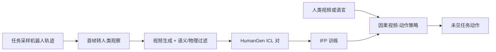

# Zero-WAM

**Zero-WAM: In-Context World-Action Modeling from Human Videos for Open-Ended Task Generalization**（[arXiv:2608.26103](https://arxiv.org/abs/2608.26103)，[项目页](https://robbyant-research.github.io/Zero-WAM/)）——蚂蚁灵波科技（Robbyant）；香港科技大学广州校区（HKUST-GZ）；香港科技大学（HKUST）。arXiv 作者为 Jiaming Zhou、Qihang Zhang、Gangwei Xu、Yinghao Xu、Junwei Liang 等。

## 一句话定义

**把人类视频当成任务规格：不更新参数，也能按上下文执行训练中从未出现的操作任务。**

## 英文缩写速查

| 缩写 | 英文全称 | 简要说明 |
|------|----------|----------|
| WAM | World-Action Model | 联合预测未来观测与可执行动作 |
| ICL | In-Context Learning | 用提示而非微调指定新任务 |
| IFP | In-context Future chunk Prediction | 抑制已见任务捷径的训练目标 |
| HumanGen | Human-robot ICL Generation | 机器人轨迹 → 对齐人类视频的数据管线 |

## 为什么重要

- 纳入 [具身智能小站 2026-08-28 九篇盘点](../../sources/blogs/wechat_embodied_station_wam_vla_cross_embodiment_9_papers_2026-08-28.md) 的「结构化接口」主线：视频成为任务说明。
- 开源状态（2026-09-04 再核）：**仍待发布**（仓仅 README / LICENSE / `docs`；计划 2026-09-15 前发代码/模型/数据）。
- 同一套因果 video-action 同时吃语言或人视频；对照 [Skild S1](./skild-s1.md) 的视频 ICL，这里把 WAM 未来分支和提示绑在一起。

## 核心信息

| 项 | 内容 |
|----|------|
| **机构** | 蚂蚁灵波科技（Robbyant）；香港科技大学广州校区；香港科技大学 |
| **出处** | arXiv:2608.26103（2026-08） |
| **数据** | HumanGen：74.2K ICL 对 / 8.6K 任务 |
| **仿真** | RoboTwin 2.0 七任务未见 |
| **真机** | 双臂 Franka：放置 / 长程 / 插桌腿 |
| **开源** | **待发布**：仓 Apache-2.0，2026-09-04 再核仍仅 README / LICENSE / `docs`；预计 2026-09-15 前发代码/模型/数据 |

### 流程总览

## 工程实践

| 项 | 内容 |
|----|------|
| **数据** | Task-diverse VA 来自 AgiBot / InternData-A1 / OXE / RoboCOIN / RoboMIND；HumanGen 覆盖公开、自研、仿真与真机 |
| **接口** | 单一策略同时支持语言指令与人类视频提示 |
| **复现入口** | 截至入库日无可运行脚本；watch [`robbyant-research/Zero-WAM`](https://github.com/robbyant-research/Zero-WAM) |
| **ICL 读法** | 见 [机器人 In-Context Learning](../concepts/robot-in-context-learning.md)：上下文是部署期适应，不是后训练克隆 |

## 评测

| 项 | 内容 |
|----|------|
| **RoboTwin 2.0** | 七个任务级 held-out，平均 **46.95%** vs LingBot-VA **17.45%**（+29.5 pp） |
| **最强单任务** | Place empty cup **84.87%**；Stack three blocks 仍仅 **9.00%** |
| **真机放置** | 物体入容器 **53.3%** vs LingBot-VA 43.3% |
| **真机长程** | 三物体顺序操作 **33.3%** vs LingBot-VA 10.0% |
| **真机插入** | 双桌腿插入 **16.7%** vs LingBot-VA 0.0% |

- 数据出处：[ingest 摘录「评测」](../../sources/papers/zero_wam_arxiv_2608_26103.md)。摘要把仿真平均四舍五入成 47.0%。

## 结论

**跨任务泛化的瓶颈常常是任务规格，而不是再训一遍策略；插桌腿 16.7% 和 RoboTwin +29.5 pt 必须分开读。**

1. 人类视频比语言更能指定实例、交互步骤与长时程顺序。
2. IFP 的作用是切断「只看机器人历史/文本」的捷径；没有干预时模型可能根本没用视频提示。
3. HumanGen（74.2K / 8.6K）把已有机器人轨迹变成可扩展 ICL 对，而不是手工人机配对；这是预训练数据前提，不是推理时用户要准备的上下文长度。
4. 主数字是相对 LingBot-VA，不要写成操作领域 SOTA。
5. 代码未发布前，只能把 47% 当论文数字，不能当可复现基线。
6. 「Zero-Shot」依赖 HumanGen 预训练分布，不是无相关人视频的真零样本。
7. **IFP 不可省**：跨消融推算，去掉 IFP 后加人类视频（**28.55**）反而低于不加（**39.44**）；朴素堆人视频会走捷径——方向性结论见 [四路线对比](../comparisons/wam-ttt-robottt-stellavla-zero-wam-embodied-icl.md)，严格等价性需作者确认。

## 源码运行时序图

**不适用**（截至 **2026-09-04**）：官方训练/推理入口尚未公开发布。

## 局限与风险

- 生成人类视频 **100% 为合成**（VLM+视频生成管线）；训练/测试 domain gap 未系统评估；质检通过率未披露。
- 堆叠三块等长时程任务成功率仍低，不能把平均 47% 读成「开箱即用」。
- 真机展示样本量有限；16.7% 方差未知。
- 公众号条目把机构写成「灵波」，官方中文名是**蚂蚁灵波科技（Robbyant）**。

## 与其他工作对比

| 对比轴 | Zero-WAM | [LAWA](./paper-lawa.md) | [Skild S1](./skild-s1.md) |
|--------|----------|-------------------------|---------------------------|
| 测试时未来 | 因果视频–动作 | 紧凑 latent action | 不强调像素 rollout |
| 任务提示 | 语言 **或** 人视频 | 语言为主 | 人视频 ICL |
| 开源 | **待发布** | **待发布** | **确认未开源** |

真人视频、零梯度且 **代码+权重已开** 的对照：[HOST](./paper-host-one-shot-human-video.md)（进度流形 + 自接地；八任务 62%，不在 RoboTwin 协议上）。

- 相对纯语言 VLA：把任务指定从文本扩展到视频上下文。
- 相对 [DreamWAM](./paper-dreamwam.md) 等像素世界动作模型：Zero-WAM 强调 **零样本跨任务 ICL**，而不是在线 rollout 规划。

## 关联页面

- [World Action Models](../concepts/world-action-models.md)
- [机器人 In-Context Learning](../concepts/robot-in-context-learning.md)
- [VLA](../methods/vla.md)
- [Manipulation](../tasks/manipulation.md)
- [LAWA](./paper-lawa.md)
- [S1（Skild）](./skild-s1.md)
- [HOST](./paper-host-one-shot-human-video.md)
- [WAM / VLA / 跨本体 9 篇技术地图](../overview/wam-vla-cross-embodiment-9-papers-technology-map.md)

## 参考来源

- [zero_wam_arxiv_2608_26103](../../sources/papers/zero_wam_arxiv_2608_26103.md)
- [zero-wam 项目页](../../sources/sites/zero-wam.md)
- [zero-wam 仓库](../../sources/repos/zero-wam.md)
- [具身智能小站 9 篇盘点](../../sources/blogs/wechat_embodied_station_wam_vla_cross_embodiment_9_papers_2026-08-28.md)
- [每日智能四篇 ICL 纵横向解读（2026-08-31）](../../sources/blogs/wechat_meiri_zhineng_embodied_icl_four_papers_2026-08-31.md)

## 推荐继续阅读

- [arXiv:2608.26103](https://arxiv.org/abs/2608.26103)
- [Zero-WAM 项目页](https://robbyant-research.github.io/Zero-WAM/)
- [GitHub 占位仓](https://github.com/robbyant-research/Zero-WAM)
