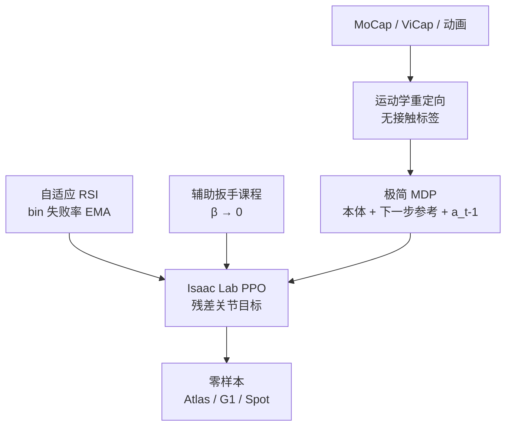

# ZEST：异构运动参考的零样本具身技能迁移

**ZEST**（*Zero-shot Embodied Skill Transfer*；期刊标题 *Embodied skill transfer for locomotion control*，[*Science Robotics* 11(117)，2026-08-12](https://doi.org/10.1126/scirobotics.aec7695)；预印本 [arXiv:2602.00401](https://arxiv.org/abs/2602.00401)）由 **机器人与人工智能研究所（RAI Institute）** 与 **波士顿动力（Boston Dynamics）** 提出：用同一套单阶段 RL 配方，把 MoCap、带噪声的单目视频和物理上往往不可行的关键帧动画，变成 Atlas、Unitree G1、Spot 上的零样本全身技能。方法导航见 [ZEST](../methods/zest.md)。

## 一句话定义

**下一步参考 + 当前本体感知就够部署；难片段用失败率采样，高动态用会自己消失的辅助扳手，不要接触标签、历史窗和状态估计器。**

## 英文缩写速查

| 缩写 | 英文全称 | 简要说明 |
|------|----------|----------|
| ZEST | Zero-shot Embodied Skill Transfer | 本文框架：异构参考 → 单阶段 RL → 硬件零样本 |
| MoCap | Motion Capture | Xsens / Vicon 高保真人体动捕 |
| ViCap | Video-Captured motion | 手持手机 + MegaSaM + TRAM 重建的参考 |
| PLA | Parallel-Linkage Actuator | 膝/踝/腰闭链驱动；用名义电枢选 PD |
| RSI | Reference State Initialization | 按参考相位 reset；本文做成失败率自适应 |
| PPO | Proximal Policy Optimization | Isaac Lab 上的单阶段训练算法 |
| MAE / MAD | Mean Absolute / Angular Distance | Table 1 关节角与基座姿态误差 |

## 为什么重要

- **全尺寸多接触第一次上 Atlas。** 战术爬行、前滚、地板舞要膝/肘/躯干贴地，这正好是 BD 全身 MPC 默认「只认手脚接触」的盲区。
- **视频当天就能上机。** 作者把 ViCap 写成「上午拍、白天训、晚上跑」：不靠物理感知优化去洗参考，策略用放松的根轨迹跟踪把抖动和滑步滤掉。
- **配方跨形态复用。** 同一套观测/奖励/超参结构从 100 kg Atlas 搬到 35 kg G1 和 12-DoF Spot，只改执行器参数。
- **工业侧极简接口。** 部署不要估计器、不要未来参考窗；后续 [MTRG](../methods/mtrg-reference-goal-driven-rl.md) 把它的 \(\lambda\) 扳手课程当基线，再把参考从「部署约束」降成「训练塑形」。
- **今天不能当复现栈。** 无项目页、无代码。

## 核心信息

| 项 | 内容 |
|----|------|
| **机构** | 机器人与人工智能研究所（RAI Institute）；波士顿动力（Boston Dynamics）。G1 实验由 RAI 完成 |
| **平台** | 全电 Atlas（30 DoF，1.8 m，100 kg）；Unitree G1（29 DoF，1.2 m，35 kg）；Spot（12 DoF，33 kg） |
| **栈** | Isaac Lab + PPO；非对称 actor–critic；单卡 L4 ≈10 h / 7k iter / 技能 |
| **参考** | MoCap、ViCap（MegaSaM+TRAM）、关键帧动画；运动学时空重定向，**不标接触** |
| **开源（截至 2026-08-15）** | **确认未开源**：无项目页、无仓库；期刊数据可用性只指向正文/附录 |

## 核心原理

### 流程总览

### 部署接口为什么能这么瘦

策略只看 IMU 角速度、投影重力、关节位置/速度和上一动作，加上**下一步**参考（基座高度、基座速度、重力方向、关节位置）。作者假设 \(a_{t-1}\) 已足够推断接触与基座线速度，不必上历史编码器或状态估计融合。动作是残差：\(\bm{q}^{\mathrm{cmd}}=\hat{\bm{q}}+\Sigma a_t\)，再进与仿真相同的 PD。消融里加 20 步历史或 20 步未来参考（各 0.4 s）反而拖垮同预算收敛。

### 两个自动课程

1. **自适应 RSI。** 长轨迹切 bin，失败水平 \(f_b\) 用 EMA 更新；reset 按 \(f_b\) 偏置，并留地板概率，避免学难动作时忘掉走路。乒乓球这类 30 s 上肢+基座协调，作者点名靠它才训得动。
2. **辅助扳手。** 模型基空间扳手打在基座上（位姿 PD + 躯干前馈），幅度 \(\beta<\beta_{\max}<1\)，由同一套 \(f_b\) 调制。空翻/侧手翻早期否则会立刻 early-term；简单步态可以弱化或关掉。

### 执行器建模（Sim2Real 真正花钱的地方）

闭链 PLA 若按精确闭链积分，仿真又硬又慢。ZEST 递进近似：质量可忽略的支撑连杆 → 耦合踝的 Jacobi 对角化 → **名义构型算一次电枢并固定**（避免每步更新约 20% 减速）。PD 按二阶临界阻尼 \(K_p=I\omega_n^2\)、\(K_d=2I\omega_n\) 选，仿真与真机共用。Spot 的连续后空翻还要功率限制、磁饱和和正负功效率，静态参数来自厂商，效率对着真机日志辨识。

## 源码运行时序图

**不适用。** 截至 2026-08-15 无官方可运行仓库；期刊只把评测数据放在正文与附录。工程复现只能对照方法页与 [MTRG](../methods/mtrg-reference-goal-driven-rl.md) 对 \(\lambda\) 课程的转述，不能对照 README 入口画运行时序。

## 工程实践

| 项 | 建议 |
|----|------|
| 先问参考能不能进策略 | 部署时还要逐步播参考 → ZEST；只要 goal、参考仅塑形 → [MTRG](../methods/mtrg-reference-goal-driven-rl.md) |
| 观测 | 先试「本体 + 下一步 + \(a_{t-1}\)」；不要默认加长窗 |
| 动作 | 残差叠参考；绝对动作在 RSI 初期会打出大 PD 误差 |
| 课程 | 高动态/大基座旋转先开扳手；长库/长 horizon 开自适应采样 |
| ViCap | 奖励不要死跟根轨迹；接触时间表本来就脏，别当监督 |
| 场景交互 | G1 爬箱不给箱子位姿，只随机初始相对位姿；出训练分布（\(x,\mathrm{yaw}\)）会掉成功率 |
| 硬件策略粒度 | 真机是**每技能一条策略**；多技能策略只做仿真消融 |
| 复现预期 | **无代码**；PLA 电枢与 Spot 功率模型是论文里最难外推的部分 |

## 实验与评测

- **MoCap → Atlas：** 走/跑出现跟脚滚转、近满伸膝、减速不跺脚；前滚、四肢爬/滚、战术爬行、侧手翻、地板舞均从站立出发再回到站立。走/跑 MAE \(q\) ≈ 0.04–0.06 rad；多接触技能基座角速度误差明显升高（breakdance ML2 \(\omega\) ≈ 1.91 rad/s）。
- **MoCap → G1：** 侧手翻与约 30 s 乒乓球；朝向误差高于 Atlas，作者归到 IMU 质量差。
- **ViCap：** Atlas 踢球与三段舞（单脚支撑、连续 hop）；G1 芭蕾（腾空外展）与跳箱/上下箱。箱体 5/5 重复；训练分布内位姿扰动全成功；2 kg 配重仍成功。
- **动画：** Atlas 用非人背偏航做倒立翻转；Spot 前肢倒立、连续后空翻、滚桶、happy dog。滚桶中段 IMU 饱和仍能做完。
- **消融：** 10 h 时基线均值与下尾最好；20 h 部分变体追上均值，但 p10 / 最小值仍落后。去掉课程主要伤样本效率；去掉自适应采样伤难 bin；匹配 actor/critic（去掉特权）伤 value；绝对动作最差。
- **vs BD 全身 MPC：** 干净步行两者接近；慢跑/侧手翻 RL 更好；若干多接触或脏接触标注技能 MPC 直接失败。

## 结论

**ZEST 证明「少接口、单阶段、中等域随机」可以在全尺寸人形上做出 MPC 不愿建模的多接触技能；真正贵的是执行器模型，不是网络或奖励清单。**

1. **部署接口能瘦就瘦。** 下一步参考 + 本体 + \(a_{t-1}\) 足够；加长窗在他们的超参下是负收益。
2. **残差动作是稳定训练的默认。** RSI 初期绝对动作会把 PD 误差打爆。
3. **课程按失败率自动分配。** 扳手服务高动态探索，自适应采样服务长库/长 horizon；两者不是装饰。
4. **视频参考不必先物理洗干净。** 放松根轨迹跟踪，比把抖动参考当硬约束更划算。
5. **读 Table 1 要分来源。** 动画空翻的大 MAD 常常是策略主动放松不可行动画，不是跟踪崩了。
6. **真机不是一条 universal policy。** 硬件是专项策略；多技能只在仿真里证明配方能共享。
7. **选型：** 要跨形态、可播参考的工业 tracking → 本页；要 OOD goal、部署不跟参考 → [MTRG](../methods/mtrg-reference-goal-driven-rl.md)。

## 与其他工作对比

| 对照 | 差异读法 |
|------|----------|
| [DeepMimic](../methods/deepmimic.md) | 祖先：RSI + 跟踪奖励。ZEST 加上失败率采样、扳手课程、PLA 电枢与硬件零样本 |
| BD 全身 MPC | 要接触时刻表，默认只认手脚；膝/躯干/前臂技能直接排除 |
| [VideoMimic](./videomimic.md) | 同属视频→机器人；ZEST 强调多接触/间歇全身接触，而不是偏 locomotion 的 real-to-sim-to-real |
| ASAP / KungfuBot | 多阶段、真机轨迹或物理约束重定向；ZEST 刻意单阶段、少后处理 |
| [GMT](./paper-gmt.md) | 也用自适应采样，但走 MoE teacher + 学生蒸馏；ZEST 保持单 MLP、不蒸馏 |
| [HIL](../methods/hil-hybrid-imitation-learning.md) | 同作者群角色动画：tracking + AMP，无硬件 |
| [MTRG](../methods/mtrg-reference-goal-driven-rl.md) | 复用扳手课程；部署只见 goal。beyond-nominal walk-jump 成功率 0.62 vs ZEST mocap 0.17 |
| [EFGCL](../methods/efgcl.md) | 同属辅助力衰减家族，学术四足设定 |

## 局限与风险

- **未测多技能策略对未见参考的泛化。** 作者把「是否学到可迁移原语」留作未来工作。
- **本体 + 平地假设。** 无显式感知，不覆盖不平或打滑地形。
- **Sim2Real 绑在建模质量上。** PLA 电枢与 Spot 功率模型是手工系统辨识，不是自动流程。
- **确认未开源。** 读者不能按仓库复现 Atlas/G1/Spot 结果。
- **专项策略。** 不要把宣传里的技能清单理解成一条 universal tracker。
- **部署仍要播参考。** 这是相对 MTRG 的硬约束，也是 beyond-nominal 失败模式的来源。

## 关联页面

- [ZEST 方法页](../methods/zest.md) — 配方导航与同作者脉络
- [MTRG](../methods/mtrg-reference-goal-driven-rl.md) — goal-only 部署，ZEST 作 tracking 基线
- [HIL vs MTRG vs ZEST](../comparisons/hil-vs-mtrg-vs-zest-parkour-imitation.md) — 跑酷模仿三条路线
- [ZEST vs SONIC vs 视觉足球](../comparisons/zest-vs-sonic-vs-vision-soccer.md) — SciRob 同期三层：技能编译器 / 运动底座 / 感知任务环
- [Curriculum Learning](../concepts/curriculum-learning.md) — 失败率采样与辅助力课程
- [Sim2Real](../concepts/sim2real.md) — 闭链电枢与增益选择
- [VideoMimic](./videomimic.md) — 视频模仿对照
- [Boston Dynamics](./boston-dynamics.md) / [Unitree G1](./unitree-g1.md)
- [人形运动跟踪方法选型](../queries/humanoid-motion-tracking-method-selection.md)

## 参考来源

- [zest.md](../../sources/papers/zest.md) — Science Robotics / arXiv 摘录与开源核查
- [wechat_embodied_ai_lab_scirobotics_three_humanoid_papers_2026.md](../../sources/blogs/wechat_embodied_ai_lab_scirobotics_three_humanoid_papers_2026.md) — 同期三篇层级读法
- [arXiv:2602.00401](https://arxiv.org/abs/2602.00401) — 可直接读的 PDF / HTML
- [Science Robotics DOI](https://doi.org/10.1126/scirobotics.aec7695) — 11(117)，2026-08-12

## 推荐继续阅读

- [arXiv PDF](https://arxiv.org/pdf/2602.00401)
- [Robot Learning Paper Notebooks：ZEST](https://imchong.github.io/Robot_Learning_Paper_Notebooks/papers/04_Loco-Manipulation_and_WBC/ZEST__Zero-shot_Embodied_Skill_Transfer_for_Athletic_Robot_Control/ZEST__Zero-shot_Embodied_Skill_Transfer_for_Athletic_Robot_Control.html)
- [MTRG / GfR（RSS 2026）](https://arxiv.org/abs/2602.20375) — 把参考从部署接口拿掉之后的对照数字
