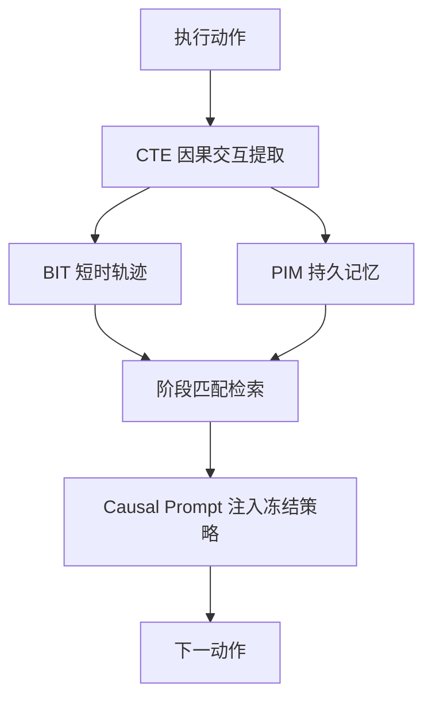
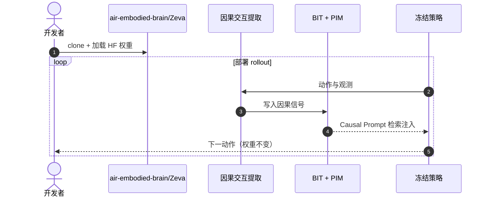

# Zeva：上下文因果学习用于可泛化具身操作

**Zeva**（*In-Context Causal Learning for Generalizable Embodied Manipulation*，[arXiv:2608.30880](https://arxiv.org/abs/2608.30880)，[项目页](https://air-embodied-brain.github.io/Zeva)，[代码](https://github.com/air-embodied-brain/Zeva)）由 **清华大学 AIR** 与 **Z-Trans AI** 等提出：在 **冻结策略模型** 前提下，从机器人 **自身物理交互** 中做 **in-context learning**——**Causal Interaction Extractor** 编码动作—状态变化因果信号，存入 **双时间尺度因果记忆**，后续检索注入为 **Causal Prompt**。

## 一句话定义

**在线适应可以先从「记住自己的动作导致了什么」开始，而不必立刻更新网络权重。**

## 英文缩写速查

| 缩写 | 英文全称 | 简要说明 |
|------|----------|----------|
| ICCL | In-Context Causal Learning | 本文核心：上下文因果学习 |
| BIT | Brief Interaction Trace | 单次尝试内的短时交互轨迹 |
| PIM | Persistent Interaction Memory | 跨尝试累积的持久交互记忆 |
| CTE | Causal Transition Encoder | 因果转移编码器 |
| VLA | Vision-Language-Action | 视觉-语言-动作策略 |
| WAM | World Action Model | 世界-动作联合模型 |

## 为什么重要

- 纳入 [2026-09-01 七篇盘点](../../sources/blogs/wechat_embodied_station_7_papers_open_source_system_loop_2026-09-01.md) 的「部署期无梯度自进化」支线。
- 对比前沿 **VLA / WAM** 在仿真与真机均 **最优档**。
- **部署期成功率随交互积累持续提升**，且经验可 **跨任务泛化**。
- **已开源** 代码与 Hugging Face 模型。

## 核心信息

| 项 | 内容 |
|----|------|
| **机构** | 清华大学 AIR；Z-Trans AI |
| **策略** | 冻结 foundation policy，仅更新记忆 |
| **记忆** | BIT（短时）+ PIM（跨尝试） |
| **开源** | **已开源** [air-embodied-brain/Zeva](https://github.com/air-embodied-brain/Zeva)；[HF 模型](https://huggingface.co/chen123fu/zeva-robocasa) |

### 流程总览

## 评测

| 基准 | 结果（读法） |
|------|-------------|
| RoboCasa365-Atomic5 | 平均 **76.8%**，+4.4 pt vs Fast-WAM |
| ChemLab-Evo Level-1（真机） | 平均 **83.3%**；Pick Up Test Tube **100%**（20 回合） |
| 在线自进化 | Evolve 1→4 累积成功率显著提升（项目页曲线） |
| 消融 | 去掉 PIM/BIT 分别降 10–30 pt |

## 结论

**冻结策略 + 因果记忆是在部署期做自进化的务实路径，且经验可跨任务检索。**

- 动作—状态变化编码为可检索因果信号
- 双时间尺度记忆分工明确（BIT vs PIM）
- 无梯度更新即可随尝试累积提升成功率
- 跨任务 effect token 近邻检索展示泛化
- 一次人类示范可 warm-start PIM
- 官方代码与模型已发布

## 源码运行时序图

## 局限与风险

- **记忆容量与检索噪声：** 错误因果信号可能误导后续尝试。
- **基础策略下限：** 冻结权重能力仍决定可进化上界。
- **真机实验室任务：** ChemLab-Evo 与 RoboCasa 域差异需注意迁移。

## 与其他工作对比（索引级）

| 维度 | Zeva | 部署期微调 / 持续学习 | Fast-WAM 等 [WAM](../concepts/world-action-models.md) 基线 | [CorrectVLA](./paper-correctvla.md) 式语言纠错 |
|------|------|-------------------|--------------------------------------------|----------------------------------------|
| 是否改权重 | **否**（只写记忆） | 是 | 否（推理即用） | 否 |
| 适应信号来源 | **机器人自身交互的因果信号** | 新采数据 + 梯度 | 训练时学到的世界模型 | **人类语言反馈** |
| 是否需要人 | 一次示范可 warm-start，其后自主 | 需标注/采数 | 否 | **每类失败要人给一次** |
| 随时间变化 | **成功率随尝试累积上升** | 阶跃式（每轮训练） | 固定 | 固定（除非再给反馈） |
| RoboCasa365-Atomic5 | **76.8%**（+4.4 pt vs Fast-WAM） | — | 对照基线 | 不同任务集，不可比 |
| 主要风险 | **错误因果信号污染记忆** | 灾难性遗忘 | 分布外失效 | 只覆盖执行错位 |

- **上界由冻结策略决定**：+4.4 pt 是在同一基础策略上「加记忆」的增量，不是新策略能力；基础模型不会的动作，检索再多因果 prompt 也做不出来（本页「局限与风险」已注明）。
- **与语言纠错互补而非竞争**：CorrectVLA 靠人一次反馈修幅度，Zeva 靠自身交互积累因果经验；前者即时、后者随时间增值，可叠加。
- **跨基准数字不可横比**：RoboCasa365-Atomic5（仿真）与 ChemLab-Evo（真机实验室）任务域差异大，83.3% 与 76.8% 不构成同一坐标上的高低。

## 关联页面

- [Manipulation](../tasks/manipulation.md)
- [VLA](../methods/vla.md)
- [World Action Models](../concepts/world-action-models.md)
- [CorrectVLA](./paper-correctvla.md) — 另一条免训练部署期纠错路线（人类语言反馈）
- [Motus2](./paper-motus2.md) — 同批次世界模型自进化对照

## 推荐继续阅读

- [Zeva 项目页](https://air-embodied-brain.github.io/Zeva)
- [arXiv:2608.30880](https://arxiv.org/abs/2608.30880)

## 参考来源

- [zeva_arxiv_2608_30880.md](../../sources/papers/zeva_arxiv_2608_30880.md)
- [具身智能小站 2026-09-01 七篇盘点](../../sources/blogs/wechat_embodied_station_7_papers_open_source_system_loop_2026-09-01.md)
- [Zeva 项目页](../../sources/sites/zeva.md)
- [air-embodied-brain/Zeva](../../sources/repos/air-embodied-brain-zeva.md)
