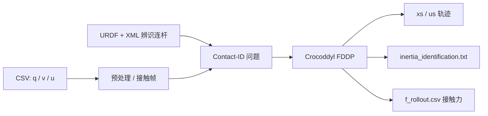
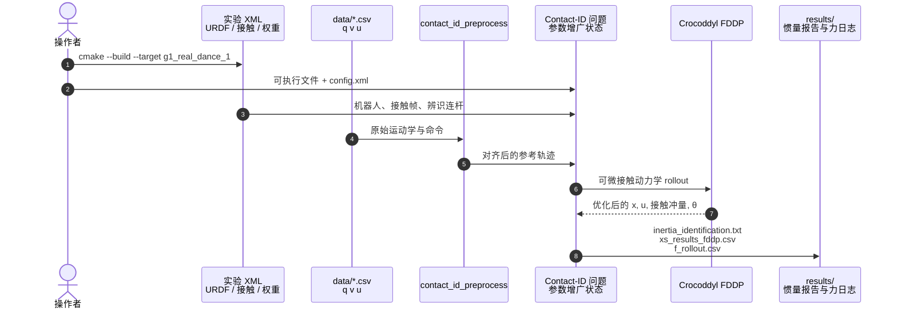

# PRIME

**PRIME**（*Physically-consistent Robotic Inertial and Motion Estimation*，[arXiv:2605.17681](https://arxiv.org/abs/2605.17681)，[项目页](https://jkangkjr.github.io/PRIME-project/)，[GitHub](https://github.com/well-robotics/PRIME)）由 **威斯康星大学麦迪逊分校** 的 Jiarong Kang、Kunzhao Ren、Tao Pang、Xiaobin Xiong（通讯；现单位 **上海创智学院**）提出，发表于 **RSS 2026**：把接触丰富运动重建写成参数全信息 MAP，用运动学与执行器命令联合细化轨迹、摩擦接触力与物理一致惯量。

本库节点沿用 HMI 开源主表的 `prime-system-id` 文件名，**不另造** `paper-prime`。

## 一句话定义

**纯运动学重建在接触段会违反牛顿定律；把摩擦接触力和惯量当成同一套 MAP 变量，用可微接触动力学把「符合刚体力学」写成硬约束。**

## 英文缩写速查

| 缩写 | 英文全称 | 简要说明 |
|------|----------|----------|
| PRIME | Physically-consistent Robotic Inertial and Motion Estimation | 本文接触隐式惯量 + 运动估计 |
| MAP | Maximum A Posteriori | 轨迹、接触力、惯量的联合后验 |
| FDDP | Feasibility-Driven Differential Dynamic Programming | Crocoddyl 后端求解器 |
| SysID | System Identification | 本方法把辨识嵌进运动重建，而不是事后最小二乘 |
| GRF | Ground Reaction Force | 重建接触力；G1 用测力台对照 |
| URDF | Unified Robot Description Format | 实验 XML 载入的连杆几何与初值惯量 |

## 为什么重要

- **接触段缺力与惯量。** EKF / 动捕只给 \(q,v\)；接触力、接触时刻、连杆惯量未观测，重建轨迹常动力学不一致。
- **产线读法。** [人形整机闭环惯量标定](../concepts/humanoid-closed-loop-inertia-calibration.md) 把 PRIME 当作「用行为倒推身体」的可运行实例：不必先拆关节上台架。
- **开源边界清晰。** C++ 实验可编译；日志 CSV 随仓；大规模预训练权重不在范围内。

## 核心信息

| 项 | 内容 |
|----|------|
| **机构** | 威斯康星大学麦迪逊分校（University of Wisconsin–Madison）；通讯作者现单位上海创智学院 |
| **发表** | RSS 2026；arXiv:2605.17681 |
| **平台** | Unitree G1；Unitree Go2 |
| **开源** | **已开源** BSD-3-Clause — [well-robotics/PRIME](https://github.com/well-robotics/PRIME)（复核日 2026-09-04） |
| **后端** | 可微 Anitescu 摩擦接触 + 平滑互补；Crocoddyl / FDDP；Pinocchio 3.4 |

## 核心原理

给定测量运动学与关节命令 \(u\)，PRIME 求动力学一致的 \(x=(q,v)\)、接触冲量与惯量 \(\pi\)（每连杆 10 参数，Log-Cholesky 保证伪惯量正定）。接触不另挂力传感器：时间步进 + 锥互补，用平滑势垒得到可微动力学，避免硬 LCP 把优化打断。



## 源码运行时序图

官方仓 [well-robotics/PRIME](https://github.com/well-robotics/PRIME) 按「CMake 目标 + 一张 XML」跑实验；节点对齐 README 的 `experiments/<Name>/`。



复现入口（README）：

```bash
cmake -S . -B build -DBUILD_PYTHON_INTERFACE=OFF -DBUILD_EXAMPLES=OFF
cmake --build build --target g1_real_dance_1 -j2
build/experiments/G1_real_dance_1/g1_real_dance_1 \
  experiments/G1_real_dance_1/config/g1_real_dance_1.xml
```

真机噪声日志可用分阶段 `kappa` 从平滑接触暖启动到更刚性接触（见 Go2 腹板 XML）。

## 实验与评测

项目页表（数字以项目页为准）：

| 设定 | 原值 | 估计 |
|------|------|------|
| Go2 仿真躯干质量 +3 kg | 6.927 kg | **9.975** kg |
| Go2 仿真 \(c_z-0.1\) m | −0.005 m | **−0.105** m |
| Go2 真机腹板 +4.6 kg | 6.927 kg | **11.740** kg |
| G1 真机总重 +2.91 kg | 躯干 9.60 kg | **13.02** kg |
| G1 测力台 RMSE_F | 不带 ID 26.141 N | 带 ID **24.486** N |

论文称 1000 步视界在 i9-13900 上约 **200 s** 内收敛。改进来自动力学一致，不是单纯把运动学滤波得更平滑。

## 与其他工作对比

| 路线 | 接触怎么处理 | 惯量怎么估 | 与 PRIME |
|------|--------------|------------|----------|
| EKF / 动捕 | 二值接触或忽略力 | 不估 | 运动学准、动力学常不一致 |
| 台架 / Fourier SysID | 尽量无接触 | 连杆或 \(I_a\) 单独回归 | 覆盖不了装机后分布式质量 |
| 采样式 SysID（如 SPI-Active） | 仿真查询 | 抽惯量，轨迹多不重估 | PRIME 同时改轨迹与参数 |
| 硬互补 batch ID | 显式 LCP | 可联合 | 数值难，多停在平面单接触；PRIME 用可微 Anitescu |

同组后续 [LegBiCal](https://github.com/DLinC3/LegBiCal)（arXiv:2510.11539）做噪声协方差与运动学双层标定，README 标明与 PRIME 接触隐式动力学的耦合不同，**不要混页**。

## 结论

**一句话总判：接触丰富段要把力和惯量放进同一套优化，而不是先滤运动学再事后拟合 URDF。**

1. **真影响指标** — 负载变更后躯干质量 / 质心是否回到物理增量（Go2 +3 kg → 9.975 kg；G1 +2.91 kg → 13.02 kg），以及测力台力误差是否下降。
2. **次要代价** — 分钟级 FDDP、要调 XML 权重与 `kappa` 日程；不是控制环内 1 kHz 估计器。
3. **部署读法** — 用仓内实验 XML 从真机日志出 `inertia_identification.txt`，写回仿真 / WBC；产线「每台序列号」仍要自己做数据管理。
4. **开源** — BSD-3-Clause，G1 / Go2 实验自洽；不要假设任意机型零改动。
5. **不要误用** — 不能替代关节 \(I_a\) / 摩擦台架；也不能被 Calib3R 一类相机免标定论文替换。

## 工程实践

| 检查项 | 建议 |
|--------|------|
| 依赖 | Pinocchio 3.4、hpp-fcl 3.0、Crocoddyl 栈；关 Python 接口做最小 C++ 构建 |
| 输入 | `q,v,u` CSV + URDF；XML 声明接触帧与待辨识连杆 |
| 输出 | `inertia_identification.txt`、`f_rollout.csv`；Meshcat 可视化在各实验 `visualizer/` |
| 许可 | BSD-3-Clause；引用时同时引 PRIME 与 Crocoddyl |

## 局限与风险

- **离线窗口优化**，不是机载滤波；KILVO 一类 1 kHz 里程计是另一条轴。
- **权重手工**，README 写明示例增益非最优。
- **HMI 主表是策展摘要**；方法细节以论文与 README 为准。

## 关联页面

- [人形整机闭环惯量标定](../concepts/humanoid-closed-loop-inertia-calibration.md) — 量产「出厂体检」读法
- [System Identification](../concepts/system-identification.md)
- [接触估计](../concepts/contact-estimation.md) — 无力传感时的接触力重建对照
- [Crocoddyl](./crocoddyl.md) — FDDP 后端
- [Pinocchio](./pinocchio.md)
- [Unitree G1](./unitree-g1.md)
- [开源主表覆盖索引](../queries/hmi-opensource-projects-coverage.md)
- [Humanoid Motion Intelligence](./humanoid-motion-intelligence.md)

## 参考来源

- [PRIME 论文摘录](../../sources/papers/prime_arxiv_2605_17681.md)
- [PRIME 项目页归档](../../sources/sites/prime-project.md)
- [PRIME 仓库归档](../../sources/repos/prime-system-id.md)
- [人形智研院公众号：惯量必须闭环](../../sources/blogs/wechat_humanoid_zhiyan_inertia_closedloop_calib_2026-08-26.md)
- [Humanoid Motion Intelligence 仓库归档](../../sources/repos/humanoid-motion-intelligence.md)

## 推荐继续阅读

- 项目页：<https://jkangkjr.github.io/PRIME-project/>
- 仓库：<https://github.com/well-robotics/PRIME>
- arXiv：<https://arxiv.org/abs/2605.17681>
