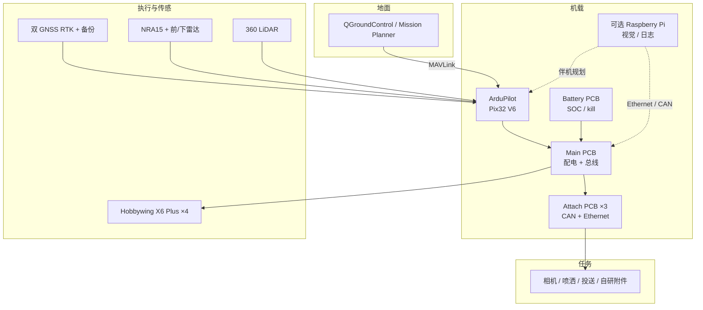

# Project Quiver

**Project Quiver**（[Arrow-air/project-quiver](https://github.com/Arrow-air/project-quiver)）是 Arrow Air（箭头航空）发布的 **开源多用途四旋翼机架**：最大起飞重量 **25 kg**、载荷 **5–8 kg**，三路快拆附件口 + 分布式定制 PCB，飞控跑 **ArduPilot**（Pix32 V6），地面站用 QGroundControl / Mission Planner。它补的是本库多旋翼栈里长期空着的 **「ArduPilot 真机机架」** 层，而不是再做一个 [PX4](./px4-autopilot.md) 或 [Betaflight](./betaflight.md) 固件分叉。

| 字段 | 内容 |
|------|------|
| 机构 | 箭头航空（Arrow Air） |
| 许可 | CERN-OHL-S-2.0（强互惠开源硬件） |
| 飞控 | ArduPilot on Holybro Pix32 V6 |
| 开源 | **已开源**：CAD / KiCad / 制造图纸 / 装配文档 / 试飞日志（截至 2026-09-05） |

## 英文缩写速查

| 缩写 | 英文全称 | 简要说明 |
|------|----------|----------|
| MTOW | Maximum Takeoff Weight | 最大起飞重量；Quiver 标称 25 kg |
| RTK | Real-Time Kinematic | 载波相位差分定位，厘米级 |
| GNSS | Global Navigation Satellite System | 全球导航卫星系统；本机双天线 + 备份 |
| PCB | Printed Circuit Board | 印刷电路板；四块可单独更换 |
| CAN | Controller Area Network | 附件口与 GNSS 使用的现场总线 |
| ESC | Electronic Speed Controller | 电调；本机用 Hobbywing X6 Plus 动力套 |
| GCS | Ground Control Station | 地面站；QGC / Mission Planner |
| DAO | Decentralized Autonomous Organization | 资助 12 架 dev-kit 的 Arrow 治理体 |

## 为什么重要

- **尺度对照**：本库已有 [Crazyflie](./crazyflie-firmware.md)（~27 g 室内微四轴）和「实验室 1–3 kg + PX4」叙事。Quiver 是 **户外作业级** 机体：5–8 kg 载荷、半小时悬停、可折叠装箱，适合谈「真机法规 / 防水 / 野外维护」，而不是室内动捕 swarm。
- **补齐 ArduPilot 机架**： [多旋翼栈总览](../overview/multirotor-simulation-planning-control-stack.md) 选型表里 ArduPilot 长期写「未列入本批」。Quiver **不替代** 上游 ArduPilot 固件页，但给出一条可制造、可借出的官方机架，伴机仍可走 [MAVSDK](./mavsdk.md)（MAVLink 兼容）。
- **开源硬件而不是开源固件**：CERN-OHL-S 覆盖机架与 PCB；CAD 是可版本控制的 [build123d](https://github.com/gumyr/build123d) Python 包，不是只丢 STEP。对「人形开源执行器 / 开源雷达」读者，这是航空侧对标案例。
- **附件口是产品，不是演示**：三口各带稳压 + CAN + Ethernet，明确把后续工作推到社区载荷（相机、喷洒、投送），平台本身转向维护。

## 核心原理

输入是任务附件 + 电池 + 飞手 / 地面站任务；机载闭环在 **ArduPilot**；本仓提供的是 **机械 / 配电 / 接口**，让附件热插拔而不动主板。

| 层 | 本仓交付 | 不在本仓 |
|----|----------|----------|
| 结构 | 铝板 + 碳管臂 / 起落架；`src/quiver/` 按 BOM 1000–3000 装配 | 气动 CFD、认证报告 |
| 电子 | 四块 KiCad：Battery / Main / FC 适配 / Attach×3 | 电调 / GNSS / 雷达模组原理图（外购） |
| 飞控 | Pix32 V6 适配板 + 文档中的 ArduPilot 配置 | ArduPilot 源码（上游） |
| 伴机 | Ethernet + CAN 接到可选 Raspberry Pi | 官方视觉 / 规划栈（路线图，非现成） |
| 地面 | 标准 QGC / Mission Planner | 自研 GCS |

### 四板分工

| 板 | BOM | 职责 |
|----|-----|------|
| Battery PCB | 3311 | 开关与保护、SOC / 温度、kill switch（取代 PT1 的 Arduino 接触器） |
| Main PCB | 3321 | 电源与数据枢纽 |
| FC PCB | 3331 | Pix32 V6 适配 |
| Attachment Interface | 3341 ×3 | 底 / 左 / 右：稳压 + CAN + Ethernet 给载荷 |

定位链：Holybro DroneCAN H-RTK F9P 或 Here4 主天线 + Mateksys M9N-G4-3100 备份；高度用 Nanoradar NRA15。当前 Dev-kit 另加 **360° LiDAR + 前视 / 下视雷达**。动力：Tattu 14S 30 Ah + 四套 Hobbywing XRotor X6 Plus，悬停 **25–31 min**。

### 原型迭代（项目页）

| | PT1 | PT2 | PT3 | Dev-kit |
|---|-----|-----|-----|---------|
| 飞控 | Pixhawk 6X | Matek H743 | Pix32 V6 | Pix32 V6 |
| PCB | 复用单板 | 定制主板 | 四块定制 | 连接器 / 母排更新 |
| 载荷口 | 1 | 1 | 3 | 3 |
| 避障 | 仅下视雷达 | 同左 | 同左 | 360 LiDAR + 前 / 下雷达 |
| 防水 | 否 | 否 | 否 | 是 |
| 起落架 | 固定 | 固定 | 固定 | 可拆 |

PT3 被标为当前生产设计；DAO 资助美 8 + 德 4 架作 dev-kit。

## 流程总览

## 工程实践

| 项 | 做法 |
|----|------|
| 开源状态 | **已开源**（CERN-OHL-S-2.0）。项目页写明 CAD / KiCad / ArduPilot 配置 / 装配文档在 GitHub；核查日 2026-09-05。 |
| 复现入口 | 装配：[Assembly Guides](https://arrowair.com/docs/quiver/pt3-assembly-guides)。CAD：`cd src && python -m quiver.assembly`（可 `-o` 导出 STEP，`--show` 进 ocp-vscode）。PCB：`src/pcb/<board>/` 含 production gerber。 |
| 飞起来 | 刷 **ArduPilot** 到 Pix32 V6，用 QGC / Mission Planner 校准；本仓 **不是** 飞控源码树。伴机自动化可走 [MAVSDK](./mavsdk.md) Offboard / Mission（与 PX4 同 API 族，参数与 SITL 端口不同）。 |
| 附件开发 | 先看仓内 `task-grant-bounty/equipment/attachment/` 的可能附件清单与社区票选优先级；申请 Discord 上的 dev-kit 出借。不要改主板走线来加传感器——走三口之一。 |
| 总线 | GNSS / 附件走 [DroneCAN](../../sources/sites/cia_dronecan_uavcan.md)，对照 [电机协议总览](../overview/motor-drive-firmware-bus-protocols.md) 的 DroneCAN 行；勿与 CiA 402 关节伺服混用工具链。 |
| 调试指标 | 悬停时间（相对 25–31 min）、RTK 固定解、雷达高度与气压计残差、附件口电压、Battery PCB 温度与 SOC。 |

源码运行时序图：**不适用**（本仓是机架 / PCB / CAD，无可训练策略或官方推理入口）。可运行路径是 **装配导出 + 刷上游 ArduPilot + QGC**。

## 局限与风险

- **误区：Quiver = 又一个 PX4 仓** — 飞控是 **ArduPilot**。PX4 SITL 参数、`px4_ros_com`、本库 [XTDrone](./xtdrone.md) 教程不能原样套到这架飞机。
- **误区：开源机架 = 开源自主栈** — 伴机视觉 / 规划仍是路线图；现成闭环是 ArduPilot 任务模式，不是 [EGO-Planner](./ego-planner-swarm.md) 开箱即用。
- **误区：和 Crazyflie / gym-pybullet-drones 同一尺度** — 25 kg 级涉及空域、电池能量与坠落动能；不能当室内 micro-UAV 实验平台。
- **许可：CERN-OHL-S 强互惠** — 改机架 / 改 PCB 的发行物通常必须同样开源；与 Apache/MIT 软件仓的「改完可闭源」不同。
- **雷达不是开源相控阵** — 高度 / 避障用商用 Nanoradar 与 LiDAR，与 [AERIS-10](./aeris-10-plfm-radar.md) 的自研 10.5 GHz 开源雷达不是同一层。
- **供应链与数量** — 12 架 DAO 资助机，靠社区制造商扩产；不是大疆式现货。
- **空中 VLN / 学习策略** — 可当 [视觉–语言导航](../tasks/vision-language-navigation.md) 的重载户外机体想象，但官方 **没有** 学习权重或 VLN 基准绑定。

## 关联页面

- [多旋翼仿真—规划—飞控开源栈总览](../overview/multirotor-simulation-planning-control-stack.md) — 本页在栈里的层
- [PX4 Autopilot](./px4-autopilot.md) — 自主飞控对照（Quiver 跑 ArduPilot）
- [MAVSDK](./mavsdk.md) — 伴机 MAVLink API
- [Crazyflie Firmware](./crazyflie-firmware.md) — 微四轴尺度对照
- [Betaflight](./betaflight.md) — FPV 手飞固件对照
- [AERIS-10](./aeris-10-plfm-radar.md) — 开源相控阵雷达（≠ 本机商用高度计）
- [平滑导航路径生成](../methods/smooth-navigation-path-generation.md) — 地面站任务之上的规划层
- [视觉–语言导航](../tasks/vision-language-navigation.md) — 空中 VLN 任务；本机不是其官方平台
- [CAN 总线](../concepts/can-bus-protocol.md) · [电机底软协议总览](../overview/motor-drive-firmware-bus-protocols.md)
- [Sim2Real](../concepts/sim2real.md)

## 参考来源

- [sources/repos/project-quiver.md](../../sources/repos/project-quiver.md)
- [sources/sites/arrowair-quiver.md](../../sources/sites/arrowair-quiver.md)
- [Arrow-air/project-quiver](https://github.com/Arrow-air/project-quiver)
- [Project Quiver 项目页](https://arrowair.com/quiver)

## 推荐继续阅读

- [Quiver 装配指南](https://arrowair.com/docs/quiver/pt3-assembly-guides)
- [Quiver 工程报告](https://arrowair.com/docs/quiver/Engineering-Reports)
- [ArduPilot 文档](https://ardupilot.org/) — 固件、模式与参数（上游，非本仓）
- [Arrow 社区 Discord](https://discord.gg/arrow)
