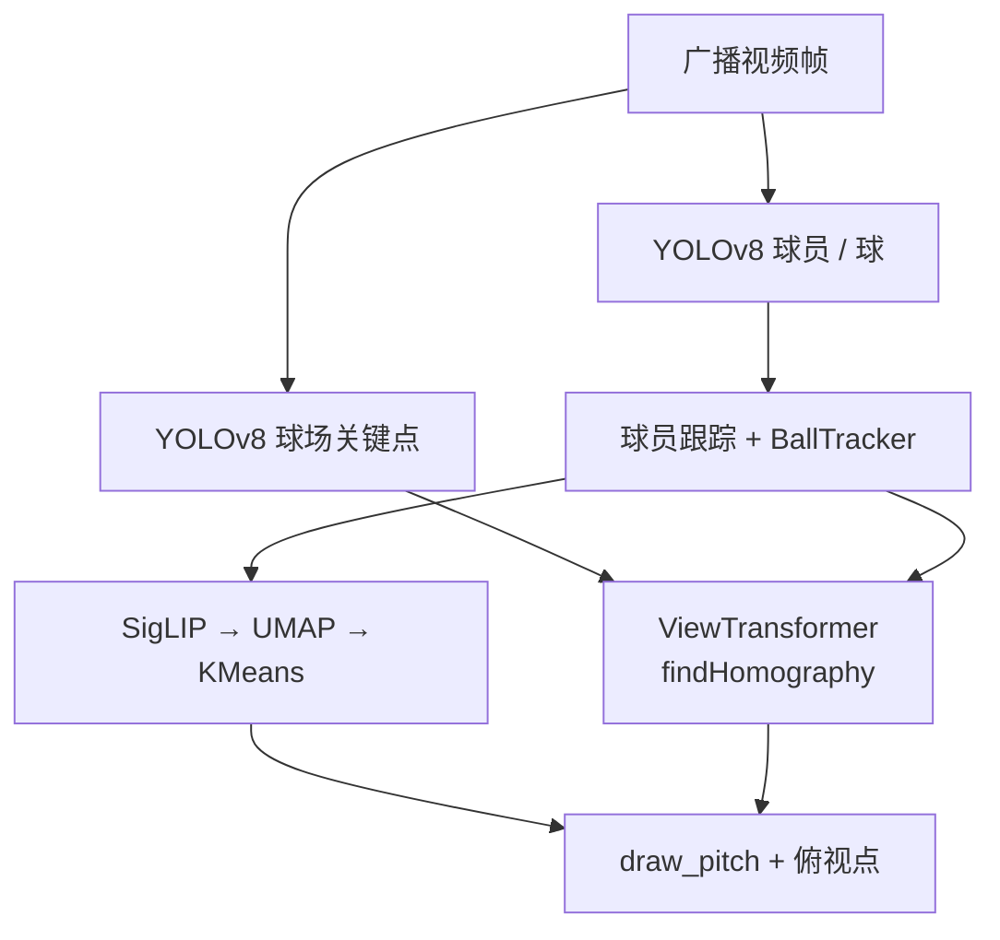
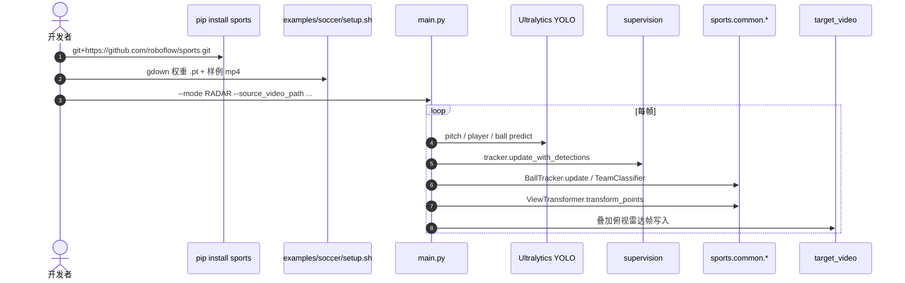

# Roboflow Sports

**Roboflow Sports**（[roboflow/sports](https://github.com/roboflow/sports)）是 Roboflow 开源的 **体育计算机视觉工具与足球分析示例**：可复用的球场几何配置、单应变换、球轨迹缓冲与球队外观聚类，叠在 **YOLOv8 + Supervision** 之上，把广播视角视频打成检测、跟踪与 **俯视雷达** 可视化。仓库以体育为极限测试场，推动小目标检测、关键点与跟踪在真实运动模糊下的工程化。

## 一句话定义

**一套 MIT 许可的体育 CV 积木 + 足球端到端 demo：从球场关键点估单应，把球员/球投到俯视平面，并用嵌入聚类区分两队——是 RoboCup 机载场线定位的第三人称对照实现。**

## 英文缩写速查

| 缩写 | 英文全称 | 简要说明 |
|------|----------|----------|
| YOLO | You Only Look Once | demo 默认检测器族（Ultralytics YOLOv8） |
| KPI | Keypoint / Pitch Keypoint | 球场角点与线交点，用于估单应 |
| Homography | Homography | 图像平面 ↔ 球场平面的透视变换 |
| SigLIP | Sigmoid Loss for Language-Image Pretraining | 球员 crop 的视觉嵌入骨干 |
| UMAP | Uniform Manifold Approximation and Projection | 嵌入降维后再聚类 |
| MOT | Multi-Object Tracking | 球员跨帧 ID（Supervision tracker） |
| RADAR | Radar / Bird's-eye Overlay | 俯视球场上叠加球员与球位置 |
| MIT | Massachusetts Institute of Technology License | 本仓分析代码默认许可 |

## 为什么重要

- **几何闭环可抄：** `SoccerPitchConfiguration` + `ViewTransformer` 把「关键点检测 → `findHomography` → 俯视坐标」写成可运行代码，直接对照本库 [场线/交点检测](../methods/soccer-field-line-detection.md) 与 [视觉场线定位流水线](../queries/soccer-visual-field-localization-pipeline.md) 的前两段（检测 + 模型关联），只是视角是 **固定/广播相机** 而非机载。
- **小目标球工程套路：** `BallTracker` 用近期检测缓冲的质心挑最稳候选，缓解单帧漏检/误检——与 RoboCup 寻球同一痛点。
- **分队不靠球衣号码：** SigLIP → UMAP → KMeans 两簇，适合无 OCR、外观主导的快速分队可视化。
- **许可边界清晰：** `sports` 本体 **MIT**；soccer demo 所绑的 **Ultralytics YOLOv8 为 AGPL-3.0**，产品化时必须拆许可（可换 [RF-DETR](./rf-detr.md) 等更宽松检测器）。

## 核心信息

| 项 | 内容 |
|----|------|
| **机构** | 罗博福流（Roboflow） |
| **代码** | <https://github.com/roboflow/sports>（~5.2k★，2026-07-27） |
| **开源** | **已开源**（库 + `examples/soccer`）；权重/样例视频经 `setup.sh` + Google Drive |
| **安装** | `pip install git+https://github.com/roboflow/sports.git`（尚无正式 PyPI 版） |
| **许可** | 库 **MIT**；demo 检测权重链路受 **Ultralytics AGPL-3.0** 约束 |
| **主示例** | `examples/soccer/main.py` 六模式 CLI |

## 核心原理

### 模块分层

| 层 | 组件 | 作用 |
|----|------|------|
| 几何先验 | `SoccerPitchConfiguration` | 标准球场尺寸（cm）与顶点/边拓扑 |
| 检测 | YOLOv8（球员/球/球场关键点三权重） | 框与关键点 |
| 跟踪 | Supervision ByteTrack 类 + `BallTracker` | 球员 ID；球用缓冲质心消歧 |
| 分队 | `TeamClassifier`（SigLIP + UMAP + KMeans） | 两队外观簇 |
| 投影 | `ViewTransformer` | 关键点对 → 单应 → 俯视坐标 |
| 可视化 | `sports.annotators.soccer` | 俯视球场图 + 点/轨迹叠加 |

### 流程总览（RADAR 模式）

### 与 RoboCup 机载流水线的对照

| 维度 | roboflow/sports（广播） | 本库机载主线 |
|------|-------------------------|--------------|
| 相机 | 侧方/高位固定或缓慢运动 | 机载、剧烈晃动 |
| 场地观测 | 关键点回归 + 全局单应 | 线/交点 + 局部匹配 / EKF |
| 输出 | 俯视雷达与统计可视化 | \((x,y,\theta)\) 供决策踢球 |
| 球 | 专用小目标检测 + 缓冲跟踪 | 寻球 + 跟踪，常需深度/运动模型 |

二者共享「**先稳定几何特征，再投到场地坐标**」的骨架；机载侧还要处理对称歧义、可观测性与滤波，见 [场线定位流水线](../queries/soccer-visual-field-localization-pipeline.md)。

## 工程实践

| 项 | 建议 |
|----|------|
| 最短路径 | 装库 → `examples/soccer` 装依赖 → `./setup.sh` 拉权重与样例 → `--mode RADAR` |
| 训练自定义 | 三个 Colab：`train_player_detector` / `train_ball_detector` / `train_pitch_keypoint_detector`；数据来自 Roboflow Universe（源自 DFL Bundesliga 等） |
| 换检测器 | 保持 Supervision `Detections` 接口，可将 YOLOv8 换成 [RF-DETR](./rf-detr.md) 或 YOLO11/26，以规避 AGPL 或提升域迁移 |
| 单应稳健性 | 可见关键点过少时勿硬解；应对齐 pitch 模型单位（本仓默认 **cm**） |
| 分队 | KMeans `n_clusters=2` 假设两队主色可分；裁判/门将需按 class id 排除后再拟合 |
| 数据集 | Universe：球员检测、球检测、球场关键点；另有篮球球场关键点与球衣 OCR 集 |

### 源码运行时序图

- **复现入口：** 仓库根 README 安装段 + [`examples/soccer/README.md`](https://github.com/roboflow/sports/blob/main/examples/soccer/README.md) 的六模式命令。
- **权重不在 git 内：** 必须跑 `setup.sh`；网络或 Drive 限流时需手动下载到 `examples/soccer/data/`。

## 局限与风险

- **非机载定位栈：** 全局单应假设近似平面与足够关键点；不能替代 RoboCup 的线匹配 + EKF。
- **许可叠层：** 分析代码 MIT ≠ 整条 demo 可闭源商用；Ultralytics 权重与训练脚本仍受 AGPL 约束。
- **无正式 PyPI：** API 与版本以 git main 为准，生产应钉 commit。
- **README 未完成项：** RADAR 闪烁平滑、离线统计 notebook 仍在 roadmap。
- **球衣 OCR / 再识别：** 挑战已列出，篮球 OCR 数据集有挂，但完整号码识别管线未作为一等 demo 模式交付。

## 关联页面

- [足球场线与球门检测](../methods/soccer-field-line-detection.md) — 机载关键点/线几何方法页
- [足球视觉场线定位流水线](../queries/soccer-visual-field-localization-pipeline.md) — 检测→匹配→EKF；本仓为广播侧对照
- [Humanoid Soccer](../tasks/humanoid-soccer.md) — 上层任务与感知需求
- [Ultralytics YOLO](./ultralytics.md) — demo 默认检测工程入口
- [RF-DETR](./rf-detr.md) — 同机构实时 DETR，可作 MIT/Apache 向检测替换
- [目标检测](../methods/object-detection.md) — 检测通论
- [足球场仿真](../concepts/soccer-field-simulation.md) — 有真值时可对照俯视误差
- [Booster RoboCup Demo](./booster-robocup-demo.md) — 真机队感知栈对照
- [Tennis-Vision](./tennis-vision.md) — 网球广播对照：地板单应门、事件语法与拒报；本仓做到俯视雷达，那仓把「测不到就不报」写进产品

## 参考来源

- [roboflow_sports.md](../../sources/repos/roboflow_sports.md) — GitHub 仓库归档（2026-07-27 核查）
- [roboflow/sports](https://github.com/roboflow/sports) — 官方代码与 soccer 示例

## 推荐继续阅读

- [examples/soccer/README.md](https://github.com/roboflow/sports/blob/main/examples/soccer/README.md) — 六模式命令与数据集徽章
- [Roboflow Universe 足球相关数据集](https://universe.roboflow.com/) — 球员 / 球 / 球场关键点
- [Supervision](https://github.com/roboflow/supervision) — 标注与跟踪依赖
