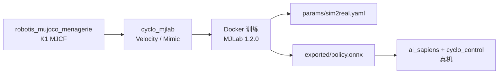

# cyclo_mjlab（ROBOTIS）

**cyclo_mjlab**（[`ROBOTIS-GIT/cyclo_mjlab`](https://github.com/ROBOTIS-GIT/cyclo_mjlab)，Apache-2.0，2026-08 新建）是 ROBOTIS 在 **[mjlab](./mjlab.md)** / **MuJoCo 3.5** 上的 K1 人形训练仓，与 Isaac Lab 路线的 [cyclo_lab](./cyclo-lab.md) 形成 **双仿真栈**：臂/Worker 偏 Isaac，**AI Sapiens K1** 全身 locomotion / dance mimic 偏 MuJoCo Warp。

## 一句话定义

在 mjlab 上为 ROBOTIS K1 提供平地速度跟踪与参考舞蹈模仿两类 RL 环境，训练自动生成 Sim2Real 参数文件，play 导出 ONNX/PT 供真机部署对接。

## 英文缩写速查

| 缩写 | 英文全称 | 简要说明 |
|------|----------|----------|
| MJLab | MuJoCo + Isaac Lab API | mujocolab 的 GPU 加速 RL 框架 |
| RL | Reinforcement Learning | Velocity 任务为主 |
| Mimic | Motion imitation | Dance1 / Dance2 参考轨迹跟踪 |
| ONNX | Open Neural Network Exchange | play 阶段导出的部署格式 |
| Sim2Real | Simulation to Real | `params/sim2real.yaml` 自动生成 |
| K1 | AI Sapiens K1 | 本仓当前目标人形平台 |

## 为什么重要

- **厂商双 Lab 选型**：ROBOTIS 不再只有 Isaac Lab 一条训练线；K1 全身策略可跟 [Unitree rl_mjlab](./unitree-rl-mjlab.md) 一样走 **mjlab 生态**。
- **部署产物明确**：训练写 `sim2real.yaml`、play 出 `policy.onnx` / `.pt`，比纯研究仓更易接到 [ai_sapiens](./robotis-ai-sapiens.md) bringup。
- **与 menagerie 互补**：[robotis_mujoco_menagerie](./robotis-mujoco-menagerie.md) 提供资产，本仓提供 **任务 + 训练 + 导出** 闭环。

## 流程总览

## 核心机制

| 任务族 | 说明 |
|--------|------|
| **Velocity** | 平地速度跟踪 locomotion（README 含 demo 视频） |
| **Mimic** | Dance1 / Dance2 参考动作模仿 |
| **版本钉** | MJLab **1.2.0**、MuJoCo **3.5.0**、Python **3.11**（README IMPORTANT 块） |
| **环境** | 推荐 Docker；预装 MuJoCo 与 GPU 配置 |

## 工程实践

| 维度 | 记录 |
|------|------|
| 安装 | Docker（README 主推）；无需主机 Conda |
| 训练输出 | `params/sim2real.yaml` 自动创建 |
| 推理导出 | play → `exported/policy.onnx` + `policy.pt` |
| 真机 | 对接 K1 ROS 2 bringup；勿直接套用 cyclo_lab 的 Isaac DDS 脚本 |
| 开源状态 | **已开源**；仓较新（~3★），API 可能迭代 |

## 局限与风险

- **机型绑定 K1**：非 OMY/FFW/四足任务；选型前确认硬件代次与 URDF/MJCF 一致。
- **mjlab 版本敏感**：与 [cyclo_lab](./cyclo-lab.md) 的 Isaac Sim/Lab 钉版本同样不能混环境。
- **生态年轻**：对比 `cyclo_lab`（~144★）社区验证更少，issue/文档以 README 为主。
- **Sim2Real 边界**：YAML/ONNX 只覆盖策略侧；真机安全、WBC、通信仍依赖 `cyclo_control` 与现场标定。

## 与相邻路线对比

| 路线 | 仿真 | 目标硬件 | 特点 |
|------|------|----------|------|
| **cyclo_mjlab** | mjlab / MuJoCo | K1 人形 | ONNX 导出 + sim2real.yaml |
| [cyclo_lab](./cyclo-lab.md) | Isaac Lab | OMY / FFW / 臂系 | 官方 Mimic + DDS Sim2Real |
| [unitree_rl_mjlab](./unitree-rl-mjlab.md) | mjlab | Unitree 多机型 | 厂商官方 mjlab 对标参照 |

## 结论

**cyclo_mjlab 把 ROBOTIS Physical AI 的训练入口从「只有 Isaac Lab」扩展成「K1 可走 mjlab 快线」，价值在任务 + 导出约定清晰，而不是 star 数。**

- 选型时先分硬件：**臂/Worker → cyclo_lab**；**K1 全身 → cyclo_mjlab**。
- 产物以 **ONNX + sim2real.yaml** 为部署锚点，真机前仍须核对 `ai_sapiens` 控制器接口。
- 仓处于早期（2026-08 创建），跟进 README 与 issue 比假设 API 稳定更安全。

## 关联页面

- [ROBOTIS 组织 hub](./robotis.md)
- [AI Sapiens K1](./robotis-ai-sapiens.md)
- [cyclo_lab](./cyclo-lab.md) · [mjlab](./mjlab.md)
- [MuJoCo Menagerie](./robotis-mujoco-menagerie.md)

## 参考来源

- [cyclo_mjlab.md](../../sources/repos/cyclo_mjlab.md)
- [robotis-git.md](../../sources/repos/robotis-git.md)
- 仓库：<https://github.com/ROBOTIS-GIT/cyclo_mjlab>

## 推荐继续阅读

- [mjlab 官方文档](https://mujocolab.github.io/mjlab)
- [AI Sapiens 文档](https://ai.robotis.com/)（K1 bringup）
