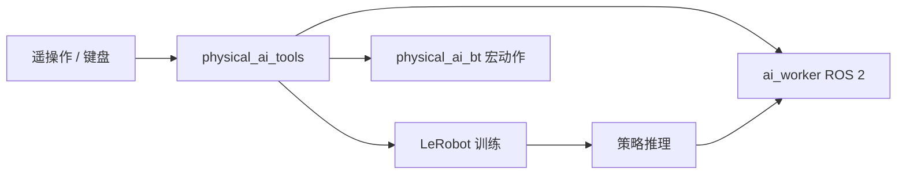

# ROBOTIS Physical AI Tools

**Physical AI Tools**（[`ROBOTIS-GIT/physical_ai_tools`](https://github.com/ROBOTIS-GIT/physical_ai_tools)，~140★，Apache-2.0）是 ROBOTIS 面向真机的 **LeRobot + ROS 2 开发界面**：数据采集、服务端与行为树宏动作，文档入口 [ai.robotis.com](https://ai.robotis.com/)。默认文档分支示例为 **`jazzy`**（`git clone -b jazzy ... --recursive`）。

## 一句话定义

在 ROS 2 上挂一层 **Physical AI Server + LeRobot 子模块 + `physical_ai_bt` 宏动作**，让 AI Worker / Open Manipulator 等平台走「遥操作采集 → 训练 → 推理」而不必先搭完整 Cyclo Intelligence 容器矩阵。

## 英文缩写速查

| 缩写 | 英文全称 | 简要说明 |
|------|----------|----------|
| LeRobot | Hugging Face LeRobot | 模仿学习 / VLA 训练库，本仓子模块 |
| ROS 2 | Robot Operating System 2 | 通信与 bringup 中间件 |
| BT | Behaviour Tree | `physical_ai_bt` 任务宏动作 |
| VLA | Vision-Language-Action | 可经 LeRobot 后端接入的策略类 |
| IL | Imitation Learning | 本工具链主路径 |

## 为什么重要

- **厂商官方「LeRobot 真机界面」**：与社区自接 LeRobot 相比，包了 ROBOTIS 硬件话题与 Docker/s6。
- **和 cyclo_lab / cyclo_intelligence 分工清晰**：Lab 偏仿真训练；Tools 偏真机数据与服务；Intelligence 偏完整 BT+VLA 编排栈——选型时按阶段选仓。
- **BT 宏动作可复用**：`move_arms` / `move_head` / `move_lift` / `rotate` 等与 [行为树 × VLA](../concepts/behavior-tree-vla-orchestration.md) 叙事同构。

## 核心原理

| 路径 | 角色 |
|------|------|
| `lerobot/` | LeRobot 子模块 |
| `physical_ai_bt/` | BT 核心、blackboard、宏动作节点与 launch |
| `docker/` + s6 | `physical_ai_server` 服务编排 |
| 文档 | ai.robotis.com 产品教程 |

## 工程实践

1. `git clone -b jazzy https://github.com/ROBOTIS-GIT/physical_ai_tools.git --recursive`（以 README 当前推荐分支为准）。
2. 用 `docker/container.sh` 拉起服务；硬件侧先 bringup [ai_worker](./robotis-ai-worker.md) 或对应臂包。
3. 仿真策略迁移：`cyclo_lab` README 的 Sim2Real 节指向本仓做数据集训练/推理。
4. 需要 **容器化多后端 VLA + 会话状态机** 时升级到 [cyclo_intelligence](./cyclo-intelligence.md)。
5. 模型与数据：[Hugging Face/ROBOTIS](https://huggingface.co/ROBOTIS)。

## 局限与风险

- **开源状态：已开源**（Apache-2.0）。
- **分支敏感**：文档写死 `jazzy` 示例；换发行版前核对 CI / README。
- **不是完整 Cyclo Brain**：策略容器矩阵、GR00T 子模块与 orchestrator 相位机以 Intelligence 仓为准，勿在本仓假设功能对等。
- **与私有 Supervisor/Hub**：Cyclo 私有栈不在本仓范围。

## 关联页面

- [ROBOTIS hub](./robotis.md) · [AI Worker](./robotis-ai-worker.md)
- [cyclo_lab](./cyclo-lab.md) · [Cyclo Intelligence](./cyclo-intelligence.md)
- [LeRobot](./lerobot.md)
- [行为树 × VLA 编排](../concepts/behavior-tree-vla-orchestration.md)
- [VLA 真机部署指南](../queries/vla-deployment-guide.md)

## 参考来源

- [sources/repos/physical_ai_tools.md](../../sources/repos/physical_ai_tools.md)
- 上游：<https://github.com/ROBOTIS-GIT/physical_ai_tools>

## 推荐继续阅读

- [ai.robotis.com](https://ai.robotis.com/)
- [LeRobot 文档](https://huggingface.co/docs/lerobot)
