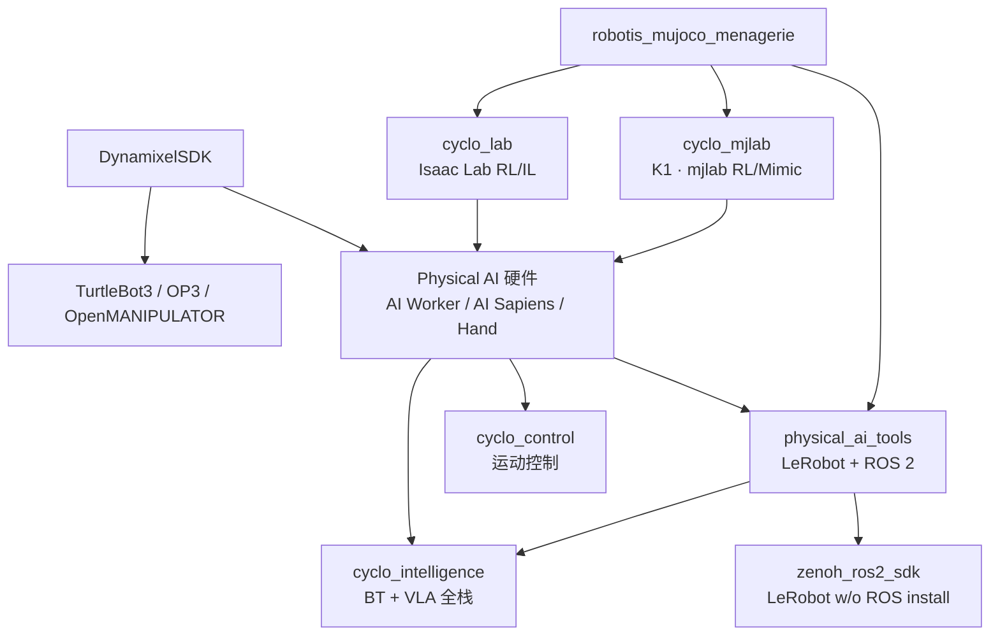

# ROBOTIS（乐百机器人）

**ROBOTIS（乐百机器人）** 是韩国机器人硬件与开源软件厂商，以 **DYNAMIXEL** 舵机协议栈和 ROS 教育平台闻名；近年将产品线扩展到 **Physical AI**（AI Worker / AI Sapiens / OpenMANIPULATOR-Y）与 **Cyclo** 模块化开源框架。官方 GitHub 组织：[ROBOTIS-GIT](https://github.com/ROBOTIS-GIT)（**154** 公开仓 · ~1182 followers，2026-09）。

## 一句话定义

从 **Dynamixel 执行器 SDK** 到 **TurtleBot3 / OpenMANIPULATOR 教育生态**，再到 **Cyclo（Isaac Lab + mjlab 双仿真线、Control、Intelligence、Tools、Zenoh×LeRobot）** 上的半人形/人形 Physical AI 真机栈——ROBOTIS 提供一条可买硬件、可跑 ROS 2、可接 LeRobot / Isaac Lab / mjlab 的厂商开源主线。

## 英文缩写速查

| 缩写 | 英文全称 | 简要说明 |
|------|----------|----------|
| DXL | DYNAMIXEL | ROBOTIS 舵机产品族与总线协议 |
| FFW | Freedom From Work | AI Worker 产品代号前缀（`ffw_*` ROS 包） |
| OMY / OMX | OpenMANIPULATOR-Y / X | Physical AI / 开源机械臂型号线 |
| VLA | Vision-Language-Action | Cyclo Intelligence / Physical AI Tools 对接的策略类 |
| BT | Behaviour Tree | 任务编排；见 cyclo_intelligence 与 physical_ai_bt |
| IL | Imitation Learning | cyclo_lab / LeRobot 主路径之一 |
| RL | Reinforcement Learning | cyclo_lab 在 Isaac Lab 上的并行训练 |
| ROS 2 | Robot Operating System 2 | 真机 bringup 与中间件主线 |
| Isaac Lab | NVIDIA Isaac Lab | cyclo_lab 仿真训练框架 |
| MuJoCo | Multi-Joint dynamics with Contact | robotis_mujoco_menagerie 资产引擎 |

## 为什么重要

- **执行器层事实标准之一**：大量开源臂/手/教育平台直接用 Dynamixel 或兼容其协议；选型与调试往往先落到 [Dynamixel SDK](./dynamixel-sdk.md)。
- **ROS 教学入口**： [TurtleBot3](./turtlebot3.md)、OpenCR、eManual 仍是全球 ROS 课设常用参照。
- **Physical AI 厂商闭环**：相对只丢 URDF 的厂商，ROBOTIS 公开 **采集界面（physical_ai_tools）→ Isaac Lab（cyclo_lab）→ BT+VLA（cyclo_intelligence）→ 真机（ai_worker / ai_sapiens）**，便于与 [Unitree](./unitree.md) 等生态对照。

## 核心原理：组织地图

### 1. 经典开源平台（已有实体）

| 平台 | wiki |
|------|------|
| TurtleBot3 | [turtlebot3.md](./turtlebot3.md) |
| OpenMANIPULATOR 等臂/手线 | [robotis-open-manipulator-line.md](./robotis-open-manipulator-line.md) |
| OP3 / THORMANG3 | [robotis-op3.md](./robotis-op3.md) · [robotis-thormang3.md](./robotis-thormang3.md) |

### 2. Cyclo Physical AI 主线（本次升格）

| 模块 | 仓库 | wiki |
|------|------|------|
| 框架索引 | [cyclo](https://github.com/ROBOTIS-GIT/cyclo) | 本节（不单独 stub） |
| 硬件：AI Worker | [ai_worker](https://github.com/ROBOTIS-GIT/ai_worker) | [robotis-ai-worker.md](./robotis-ai-worker.md) |
| 硬件：AI Sapiens | [ai_sapiens](https://github.com/ROBOTIS-GIT/ai_sapiens) | [robotis-ai-sapiens.md](./robotis-ai-sapiens.md) |
| Lab（Isaac RL/IL） | [cyclo_lab](https://github.com/ROBOTIS-GIT/cyclo_lab) | [cyclo-lab.md](./cyclo-lab.md) |
| Lab（K1 / mjlab） | [cyclo_mjlab](https://github.com/ROBOTIS-GIT/cyclo_mjlab) | [robotis-cyclo-mjlab.md](./robotis-cyclo-mjlab.md) |
| Tools（LeRobot 界面） | [physical_ai_tools](https://github.com/ROBOTIS-GIT/physical_ai_tools) | [robotis-physical-ai-tools.md](./robotis-physical-ai-tools.md) |
| LeRobot × Zenoh（α） | [zenoh_ros2_sdk](https://github.com/ROBOTIS-GIT/zenoh_ros2_sdk) + [lerobot_robot_ros2_zenoh](https://github.com/ROBOTIS-GIT/lerobot_robot_ros2_zenoh) | 本节 + [lerobot.md](./lerobot.md) |
| Intelligence（BT+VLA） | [cyclo_intelligence](https://github.com/ROBOTIS-GIT/cyclo_intelligence) | [cyclo-intelligence.md](./cyclo-intelligence.md) |
| MuJoCo 资产 | [robotis_mujoco_menagerie](https://github.com/ROBOTIS-GIT/robotis_mujoco_menagerie) | [robotis-mujoco-menagerie.md](./robotis-mujoco-menagerie.md) |
| 执行器 SDK | [DynamixelSDK](https://github.com/ROBOTIS-GIT/DynamixelSDK) | [dynamixel-sdk.md](./dynamixel-sdk.md) |

`cyclo_control`、`cyclo_manager`、`robotis_hand`、`soma-retargeter` 等：在组织归档与本 hub 导航；深度细节见对应 `sources/repos/`（`soma-retargeter` 已有独立归档）。

## 工程实践

1. **先定产品线**：教学轮式 → TurtleBot3 eManual；桌面臂 → OpenMANIPULATOR / OMY；半人形操作 → AI Worker + [ai.robotis.com](https://ai.robotis.com/)；人形 K1 → AI Sapiens docs。
2. **学习栈**：仿真资产用 [MuJoCo menagerie](./robotis-mujoco-menagerie.md)；**K1 全身**用 [cyclo_mjlab](./robotis-cyclo-mjlab.md) 或 **臂/Worker** 用 [cyclo_lab](./cyclo-lab.md)；真机 LeRobot 流程用 [physical_ai_tools](./robotis-physical-ai-tools.md)（或 Zenoh 路径 `lerobot_robot_ros2_zenoh`）；长程 BT+VLA 部署看 [cyclo_intelligence](./cyclo-intelligence.md)。
3. **Docker**：官方镜像多在 `robotis/ros`、`robotis/cyclo-intelligence` 等；Jetson ARM64 与 AMD64 常共用 `container.sh`。
4. **数据与权重**：[Hugging Face/ROBOTIS](https://huggingface.co/ROBOTIS)。
5. **厂商 Lab 对照**：与 [unitree_rl_lab](./unitree-rl-lab.md)、[Deep Robotics rl_training](./deeprobotics-rl-training.md)、社区 [robot_lab](./robot-lab.md) 并列选型时，`cyclo_lab` 是 ROBOTIS 官方入口。

## 局限与风险

- **开源状态：主线仓已开源**；Cyclo README 标明 **Supervisor / Hub 等私有栈**不在公开组织——勿假设「全栈皆 Apache」。
- **型号与包名分叉**：FFW 子型号（SH5/SG2/BG2）、OMY/OMX、K1 rev 配置以当前 docs 为准，旧 eManual 页面可能滞后。
- **Isaac Lab 版本钉死**：`cyclo_lab` 徽章绑定 Sim/Lab 版本，与其它厂商 Lab 环境不互通。
- **组织仓体量大**：154 仓含大量 ROS1 时代与 fork；选型以本 hub「已升格节点」与 Cyclo 模块表为准，避免陷入冷门归档仓。

## 关联页面

- [AI Worker](./robotis-ai-worker.md) · [AI Sapiens](./robotis-ai-sapiens.md)
- [cyclo_lab](./cyclo-lab.md) · [cyclo_mjlab](./robotis-cyclo-mjlab.md) · [Physical AI Tools](./robotis-physical-ai-tools.md) · [Cyclo Intelligence](./cyclo-intelligence.md)
- [Dynamixel SDK](./dynamixel-sdk.md) · [MuJoCo Menagerie](./robotis-mujoco-menagerie.md)
- [TurtleBot3](./turtlebot3.md) · [OpenMANIPULATOR 线](./robotis-open-manipulator-line.md)
- [行为树 × VLA 编排](../concepts/behavior-tree-vla-orchestration.md)
- [Unitree（厂商对照）](./unitree.md)

## 参考来源

- [sources/repos/robotis-git.md](../../sources/repos/robotis-git.md)
- [sources/repos/cyclo.md](../../sources/repos/cyclo.md)
- 组织页：<https://github.com/ROBOTIS-GIT>
- Physical AI 文档：<https://ai.robotis.com/>

## 推荐继续阅读

- [docs.robotis.com](https://docs.robotis.com/) — 系统与产品手册
- [ROBOTIS Open Source Team（YouTube）](https://www.youtube.com/@ROBOTISOpenSourceTeam)
- [ROBOTIS Discord](https://discord.gg/robotis)
