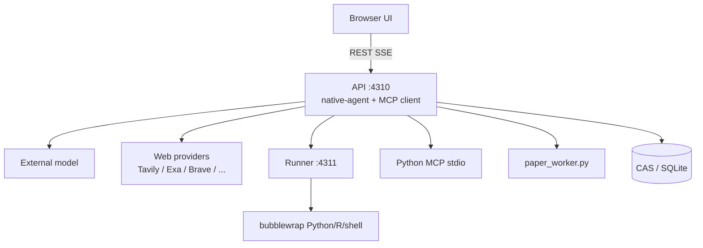
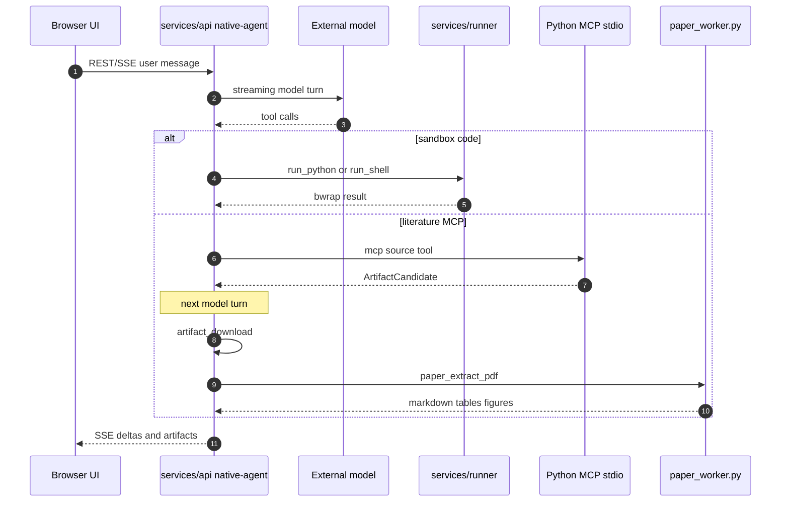

# ScienceDiscovery

**ScienceDiscovery**（[GitHub](https://github.com/openJiuwen-ai/sciencediscovery) · [AtomGit](https://atomgit.com/openJiuwen/sciencediscovery)）是 [openJiuwen](./openjiuwen.md) 社区的 **一站式 AI 科研工作台**：把「文献阅读 → 假设 → 写代码 → 试错 → 调参」收进同一本地 Linux 环境。控制面是 Node，agent 环是本仓 TypeScript，代码执行进 Bubblewrap，科学数据走 MCP。

## 一句话定义

在 **可信工作站** 上跑一条带权限卡、沙箱和内容寻址溯源的科研 agent 环：模型在沙箱外出站调用，Python / R / shell 默认无网隔离执行，文献与库查询经治理过的 MCP。

## 英文缩写速查

| 缩写 | 英文全称 | 简要说明 |
|------|----------|----------|
| MCP | Model Context Protocol | 科学 Connector 与延迟披露工具的协议；进程内 Node client + Python stdio server |
| CAS | Content-Addressable Storage | SHA-256 寻址的不可变产物；请求/响应用于审计与引用 |
| SSE | Server-Sent Events | 浏览器只连 API `:4310`，文本与推理增量由此推流 |
| NPU | Neural Processing Unit | 可选昇腾 Host Broker；allowlist 作业，不是通用宿主机 shell |
| HOTS | Human on the Swarm | openJiuwen 平台层的人机协作口径；本仓落地为权限卡与审阅，而非完整蜂群产品 |

## 核心信息

| 字段 | 内容 |
|------|------|
| 机构 | 华为（Huawei）开源社区 openJiuwen |
| 类型 | 本地单用户科学 agent 工作台 |
| 代码 | <https://github.com/openJiuwen-ai/sciencediscovery> |
| 镜像 | <https://atomgit.com/openJiuwen/sciencediscovery> |
| 许可 | Apache-2.0 |
| 开源结论 | **已开源**（完整 monorepo + 中英文档）；模型与文献全文不随仓 |
| 运行时 | Linux x86_64 / aarch64；默认 `127.0.0.1:4310`（API+UI）、`:4311`（Runner） |

## 为什么重要

- **S2+S3 工作台，不是 wiki 编译器：** [AI Auto-Research](../concepts/ai-auto-research.md) 把文献综合与实验编排分成两段。本产品用 MCP 接 PubMed / arXiv / PDB 等，用沙箱跑分析脚本，用 Prompt Manifest 冻结技能修订—— complementary 于本库 [Karpathy LLM Wiki](../references/llm-wiki-karpathy.md) 的「先编译进页面」。
- **对照最小实验环：** [karpathy/autoresearch](./karpathy-autoresearch.md) 用固定 5 分钟 + `val_bpb` 约束代理只改 `train.py`。ScienceDiscovery 相反：开放文献、多工具、子代理 `task`，验证靠权限卡、审阅与 CAS，**没有**单一可比指标。选型时问的是「要不要锁编辑面」，不是谁更 SOTA。
- **控制面可审计：** 文档把「自然语言空间」（agent 环）和「代码实体空间」（Runner + workspace）拆开；MCP 结果一律当不可信数据，claim/evidence 只接受受治理的 MCP 或可追溯执行。这对机器人论文复现里「模型随口引用 DOI」是直接纠偏。

## 核心原理

### 常驻进程

Explanation 当前口径：产品常驻 **两个** 进程。历史 README 仍写「Python Gateway 驱动每个 run」——那是旧架构。现网文档：

| 进程 | 地址 | 职责 |
|------|------|------|
| API | `127.0.0.1:4310` | REST/SSE、静态 UI、**native-agent 环**、模型 HTTPS、进程内 MCP client、权限/provenance |
| Runner | `127.0.0.1:4311` | Bubblewrap 跑 Python/R/shell；可选 Host NPU 作业 |
| gateway venv | 无端口 | 只给 bundled Python MCP（biomed、UniProt）提供解释器 |
| paper worker | 按次 | 本地 PDF → Markdown/表/图；不上网检索 |
| Science Memory | 默认关 | 需外部 Neo4j |

agent 环在 `services/api/src/native-agent/`，**不用 LangChain / LangGraph**。模型方言：OpenAI-compatible 或 Anthropic Messages，出站走 `undici`。

### 一次用户消息

1. 浏览器只跟 `:4310` 说话。
2. API 组装 `AgentProfile`，`createNativeAgent` 带上 Session 工具表。
3. 模型流式回合；工具调用在 **同一进程** `await`，可能打 Runner、MCP、workspace 或出站 web。
4. MCP 工具名先可见、schema 延迟披露（`tool_search` / 关键词 promote）；内置工具始终在 wire 表上。
5. 下载与 PDF 抽取 **不能同 turn**：`artifact_download` 结束后下一回合才 `paper_extract_pdf`。
6. 子代理是另一次 `NativeAgent.execute()`：无共享可变状态，child 不能再 `task`；每用户请求最多 50 个 child，每模型回复最多 10 次 `task`。

### 科学数据治理

路径：`Agent MCP tool → Node McpGovernanceBroker → 进程内 Node MCP client → Python MCP server → CAS/缓存/权限/审计`。文献：PubMed、arXiv、Europe PMC、bioRxiv、medRxiv。库：UniProt、PDB、Ensembl、Reactome、ClinVar、ChEMBL、GEO。缺失或不兼容的 tool 会让该源对 Agent **不可见**（治理边界是隐藏，不是跑起来再拒）。

### 源码运行时序图

官方仓可运行（二进制 `serve` / 源码 `start-stack.sh` / Docker）。下面按文档中的主路径画运行时交互，节点对齐 `services/api`、`services/runner`、bundled MCP 与 `paper_worker.py`。

预打包二进制首次 `serve` 会把运行时解到 `~/.cache/science-discovery/payload/`，再用 uv 按 hash 装 gateway 依赖（默认华为云 PyPI 镜像）。之后复用该目录。

## 工程实践

| 场景 | 做法 |
|------|------|
| 最短路径 | 装 host `bubblewrap`，`./ScienceDiscovery serve`，另开终端 `curl --fail http://127.0.0.1:4310/api/health`，用启动打印的 token 登录，在 **系统配置 → Global defaults** 配模型 |
| 源码开发 | `./scripts/start-stack.sh --mode local`（Node 22.19+、pnpm 11.1.2、uv、Python 3.12、bwrap、Git） |
| Docker | `docker compose build && up -d`；Compose 为 bwrap 放松容器 seccomp/apparmor/`systempaths`，**不加 privileged、不挂 Docker socket** |
| 权限 | 首次 `run_python` / 外数据源会弹权限卡；「允许同类」写成 Session grant，没有通配 Always |
| 环境 | 科学 Python/R 走 `environment_*` 工具与 micromamba 修订，不要在 `run_shell` 里直接 conda |
| 昇腾 | 管理员显式 `SCIENCE_AGENT_NPU_BROKER=1` + allowlist；内置 `npu.smoke_test`、`antibody.protenix.v1` |
| Skills | `describe_skill` / `read_skill` 读 **冻结修订**；仓内只有生命科学 brief 与 PDB pocket 两套内置包 |

三条部署路径 **不要混用**。二进制不走 Docker；镜像也不该再包一层官方 ELF。

## 局限与风险

- **不是多租户、不是控机栈。** 单 token、无 TLS、默认回环。真机 / 桌面臂看 [openJiuwen](./openjiuwen.md) 生态里的 JiuwenSymbiosis，或本库 [Philia](./philia.md) / [OpenClaw](./openclaw.md)。
- **「300+ Skills」不要按仓内目录数理解。** 产品 README 的营销句；`skills/` 文档只列 2 个内置包。其余来自 Session 配置或 SkillHub，需当场 `describe_skill`。
- **Linux + user namespace 硬依赖。** Ubuntu 24.04 常要 `kernel.apparmor_restrict_unprivileged_userns=0`，否则 UI 能起、`run_python` 全失败。
- **无单一验证指标。** 与 autoresearch 不同，不能靠一个 val metric 自动 keep/discard；人类仍要看权限卡、引用链和 Artifact。
- **PDF worker 有界。** 50 MiB / 200 页量级上限、无 OCR；MCP 结果当不可信数据。
- **外部评测数字未写入官方 README。** 新闻稿中的 BiomniBench 分数不作为本页事实。

## 与其他工作对比

| 维度 | ScienceDiscovery | Hermes / OpenClaw / dsh | karpathy/autoresearch |
|------|------------------|-------------------------|------------------------|
| 主场景 | 文献 + 科学代码工作台 | 通用助手 / coding harness | 单 GPU 训练 ablation |
| Agent 环 | Node `native-agent/` | 各仓自有环 / Cordis | 外部编码代理改 `train.py` |
| 隔离 | fail-closed bwrap | 多后端沙箱可选 | 基本无产品级沙箱 |
| 验证 | 权限、审阅、CAS、引用 | 审批 / pairing | 固定 val_bpb |
| 具身 | 无 | OpenClaw 可接 Gateway | 无 |

## 关联页面

- [openJiuwen](./openjiuwen.md) — 平台与 WorkSwarm / 具身仓入口
- [AI Auto-Research](../concepts/ai-auto-research.md) — S2/S3 生命周期位置
- [karpathy/autoresearch](./karpathy-autoresearch.md) — 锁编辑面的最小 S3 对照
- [Hermes Agent](./hermes-agent.md) — 常驻 agent OS
- [OpenClaw](./openclaw.md) — Claw 类助手；WorkSwarm 自称覆盖同类模式
- [DeepSeek Harness](./deepseek-harness.md) — 插件化 coding 运行时
- [Agent Reach](./agent-reach.md) — 外网读搜脚手架；与 MCP Connector 互补
- [Model Context Protocol](../concepts/model-context-protocol.md) — Connector 协议层
- [真机策略 autoresearch 闭环](../queries/real-robot-policy-autoresearch-harness.md) — 物理实验环；本页不覆盖 reset/verify
- [LLM Wiki（Karpathy 模式）](../references/llm-wiki-karpathy.md) — 知识编译 vs 可执行工作台

## 参考来源

- [ScienceDiscovery 仓库归档](../../sources/repos/sciencediscovery.md)
- [openJiuwen 官网归档](../../sources/sites/openjiuwen-com.md)
- [GitHub: openJiuwen-ai/sciencediscovery](https://github.com/openJiuwen-ai/sciencediscovery)
- [AtomGit: openJiuwen/sciencediscovery](https://atomgit.com/openJiuwen/sciencediscovery)
- [Runtime architecture](https://github.com/openJiuwen-ai/sciencediscovery/blob/main/docs/en/explanation/architecture.md)
- [Deployment](https://github.com/openJiuwen-ai/sciencediscovery/blob/main/docs/en/how-to/deployment.md)
- [Built-in tools](https://github.com/openJiuwen-ai/sciencediscovery/blob/main/docs/en/reference/builtin-tools.md)

## 推荐继续阅读

- 中文 README：<https://github.com/openJiuwen-ai/sciencediscovery/blob/main/README_zh.md>
- 快速开始：<https://github.com/openJiuwen-ai/sciencediscovery/blob/main/docs/zh/tutorial/01-quick-start.md>
- 子代理编排：<https://github.com/openJiuwen-ai/sciencediscovery/blob/main/docs/en/explanation/subagent-orchestration.md>
- 科学 Connector 治理：<https://github.com/openJiuwen-ai/sciencediscovery/blob/main/docs/en/explanation/science-connectors.md>
