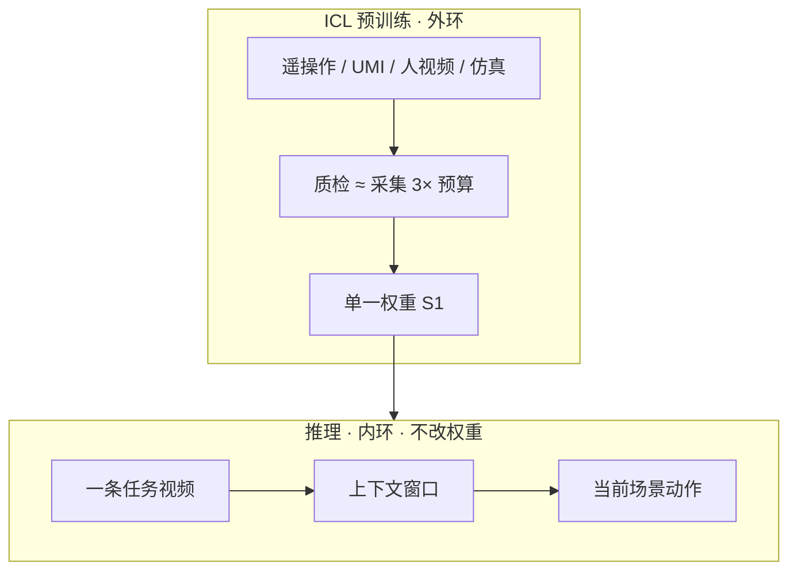

# S1：机器人 In-Context Learning（Skild）

| 字段 | 内容 |
|------|------|
| **机构** | 斯齐尔德（Skild AI） |
| **类型** | 产业官方博客（非 peer-reviewed 论文） |
| **模型** | S1（旗舰操作基础模型；前序 LocoFormer） |
| **发布** | 2026-08 |
| **开源** | **确认未开源**（无公开代码 / 权重 / 数据集；2026-09-04 再核 `github.com/skild-ai` 仍 0 公开仓） |

## 一句话定义

**S1** 把语言模型的 in-context learning 做成操作策略的 **预训练目标**：上下文里放一条（可跨场景、视角、本体的）**任务视频**，同一套权重在 **不微调** 的前提下执行当前场景——作者声称覆盖 **预训练未见、最长约 10 分钟** 的长程操作。

## 英文缩写速查

| 缩写 | 英文全称 | 简要说明 |
|------|----------|----------|
| S1 | Skild S1 | 本页模型；视频 prompt 的 ICL 操作基础模型 |
| ICL | In-Context Learning | 权重不变、从上下文示范归纳观测→动作映射 |
| VLA | Vision-Language-Action | 本篇对照的语言条件基线 |
| UMI | Universal Manipulation Interface | 数据三角中「中贴近 / 中多样 / 中扩展」的采集形态 |
| SFT | Supervised Fine-Tuning | 本篇「后训练」对照；单次 ICL ≈ 约 380 条后训练 episode |

## 为什么重要

- **评测轴补全：** 把 ICL 拆成 **已见 vs 未见** × **短程原子 vs 长程组合**；并点名 concurrent 工作多停在短程或 in-distribution（见 [GEN-1.5](./generalist-gen15-one-shot.md)）。
- **预训练目的论：** 主张后训练数据够密时从零训练可追上后训练基础模型，因此预训练应服务于 **立即从示范学习**，而不是为每个任务再 SFT。
- **部署成本叙事：** 盆栽示例从录示范到真机执行约 **11 分钟**；作者把它接到 [数据飞轮](../concepts/data-flywheel.md)——分钟级部署才能把现场交互喂回预训练。
- **闭源边界：** 训练配方本篇明确推迟；数字全部内部基准。当产业上界叙事，不当可复现方法。

## 流程总览

预训练 episodic 数据里 **任务只通过示范指定**。示范与部署可差场景、相机、本体，策略必须学意图、功能对应与进度。元学习读法：外环教「如何从上下文学习」，内环由示范驱动。

## 核心原理

### 1. 视频指定任务，而不是语言

作者引用社区常识（Jim Fan）：数据够多时许多原子行为可零样本，语言已够；一旦任务细腻或长程，人会 **示范而不是描述**。S1 把这条当成架构选择：原子 in-distribution 行为语言或可；**未见技能与长程组合** 必须看视频。

小数据已见任务上语言 VLA 甚至更好（1k 小时：53% vs ICL 43%）——高维视频条件更容易过拟合。规模上来后，语言的歧义变成负担，示范锁住执行模态。

### 2. 两条难度轴

| 轴 | 已见 / 短程 | 未见 / 长程 |
|----|-------------|-------------|
| 技能新颖度 | 预训练已覆盖的原语 | 摊饼翻转、压滤纸等测试时新行为 |
| 任务地平线 | 5–25 秒原子 | 最长约 10 分钟、数十步、需进度跟踪与恢复 |

作者认为 concurrent ICL 主要落在左列；S1 宣称进入右列。本库对照：[GEN-1.5](./generalist-gen15-one-shot.md) 公开数字是 **3–12 秒** physical prompt；[RoboTTT](./paper-robottt-test-time-training-vla-context.md) 是 **TTT 写 fast weights**，与「权重不变的 ICL」机制不同——S1 文将其并列为 concurrent ICL，引用时按机制分栏。

### 3. 数据三角，没有免费午餐

遥操作最贴近硬件、最难 scale；egocentric 视频相反；UMI 与仿真各占中间。S1 叙事是 **全开 + 重质检**（1 美元采集 / 3 美元质检），而不是赌单一来源。

### 4. Scaling：未见任务上 ICL 吃数据更狠

同一数据与算力、仅 prompt 编码器不同：

- **已见：** 小数据语言胜，大规模 ICL 反超。
- **未见 @ 100k h：** ICL **66%** vs 语言 **9%**（约 **7×**）。归因：新原语语言没有动作接地；新组合语言太粗，示范直接写出 chaining。
- **示范效率：** 单次上下文示范约等于语言 VLA **380** 条后训练 episode（插值）；2000 条后训练可到 **86%**，仍高于单次 ICL 的 66%。

### 5. 涌现：扰动、恢复、常识、纠正示范

定性例子（prompt 未展示这些扰动）：挪物、换物、改光仍完成；失败会重试；喷壶换成杯子；示范失手打蛋时策略按 **目标规格** 而非轨迹复刻。L1–L5 位移表上，语言 VLA 在需要新执行计划（换臂）时退化可达 ICL 的三倍。

## 工程实践

| 项 | 实践要点 |
|----|----------|
| **评测协议** | 分开已见/未见与短/长程；失败用人干预恢复以便逐步打分——复现时必须写明，否则成功率不可比 |
| **Prompt** | 一条 egocentric 人视频即可；跨场景对应是预训练该学会的事，而不是部署期标定 |
| **对照语言 VLA** | 小数据已见任务不要指望 ICL 赢；ICL 的预算应花在 **OOD + 组合** |
| **后训练仍有用** | 单次 ICL 是分钟级底座，不是 mastery 上限（2000 条 SFT 仍更高） |
| **开源状态** | **不适用源码运行时序图**——确认未开源；配方后续博文才写 |
| **可复现替代** | 开源 one-shot IL、[WAM-TTT](./paper-wam-ttt-human-video-test-time-steering.md)（人视频 TTT，非 ICL）、RoboTTT |

## 与其他工作对比

| 维度 | S1（本页） | GEN-1.5 | RoboTTT / WAM-TTT |
|------|-----------|---------|-------------------|
| 证据 | 公司博客 + 长程视频 | 公司博客 + 短程 10 任务 | 论文 / 项目页 |
| 上下文 | 任务视频示范 | 3–12 s sensorimotor prompt | 交互历史或人视频 |
| 是否改权重 | **否** | 主路径否；可选 1–10 步 | **是（fast weights）** |
| ICL 训练 | **显式**：任务只经示范指定 | 声称 **无** 显式 ICL 目标，靠规模涌现 | TTT / meta-training，不是 ICL |
| 公开地平线 | 最长约 **10 分钟** 未见 | **3–12 秒** 为主 | 上下文长度或视频 steering |
| 开源 | 确认未开源 | 确认未开源 | RoboTTT 部分公开；WAM-TTT 见实体页 |

学术侧可核对的短程单视频对照：[HOST](./paper-host-one-shot-human-video.md)（零梯度、进度流形、双臂 ARX；不覆盖本页 10 min 未见主张）。

## 局限与风险

- **闭源不可复现：** 66%/9%、100k 小时、380 episode 交叉点无法独立验证。
- **「首次 10 分钟未见 ICL」是作者立场**，不是第三方基准结论。
- **干预式逐步成功率** 会高估自治长程（人把失败态扶回轨道后再计后续步）。
- **训练配方未公开**；无法判断上下文编码、动作头、示范检索还是满上下文拼接。
- **安全：** 「纠正示范 / 即兴换工具」与 GEN-1.5 同类双刃剑，产线需任务级约束。

## 关联页面

- [Skild AI（公司入口）](./skild-ai.md)
- [机器人 In-Context Learning](../concepts/robot-in-context-learning.md) — 三类不确定性；S1 落在「映射本身」
- [GEN-1.5 一次示范学习](./generalist-gen15-one-shot.md) — 短程涌现 ICL 对照
- [Foundation Policy](../concepts/foundation-policy.md)
- [Embodied Scaling Laws](../concepts/embodied-scaling-laws.md)
- [Data Flywheel](../concepts/data-flywheel.md)
- [Manipulation](../tasks/manipulation.md)
- [Imitation Learning](../methods/imitation-learning.md)
- [RoboTTT](./paper-robottt-test-time-training-vla-context.md) — S1 文列为 concurrent，机制实为 TTT
- [LocoFormer（论文笔记占位）](./paper-notebook-locoformer-generalist-locomotion-via-long-contex.md) — 运动域前序
- [HOST](./paper-host-one-shot-human-video.md) — 开源单视频 one-shot；地平线短、数字可核对

## 参考来源

- [S1: In-Context Learning for Robotics（博客归档）](../../sources/blogs/skild_s1_in_context_learning.md)
- [Skild AI 公司站点归档](../../sources/sites/skild-ai.md)

## 推荐继续阅读

- 原文：<https://www.skild.ai/blogs/s1>
- [GEN-1.5: Embodied Foundation Models are One-Shot Learners](https://generalistai.com/blog/gen-1.5)
- Liu et al., *LocoFormer*（[arXiv:2509.23745](https://arxiv.org/abs/2509.23745)）
- Jiang et al., *RoboTTT*（S1 引 arXiv:2607.15275；本库另有 [项目页实体](./paper-robottt-test-time-training-vla-context.md)）
