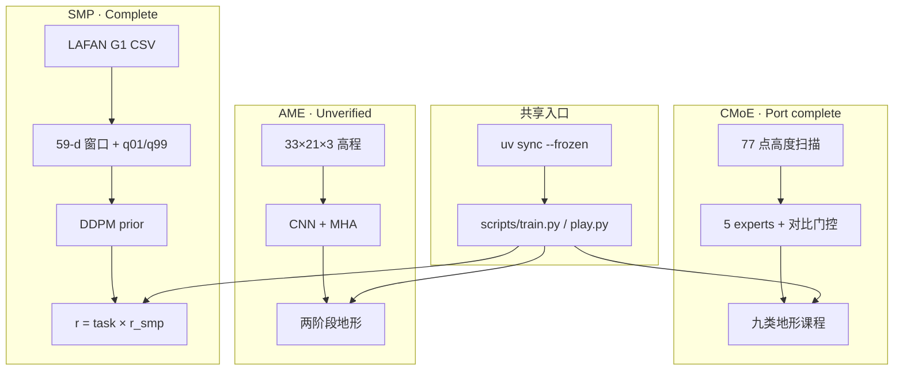
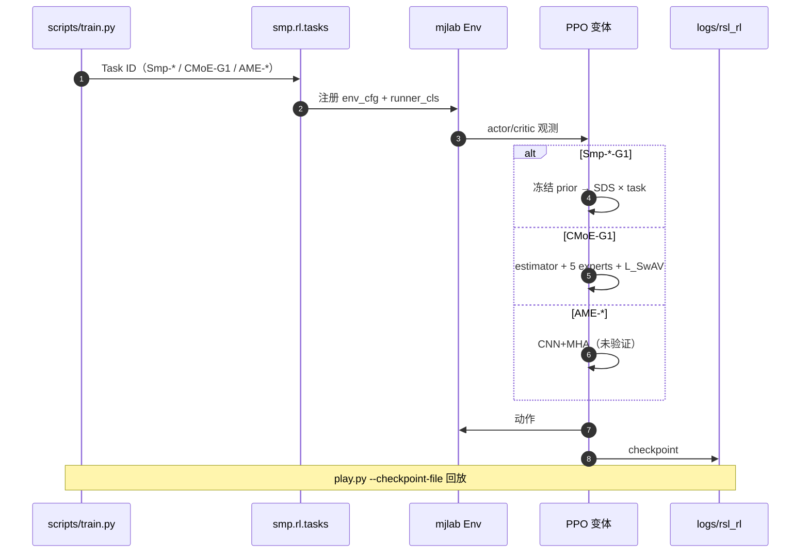

# senlanke/mimic：G1 上的 SMP / CMoE / AME 移植

**[senlanke/mimic](https://github.com/senlanke/mimic)**（SMP 同系 [SUZ-tsinghua/smp](https://github.com/SUZ-tsinghua/smp)）是一条 **mjlab + Unitree G1** 课程移植仓：用同一套 `uv` / `scripts/train.py` / `play.py` 挂上三条上游线——[SMP](../methods/smp.md)（完整）、[CMoE](./paper-cmoe.md)（移植完成）、[AME](./paper-ame-attention-based-map-encoding.md)（未完成）。不是任一论文的官方实现。

## 一句话定义

**同一 mjlab 入口上的三条 G1 运动控制移植：SMP 用冻结扩散乘性奖励；CMoE 用五专家对比门控走复杂地形；AME 的注意力高程编码还停在未验证迁移。**

## 英文缩写速查

| 缩写 | 英文全称 | 简要说明 |
|------|----------|----------|
| G1 | Unitree G1 Humanoid | 本仓统一目标本体 |
| SMP | Score-Matching Motion Prior | 冻结 DDPM + SDS 作可复用运动奖励 |
| CMoE | Contrastive Mixture of Experts | 五专家 + SwAV 式对比防门控塌缩 |
| AME | Attention-Based Map Encoding | CNN + MHA 编码 2.5D 高程图 |
| SDS | Score Distillation Sampling | 用 ε-预测误差当引导奖励 |
| GSI | Generative State Initialization | 用 prior 采样窗口作 reset 初态 |
| PPO | Proximal Policy Optimization | 三条线共用的 on-policy 优化器 |
| mjlab | MuJoCo Lab | Isaac Lab 风格 API + MuJoCo Warp |

## 为什么重要

- **一条仓对照三条先验/感知路线：** 生成式冻结先验（SMP）、对比 MoE 地形专精（CMoE）、注意力高程编码（AME）都落到 **同一 G1 + mjlab** 入口，便于和 [AMP_mjlab](./amp-mjlab.md) 做工程对照。
- **CMoE 补了官方 Isaac Gym 的引擎缺口：** 官方 [`Hoshi-No-Ai/CMoE`](https://github.com/Hoshi-No-Ai/CMoE) 钉 Preview 4；本仓 `CMoE-G1` 把五专家对比目标迁到 MuJoCo，无需 Isaac Gym。
- **开箱与边界同时写清：** SMP 内置三套 prior；CMoE 从零训；AME README 自己标 **unfinished**，避免被当成可引用基线。

## 核心信息

| 项 | 内容 |
|----|------|
| **角色** | 课程移植 / 工程 port，非官方 |
| **安装** | `uv sync --frozen`；Python 3.13；依赖锁在 `uv.lock` |
| **开源（截至 2026-08-29）** | 代码公开；根目录无 SPDX；CMoE 子集保留 BSD-3-Clause |
| **SMP** | 四任务 + 三套 prior；**Complete** |
| **CMoE** | 任务 `CMoE-G1`；**Port complete**，无预置权重 |
| **AME** | `AME-G1` / `AME-G1-Global` / `AME-G1-Finetune`；**Incomplete / unverified** |

## 流程总览

## 核心原理

### 三项目怎么选

| 目标 | 任务 ID | 该不该用本仓 |
|------|---------|--------------|
| 自然走/跑/转向/起身，不要对抗判别器 | `Smp-*-G1` | **首选**；有 prior，乘性奖励少调权重 |
| 复杂地形 MoE，且只有 mjlab | `CMoE-G1` | **可用**；要对齐论文数字仍看官方 Isaac Gym |
| 注意力高程 / 稀疏踏石 | `AME-G1*` | **不要当基线**；去 [AME 论文页](./paper-ame-attention-based-map-encoding.md) 与 [AME_Locomotion](https://github.com/SII-FUSC/AME_Locomotion) |

### SMP：乘性奖励与 GSI

相对 [MimicKit](./mimickit.md) 加性 `w_task·task + w_smp·r_smp`，本复现用 `r = (Σ wᵢ·taskᵢ) × r_smp`：任务与自然度必须同时高，单边刷分≈0。`r_smp` 在固定 timestep 集合 `K` 上算 ε-MSE 再 `exp`。GSI 在 reset 时用 prior 预采样窗口填 `MotionFeatureBuffer`，特征相对 env origin，避免世界网格位置污染奖励。

| 任务 ID | 行为 | 默认 prior |
|---------|------|------------|
| `Smp-Forward-G1` | +x 速度 0.5–5 m/s（后退奖励为 0） | `pretrained_loco.pt` |
| `Smp-Steering-G1` | 速度 + 朝向，0.5–2 m/s | `pretrained_lafan_run.pt` |
| `Smp-Location-G1` | 世界系 xy 目标 | `pretrained_lafan_run.pt` |
| `Smp-Getup-G1` | 跌倒→站立 | `pretrained_getup_f2s2.pt` |

### CMoE-G1：与官方栈对齐什么、改了什么

移植保留官方 12-DoF 下肢、10 帧本体历史、5 专家、32 prototype / 温度 0.2、状态+地形 estimator。观测改成 **77 点高度扫描**（官方仿真是 0.7×1.1 m 高程图）。CMoE **从零训**，不吃 SMP checkpoint。`play` 默认同训练地形；把 `play_env_cfg` 换成 `g1_cmoe_course_env_cfg(difficulty=0.5)` 可沿 x 轴串九类地形。

官方 Isaac Gym 栈、真机 80 cm 沟 / 20 cm 台阶数字见 [paper-cmoe](./paper-cmoe.md)；本仓未复现那些真机数字。

### AME：迁移契约，不是结果

已搬 CNN/MHA、33×21×3 高程、两阶段地形与原 `model_state_dict` 布局；MuJoCo 碰撞高程 10 cm 步长、策略射线仍 5 cm；Isaac 的 restitution / `velocity_limit_sim` 无直接对应，未另造近似。`MIGRATION.md` 写明**未跑训练、仿真或 import 验证**。

## 源码运行时序图

## 工程实践

| 项 | 做法 |
|----|------|
| 安装 | `uv sync --frozen`；先 `uv run scripts/train.py Smp-Forward-G1 --help` 与 `CMoE-G1 --help` 确认注册 |
| SMP 开训 | `uv run scripts/train.py Smp-Forward-G1 --env.scene.num-envs=4096` |
| CMoE 开训 | `uv run scripts/train.py CMoE-G1 --env.scene.num-envs=4096`（无预置权重，预算按 `max_iterations=50000`） |
| 回放 | `uv run scripts/play.py <Task> --checkpoint-file logs/rsl_rl/<run>/model_*.pt --num-envs 4` |
| 自训 prior | `csv_to_npz.py`（30→50 FPS、非递归搜 CSV）→ `pretrain.py`；默认复用仓内 `datasets/norm_stats.npz` |
| AME | 只当迁移代码读；要可跑 G1 AME 先看 [AME_Locomotion](https://github.com/SII-FUSC/AME_Locomotion) |
| 对照官方 CMoE | 论文数字 / 真机部署走 [Hoshi-No-Ai/CMoE](https://github.com/Hoshi-No-Ai/CMoE) + `elevation_mapping_humanoid` + `rl_sar` |

## 局限与风险

- **不是官方仓：** 引用论文结果时指向 MimicKit / Hoshi-No-Ai/CMoE / AME 原文，不要把本仓成功率写成论文数字。
- **AME 未验证：** 任务已注册但 README 与 `MIGRATION.md` 均禁止当 baseline。
- **CMoE 权重自训：** 移植完成 ≠ 已对齐官方 Table III；Isaac Gym ↔ MuJoCo 接触与高程分辨率不同。
- **`Fudan-MAGIC-Lab/CMoE` 是空仓：** 克隆官方代码用 `Hoshi-No-Ai/CMoE`。
- **许可拼盘：** 根目录无统一 SPDX；CMoE 子集 BSD-3-Clause；LAFAN 与各上游另计。

## 关联页面

- [SMP 方法页](../methods/smp.md)、[paper-smp](./paper-smp.md)
- [CMoE 论文（官方 Isaac Gym）](./paper-cmoe.md)
- [AME 论文](./paper-ame-attention-based-map-encoding.md)
- [mjlab](./mjlab.md)、[MimicKit](./mimickit.md)、[AMP_mjlab](./amp-mjlab.md)
- [楼梯/障碍感知 locomotion](../tasks/stair-obstacle-perceptive-locomotion.md)
- [Unitree G1](./unitree-g1.md)、[LaFAN1](./lafan1-dataset.md)

## 参考来源

- [sources/repos/senlanke_mimic.md](../../sources/repos/senlanke_mimic.md)
- [sources/repos/smp_suz_tsinghua.md](../../sources/repos/smp_suz_tsinghua.md)
- [sources/repos/cmoe.md](../../sources/repos/cmoe.md)
- [sources/papers/smp.md](../../sources/papers/smp.md)
- [sources/papers/cmoe_contrastive_mixture_of_experts_icra_2026.md](../../sources/papers/cmoe_contrastive_mixture_of_experts_icra_2026.md)
- [senlanke/mimic README](https://github.com/senlanke/mimic)

## 推荐继续阅读

- [MimicKit README_SMP](https://github.com/xbpeng/MimicKit/blob/main/docs/README_SMP.md)
- [Hoshi-No-Ai/CMoE](https://github.com/Hoshi-No-Ai/CMoE) — 官方 Isaac Gym 训练栈
- [SII-FUSC/AME_Locomotion](https://github.com/SII-FUSC/AME_Locomotion) — 可运行的 G1 AME（Isaac Lab）
- [SMP 项目页](https://yxmu.foo/smp-page/)
