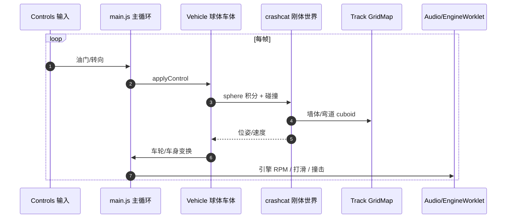

# starter-kit-racing

**starter-kit-racing** 是 **mrdoob** 将 Kenney「Starter Kit Racing」从 **Godot 4.6** 移植到 **纯 JavaScript + Three.js** 的浏览器街机竞速 demo：模块化 GridMap 铺砖赛道、`crashcat` 墙体/球体碰撞、程序化引擎与撞击音效，并附带 **`editor.html` 赛道编辑器**。

## 一句话定义

> 若目标是「**最小可读的三.js 赛车样板 + 可编辑模块化赛道**」，而非纽北高保真或 RL Gym，starter-kit-racing 提供 **零 npm 构建**、CDN 直引 three + crashcat 的 MIT 开源起点。

## 英文缩写速查

| 缩写 | 英文全称 | 简要说明 |
|------|----------|----------|
| JS | JavaScript | 移植目标语言；无 TypeScript 构建链 |
| Three.js | — | WebGL 3D 渲染；本仓通过 importmap CDN 0.185.1 |
| crashcat | — | 轻量刚体物理库；墙体 cuboid + 车体 sphere |
| GridMap | — | Godot 网格铺砖概念；`Track.js` 按 cell 摆放赛道块 |
| CC0 | Creative Commons Zero | Kenney 游戏资产许可 |
| CDN | Content Delivery Network | 浏览器运行时拉取 three / crashcat |

## 为什么重要

1. **Godot → Web 移植范例**：碰撞形状从 Godot `mesh-library.tscn` 近似为 crashcat cuboid，文档见仓内 `CLAUDE.md`。
2. **街机物理栈**：sphere 车体 + 线性/角速度阻尼，与 [drive-game](./drive-game.md) 的 Pacejka 240 Hz 路线形成对照。
3. **赛道 UGC**：`editor.html` 导出 map 参数 → `index.html?map=...`，适合快速原型与教学 demo。

## 核心结构/机制

- **在线：** [mrdoob.github.io/Starter-Kit-Racing](https://mrdoob.github.io/Starter-Kit-Racing/)
- **本地：** 仓根目录 `python3 -m http.server` → `index.html`
- **物理：** `Physics.js` 铺墙/弯道 collider；`Vehicle.js` crashcat sphere + 速度/转向控制
- **开源状态（2026-09-01）：** GitHub + Pages **MIT 已开源**，资产 Kenney CC0

## 源码运行时序图

## 常见误区或局限

- **误区：这是科研 RL 环境** — 面向 **街机可玩 demo**；训练策略见 [f1tenth-gym](./f1tenth-gym.md) 或 [xcar-rlgpu](./xcar-rlgpu.md)。
- **误区：与 drive-game 同类** — 本仓是 **模块化 tile 赛道 + arcade 物理**；drive-game 是 **OSM 纽北 + Pacejka**。
- **局限：** 无 npm 包、无 Gym API；运行时依赖 CDN（three / crashcat），离线需改 importmap。

## 关联页面

- [drive-game](./drive-game.md) — 纽北高保真 Three.js 模拟器
- [nordschleife-racer](./nordschleife-racer.md) — TS 纽北漂移引擎
- [赛车漂移 RL 开源景观](../overview/racing-drift-rl-open-source-landscape.md)

## 参考来源

- [sources/repos/starter_kit_racing.md](../../sources/repos/starter_kit_racing.md)
- [sources/sites/starter_kit_racing_pages_dev.md](../../sources/sites/starter_kit_racing_pages_dev.md)

## 推荐继续阅读

- [Kenney Starter Kit Racing（Godot 原版）](https://github.com/KenneyNL/Starter-Kit-Racing)
- [crashcat 物理库](https://github.com/isaac-mason/crashcat)
- [mrdoob 移植 devlog（X）](https://x.com/mrdoob/status/2048358619985690935)
