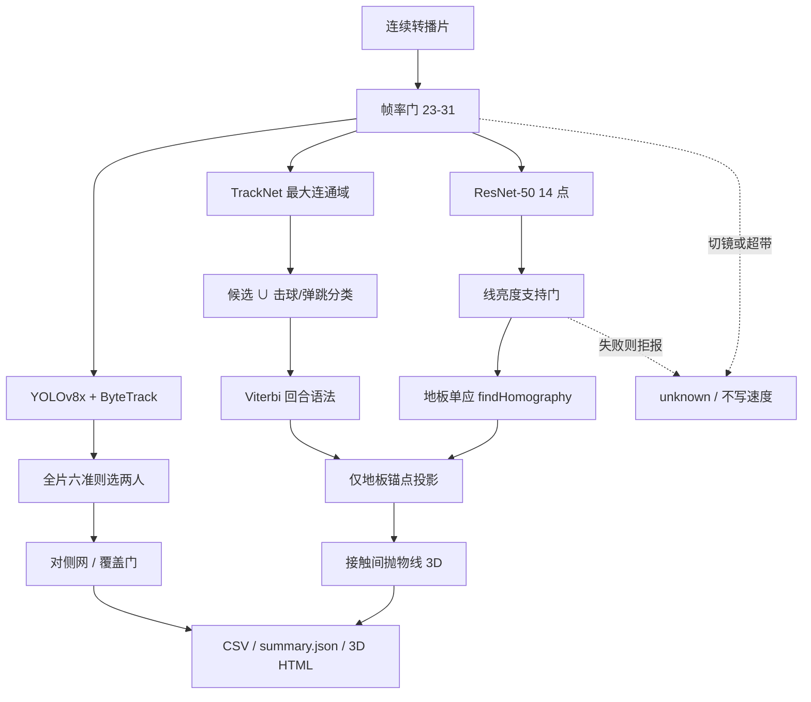
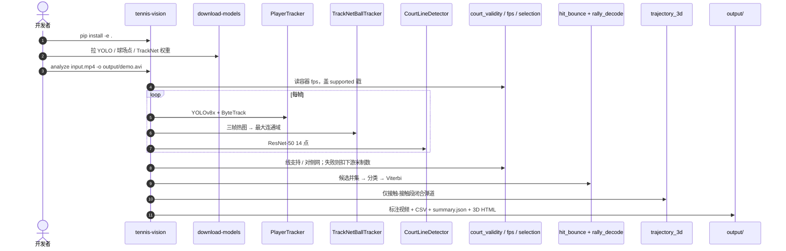

# Tennis-Vision

**Tennis-Vision**（[HarshTomar1234/Tennis-Vision](https://github.com/HarshTomar1234/Tennis-Vision)）是一套 **单路广播/高位固定相机** 的网球比赛分析管线：检球、球场几何、选球员、击球/弹跳、发球速度与 **闭合弹道三维重建**。它和 [Roboflow Sports](./roboflow-sports.md) 同属第三人称体育 CV，但把工程重点放在 **证据门**：拟合失败、切镜、看不到落地时，输出写 `unknown` / 拒报，而不是给出看起来合理的假数。

## 一句话定义

**从一条连续转播镜头估计网球事件与米制轨迹的离线管线：检测器出候选，图像证据与回合语法做门控，地板单应只在地面锚点上用，空中段用重力抛物线而不是把球当贴地投影。**

## 英文缩写速查

| 缩写 | 英文全称 | 简要说明 |
|------|----------|----------|
| TrackNet | TrackNet | 三帧堆叠热图的小球检测器 |
| YOLO | You Only Look Once | 球员检测；本仓用 Ultralytics YOLOv8x |
| MOT | Multi-Object Tracking | ByteTrack 跨帧人 ID |
| Homography | Homography | 图像平面 ↔ 球场地板的 3×3 透视 |
| RTS | Rauch–Tung–Striebel | 前向–后向 Kalman 平滑；本仓测过默认关 |
| Viterbi | Viterbi decoding | 用回合语法重标整条事件序列 |
| MHR | Momentum Human Rig | 可选 [SAM 3D Body](./sam-3d-body.md) 网格骨架 |
| MIT | Massachusetts Institute of Technology License | 本仓分析代码默认许可 |

## 为什么重要

- **平面单应的教学反例：** 把腾空球直接 `findHomography` 到迷你场，射线与地面的交点可飞出球场数米。本仓把球位置只钉在 **弹跳/击球** 等地板有效锚点，中间用插值或三维重建——对齐 [感知坐标后处理](../concepts/perception-coordinate-postprocessing.md) 的「平面假设在球离地时失效」。
- **有效性 ≠ 自洽：** 14 点重投影误差在正确拟合与「拟合到看台」之间几乎分不开（约 1.4–2.1 px，14/14 RANSAC inlier）。真正能拒的是 **预测线是否落在比两侧更亮的漆线**。机载场线定位若只用重投影门控，会踩同一坑。
- **指标要对齐产品：** 出点率 88.6% 与「可见球落入 5 px」42.5% 同时成立；held-out 分类 89.3% 的特征集端到端 F1 反而最差。换检测器或滤波前先分清测的是哪一层。
- **对照足球广播栈：** [roboflow/sports](./roboflow-sports.md) 做到关键点单应 + 俯视雷达；本仓多了事件语法、发球雷达校验、拒报架构与公开负结果（RTS、χ² 门、更大 YOLO 都测过并丢掉）。

## 核心信息

| 项 | 内容 |
|----|------|
| **作者** | Harsh Tomar（个人仓；无独立项目页） |
| **代码** | <https://github.com/HarshTomar1234/Tennis-Vision>（67★ / 5 fork，2026-09-05） |
| **开源** | **已开源**（MIT；`pip install -e .` + CLI） |
| **权重** | `tennis-vision download-models` ≈140 MB；TrackNet 不随仓再分发；球场微调在 HF `Coddieharsh/tennis-court-keypoints` |
| **许可叠层** | 本仓 MIT；YOLOv8 权重链受 Ultralytics **AGPL-3.0** 约束；可选 SAM 3D Body 为 Meta SAM License |
| **实时性** | **不宣称实时**；1050 Ti 上 19 s 片约 18.5× 慢，时间几乎全在 YOLOv8x 与 TrackNet+逐帧球场点 |

## 核心原理

### 方法栈

| 层 | 组件 | 作用 |
|----|------|------|
| 人 | YOLOv8x + ByteTrack | 每帧 11–14 人；难的是选哪两个是球员 |
| 球 | TrackNet v2，最大连通域质心 | 三帧 9 通道热图；不用全响应均值（双峰会落到两团中间） |
| 球场 | ResNet-50 回归 14 点 | 逐帧重检，跟 pan/tilt；几何增广微调后中位 2.90 px |
| 门 | 线亮度支持 / 对侧网 / 帧率带 | 拟合到看台、同半场两人、23–31 fps 外的事件阈值分别拦住 |
| 事件 | y 反向 ∪ x 速度 ∪ 弹跳生成器 | 并集补盲区；固定帧窗合并仍吃掉约 16.5% 接触 |
| 语法 | `rally_decode` Viterbi | 禁止连击、连弹；可标 NOISE 丢掉，而不是硬改成另一类 |
| 三维 | 两已知接触之间的重力抛物线 | 端点高度已知，**无自由参数**；高度是建模不是图像测深 |

### 流程总览

广播窗若含回放/切镜，场地门按中位帧判整段：held-out 14 个 15 s 窗口 **14/14 拒报、0 次编造数字**。剪到连续回合后，5/5 场地与球员门通过。

### 源码运行时序图

- **复现入口：** 仓库 README Quickstart；数字复现走 `eval/` 同名脚本。`--max-frames 60` 做冒烟。
- **权重不在 git：** TrackNet 必须走原作者许可；打开 SAM 3D 还需 `HF_TOKEN` 与独立 clone，缺权时回退 MediaPipe 并写明，禁止静默换后端（两后端 balanced 85.5% vs 66.4%）。

### 与机载 / 足球广播栈对照

| 维度 | Tennis-Vision | [Roboflow Sports](./roboflow-sports.md) | 本库机载主线 |
|------|---------------|------------------------------------------|--------------|
| 相机 | 转播或高位固定，**一段连续镜头** | 侧方/高位广播 | 机载、剧烈晃动 |
| 几何 | 14 点 + 线亮度门 + 地板单应 | 球场关键点 + 全局单应 | 线/交点 + 局部匹配 / EKF |
| 球 | TrackNet 热图；空中不投地板 | YOLO 小目标 + 缓冲质心 | 寻球 + 跟踪，常需深度 |
| 输出 | 事件、发球速度、3D 弹道、迷你场 | 俯视雷达与分队可视化 | \((x,y,\theta)\) 供决策 |
| 拒报 | 切镜/场地/球员/落地门 | 关键点不足时勿硬解 | 马氏门控拒野值观测 |

共享骨架仍是「**先稳定场地特征，再谈米制**」。机载侧还要处理对称场、可观测性与滤波，见 [场线定位流水线](../queries/soccer-visual-field-localization-pipeline.md)。

## 工程实践

| 项 | 建议 |
|----|------|
| 最短路径 | `pip install -e .` → `tennis-vision download-models` → `analyze`；先 `--max-frames 60` |
| 输入约束 | **一条连续回合**；含切镜/回放/观众特写整段拒绝。全场比赛无分段且约 18× 实时，不支持 |
| 帧率 | 证据带 **23–31 fps**。事件阈值按 **帧**、分类特征按 **px/帧**，未归一到秒。60 fps 会把接触几乎全判成弹跳 |
| 缓存 | 默认关。`configs/dev.yaml` 才开 stub；换片仍加载旧检测会「自信地错」 |
| 选球员 | 不要用第 0 帧：真球员可能那时不在画面。全片聚合 + 对侧网 sanity |
| 速度误差主因 | 事件定时 ±2.4 帧 → 平均约 12.5% 相对误差，短于 0.5 s 的飞行更差；拖曳/自旋是次项 |
| 调试 | `summary.json` 写门状态；`eval/rally_coherence.py`、`player_selection_sanity.py` 无需真值 |

## 局限与风险

- **不是机器人闭环感知：** 离线、第三人称、不输出机载位姿；不要当 RoboCup 定位栈。
- **召回缺口：** 真实检测接触召回约 72%；漏检无法靠语法补出来。漏斗显示 0% 因「附近没球」，损失在候选生成与合并。
- **正反手不可靠：** 姿态几何在 THETIS 上约 54%；[MediaPipe](./mediapipe.md) 在反手常丢掉持拍手（腕缺失 44–58%）。换 [SAM 3D Body](./sam-3d-body.md) 覆盖到 100% 但 balanced 掉到 66.4%——模型一直给答案，会毁掉「拒绝」本来滤掉的噪声。
- **Kalman 负结果：** RTS 平滑让重尾 TrackNet 误差渗到好帧；跨击球平滑会抹掉速度跳变。χ² 门在恒速预测太差时发散（中位误差 6.3→29.4 px）。工具留在树里，默认关。见 [Kalman Filter](../formalizations/kalman-filter.md)。
- **未验证 / 超范围：** 回合球速无雷达真值；地面机位、双打、业余片未测；Volley/Smash 是验证过滤器（81 拍里实证 1、降级 20），不是分类器。
- **许可：** 分析代码 MIT ≠ 整条权重链可闭源商用。

## 关联页面

- [Query：机器人视觉感知栈选型闭环](../queries/robot-perception-stack-selection-loop.md) — 本页属**第②层 2D 检测/跟踪**的体育广播工程案例
- [Roboflow Sports](./roboflow-sports.md) — 足球广播关键点→单应→俯视雷达；本页是网球侧更深的门控对照
- [足球场线与球门检测](../methods/soccer-field-line-detection.md) — 关键点 / 线几何方法页
- [足球视觉场线定位流水线](../queries/soccer-visual-field-localization-pipeline.md) — 机载检测→匹配→EKF
- [感知后处理与坐标变换](../concepts/perception-coordinate-postprocessing.md) — 像素→米制与平面假设
- [目标检测](../methods/object-detection.md) / [Ultralytics YOLO](./ultralytics.md) — 球员检测工程入口
- [Kalman Filter](../formalizations/kalman-filter.md) — RTS / 野值门在重尾测量上的反例
- [MediaPipe](./mediapipe.md) / [SAM 3D Body](./sam-3d-body.md) — 正反手姿态两后端
- [Humanoid Soccer](../tasks/humanoid-soccer.md) — 上层任务；广播分析 ≠ 机载决策

## 参考来源

- [tennis-vision.md](../../sources/repos/tennis-vision.md) — GitHub 仓库归档（2026-09-05 核查）
- [HarshTomar1234/Tennis-Vision](https://github.com/HarshTomar1234/Tennis-Vision) — 官方代码与 README 数字
- [TECHNICAL_OVERVIEW.md](https://github.com/HarshTomar1234/Tennis-Vision/blob/main/docs/public/TECHNICAL_OVERVIEW.md) — 十九级假设与失败模式

## 推荐继续阅读

- [yastrebksv/TrackNet](https://github.com/yastrebksv/TrackNet) — 球检测权重与标注集
- [Coddieharsh/tennis-court-keypoints](https://huggingface.co/Coddieharsh/tennis-court-keypoints) — 球场 14 点微调卡
- [roboflow/sports soccer 示例](https://github.com/roboflow/sports/tree/main/examples/soccer) — 足球广播对照实现
