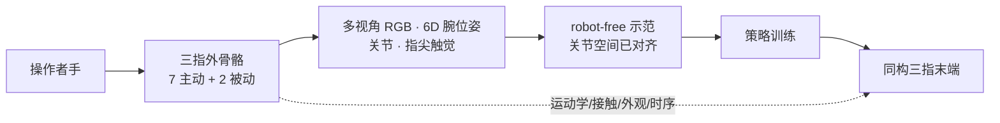

# TwinDEX（无本体灵巧操作共设计接口）

**TwinDEX**（[项目页](https://x2robot.com/en/pages/twindex)，2026-09-02）由 **自变量机器人（X Square Robot）** 发布：一对 **共设计** 的三指九自由度接口——可穿戴外骨骼采数、同构机器人末端部署——加上同步传感与策略训练流程，走 **robot-free 数据 → 真机灵巧策略**，而不经过复杂人手→机器人重定向。

| 字段 | 内容 |
|------|------|
| **机构** | 自变量机器人（X Square Robot） |
| **类型** | 可穿戴外骨骼 + 同构三指末端（采数 / 部署成对） |
| **形态** | 三指、**9 DoF**（**7 主动 + 2 被动**） |
| **主张** | 纯 robot-free 训练；data-efficiency ≈ 真机遥操作；吞吐 **5.3×** |
| **开源（截至 2026-09-02）** | **确认未开源**；BibTeX *Coming soon* |

## 一句话定义

**用运动学/接触/外观/时间对齐的「双胞胎」外骨骼与机械手，把无本体示教直接写成目标关节空间，宣称不必真机遥操作数据也能训出可部署的灵巧策略。**

## 英文缩写速查

| 缩写 | 英文全称 | 简要说明 |
|------|----------|----------|
| TwinDEX | Twinned Dexterous (interface) | 本页成对采数/部署系统；非 DeFi 项目 Twindex |
| DoF | Degrees of Freedom | 本系统 9 自由度，其中 7 主动 |
| UMI | Universal Manipulation Interface | 无机器人夹爪示教范式；TwinDEX 把思想推到三指灵巧并锁同构 |
| CMC / MCP / PIP / IP | Carpometacarpal / Metacarpophalangeal / Proximal Interphalangeal / Interphalangeal | 拇指与指关节命名；决定 7 主动如何分配 |
| IL | Imitation Learning | 示范 → 策略；本页主张 robot-free 与 on-robot 数据等效密度 |
| URDF | Unified Robot Description Format | 头相机平面重投影双手模型，作运动学/同步标定视图 |

## 为什么重要

- **把 embodiment gap 写成硬件约束，而不是后处理：** 无本体采数易扩展，但运动学、指尖几何、外观或时序一旦错位，接触关系在部署端会丢。[UMI](https://umi-gripper.github.io/) / [HandUMI](./handumi.md) 用夹爪几何 + 软件重定向换跨臂复用；TwinDEX 反其道，**锁死同一套运动链**，换「关节状态直接进机器人关节空间」。
- **三指不是偷懒，是可量产的灵巧下限：** 项目页把三指定为「true dexterity 的最小可行解」——再加指会撞空间堆叠、力矩密度与可靠性。对 6/7/8 主动做同一套 primitive 基准后，**7 主动相对 6 有跃迁，相对 8 边际主要在穿戴舒适**，因此量产锁定 7+2。
- **数字可读、但不可复现：** **5.3×** 有效采数吞吐、data-efficiency 曲线重叠、化学实验「数百条、零真机数据」。这些是选型对照坐标，不是可跑基线——**代码、数据、技术报告均未发布**。
- **同机构不要串台：** 2026-04 的 [XRZero-G0](https://github.com/X-Square-Robot/XRZero-G0)（arXiv:2604.13001）是 **VR + 专用夹爪** 无本体采数，且混合律仍用少量真机数据；TwinDEX 页 **未链** 该仓。五指 [sdk_hand](https://github.com/X-Square-Robot/sdk_hand) 是另一产品线。

## 核心原理

### 成对硬件

外骨骼与机械手对齐五件事：**运动学同构**（DoF 数、关节轴、连杆比例；外骨骼转轴与人手共轴且给软组织让位）、**接触力学**（同材料/几何/表面 + 同位置触觉）、**外观**（接触壳体一致，驱动与连杆蒙布）、**精度**（关节、腕定位、相对/绝对、jitter、drift——权重不等，细节在未公开技术报告）、**模态间同步**（视觉 / 触觉 / 关节 / 腕）。头相机上把双手 URDF 按腕位姿与关节重投影，重叠度当校准与同步体检。

### 7 主动怎么分

| 指 | 主动 | 被动 / 结构 |
|----|------|-------------|
| **拇指** | CMC 屈伸 + 外展内收、MCP 屈伸（3） | IP 经四连杆随 MCP；CMC 双主动对拧螺丝等 primitive 关键 |
| **食指** | MCP 屈伸 + 外展内收、PIP（3） | DIP 独立、略内弯，降低手寸对齐苛刻度；主触觉/施力指 |
| **中指** | MCP（1） | PIP 四连杆随动；壳体加宽同时容纳中/无名/小指，换视觉同构 |

食指与中指 DIP 做成非独立关节，是穿戴适配，不是「少做灵巧」。

### 数据主张（项目页）

- 多任务 data-efficiency：robot-free 与 on-robot **同斜率、曲线重叠**（宣称统计显著范围内）→ 「价值密度相同」。
- **本工作全部实验只用 robot-free**，无干预、无真机遥操作数据。外骨骼 **结构上** 可当高精度真机遥操作器，留给更难/要泛化时补数据，**不是** 当前数字的前提。
- 采数单元 = 一人 + 一桌 + 一套外骨骼；办公室/厨房/工位可并行。可穿戴保留本体感觉，接触丰富任务不必透过延迟和间接力反馈遥操。

## 工程实践

| 维度 | 可读法 |
|------|--------|
| 选型 | 要 **与特定三指手 1:1、省略软件 retarget** → 读 TwinDEX / [DEUX Glove X](./xyz-deux.md) / [mimic U1](./mimic-wearable-u1.md)；要 **跨臂开源数据集** → [HandUMI](./handumi.md) |
| 标定 | 页内展示 URDF→头相机重投影；无公开误差曲线或 SDK |
| 吞吐 | 相对真机遥操作 **5.3×**（任务含拧盖、注射器、抽翻本、开工具箱、扫地）；当厂商主张读，勿当自己工位的保证倍数 |
| 长程演示 | 标准化化学实验单段未剪辑；Overview 写 **25** 子动作，Conclusion 与新闻稿写 **24** |
| 源码运行时序图 | **不适用**（截至 2026-09-02 无可运行官方训练/推理仓库） |

## 局限与风险

- **确认未开源（2026-09-02）：** 项目页无 GitHub / HF / 数据集；BibTeX *Coming soon*；精度与同步消融只指向未上线 technical report。详见 [sources/sites/x2robot-twindex.md](../../sources/sites/x2robot-twindex.md)。
- **数字不可独立审计：** 5.3×、1:1 data-efficiency、化学实验成功率均无公开表或误差条原始数据（页上图表有 *supplied uncertainty* 文案，未给下载）。
- **页内数字不一致：** 化学实验子动作 24 vs 25——引用时写「约 24–25」，不要只抄一边。
- **任务边界（官方自述）：** 单桌面、物体类别有限；长时穿戴人体工学未系统研究；多指精密装配可能超出 7 主动。
- **embodiment 锁定：** 数据飞轮绑在该三指几何上；与 HandUMI「一次采集、多臂重定向」正交。
- **「零真机数据」是闭环部署目标，不是普遍定律：** 页文承认现有跨具身方法通常仍要真机对齐/微调；TwinDEX 用共设计把标准提高到「零真机」，复现前先问：你的手是否真能做到五维对齐。

## 关联页面

- [Teleoperation](../tasks/teleoperation.md) — 无本体 / 外骨骼采数在遥操作谱系中的位置
- [灵巧操作数据采集指南](../queries/dexterous-data-collection-guide.md) — 视觉 teleop / 手套 / 固定运动学外骨骼怎么选
- [数据手套 vs 视觉遥操作](../comparisons/data-gloves-vs-vision-teleop.md) — 1:1 绑定商业采数对照
- [mimic wearable U1](./mimic-wearable-u1.md) — 另一条「与目标手 1:1、无软件 retarget」产业样本（四指灵巧、被动外骨骼）
- [DEUX / Glove X](./xyz-deux.md) — 三指手 + 手套接触点 1:1（闭源门店一体机）
- [HandUMI](./handumi.md) — 开源、跨臂可重定向的无机器人示教对照
- [Motion Retargeting](../concepts/motion-retargeting.md) — TwinDEX 用共设计 **省略** 的那一层
- [Imitation Learning](../methods/imitation-learning.md) — robot-free 示范的消费端
- [Humanoid Hardware 101 · 传感与末端](../overview/humanoid-hardware-101-sensing-end-effectors.md) — 三指单位经济性
- [WALL-SS](./paper-wall-ss.md) — 同机构世界模型；训练代码同样待发布，任务不同

## 参考来源

- [TwinDEX 项目页归档](../../sources/sites/x2robot-twindex.md) — 开源核查、形态/Correspondence 摘录、与 XRZero-G0 边界

## 推荐继续阅读

- 项目页（英文）— <https://x2robot.com/en/pages/twindex>
- 项目页（中文）— <https://x2robot.com/pages/twindex>
- 新闻稿 — <https://www.prnewswire.com/news-releases/twindex-introduces-a-scalable-path-from-robot-free-data-collection-to-real-world-dexterous-manipulation-302867559.html>
- 同机构更早的无本体夹爪路线 XRZero-G0（**不是** TwinDEX 代码）— <https://arxiv.org/abs/2604.13001>
