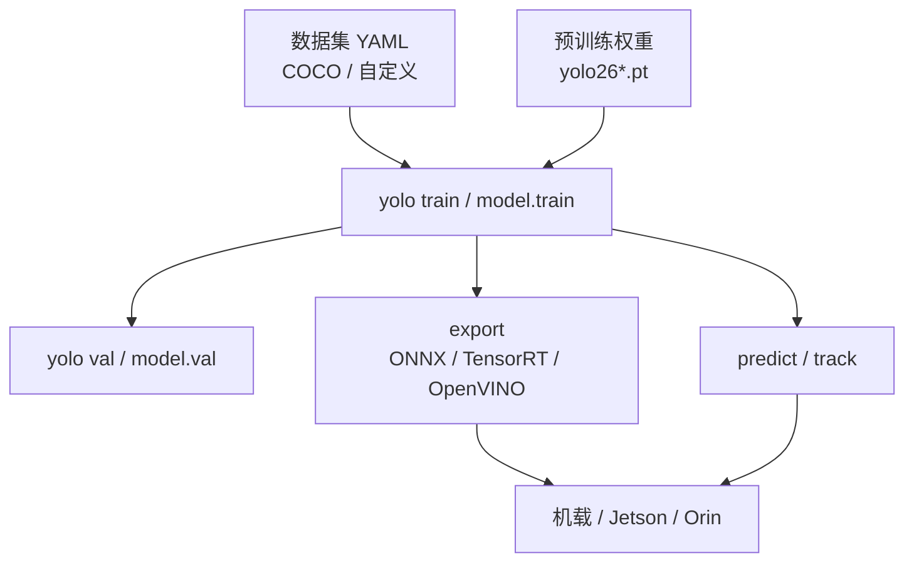
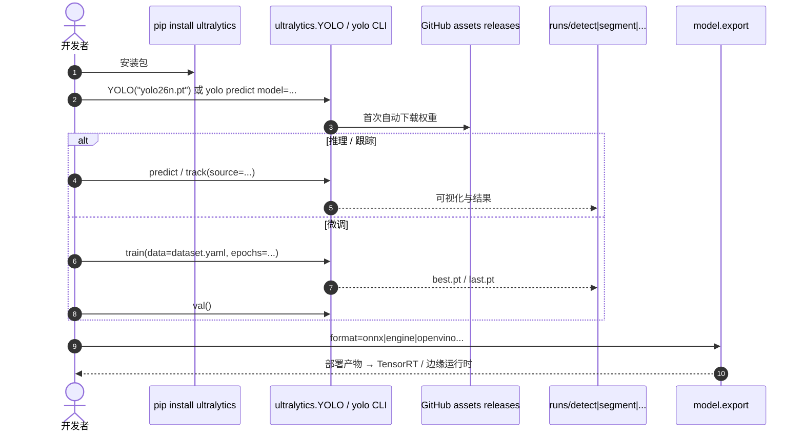

# Ultralytics YOLO

**Ultralytics**（[ultralytics/ultralytics](https://github.com/ultralytics/ultralytics)，文档 [docs.ultralytics.com](https://docs.ultralytics.com/)）是 **YOLO 系列** 的主流工程实现与模型发布仓：一个 `ultralytics` Python 包 + `yolo` CLI，覆盖检测、实例/语义分割、分类、姿态、旋转框（OBB）、深度估计与多目标跟踪，并支持 ONNX / TensorRT / OpenVINO 等导出。当前文档主推 **YOLO26**（并仍推荐稳定生产用 **YOLO11**）。

## 一句话定义

**把 YOLO 家族做成统一任务/模式 API 的实时视觉工具链：预训练权重一键下载，训练–验证–预测–导出–跟踪同一套命令，是机器人机载检测的默认工程入口之一。**

## 英文缩写速查

| 缩写 | 英文全称 | 简要说明 |
|------|----------|----------|
| YOLO | You Only Look Once | 单次前向实时检测范式；本仓为其工程谱系 |
| CLI | Command-Line Interface | `yolo` 命令行入口 |
| mAP | mean Average Precision | COCO 等检测精度指标 |
| NMS | Non-Maximum Suppression | 经典 YOLO 后处理；YOLO26 文档宣称端到端 NMS-free |
| OBB | Oriented Bounding Box | 旋转框检测（如航拍 DOTA） |
| ONNX | Open Neural Network Exchange | 常见导出格式，便于 TensorRT 等 |
| AGPL | Affero General Public License | 本仓默认开源许可（v3.0） |
| FPS | Frames Per Second | 实时性指标 |

## 为什么重要

- **机器人落地默认栈：** [Booster RoboCup Demo](./booster-robocup-demo.md)、[人形足球寻球](../tasks/humanoid-soccer.md) 等直接消费 YOLO 系权重；教程与社区远大于多数学术仓。
- **一条命令闭环：** 标注 YAML → `train` → `val` → `export` → Jetson/Orin TensorRT，缩短「论文到真机」路径。
- **多任务统一：** 同一 API 切 detect/segment/pose/track，减少多仓库拼装；检测框也可作下游分割提示。
- **许可必须先读：** **AGPL-3.0** 对闭源产品传染性强；商用应评估 [Enterprise](https://www.ultralytics.com/license) 或改用更宽松许可的替代（如部分 Apache 模型）。

## 核心信息

| 项 | 内容 |
|----|------|
| **机构** | 超光速视觉（Ultralytics） |
| **代码** | <https://github.com/ultralytics/ultralytics>（~60k★，入库日） |
| **文档** | <https://docs.ultralytics.com/> |
| **安装** | `pip install ultralytics`（PyPI；入库快照约 8.4.x） |
| **开源** | **已开源**（训练/推理/导出齐全）；默认 **AGPL-3.0** |
| **主推模型** | YOLO26（n/s/m/l/x）；生产亦可 YOLO11 |

## 核心原理

### 方法栈（工程视角）

| 层 | 作用 |
|----|------|
| 模型族 | YOLO26 / YOLO11 / YOLOv8…；Docs 另挂 RT-DETR、SAM 等可 `model=` 加载的架构 |
| 任务 Task | detect、segment、semantic、classify、pose、obb、depth |
| 模式 Mode | train、val、predict、export、track、benchmark |
| 运行时 | PyTorch 训练/推理；导出后走 TensorRT / OpenVINO / ONNX Runtime 等 |
| 跟踪 | BoT-SORT / ByteTrack 等内置于 track 模式 |

### 流程总览

## 工程实践

| 项 | 建议 |
|----|------|
| 最短路径 | `pip install ultralytics` → `yolo predict model=yolo26n.pt source=bus.jpg` |
| Python | `from ultralytics import YOLO` → `YOLO("yolo26n.pt")` → `train` / `export(format="onnx")` |
| 机载选型 | 先定延迟：优先 **n/s** + TensorRT FP16；再谈 mAP |
| 自定义数据 | YOLO 格式或文档支持的转换；小集可从 `coco8.yaml` 冒烟 |
| 与分割级联 | 框 → SAM/实例分割，或直接用 `*-seg` 权重 |
| 许可 | 内部工具/闭源量产：**先过法务**（AGPL vs Enterprise） |
| 对照选型 | 要 **无 NMS + DINOv2 域迁移** 时评估 [RF-DETR](./rf-detr.md) |

### 源码运行时序（推理 / 训练 / 导出）

- **最短复现：** `pip install ultralytics` → `yolo predict model=yolo26n.pt source='https://ultralytics.com/images/bus.jpg'`。
- **真机：** Orin/Jetson 上优先导出 TensorRT；Booster 演示栈是 YOLOv8 + TensorRT 的既有范例。

## 实验与评测（官方表摘要）

以仓库 README **YOLO26 Detection（COCO val2017）** 为例（单模型单尺度；速度为官方协议）：

| 模型 | mAP50-95 | T4 TensorRT10 (ms) | Params (M) |
|------|----------|--------------------|------------|
| YOLO26n | 40.9 | 1.7 | 2.4 |
| YOLO26s | 48.6 | 2.5 | 9.5 |
| YOLO26m | 53.1 | 4.7 | 20.4 |
| YOLO26l | 55.0 | 6.2 | 24.8 |
| YOLO26x | 57.5 | 11.8 | 55.7 |

另有分割（COCO）、语义分割（Cityscapes）、姿态（COCO-Pose）、OBB（DOTA）、深度（NYU）等专用表，见 Docs / README。

## 与其他工作对比

| 对照 | 差异读法 |
|------|----------|
| [YOLO v1](./paper-yolo-unified-realtime-detection.md) | 历史范式与论文起点；本仓是 **v8/v11/v26 工程谱系** |
| [RF-DETR](./rf-detr.md) | 实时 DETR、默认 Apache（部分 XL 例外）、强调域迁移；生态与教程密度通常不如 Ultralytics |
| [DualMap](./dualmap.md) | 语义建图前端可用 YOLO-World / MobileSAM 等；本仓是更广的 YOLO 工具链 |
| 学术 darknet / 独立 YOLOv* 仓 | 功能碎片化；Ultralytics 以统一 API 与持续发版取胜 |

## 局限与风险

- **AGPL-3.0：** 闭源商用嵌入需 Enterprise 或更换栈；开源机器人项目亦需合规披露。
- **版本滚动快：** v8→v11→v26 权重与默认行为会变；钉死版本号与导出引擎版本。
- **榜单 ≠ 真机：** 运动模糊、光照、小目标与域偏移常比换更大模型更致命（见 [检测选型 Query](../queries/object-detection-model-selection.md)）。
- **NMS / e2e：** 勿假设所有 YOLO* 都已 NMS-free；以当前模型文档为准（YOLO26 宣传端到端）。
- **云平台绑定可选：** Platform / 遥测与账号体系与本地 CLI 可分离，按需关闭。

## 关联页面

- [Query：机器人视觉感知栈选型闭环](../queries/robot-perception-stack-selection-loop.md) — 本页属**第②层 2D 检测/分割选型**（单阶段实时检测代表）
- [目标检测（方法）](../methods/object-detection.md)
- [目标检测模型选型](../queries/object-detection-model-selection.md)
- [YOLO v1](./paper-yolo-unified-realtime-detection.md) — 范式原点
- [RF-DETR](./rf-detr.md) — 实时 DETR 对照
- [Booster RoboCup Demo](./booster-robocup-demo.md) — YOLOv8 真机范例
- [人形足球](../tasks/humanoid-soccer.md) / [场地线检测](../methods/soccer-field-line-detection.md)
- [Roboflow Sports](./roboflow-sports.md) — YOLOv8 足球广播分析 demo（本仓 AGPL 权重叠 MIT 分析代码）
- [Tennis-Vision](./tennis-vision.md) — YOLOv8x + ByteTrack 检人；测过更大 YOLO 无收益，瓶颈在选哪两个是球员
- [DualMap](./dualmap.md) — 开放词汇语义建图中的检测/分割前端

## 参考来源

- [ultralytics.md](../../sources/repos/ultralytics.md) — GitHub 仓库归档
- [docs-ultralytics.md](../../sources/sites/docs-ultralytics.md) — 官方文档归档
- [ultralytics/ultralytics](https://github.com/ultralytics/ultralytics) — 官方代码
- [Ultralytics Docs](https://docs.ultralytics.com/) — 任务/模式/导出

## 推荐继续阅读

- [Quickstart](https://docs.ultralytics.com/quickstart/)
- [YOLO26 模型页](https://docs.ultralytics.com/models/yolo26/)
- [Export 模式](https://docs.ultralytics.com/modes/export/)
- [Licensing](https://www.ultralytics.com/license)
