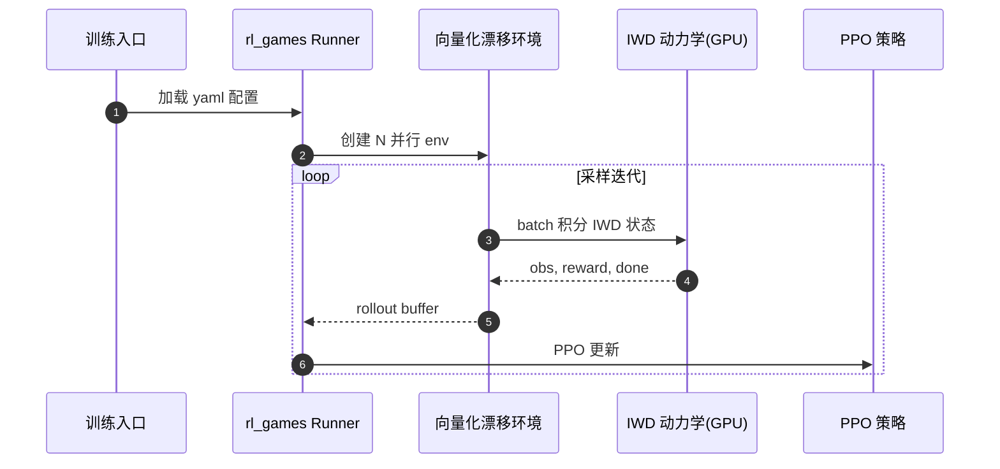

# xcar-rlgpu

**xcar-rlgpu** 是面向 **独立轮驱（IWD）自主漂移** 的 **GPU 加速强化学习** 框架：自研向量化环境与 **rl_games** 子模块，强调训练吞吐与 Sim2Real 域随机化。

## 一句话定义

> 若 [f1tenth_gym](./f1tenth-gym.md) 解决「轻量 CPU 仿真」，xcar-rlgpu 解决「**CUDA 上成千上万并行漂移环境**」——用 IWD 模型与系统域随机化换样本效率。

## 英文缩写速查

| 缩写 | 英文全称 | 简要说明 |
|------|----------|----------|
| IWD | Individual Wheel Drive | 四轮独立扭矩/速度控制 |
| RL | Reinforcement Learning | 通过 rl_games（PPO 等）训练 |
| GPU | Graphics Processing Unit | 向量化仿真并行 |
| DR | Domain Randomization | 动力学/环境参数随机化 |

## 为什么重要

1. **训练速度：** README 宣称 GPU 并行将训练从小时级压到分钟级。
2. **IWD 动力学：** 比单输入转向+油门更贴近四驱漂移机动空间。
3. **任务族完整：** 圆环、变曲率、八字等轨迹 + 可视化分析工具链。

## 核心结构/机制

- **环境：** `conda env create -f environment.yml`；CUDA 11.8+、PyTorch 2.0.1+
- **算法：** git submodule `rl_games`（Denys88 fork）
- **开源状态：** GitHub **MIT 已开源**（2026-08-23 核查）

## 源码运行时序图

典型路径：`git submodule update --init` → `conda env create -f environment.yml` → README Training 节脚本。

## 常见误区或局限

- **误区：基于 CARLA / f1tenth_gym** — 为 **自研** 向量化动力学，不与上述 API 兼容。
- **局限：** 社区 star 较新；真机部署需自行验证 IWD 执行器接口。

## 关联页面

- [赛车漂移 RL 开源景观](../overview/racing-drift-rl-open-source-landscape.md)
- [F1TENTH Gym](./f1tenth-gym.md)
- [drift_drl](./drift-drl.md) — CARLA 系对照

## 参考来源

- [sources/repos/xcar_rlgpu.md](../../sources/repos/xcar_rlgpu.md)
- [赛车漂移 RL 开源景观](../../sources/papers/racing_drift_rl_open_source_landscape.md)

## 推荐继续阅读

- [rl_games](https://github.com/Denys88/rl_games)
- [Gym-Khana](https://github.com/TeoIlie/Gym-Khana) — f1tenth_gym + SB3 轻量路线
