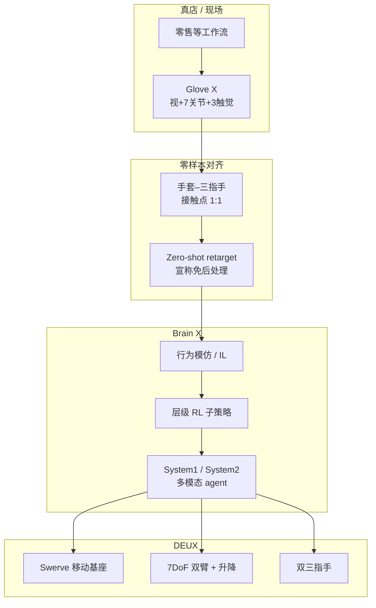

# DEUX（XYZ · 半人形服务机器人）

**DEUX** 是韩国 **艾克斯怀吉（XYZ / XYZ Corp）** 于 **2026** 发布的 **半人形（semi-humanoid）双臂移动服务机器人**（产品页与 ABOUT 称 **DEUX 1.0**）：以 **真店数据** 训练的 Physical AI 叙事为主，配套 **Glove X**（与三指手 **1:1** 的可穿戴采集装置）与 **Brain X**（行为模型 / 层级 RL / 对话动作）。2026-07 起宣称进入 **商业门店试点**。

| 机构 | 艾克斯怀吉（XYZ） |
|------|-------------------|
| 产品页 | <https://xyzcorp.imweb.me/DEUX> |
| 形态 | 移动双臂 + 升降躯干 + 双三指手 |
| 配套采数 | **Glove X**（独立板载，&lt;50 ms 多模态同步） |
| 软件栈叙事 | **Brain X** + ROS 2 / Python / DEUX Controller |
| 开源状态（2026-07-27） | **未开源** |

## 一句话定义

**用「真店数据 + 手套–三指手 1:1 零样本重定向」驱动的闭源半人形服务机器人平台，把零售等工作流自动化与持续在线学习绑成同一产品叙事。**

## 英文缩写速查

| 缩写 | 英文全称 | 简要说明 |
|------|----------|----------|
| DoF | Degrees of Freedom | 自由度；DEUX 分项合计约 32（臂/手/升降/底盘） |
| IL | Imitation Learning | 模仿学习；Glove X 数据宣称可直接供 IL |
| RL | Reinforcement Learning | Brain X 用层级/组合 RL 编排子策略 |
| ROS 2 | Robot Operating System 2 | 产品页宣称软件支持 |
| MCU | Microcontroller Unit | Glove X 单 MCU 同步关节/触觉/视觉 |
| CAN-FD | Controller Area Network Flexible Data-rate | 宣称 1 kHz 关节控制总线 |

## 为什么重要

- **「不必仿人手」的商业三指路线：** 与 [Sunday Memo / ACT-2](./sunday-robotics-act2.md) 一样押注 **三指几何稳定抓取**，但 XYZ 把故事写成 **手套接触点 1:1 → 免后处理 retarget**，直接服务 [模仿学习](../methods/imitation-learning.md) 数据飞轮。
- **移动双臂服务机器人的可引用规格：** 高度 **900–1550 mm**、全向底盘、单臂 **5.5 kg** / 双臂 **11 kg**、**CAN-FD 1 kHz**、预购 **~$30k–40k**（含 BrainX 与一轮任务建模）——便于和开源桌面臂 / 人形平台做 **成本–工作空间–开源度** 对照。
- **闭源 Physical AI 闭环样本：** 真店数据 → Glove X（视/关节/触觉同步）→ Brain X（foundation + IL/RL + Voice X）→ 门店试点；研究侧价值在 **产品形态与采数主张**，不在可复现权重。
- **与开源手套/无机器人示教对照：** [HandUMI](./handumi.md) 走 **跨臂可重定向 + LeRobot**；DEUX/Glove X 走 **专有 embodiment 1:1 绑定**——选型时先问「要可迁移数据集还是要门店一体机」。自变量 [TwinDEX](./twindex.md) 也是三指 1:1，但是 **外骨骼–机械手共设计** 且主张 **零真机遥操作数据**，同样闭源。

## 流程总览

## 核心结构

### 本体与规格（产品页）

| 项 | 内容 |
|----|------|
| 尺寸 / 高度 | W530×D652 mm；高度 **900–1550 mm** 可调 |
| 质量 | 底盘 35 kg + 上身 25 kg ≈ **60 kg** |
| 关节构成 | 7DoF 臂×2、7DoF 灵巧手×2、1DoF 升降、3DoF swerve 底盘（分项合计 **32 DoF**；规格表头写「30」与分项/营销「32」不一致，**以 32 为准并标注疑似笔误**） |
| 末端 | **三指**专有手；三点接触稳定抓取叙事 |
| 控制 / 软件 | **1 kHz CAN-FD**；**ROS 2**、Python、DEUX Controller |
| 算力 | **NVIDIA Thor** 选配另售 |
| 预购（USD） | Mobile DEUX **$39,900** / DEUX **$29,900** / Glove X **$3,900**（含 BrainX + 一轮任务建模） |

### Glove X：多模态采集与零样本重定向

| 通道 | 宣称指标 |
|------|----------|
| 视觉 | 双高清相机 + **220°** 超广角；MIPI CSI-2 |
| 本体 | 磁编码器 **7 关节 @ 1 kHz**（公差 0.5°）；可叠 Meta Quest 双手 3D 跟踪 |
| 触觉 | **3** 指尖压力通道 @ **83.3 Hz** |
| 同步 | 单 MCU；全链路 **&lt; 50 ms**；板载 1 kHz，**无外接 PC** |
| 映射 | 与 DEUX 手 **接触点 1:1** → 宣称 **zero-shot retargeting**、数据可直接进 IL |

这把 [数据手套 vs 视觉遥操作](../comparisons/data-gloves-vs-vision-teleop.md) 里的「手套高精度、贵、校准重」路线产品化，并用 **embodiment 绑定** 换取「免校正」主张——与 Vision-only / 跨形态 UMI 路线正交。

### Brain X（TECHNOLOGY 页摘要）

- **动作模型框架：** robot foundation models + **IL** + **层级/组合 RL**  
- **System 1 / System 2** 按复杂度切换；System 2 做感知–推理–人机交互  
- **Voice X：** 对话与肢体动作联合的 conversational action model  
- 生态备注（非本页深挖）：**TwinX** 数字孪生遥操作、**Glass X** 眼镜采数、Baris Brew 咖啡机器人产线经验

## 工程实践

| 维度 | 可读法 |
|------|--------|
| 选型 | 需要 **门店一体机 + 厂商任务建模** 时看预购包；需要 **可复现训练栈** 时不要把 DEUX 当开源基座 |
| 采数对照 | 要 **跨机器人迁移** → [HandUMI](./handumi.md) / UMI 族；要 **与三指手严格对齐的手套流** → 读 DEUX/Glove X 主张并假设数据锁定在该 embodiment |
| 部署接口 | 产品页仅保证 **ROS 2 / Python / DEUX Controller** 叙事；无公开 API 文档仓 |
| 源码运行时序图 | **不适用**（截至 2026-07-27 无可运行官方训练/推理仓库） |

## 局限与风险

- **未开源（2026-07-27）：** 产品页与主站 **无** GitHub / HF / 数据集链接；同名空 GitHub 组织 **未** 被官网引用。详见 [sources/sites/xyzcorp-deux.md](../../sources/sites/xyzcorp-deux.md)。
- **营销规格不一致：** DoF 表头「30」vs 分项/文案「32」；医院/家庭场景多为叙事，**定量成功率与 Scope 未公布**（对比 Sunday 的 Solve 三元组更难审计）。
- **「零样本免校正」不可独立验证：** 1:1 接触点设计可降低 retarget 难度，但不等于跨操作员/跨物体的零误差；无公开标定协议或误差曲线。
- **算力与总拥有成本：** 标价不含 **NVIDIA Thor**；任务建模仅含 **一轮**——后续门店适配成本未透明。
- **厂商锁定：** Glove X ↔ DEUX 手绑定，数据飞轮难外溢到开源臂/手生态。

## 关联页面

- [Teleoperation](../tasks/teleoperation.md) — 手套/XR 采数在遥操作谱系中的位置
- [数据手套 vs 视觉遥操作](../comparisons/data-gloves-vs-vision-teleop.md) — Glove X 作为商业手套路线样本
- [Imitation Learning](../methods/imitation-learning.md) — 示范数据 → 策略的主线方法
- [Manipulation](../tasks/manipulation.md) — 零售/家务操作任务语境
- [ACT-2 / Sunday Robotics](./sunday-robotics-act2.md) — 另一三指移动服务/家用闭源对照
- [HandUMI](./handumi.md) — 开源、跨臂可重定向的无机器人示教对照
- [TwinDEX](./twindex.md) — 三指外骨骼–同构手共设计；纯 robot-free（自变量，闭源）
- [Humanoid Hardware 101 · 传感与末端](../overview/humanoid-hardware-101-sensing-end-effectors.md) — 三指末端单位经济性论点

## 参考来源

- [xyzcorp-deux.md](../../sources/sites/xyzcorp-deux.md) — DEUX 产品页归档（含 ABOUT / TECHNOLOGY 交叉摘录与开源核查）

## 推荐继续阅读

- DEUX 产品页：<https://xyzcorp.imweb.me/DEUX>
- XYZ TECHNOLOGY（Brain X）：<https://xyzcorp.imweb.me/tech>
- XYZ ABOUT（时间线 / 试点）：<https://xyzcorp.imweb.me/93>
