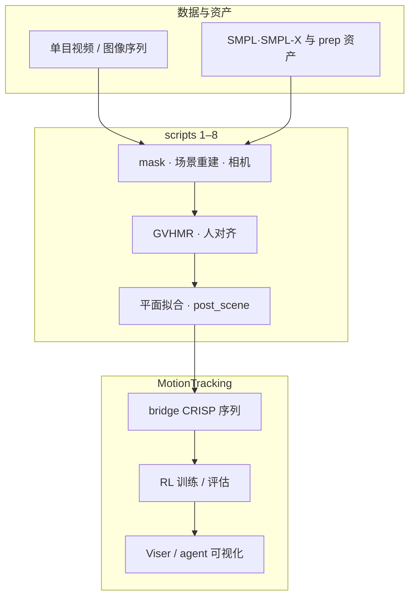

# CRISP（Contact-guided Real2Sim）

**CRISP**（*Contact-guided Real2Sim from Monocular Video with Planar Scene Primitives*，Wang et al.，ICLR 2026）研究如何把**互联网风格单目 RGB 视频**转成**能在接触丰富仿真里跑起来**的人形运动与场景：核心是用**仿真就绪的凸平面原语**近似场景几何，并用**人–场景接触**推断遮挡支撑面，最后用 **RL 驱动的人形控制器**把「人 + 场景」一起约束到物理可信的解空间。

## 一句话定义

用**平面几何 + 接触物理**把单目视频里的「人–场景交互」变成**可 rollout 的仿真资产**，而不是只做视觉好看的稠密重建。

## 英文缩写速查

| 缩写 | 英文全称 | 简要说明 |
|------|----------|----------|
| RL | Reinforcement Learning | 通过与环境交互最大化长期回报来学习策略的范式 |
| Sim2Real | Simulation to Real | 把仿真中学到的策略迁移落地真机的工程主线 |
| RGB | Red-Green-Blue | 彩色图像通道，常与深度 (RGB-D) 配合 |

## 为什么重要

- **Real2Sim 的瓶颈常在几何与接触**：稠密 mesh 或噪声深度会在脚–地、臀–椅等接触上产生伪碰撞，后续跟踪/模仿策略大量失败。
- **与 Sim2Real 数据链衔接**：先得到**动力学一致**的仿真场景与参考运动，再在同一套物理里训练策略，是视觉模仿与上下文控制pipeline 的上游模块。
- **论文在 EMDB / PROX 等人-centric 基准上报告**运动跟踪失败率从约 **55.2% 降至 6.9%**，并声称 **RL 仿真吞吐约 +43%**（相对其对比设置），说明「可仿真」不仅是审美指标。

## 主要技术路线

1. **单目视频 + 深度点云**：从 RGB 序列恢复场景点云与人体运动候选（与 [Sim2Real](../concepts/sim2real.md) 数据链中的「资产构建」阶段衔接）。
2. **凸平面原语拟合**：在 depth / normal / optical flow 上聚类，用**仿真就绪的凸平面片**近似可碰撞场景，降低稠密噪声几何对接触的破坏。
3. **接触引导的几何补全**：用人–场景接触（如坐姿推断椅面）补全遮挡区域，避免悬空/穿透等「看起来对、仿真里不可用」的重建。
4. **RL 人形闭环**：用 [强化学习](./reinforcement-learning.md) 驱动 [全身控制](../concepts/whole-body-control.md) 意义上的跟踪/场景感知策略，把运动与场景一起压到物理可行域。

## 流程总览

## 工程实现（官方代码）

官方实现托管在 **[Z1hanW/CRISP-Real2Sim](https://github.com/Z1hanW/CRISP-Real2Sim)**（`CRISP-Real2Sim/CRISP-Real2Sim` 组织仓仅为 GitHub Pages 站点源码）。README 将复现拆为两段：

1. **重建管线（`scripts/` 1–8）：** 视频抽帧 → 人体 mask → 场景重建 → 相机后处理 → **GVHMR** 人体运动 → 人–场景对齐优化 → **凸平面拟合** → 后处理对齐与 **bridge**；输出 `results/output/scene/`（原始重建）与 `post_scene/`（z-up 对齐、供下游 RL 桥接）。
2. **`MotionTracking/`：** 将 CRISP 资产桥接进 RL 环境，覆盖训练、评估、Viser 调试与 SMPL 运动导出。

**可选扩展：** InteractVLM 类 **contact hallucination**（`scripts/0_interactvlm.sh`）与 **NKSR** 稠密表面测试路径；主流程不依赖。作者另发布 [视频数据集](https://drive.google.com/drive/folders/1PX8Pqzqjlh5v0Z6xt-NjzTgpugk4igoN)（含 PROX / EMDB / RICH 相关剪辑），并注明高动态片段上 HMR 仍可能失败。

## 核心机制（编译理解）

1. **平面原语而非万能稠密表面**：在深度点云上聚类并拟合**凸平面片**，使接触求解更接近游戏/仿真引擎里常用的碰撞近似，减少不可控的自穿透与抖动接触法向。
2. **接触引导的遮挡补全**：交互时大量结构不可见（例如座椅面）；用人体姿态与接触假设**推断被挡住的支撑几何**，让人能「坐稳、站起」而不是悬空或穿透。
3. **RL 作为物理一致性过滤器**：重建不仅供可视化，还驱动**人形控制策略**在仿真中运行；物理不可行的运动会在训练/跟踪中暴露，从系统设计上把 **geometry–control** 绑在一起。

## 常见误区

- **把 CRISP 当成纯「4D 视觉重建」**：其卖点是 **simulation-ready**，评价口径包含跟踪失败率与仿真效率，而不是只比渲染逼真度。
- **忽略对比对象差异**：项目页与 VideoMimic 并排展示；不同管线在**几何表示、接触建模、控制接口**上不一致时，数字只能在其论文设定内解读。

## 与其他页面的关系

- 与 **[Sim2Real](../concepts/sim2real.md)**：CRISP 强化 **Real2Sim** 一侧的资产质量，使后续 sim 中训练更稳。
- 与 **[GS-Playground](../entities/gs-playground.md)**：后者用 **3DGS** 做外观 Real2Sim；CRISP 走 **单目视频 + 平面原语 + 接触** 路线，侧重点不同，可对照「视觉真实感 vs 接触动力学可仿真性」（详见 [CRISP vs GS-Playground 选型对比](../comparisons/crisp-vs-gs-playground-real2sim.md)）。
- 与 **[COINS](../entities/paper-coins-compositional-human-scene-interaction.md)**：同在 **PROX** 人–场景生态；COINS **前向** 按语义在场景中合成虚拟人静态交互，CRISP **后向** 从单目视频恢复可仿真人形运动——互补的「生成 vs 重建」路线。
- 与 **[DIMOS](../entities/paper-dimos-human-scene-motion-synthesis.md)**：CRISP 从 **视频恢复可仿真资产**；DIMOS 从 **语义/路点目标正向合成** 室内坐/躺/行走序列（静态交互目标来自 COINS）——前者偏 Real2Sim 上游，后者偏 **合成训练数据 / 场景填充**。
- 与 **[SimFoundry](../entities/paper-simfoundry-real2sim-scene-generation.md) / [Agentic Real2Sim](../entities/paper-agentic-real2sim.md)**：后两者偏 **操作臂 episode / 场景孪生**；CRISP 偏 **人–场景接触 + 人形 RL**——几何原语与下游策略接口不同。
- 与 **[R2S-EGO](../entities/paper-r2s-ego.md)**：后者在**既有仿真**上用双代理补 **行为范围 ego 外观/碰撞**（稀疏多视角）；CRISP 从**单目视频**构造可 rollout 人–场景资产——上游输入与输出接口不同。
- 与 **[Lucida](../entities/paper-lucida-r2s.md)**：后者把室内多视角写成 **可编辑物体 mesh + 场景图**，VLM 做 **gizmo 放置**；CRISP 做人–场景平面原语与人形 RL——几何与下游接口不同。

## 关联页面

- [Sim2Real](../concepts/sim2real.md)
- [Whole-Body Control](../concepts/whole-body-control.md)
- [Reinforcement Learning](./reinforcement-learning.md)
- [GS-Playground](../entities/gs-playground.md)
- [COINS](../entities/paper-coins-compositional-human-scene-interaction.md)
- [SimFoundry](../entities/paper-simfoundry-real2sim-scene-generation.md)
- [Agentic Real2Sim](../entities/paper-agentic-real2sim.md)
- [R2S-EGO](../entities/paper-r2s-ego.md) — 稀疏捕获双代理 ego 细化（3DGS + 真机坐姿）
- [Lucida](../entities/paper-lucida-r2s.md) — 室内物体级 Real2Sim + GizmoAct 闭环放置（arXiv:2608.30821）

## 参考来源

- [CRISP（ICLR 2026）论文摘录](../../sources/papers/crisp_real2sim_iclr2026.md)
- [CRISP 项目页归档](../../sources/sites/crisp-real2sim-project-github-io.md)
- [CRISP-Real2Sim 官方仓库索引](../../sources/repos/crisp_real2sim_repo.md)（Z1hanW/CRISP-Real2Sim）

## 推荐继续阅读

- [Z1hanW/CRISP-Real2Sim（GitHub）](https://github.com/Z1hanW/CRISP-Real2Sim) — 克隆复现与 `run_crisp_video.sh` 入口
- [机器人论文阅读笔记：CRISP](https://imchong.github.io/Robot_Learning_Paper_Notebooks/papers/13_Physics-Based_Animation/CRISP__Contact-Guided_Real2Sim_from_Monocular_Video_with_Planar_Scene_Primit/CRISP__Contact-Guided_Real2Sim_from_Monocular_Video_with_Planar_Scene_Primit.html)
- [OpenReview：CRISP 论文页](https://openreview.net/forum?id=xlr3NqxUqY)
- [arXiv:2512.14696](https://arxiv.org/abs/2512.14696)
- [VideoMimic 项目页](https://videomimic.github.io/)（站点中与 CRISP 做交互对比的基线之一）
- [Sim2Real（概念总览）](../concepts/sim2real.md)
