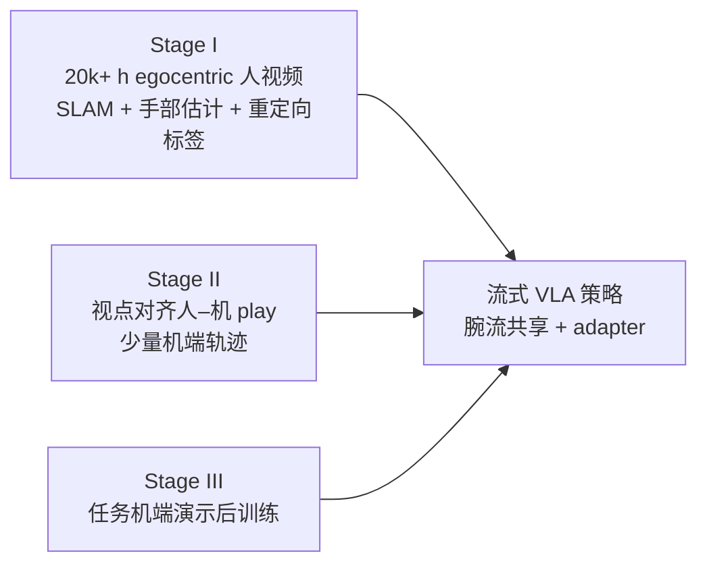

---

type: method
tags: [vla, egocentric-video, dexterous-manipulation, flow-matching, human-robot-transfer, imitation-learning, nvidia-gear, scaling-laws, nvidia]
status: complete
updated: 2026-09-05
date: 2026-05-17
summary: "EgoScale 用超两万小时、带腕与重定向高 DoF 手部标签的第一人称人视频预训练流式 VLA，实证人数据规模与验证损失近 log-linear 缩放且与真机灵巧表现强相关，再以小规模视点对齐的人–机 mid-training 把表示锚到机器人，从而在极少机端演示下获得高灵巧长程操作与 one-shot 迹象。"
related:
  - ./vla.md
  - ./imitation-learning.md
  - ./mimic-video.md
  - ../concepts/motion-retargeting.md
  - ../concepts/embodied-scaling-laws.md
  - ../entities/dyna-2.md
  - ../entities/humannet.md
  - ../entities/paper-egoverse.md
  - ../entities/paper-trex-tactile-reactive-dexterous-manipulation.md
  - ../entities/paper-egosteer.md
  - ../entities/egoworld-100w.md
  - ../entities/rekadaily-10k-dataset.md
  - ../entities/paper-ace-data-0.md
  - ../entities/paper-egoworld.md
  - ../tasks/manipulation.md
  - ../entities/nvidia-gear-lab.md
  - ./macrodata-egocentric-hand-action.md
  - ../entities/paper-ego2robot.md
  - ../entities/paper-spd.md
sources:
  - ../../sources/papers/egoscale_arxiv_2602_16710.md
  - ../../sources/sites/nvidia-research-egoscale.md
  - ../../sources/papers/egosteer_arxiv_2607_09701.md
  - ../../sources/blogs/stellarnex_egoworld_100w.md
  - ../../sources/papers/egoverse_arxiv_2604_07607.md
  - ../../sources/sites/rekadaily-10k.md
  - ../../sources/blogs/macrodata_egocentric_video_3d_hand_actions.md
---

# EgoScale

**EgoScale**（NVIDIA [GEAR Lab](../entities/nvidia-gear-lab.md) 等，arXiv:2602.16710）研究的是：能否把 **互联网尺度的第一人称人操作视频** 当成 **灵巧机械臂–手策略** 的主监督来源，并在数据继续变大时 **可预测地** 提升真机表现。

## 一句话定义

用 **海量 egocentric 人视频上的显式腕–手动作预测** 预训练 **流匹配式 VLA**，再用 **小规模、视点与场景严格对齐的人–机 play 数据** 做 mid-training，把表示落到可执行机器人接口上，最后用常规 **任务演示后训练** 完成部署。

## 英文缩写速查

| 缩写 | 英文全称 | 简要说明 |
|------|----------|----------|
| DoF | Degrees of Freedom | 自由度，人形通常 20–50+ 关节 |
| VLA | Vision-Language-Action | 视觉-语言-动作多模态基础策略方向 |
| SLAM | Simultaneous Localization and Mapping | 同步定位与建图 |
| VLM | Vision-Language Model | 视觉-语言多模态理解模型，VLA 的上游 |
| DiT | Diffusion Transformer | 以 Transformer 为骨干的扩散生成架构 |
| Retargeting | Motion Retargeting | 将人体/动物动作映射到目标机器人骨架 |
| VAM | Video-Action Model | 从视频学习并预测动作的模型 |
| Manipulation | Robot Manipulation | 抓取、移动、操作物体的任务总称 |

## 为什么重要

- **把「人视频小时」接到可复核指标上：** 论文在约 **1k–20k 小时** 扫描上给出 **验证损失随数据规模近似 log-linear 下降**，并展示其与 **后训练后真机平均完成度** 同向改善，便于把数据采集预算和实验设计对齐到同一标尺。
- **分离「规模」与「对齐」：** 大规模野外人数据提供 **行为长尾与语义覆盖**；对齐阶段用 **机位匹配的头 + 双腕相机** 与少量机端轨迹解决 **感知与控制域 gap**，避免把一切都押在昂贵的大规模配对演示上。
- **与低 DoF 迁移叙事相容：** 预训练监督定义在 **高 DoF 重定向手空间**，论文仍报告向 **更少手指自由度** 平台迁移的增益，支持把 rich human motion 当作 **可复用的 motor prior** 来读（具体数值以论文图表为准）。
- **对照仿真 on-embodiment：** [SPD](../entities/paper-spd.md) 不从人视频抽动作，而在目标双臂灵巧手上采 **75 h** 仿真 VR 演示再真机短微调。规模小两个数量级，但没有 embodiment gap；适合「目标手已定、要的是接触标签」而不是「先吃互联网人视频」。

## 主要技术路线

### 人侧动作接口

- **臂：** 用 **相对腕位姿** \(\Delta\mathbf{W}\)（chunk 内相对首帧），弱化全局 SLAM 漂移，并与机器人相对末端控制对齐。
- **手：** 从估计的 **21 手部关键点** 做 **优化式重定向** 到默认 **22-DoF Sharpa** 关节目标，使预训练直接优化 **操纵相关的手指结构**。

### 数据两阶段

1. **Stage I（人预训练，大规模、噪声容忍）：** 论文叙述合计约 **20,854 h** egocentric；其中包含大量 **野外** 场景，并混入约 **829 h EgoDex**（Vision Pro 等更精确腕/手信号）作 **锚定**。
2. **Stage II（对齐 mid-training，小规模、强对应）：** 桌面 **344** 任务，约 **50 h** 人 + **4 h** 机；人与机 **共享相机布置**（ego + 双腕），人用 **Vive + Manus** 与视频流同步，强调 **可比视觉观测**。

### 模型与训练三阶段（与 GR00T N1 同族叙述）

- **架构：** **VLM 编码语言–图像** → **共享 DiT 动作专家** + **flow matching** 生成动作块；人数据无本体时用 **可学习占位 token** 代替 proprio；跨硬件用 **轻量 embodiment adapter** 处理输入本体与输出手指维度。
- **优化日程（论文 §2.4 量级）：** Stage I **全模型** 长步数吸收人数据；Stage II **多冻结 VLM 骨干**，主要更新 **视觉编码器 + 动作专家** 以锚到机器人；Stage III **任务后训练** 细调，是否冻结视觉取决于是否经过 mid-training 等设定。

## 流程总览

## 常见误区或局限

- **误区：「只靠 YouTube 级人视频就能零样本上机」。** 论文明确需要 **对齐 mid-training** 与 **任务后训练**；人数据主要提供 **可扩展的先验**，不是单独闭环。
- **局限：标签来自估计栈。** Stage I 依赖 **SLAM / 手部估计**，噪声存在；论文论点是大规模 **统计上** 仍改善表示，但 **域外失败模式** 仍需用机端评测与数据清洗约束。
- **局限：公开复现材料。** 截至项目页文案，**GitHub 仍为 Coming Soon**，工程复现应以后续官方发布为准。
- **对照：[EgoSteer](../entities/paper-egosteer.md)（PKU/PsiBot，arXiv:2607.09701）。** 同属 egocentric 腕–指预训练 VLA，但用 **EgoSmith 策展吞吐 + 统一 HITL DAgger 栈 + 训练-only DINOv3 世界专家** 换 mid-training 叙事，且 **代码/权重已开源**（全量处理后数据待发）。

## 与其他页面的关系

- 与 [VLA](./vla.md)：属于 **同一 VLA 家族接口**（图像 + 语言 → 动作），但强调 **人侧小时数** 与 **腕–手显式监督** 的预训练位置，以及 **mid-training** 在跨本体中的角色。
- 与 [EgoSteer](../entities/paper-egosteer.md)：同族人视频 → 灵巧 VLA；对照 **mid-training 对齐** vs **策展全栈 + DAgger**。
- 与 [mimic-video](./mimic-video.md)：mimic-video 把瓶颈叙事放在 **视频骨干潜质量**；EgoScale 把瓶颈叙事放在 **人操纵轨迹规模 + 对齐阶段**，二者可对照阅读而非互斥。
- 与 [HumanNet](../entities/humannet.md)：HumanNet 侧重建 **互联网级人中心语料与标注管线**；EgoScale 给出 **两万小时量级 egocentric + 动作标签** 上 **VLA 预训练缩放** 的实证数据点。
- 与 [EgoVerse](../entities/paper-egoverse.md)：同属 Direct 档 egocentric 人数据；EgoVerse 强调 **联盟协议采集 + 人–机共训缩放判据**（域对齐锚定、场景多样性），EgoScale 强调 **VLA 预训练小时 ↔ 验证损失 / 真机完成度**。
- 与 [具身规模法则](../concepts/embodied-scaling-laws.md)：可把本文的 **log-linear 验证损失–数据规模** 与 **下游完成度** 的联动，当作 **人侧监督缩放** 的一个具体案例研究。
- 与 [Dyna-2](../entities/dyna-2.md)：同属「人视频小时 → 机端增益」叙事；EgoScale 走 **VLA + 显式人–机对齐 mid-training（~20k h）**，Dyna-2 走 **WAM + 零对齐纯人预训练梯子（至 1M h）** 并主张跨具身零样本缩放——协议不同，宜对照读。
- 与 [Motion Retargeting](../concepts/motion-retargeting.md)：重定向是 **人手关键点 → 机器人手关节** 的硬接口；误差形态会进入 **预训练标签噪声** 讨论。
- 与 [T-Rex](../entities/paper-trex-tactile-reactive-dexterous-manipulation.md)：同人灵巧线后续工作；共享 **人 egocentric 预训练 + 机端 mid-training** 骨架，T-Rex 把 mid-training 换成 **触觉同步 play** 并引入 **高频触觉专家**；论文以 EgoScale 为 **最强无触觉基线（35% vs 65%）**。
- 与 [Macrodata Egocentric Hand-Action](./macrodata-egocentric-hand-action.md)：同属「egocentric → 可训手动作」；Macrodata 停在 **度量 21 关节轨迹 + Action MPJPE 工程标尺**（博客亦点名 EgoScale 的机器人手重定向表示），EgoScale 继续走到 **流式 VLA 预训练缩放与真机完成度**。

## 推荐继续阅读

- 论文 HTML（方法与实验锚点）：<https://arxiv.org/html/2602.16710v1>
- 官方项目页（演示、作者、BibTeX）：<https://research.nvidia.com/labs/gear/egoscale/>
- GR00T N1 公开材料（同族 flow-VLA 叙述入口，便于对照架构选择）：<https://github.com/NVIDIA/Isaac-GR00T>（以官方 README 为准）

## 参考来源

- [EgoScale 论文摘录（arXiv:2602.16710）](../../sources/papers/egoscale_arxiv_2602_16710.md)
- [NVIDIA Research EgoScale 项目页](../../sources/sites/nvidia-research-egoscale.md)
- [SPD 论文归档](../../sources/papers/spd_corl_2026.md) — 仿真 on-embodiment 预训练对照

## 关联页面

- [VLA（Vision-Language-Action）](./vla.md)
- [Imitation Learning](./imitation-learning.md)
- [mimic-video（VAM）](./mimic-video.md)
- [Manipulation（操作任务）](../tasks/manipulation.md)
- [EgoSteer](../entities/paper-egosteer.md)
- [EgoWorld-100W](../entities/egoworld-100w.md) — 商业百万级自中心操作语料（申请制；与本方法学术缩放叙事对照）
- [RekaDaily-10k](../entities/rekadaily-10k-dataset.md) — 公开 Apache 2.0 家务 ego 视频（无原生腕手标签；规模对照）
- [ACE-Data-0](../entities/paper-ace-data-0.md) — 度量同步家居 HOI + 触觉（高保真、中规模；与本方法「万小时缩放」互补）
- [EgoWorld（exo→ego）](../entities/paper-egoworld.md) — 同名视图翻译方法（消歧）
- [Macrodata Egocentric Hand-Action](./macrodata-egocentric-hand-action.md) — RGB-only 开源手轨迹配方与 HOT3D Action MPJPE
- [HumanNet](../entities/humannet.md)
- [EgoVerse](../entities/paper-egoverse.md)
- [Motion Retargeting](../concepts/motion-retargeting.md)
- [Embodied Scaling Laws](../concepts/embodied-scaling-laws.md)
- [Dyna-2（百万小时 WAM 跨具身缩放）](../entities/dyna-2.md)
- [Ego2Robot](../entities/paper-ego2robot.md) — 先把人视频渲染成机器人像素+动作再共训，对照本页 mid-training 对齐
- [SPD](../entities/paper-spd.md) — 对照：不走人视频重定向，直接在目标灵巧手上采仿真演示做预训练（CoRL 2026；75 h vs 本页万小时）
