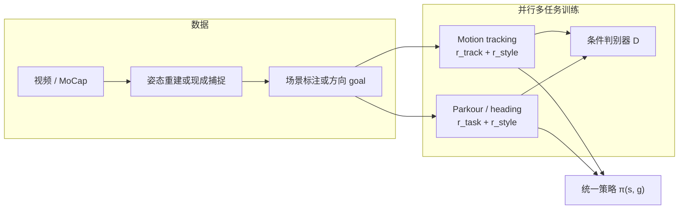

# HIL: Hybrid Imitation Learning（混合模仿学习）

**HIL**（*Hybrid Imitation Learning for Dynamic Athletic Control*，[ACM TOG 2026](https://jiashunwang.github.io/HIL/)，[arXiv:2505.12619](https://arxiv.org/abs/2505.12619)）将 **逐帧 motion tracking** 与 **AMP 式对抗模仿** 放在同一策略、同一观测空间里并行训练。物理仿真角色既能精确学会跑酷参考动作，又能在新障碍布局中组合 vault、plyo 等技能，并在 **heading / facing** 任务上用更大 MoCap 库转向。论文实体与评测数字见 [HIL 论文实体](../entities/paper-hil-hybrid-imitation-learning.md)。

## 英文缩写速查

| 缩写 | 英文全称 | 简要说明 |
|------|----------|----------|
| HIL | Hybrid Imitation Learning | 跟踪 + 对抗模仿的并行多任务框架 |
| AMP | Adversarial Motion Prior | 判别器提供 style reward 的运动先验 |
| AIL | Adversarial Imitation Learning | 用对抗信号匹配参考运动分布的模仿范式 |
| PSI | Perturbed State Initialization | 参考初始状态加扰动以提升过渡鲁棒性 |
| PD | Proportional-Derivative Control | 关节力矩由目标位置/速度误差计算 |
| SMPL | Skinned Multi-Person Linear Model | 论文采用的参数化人体网格与骨骼模型 |
| DTW | Dynamic Time Warping | 评估生成动作与参考时序对齐距离的指标 |

## 为什么重要

跑酷类 **人–场景交互** 同时需要：(1) 参考级动作保真；(2) 按障碍改技能与顺序。纯 tracking 难 OOD；纯 AMP 易 mode collapse。HIL 用**共享 style 判别器**把两路训练桥接起来，并发现**场景点云 / 方向 goal** 可在无相位输入时充当**空间相位**。TOG 定稿用 heading 任务证明同一配方也能吃 ASE 级 MoCap，而不仅是 30 秒互联网跑酷视频。

## 主要技术路线

## 核心机制

### 1. 双模式并行

- **Tracking 模式**：最小化角色与参考在位置、旋转、速度、根高上的指数跟踪误差，加能量项；叠加与任务模式相同的 style reward。
- **任务模式（AMP）**：跑酷沿障碍更新目标点 \(l_t\)；heading 对齐 \(\hat d_t\) 与 \(\hat f_t\)。判别器约束动作自然，跑酷时还要**适配当前场景点云**。

### 2. 统一观测（无相位 / 无未来参考）

策略输入为角色状态与 **goal condition**。跑酷是 agent-centric 点云 + 目标位置；heading 是地面平面单位向量。Tracking 与任务模式 **共用**该空间，避免两套行为。

### 3. 场景条件判别器

跑酷 \(D\) 接收过去 10 步状态转移 + 场景最近点；同时判断「像不像人」与「适不适合当前障碍」。消融表明去掉场景信息会降低技能–场景对齐度。heading 任务去掉 PointNet / 点云。

### 4. PSI 与 critic 任务指示

- **PSI**：参考初始状态扰动，改善技能衔接、减轻 mode collapse。
- **Critic task indicator \(k_t\)**：两模式奖励结构不同，需分开估值。

## 数据与评估

- 跑酷参考来自**互联网视频**（非动捕棚），场景几何靠标注工具对齐，再经物理 tracker 清洗。
- Heading 用 ASE sword-and-shield MoCap（约 7 分钟）。
- 跑酷训练课为 5 障碍序列；评测加障碍位姿/尺度噪声，可泛化到更长序列；可与坐姿等日常动作混训。
- 关键读数：技能准确率 **0.66**、DTW 误差 **0.31**、完成率 0.74；heading facing **0.97**。详见实体页。

## 开源状态

- **官方 TOG 实现确认未开源**（[项目页](https://jiashunwang.github.io/HIL/) 无 GitHub）。
- 一作 [Hybrid-Motion-Imitation](https://github.com/jiashunwang/Hybrid-Motion-Imitation) 是 **非官方** G1 箱攀/搬箱扩展（Holosoma + Isaac Sim），README 写明不是官方代码，且 **没有 AMP 判别器**。时序图见实体页。

## 常见误区

- **不是**人形机器人真机工作——面向 **TOG 物理角色动画**；与 [MTRG](./mtrg-reference-goal-driven-rl.md) 的 G1 跑酷是同一作者脉络的「仿真角色 → 人形泛化」演进。
- **仍依赖对抗训练**——相对 MTRG，硬件部署与调参成本更高。
- **不要和 [HIL-HARC](../entities/paper-hil-harc.md) 混页**——后者是 Hardware-in-the-Loop 真机在线 RL。

## 关联页面

- [HIL 论文实体](../entities/paper-hil-hybrid-imitation-learning.md) — TOG 评测、开源边界与 G1 仓时序图
- [Reward Design](../concepts/reward-design.md) — tracking / style 多目标奖励分解
- [DeepMimic](./deepmimic.md) — tracking 分支的理论祖先
- [AMP & HumanX](./amp-reward.md) — style / 判别器奖励
- [ASE](./ase.md) — heading 数据与无任务引导基线
- [MTRG](./mtrg-reference-goal-driven-rl.md) — 无对抗的参考塑形 + 目标泛化（人形）
- [HIL vs MTRG vs ZEST 跑酷路线对比](../comparisons/hil-vs-mtrg-vs-zest-parkour-imitation.md) — 三条路线选型
- [ZEST](./zest.md) — 工业侧极简 motion imitation 与 sim2real
- [Locomotion](../tasks/locomotion.md) — 跑酷与障碍穿越任务挂接

## 参考来源

- [HIL: Hybrid Imitation Learning for Dynamic Athletic Control](../../sources/papers/hil_hybrid_imitation_learning_arxiv_2505_12619.md)
- [HIL 项目页归档](../../sources/sites/hil-project.md)
- [Hybrid-Motion-Imitation 仓库归档](../../sources/repos/hybrid-motion-imitation.md)
- [arXiv:2505.12619](https://arxiv.org/abs/2505.12619)
- [演示视频](https://youtu.be/le4248gIMME)

## 推荐继续阅读

- [HIL 项目页](https://jiashunwang.github.io/HIL/) — TOG 演示与 PDF
- [AMP 原始论文](https://arxiv.org/abs/2104.02180) — style reward 来源
- [MTRG 演示视频](https://youtu.be/9NamvWhtFPM) — 同人形跑酷主题的参考–目标解耦路线
