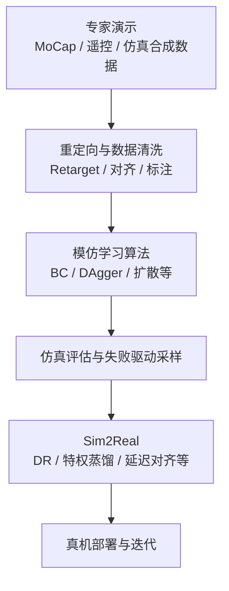

# Imitation Learning (IL, 模仿学习)

**模仿学习 (Imitation Learning)**：通过专家演示数据（**行为克隆**、**DAgger** 等），让机器人学会从状态到动作的映射，核心是“抄”。

## 一句话定义

让机器人看人类/专家怎么做，它就模仿着做。常用的核心算法包括 **DAgger (Dataset Aggregation)**、**行为克隆 (Behavior Cloning, BC)** 等。

## 英文缩写速查

| 缩写 | 英文全称 | 简要说明 |
|------|----------|----------|
| IL | Imitation Learning | 从专家演示学习策略，奖励难定义时的主路线 |
| BC | Behavior Cloning | 将状态映射到动作的监督模仿，易分布偏移 |
| DAgger | Dataset Aggregation | 迭代收集策略诱导状态下的专家标注以纠偏 |
| MoCap | Motion Capture | 动捕等高质量演示数据来源 |
| AMP | Adversarial Motion Prior | 可与 IL 组合，用对抗判别约束运动分布 |
| Sim2Real | Simulation to Real | IL 策略经 DR/特权蒸馏等迁移到真机 |

## 为什么重要

- 纯 RL sample efficiency 低，训练慢。
- 很多任务难以定义 reward。
- 专家演示（行为克隆）提供了高质量数据，可以快速初始化策略。

## 从演示到部署的流程总览



## 主要分类

### 1. 行为克隆 (Behavior Cloning, BC)

最简单的模仿学习 (IL)：把专家数据当监督学习做。参见 [Behavior Cloning with Transformer](./bc-with-transformer.md)。

### 2. DAgger (Dataset Aggregation)
...
有效缓解行为克隆的分布偏移问题。

### 3. DMP (Dynamic Movement Primitives)

轨迹级模仿学习的经典工具，见 [Dynamic Movement Primitives (DMP)](./dmp.md)。它通过二阶微分方程描述运动，具有良好的自适应性。

### 3. GAIL（Generative Adversarial Imitation Learning）

用 GAN 思想：

- 判别器：区分专家数据 vs 策略数据
- 生成器（策略）：试图骗过判别器

让策略在 reward signal 上接近专家，不需要显式 reward。

这是 [逆强化学习](./inverse-reinforcement-learning.md) 的对抗实例化：**占用匹配**，不是可迁移奖励学习。最优时判别器约输出 0.5，不能当新动力学上的 $r$。若目标是先学奖励再优化，看 MaxEnt / AIRL；若只要运动风格项，看 [AMP](./amp-reward.md)。

### 4. 基于重建的方法

先从演示中提取隐表示或技能 latent，再用于控制。

代表：ASE, CALM, Motion Encoder

## 和强化学习的关系

| | 模仿学习 | 强化学习 |
|--|---------|---------|
| 数据来源 | 专家演示 | 环境交互 |
| 样本效率 | 高 | 低 |
| 可超越专家 | 难 | 可以 |
| Reward 设计 | 不需要 | 需要 |
| 适用范围 | 有专家数据的任务 | 任意可定义 reward |

常见组合策略：
- **IL 初始化 + RL 微调**：先用 IL 训一个不错的初始策略，再用 RL 探索超越专家
- **IL + RL 混合**：如 GAIL 本身就是 IL 和 RL 的混合；完整「演示 → 奖励 → 策略」见 [IRL](./inverse-reinforcement-learning.md)
- **自模仿（SIL）**：用智能体自身轨迹作监督；[TSIL](../entities/paper-tsil-temporal-self-imitation-learning.md) 进一步按**时间效率**而非纯回报筛选快速成功轨迹，用于长时域操作 PPO

## 在人形机器人中的应用

典型 pipeline：

```
专家演示（MoCap/遥控/CLAW合成）→ 动作重定向（Retarget）→ 模仿学习训练（robot_lab/legged_gym）→ Sim2Real部署
```

网络结构（层数、宽度、是否判别器 / Transformer / chunk）在论文 Method 中通常有明确表格；可按 [人形与腿式策略的网络架构](../concepts/humanoid-policy-network-architecture.md) 对照阅读。

代表工作：
- [deepmimic](deepmimic.md)：基于轨迹跟踪的显式模仿
- BeyondMimic：强调精确物理建模与失败驱动采样的模仿学习基座
- HumanX：引入接触图 (Contact Graph) 与多教师蒸馏，解决风格模仿与外力估计
- Any2Track：结合历史编码器与世界模型，实现对动态扰动的自适应动作模仿
- AMS (Adaptive Motion Synthesis)：通过物理可行性过滤与混合奖励机制，生成并学习平衡动作
- Switch：引入增强技能图与缓冲节点，实现敏捷技能间的 100% 稳健切换
- HAIC：引入世界模型的教师-学生两阶段训练，用于物体交互任务
- [ase](ase.md)：对抗技能嵌入
- CALM：latent 方向控制
- CLAW：宇树 G1 的模块化语言-动作数据生成管线
- HTD：在人形接触丰富型移动操作中，把未来手部力与触觉 latent 预测作为行为克隆辅助目标，解决“有触觉输入但策略未必会用触觉”的问题
- [HumanNet](../entities/humannet.md)：互联网级 **人中心** 视频语料（论文宣称约百万小时）与交互导向标注管线，可作为「人类侧大规模演示」与 VLA 持续预训练的数据基础设施参照（与真机日志互补，不等价替代物理闭环）
- [EgoScale](./egoscale.md)：在 **两万小时量级** egocentric 人视频上做 **显式腕–手动作** 预训练，并系统测量 **数据规模–离线验证–真机灵巧** 的缩放关系；用 **对齐人–机 mid-training** 把表示锚到机器人（arXiv:2602.16710）
- [EgoVerse](../entities/paper-egoverse.md)：联盟式 **1,362 h** egocentric 人示教 + 跨实验室三具身 **BC/CFM 共训**——共训可涨分，但有效缩放依赖 **域对齐人数据锚定**，有限预算下 **场景多样性** 优先（arXiv:2604.07607）
- [EgoWAM](../entities/paper-egowam-egocentric-human-wam-co-training.md)：在 **固定 HPT 与数据混合** 下仅换 **世界预测目标**，实证 **朴素 BC 人–机协同训练** 可因 **具身差距 / misalignment** **损害** 性能，而 **WAM 动力学分支** 使策略能随 **野外 egocentric 人数据** 扩展（Georgia Tech RL²，[项目页](https://gatech-rl2.github.io/egowam.github.io/)）
- [LaST-HD](../entities/paper-last-hd-latent-physical-reasoning.md)：用 **动作条件世界模型** 在 **共享潜式物理推理空间** 对齐人手与机器人轨迹，配套 **OOL Glove** 与 **mixed-to-human**（混合共训 + 人手 DAgger 纠偏），在真机操作任务上报告 **人类数据缩放与快速适应**（arXiv:2606.23685）

## 常见问题

- **Retarget 误差**：MoCap 动作不一定适配机器人身体结构；[TwinDEX](../entities/twindex.md) 一类共设计接口则用同构外骨骼 **绕开** 软件 retarget，代价是锁死特定手。
- **分布偏移**：训练分布和真实部署差异
- **技能组合**：如何把多个独立技能串成复杂长序列

## 参考来源
- [KungFuAthleteBot](../entities/paper-kungfuathlete-humanoid-martial-arts-tracking.md) — 高动态武术参考与 tracking+recovery（[source](../../sources/papers/kung_fu_athlete_bot.md)）
- [KungfuBot 2 / VMS](../entities/paper-notebook-kungfubot-2.md) — 混合局部/全局跟踪 + 段级奖励的单策略多技能模仿（[ingest](../../sources/papers/kungfubot2_vms_icra2026.md)）
- Ross et al., *A Reduction of Imitation Learning and Structured Prediction to No-Regret Online Learning* — DAgger 原论文
- Chi et al., *Diffusion Policy: Visuomotor Policy Learning via Action Diffusion* — 生成式 IL 代表工作
- [sources/papers/imitation_learning.md](../../sources/papers/imitation_learning.md) — DAgger / ACT / Diffusion ingest 摘要
- [sources/papers/humanoid_touch_dream.md](../../sources/papers/humanoid_touch_dream.md) — HTD / Touch Dreaming ingest 摘要
- [sources/papers/humannet.md](../../sources/papers/humannet.md) — HumanNet 百万小时人中心视频与 VLA 受控预训练叙事
- [sources/papers/interprior_arxiv_2602_06035.md](../../sources/papers/interprior_arxiv_2602_06035.md) — InterPrior：物理 HOI 变分蒸馏 + RL 微调 ingest 摘要
- [SPD 论文归档](../../sources/papers/spd_corl_2026.md) — 仿真 VR 灵巧手预训练 + 真机 BC 微调
- [sources/papers/mimic_video_arxiv_2512_15692.md](../../sources/papers/mimic_video_arxiv_2512_15692.md) — mimic-video：Video-Action Model 与 VLA 对照（arXiv:2512.15692）摘录
- [sources/papers/egoscale_arxiv_2602_16710.md](../../sources/papers/egoscale_arxiv_2602_16710.md) — EgoScale：人视频规模预训练 VLA + 对齐 mid-training（arXiv:2602.16710）摘录
- [sources/papers/egoverse_arxiv_2604_07607.md](../../sources/papers/egoverse_arxiv_2604_07607.md) — EgoVerse：联盟 egocentric 人示教与跨实验室共训研究（arXiv:2604.07607）
- [sources/papers/egowam.md](../../sources/papers/egowam.md) — EgoWAM：WAM 人–机协同训练与世界目标消融（项目页）摘录
- [sources/papers/last_hd_arxiv_2606_23685.md](../../sources/papers/last_hd_arxiv_2606_23685.md) — LaST-HD：潜式物理推理 + OOL Glove 人手→机器人 VLA（arXiv:2606.23685）摘录
- [sources/sites/nvidia-research-egoscale.md](../../sources/sites/nvidia-research-egoscale.md) — NVIDIA Research EgoScale 官方项目页索引
- [sources/papers/taco_tactile_sensor_benchmark_arxiv_2605_21976.md](../../sources/papers/taco_tactile_sensor_benchmark_arxiv_2605_21976.md) — TacO：统一 ACT 跨模态触觉真机 IL 基准
- [sources/papers/learn_weightlessness.md](../../sources/papers/learn_weightlessness.md) — Learn Weightlessness (WM) ingest 摘要
- [sources/papers/holomotion_arxiv_2605_15336.md](../../sources/papers/holomotion_arxiv_2605_15336.md) — HoloMotion-1：野外视频重建 + MoCap 混合语料，稀疏 MoE Transformer + 序列级 PPO 的零样本全身跟踪
- [sources/blogs/claw_unitree_g1_language_annotated_motion_data.md](../../sources/blogs/claw_unitree_g1_language_annotated_motion_data.md) — CLAW 数据生成管线资料
- [sources/repos/robot_lab.md](../../sources/repos/robot_lab.md) — robot_lab RL 训练框架资料
- [Xbotics-Embodied-Guide](../../sources/repos/xbotics-embodied-guide.md) — 任务驱动的工程实践路径与 LeRobot 应用
- [Imitation Learning 论文导航](../../references/papers/imitation-learning.md) — 论文集合
- [机器人论文阅读笔记：DeepMimic](https://imchong.github.io/Robot_Learning_Paper_Notebooks/papers/01_Foundational_RL/DeepMimic_Example-Guided_Deep_RL_of_Physics-Based_Character_Skills/DeepMimic_Example-Guided_Deep_RL_of_Physics-Based_Character_Skills.html)
- [机器人论文阅读笔记：ASE](https://imchong.github.io/Robot_Learning_Paper_Notebooks/papers/01_Foundational_RL/ASE_Adversarial_Skill_Embeddings_for_Large-Scale_Motion_Control/ASE_Adversarial_Skill_Embeddings_for_Large-Scale_Motion_Control.html)
- [机器人论文阅读笔记：CALM](https://imchong.github.io/Robot_Learning_Paper_Notebooks/papers/01_Foundational_RL/CALM_Conditional_Adversarial_Latent_Models_for_Directable_Virtual_Characters/CALM_Conditional_Adversarial_Latent_Models_for_Directable_Virtual_Characters.html)
- [机器人论文阅读笔记：Diffusion Policy](https://imchong.github.io/Robot_Learning_Paper_Notebooks/papers/01_Foundational_RL/Diffusion_Policy/Diffusion_Policy.html)
- [sergey_levine_diffusion_rl_robotics_simons_youtube.md](../../sources/courses/sergey_levine_diffusion_rl_robotics_simons_youtube.md) — Levine @ Simons：生成式动作头与长 action chunk 对 IL 的抬升（官方 abstract）
- [wechat_embodied_heart_robot_icl_gen15_survey_2026-08-25.md](../../sources/blogs/wechat_embodied_heart_robot_icl_gen15_survey_2026-08-25.md) — 机器人 ICL taxonomy 综述（具身智能之心，2026-08-25）
- [seohong_behavioral_cloning_mystery.md](../../sources/blogs/seohong_behavioral_cloning_mystery.md) — 真机风格 BC 四条反直觉（仿真复现）
- [skild_s1_in_context_learning.md](../../sources/blogs/skild_s1_in_context_learning.md) — 视频 ICL 预训练，未见长程操作（闭源）

## 关联页面
- [具身智能高频面试题库](../entities/embodied-interview-qa.md) — 卷三 IL/VLA 面试速查（BC / DAgger / ACT / Diffusion Policy）
- [Sergey Levine：表达力更强的连续动作策略](../overview/sergey-levine-diffusion-expressive-policies.md) — 扩散/flow → chunk → IL / offline RL 的讲者读法
- [机器人学习五大范式](../comparisons/robot-learning-five-paradigms-taxonomy.md) — IL 作为示范信号主线，与 RL / LfV / VLA / 持续学习对照
- [深度学习基础](../concepts/deep-learning-foundations.md)
- [Reinforcement Learning](./reinforcement-learning.md)
- [RL Runner（训练循环编排）](../concepts/rl-runner.md) — Imitation Runner：BC / DAgger / GAIL 的采集–模仿循环，与蒸馏 Runner 分源
- [Whole-Body Control](../concepts/whole-body-control.md)
- [Locomotion](../tasks/locomotion.md)
- [Sim2Real](../concepts/sim2real.md)
- [Foundation Policy（基础策略模型）](../concepts/foundation-policy.md)
- [Behavior Cloning](./behavior-cloning.md) — 最基础的离线监督式 IL 基线
- [Inverse Reinforcement Learning](./inverse-reinforcement-learning.md) — 从演示推断奖励再交给 RL；GAIL 只匹配占用，AIRL 才追求可迁移 $r$
- [Chronos](../entities/paper-chronos.md) — 全历史 SSM + IMLE + 二阶桥的非马尔可夫模仿（arXiv:2606.30318）
- [SpeedTuning](../entities/paper-speedtuning.md) — 冻结模仿基座，只学执行速度倍率（ICRA 2025；仿真仓已开源）
- [ParcelStow](../entities/paper-parcelstow.md) — G1 L6 上问模仿是否继承专家跨速度鲁棒性；\(r=2\) 时 ACT 53% / 专家 84%（arXiv:2609.01453）
- [VERAGMIL](../entities/paper-veragmil.md) — VR + Isaac Sim 颗粒喂食仿真；BC/BCQ + VR 示范（IROS 2025；arXiv:2608.18258）
- [Imitator Game](../entities/paper-imitator-game.md) — L0–L3 意图级模仿基准；L3 功能替代崩溃；MIT 仓 + IG-10K 已开源（arXiv:2608.22301）
- [HOST](../entities/paper-host-one-shot-human-video.md) — 单条人视频、约 29 s、不改权重；八任务 62%；代码+权重已开（arXiv:2607.20033）
- [GEN-1.5](../entities/generalist-gen15-one-shot.md) — 闭源 physical prompting；one-shot ~59% / 10 步 ~83%
- [Zero-WAM](../entities/paper-zero-wam.md) — 人视频作 in-context 任务规格；代码待发布（arXiv:2608.26103）
- [CLAW (宇树 G1 全身动作数据生成管线)](./claw.md) — 通过 MuJoCo 仿真和组合原子动作快速生成带语言标签的专家数据
- [Humanoid Transformer with Touch Dreaming](./humanoid-transformer-touch-dreaming.md) — 用未来触觉 latent 预测增强人形接触丰富型操作的行为克隆策略
- [robot_lab](../entities/robot-lab.md) — 提供高效 IL/RL 任务开发环境的扩展框架
- [LeRobot](../entities/lerobot.md) — Hugging Face 开发的具身智能全栈框架
- [DAgger](./dagger.md) — 用专家回标策略访问到的状态，缓解 covariate shift
- [机器人 In-Context Learning（概念 taxonomy）](../concepts/robot-in-context-learning.md) — one-shot / few-shot 示范归纳与真 ICL 判别
- [BC Mysteries](../concepts/behavioral-cloning-mysteries.md) — 真机风格演示上 BC 的过拟合 / 开环 / 容量 / 特征反直觉
- [S1（Skild）](../entities/skild-s1.md) — 把模仿从「后训练克隆」改成「上下文示范」的闭源样本
- [VLA](./vla.md) — 把语言、视觉与动作统一进多模态模仿学习 / foundation policy 路线
- [EgoScale](./egoscale.md) — 海量 egocentric 人视频预训练 VLA + 对齐 mid-training 的灵巧操作迁移案例
- [EgoVerse](../entities/paper-egoverse.md) — 联盟式 egocentric 人示教与跨实验室共训缩放判据
- [EgoWAM](../entities/paper-egowam-egocentric-human-wam-co-training.md) — WAM 动力学监督 vs BC：野外人数据缩放与 misalignment 鲁棒性
- [Seeker](../entities/paper-seeker.md) — 无空间标签的动作监督视觉瓶颈；少数据 MimicGen / xArm（arXiv:2608.13422；已开源）
- [BooST](../entities/paper-boost-skill-transfer.md) — 语义+运动 VQ-VAE 技能码，LIBERO 少样本（arXiv:2608.10600；训练仓未开）
- [SPD](../entities/paper-spd.md) — 仿真 VR 灵巧手预训练 + 真机短微调 BC（CoRL 2026）
- [HumanNet](../entities/humannet.md) — 大规模人中心视频语料与跨本体迁移的数据侧参照
- [RL vs Imitation Learning](../comparisons/rl-vs-il.md)（两大策略学习路线的系统性对比）
- [Motion Retargeting](../concepts/motion-retargeting.md) — MoCap 数据需经过 Motion Retargeting 才能作为 IL 的参考轨迹
- [MimicKit](../entities/mimickit.md) (Xue Bin Peng 团队开发的模块化运动控制框架)
- [ProtoMotions](../entities/protomotions.md) (NVIDIA 开发的高性能仿真与控制框架，支持超大规模并行训练)
- [BeyondMimic](./beyondmimic.md) — 强调精确物理建模的人形动作模仿框架
- [SMP](./smp.md) (基于得分匹配的运动先验)
- [ADD](./add.md) (对抗性微分判别器，消除运动伪影)
- [LCP](./lcp.md) (Lipschitz 约束策略，提升控制鲁棒性)
- [AWR](./awr.md) (优势加权回归，简单高效的离策学习)
- [TOPReward](../entities/paper-topreward.md) — 零样本 VLM 进度作 advantage 的 TOP-AWR 加权 BC
- [DeepMimic](./deepmimic.md) (经典的显式轨迹跟踪模仿学习)
- [Learn Weightlessness](../../sources/papers/learn_weightlessness.md) — 针对非自稳定运动的失重模仿机制
- [ASE](./ase.md) (对抗性技能嵌入)
- [Any2Track](./any2track.md) — 结合历史编码器与世界模型的自适应动作模仿
- [AMP Reward (HumanX)](./amp-reward.md) — 引入接触图与判别器奖励的风格模仿
- [AMS](./ams.md) — 物理可行性过滤与混合奖励机制
- [HAIC](./haic.md) — 基于世界模型的教师-学生训练范式
- [InterPrior（论文实体）](../entities/paper-interprior.md) — HOI 模仿专家 → 变分蒸馏 → RL 微调的可泛化运动先验（arXiv:2602.06035）
- [SkillMimic（论文实体）](../entities/paper-notebook-skillmimic-learning-basketball-interaction-skill.md) — 统一 HOI 模仿 + Contact Graph 学可复用篮球技能（arXiv:2408.15270）
- [Learning to Ball（论文实体）](../entities/paper-notebook-learning-to-ball.md) — 非结构化对抗模仿学子技能 + soft router 拼长程篮球连招（arXiv:2509.22442）
- [TSIL（论文实体）](../entities/paper-tsil-temporal-self-imitation-learning.md) — RL 训练期按配置挖掘快速成功并效率加权回放（arXiv:2606.19752）
- [TacO（触觉传感器操作基准）](../entities/paper-taco-tactile-sensor-benchmark.md) — 统一 ACT 管线跨模态触觉真机 IL 评测（arXiv:2605.21976）
- [DEUX（XYZ）](../entities/xyz-deux.md) — 真店手套采数 → Brain X IL/RL 的闭源服务机器人样本
- [TwinDEX](../entities/twindex.md) — 三指外骨骼 robot-free 示范 → 同构手策略（闭源；宣称零真机数据）
- [LeTools](../entities/letools.md) — 乐聚 Kuavo 官方 rosbag→LeRobot v3→ACT/VLA 训练部署栈
- [LET-Base-Dataset](../entities/let-base-dataset.md) — Kuavo 真机操作小时库（CC-BY-NC-SA）

## 推荐继续阅读

- [Imitation Learning 论文导航](../../references/papers/imitation-learning.md)
- [Diffusion Policy (Blog)](https://diffusion-policy.cs.columbia.edu/)（当前 IL 方向最活跃的生成式路线）
- Ross et al., *A Reduction of Imitation Learning and Structured Prediction to No-Regret Online Learning*（DAgger 原论文）
- Peng et al., *AMP: Adversarial Motion Priors for Style-Preserving Physics-Based Humanoid Motion Synthesis*（IL + RL 融合路线）

## Weightlessness Mechanism (WM)

针对非自稳定（non-self-stabilizing, NSS）运动（如坐下、躺下、靠墙），研究表明，过度严格的轨迹跟踪会阻碍机器人与环境建立稳定的接触。**Learn Weightlessness** (Xin et al., 2026) 提出通过模仿人类在 NSS 运动中的“失重”状态——选择性地放松特定关节，从而允许被动的身体-环境接触，最终实现运动的稳定。

该方法设计了：
1. **失重状态自动标注策略**：从单演示数据中自动标注“失重”标签。
2. **失重机制 (Weightlessness Mechanism, WM)**：通过网络输出动态决定哪些关节需要放松以及放松的程度（即输出 PD 增益的调节系数），从而在执行目标运动时实现有效的环境交互。

WM 无需针对特定任务进行微调，且能在不同环境配置（如不同高度的椅子、不同倾角的床）中展现出强泛化能力。
