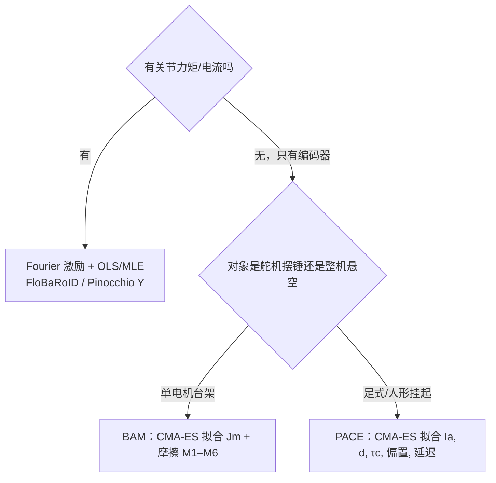

# Joint Actuator Parameter Identification（关节执行器参数辨识）

**关节执行器参数辨识**：用激励轨迹和测量，估计写在**关节坐标**上的动力学参数——首先是 **转子反射惯量 $I_a$（armature）** 与 **摩擦（库仑 / 粘滞 / 可选 Stribeck）**，常再带延迟、偏置或电气常数。它回答的是「这些数怎么从数据里来」，不是「$I_a$ 物理上是什么」（那是 [连杆 vs 转子惯量](../concepts/robot-link-and-rotor-inertia.md)）。

## 一句话定义

**先决定测力矩还是只测编码器，再选线性回归或 CMA-ES；输出是每关节的 $I_a,b,\tau_c$ 一类小数，写进 MuJoCo `armature`/`damping`/`frictionloss` 或 URDF。** 若参数在同一条阶跃上纠缠（延迟↔惯量、库仑↔黏性），先做 [实验设计](./sim2real-joint-sysid-experiment-design.md)，不要一上来把全部参数丢给优化器。

## 英文缩写速查

| 缩写 | 英文全称 | 简要说明 |
|------|----------|----------|
| SysID | System Identification | 本页是 SysID 里「关节执行器层」的算法子集 |
| OLS | Ordinary Least Squares | 线性回归 $\tau=Y\pi$ 的默认求解 |
| MLE | Maximum Likelihood Estimation | Swevers 1997 在周期激励上的统计估计 |
| CMA-ES | Covariance Matrix Adaptation Evolution Strategy | 无梯度拟合仿真轨迹，BAM / PACE 默认优化器 |
| FIM | Fisher Information Matrix | 激励是否「能看见」参数；SPI-Active 主动最大化它 |
| SDP | Semidefinite Programming | 给惯性参数加物理一致 LMI 约束（FloBaRoID） |

## 为什么重要

- **CAD 给不了这两项。** URDF `<inertial>` 没有转子；手册 $J_r$ 乘 $G^2$ 只是初值。摩擦几乎只能测。
- **Sim2Real 的高频/低速两端。** 缺 $I_a$ 仿真关节过轻、PD 发脆；缺摩擦则换向抖动、悬空掉不稳。
- **不要和刚体 10 参数混在一个最小二乘里乱改质量。** $I_a$ 是关节对角附加惯量，摩擦是关节局部非线性；混进 link 质量会把重力项 $g(q)$ 也带偏（Pinocchio `computeGeneralizedGravity` 会跟着错）。

## 核心原理

待估对象（每关节，最小集）：

$$
\tau \approx I_a\ddot q + b\dot q + \tau_c\,\mathrm{sign}(\dot q) + \underbrace{Y_{\mathrm{rb}}(q,\dot q,\ddot q)\pi_{\mathrm{rb}}}_{\text{连杆刚体}}
$$

$I_a\ddot q$ 就是 MuJoCo `armature` 对力矩的贡献。扩展模型再加 Stribeck、负载相关摩擦、电气 $k_t/R$、延迟（见 [BAM](../entities/bam-better-actuator-models.md) / [PACE](../entities/paper-pace-sim2real-legged-robots.md)）。

## 主要技术路线

| 路线 | 机制 | 需要什么 | 开源入口 |
|------|------|----------|----------|
| 解耦台架 | 匀速 → LS 拟合 $b,\tau_c$；摆锤/自由振荡估 $I_a$ | 单关节可控、最好有电流/力矩 | 自己写十几行；BAM 把摆锤自动化 |
| 线性回归 + Fourier | Swevers：周期 Fourier 激励；$Y$ 含惯性与 Coulomb/Viscous 列；OLS/MLE | **关节力矩**（或可靠电流×$K_t$） | [FloBaRoID](../entities/flobaroid.md)；$Y_{\mathrm{rb}}$ 用 Pinocchio `computeJointTorqueRegressor` |
| 两步浮动基 | Ayusawa：基座 wrench **不含关节摩擦** → 先估惯性，再对关节残差拟合摩擦 | 浮动基 + 基座 IMU/力或等效 | FloBaRoID `identifier.py` |
| CMA-ES 仿真对齐 | 把 $I_a,b,\tau_c,\ldots$ 塞进仿真，最小化 $q$ 轨迹误差 | **不必力矩传感** | BAM 摆锤；PACE 悬空 chirp |
| 采样 + 主动 FIM | GPU 抽参数 + 专门采高信息轨迹 | 腿足、要质量/电机一起估 | [SPI-Active](../entities/paper-notebook-sampling-based-system-identification-with-active.md) |

**线性回归怎么把 $I_a$ 和摩擦塞进 $Y$。** Pinocchio 的 `computeJointTorqueRegressor` 只给出 **连杆 10 参数** 的 $Y_{\mathrm{rb}}$。关节执行器列要自己拼：

- armature：$Y_{I_a}$ 的第 $i$ 列是 $\ddot q_i$（只出现在第 $i$ 个力矩方程）
- 粘滞：$Y_b$ 第 $i$ 列是 $\dot q_i$
- 库仑：$Y_c$ 第 $i$ 列是 $\mathrm{sign}(\dot q_i)$（零速要死区，否则矩阵病态）

浮动基不要把这三列写进基座行——基座方程看不到关节摩擦（Ayusawa 2014）。

## 工程实践

### 选型（先读这一表）

| 你的硬件 | 优先算法 | 不要一上来就 |
|----------|----------|----------------|
| 工业臂 + 关节力矩 | FloBaRoID Fourier + SDP | 用 CMA-ES 拟合 50 维黑盒 |
| 舵机 / Dynamixel / STS | [BAM 文档站](https://bam.readthedocs.io/) 摆锤流程 | 把 $I_a$ 写进 URDF 质量 |
| 足式、只有编码器 | PACE `data_collection.py` → `fit.py` | 站在地上辨识（接触力会吞掉 $I_a$） |
| 高精度跳跃等技能 | SPI-Active 再叠加执行器层 | 只 DR 质量 ±20% 却不碰摩擦 |

### 调试指标

- **匀速段：** $\tau$ 对 $\dot q$ 应接近仿射（斜率为 $b$，截距为 $\tau_c$）；弯折说明 Stribeck/齿槽，改 BAM M4+。
- **悬空 chirp：** 辨识后仿真 $q(t)$ 与真机重叠；PACE 文档用拟合分数作门槛。
- **重力抽检：** 改完 $I_a$ 后 $g(q)$ **不应**大变；若肩关节重力矩跳了，说明你把转子惯量塞进了 link 质量。
- **写回仿真：** MuJoCo 三件套分开：`armature`、`damping`、`frictionloss`。BAM `to_mujoco()` 按此导出。

## 局限与风险

1. **零速库仑列不可辨识** — $\mathrm{sign}(0)$ 无定义；激励必须反复穿越，或改连续摩擦模型。
2. **高增益 PD 会藏参数** — 闭环把极点推高，Chirp 看不见 $I_a$；PACE/BAM 都强调辨识时用低增益。
3. **接触污染惯性** — 站立辨识时地面力矩和摩擦缠在一起；足式先悬空。
4. **线性模型装不下谐波减速箱** — Swevers 自己报告 Coulomb–Viscous 残差大于测量噪声；这时换 BAM 扩展摩擦，而不是加大 OLS 权重。
5. **FloBaRoID ≠ Pinocchio 生态** — 它走 iDynTree；只要回归矩阵，也可以只调用 Pinocchio 再自己做 LS。

## 关联页面

- [关节动力学辨识实验设计](./sim2real-joint-sysid-experiment-design.md) — 可辨识性与分级实验（延迟→摩擦→惯量→柔性）
- [System Identification](../concepts/system-identification.md) — 更宽的 SysID 层级（刚体 / 执行器 / 接触）
- [人形整机闭环惯量标定](../concepts/humanoid-closed-loop-inertia-calibration.md) — 台架 \(I_a\) 覆盖不了装机后分布式质量；整机用闭环辨识
- [Joint Friction Models](../concepts/joint-friction-models.md) / [Friction Compensation](../concepts/friction-compensation.md)
- [连杆与转子惯量](../concepts/robot-link-and-rotor-inertia.md) / [Armature Modeling](../concepts/armature-modeling.md)
- [CMA-ES](./cma-es.md) — BAM/PACE 的优化器
- [FloBaRoID](../entities/flobaroid.md) — Fourier + 两步摩擦开源箱
- [BAM](../entities/bam-better-actuator-models.md) / [BAM 论文](../entities/paper-bam-extended-friction-servo-actuators.md)
- [PACE](../entities/paper-pace-sim2real-legged-robots.md) / [SPI-Active](../entities/paper-notebook-sampling-based-system-identification-with-active.md)
- [Pinocchio](../entities/pinocchio.md) / [Pinocchio 快速上手](../queries/pinocchio-quick-start.md)
- [执行器驱动链选型闭环](../queries/actuator-drive-chain-selection-loop.md) — 本页是 ③ 层「数从哪来」
- [执行器驱动链枢纽](../overview/hub-actuator-drive-chain.md)
- [Actuator Network](./actuator-network.md) — 解析参数不够时的残差网络
- [Gravity Compensation](../concepts/gravity-compensation.md) — 辨识时不要把 $I_a$ 和 $g(q)$ 绑死

## 参考来源

- [自由度FreeDof：Sim2Real 动力学辨识实验设计](../../sources/blogs/wechat_freedof_sim2real_dynamics_identification.md) — 纠缠参数与分级实验
- [关节执行器参数辨识论文簇](../../sources/papers/joint_actuator_parameter_identification.md)
- [FloBaRoID 仓库](../../sources/repos/flobaroid.md)
- [BAM 文档站](../../sources/sites/bam-readthedocs.md)
- [Rhoban/bam](../../sources/repos/rhoban_bam.md)
- [PACE 仓库](../../sources/repos/pace-sim2real.md)

## 推荐继续阅读

- Swevers et al., *Optimal robot excitation and identification*, IEEE T-RA 1997：<https://doi.org/10.1109/70.631234>
- BAM Identification 文档：<https://bam.readthedocs.io/en/latest/identification/index.html>
- PACE `fit.py` 指南：<https://pace.filipbjelonic.com/usage/>
- FloBaRoID README：<https://github.com/kjyv/FloBaRoID>
