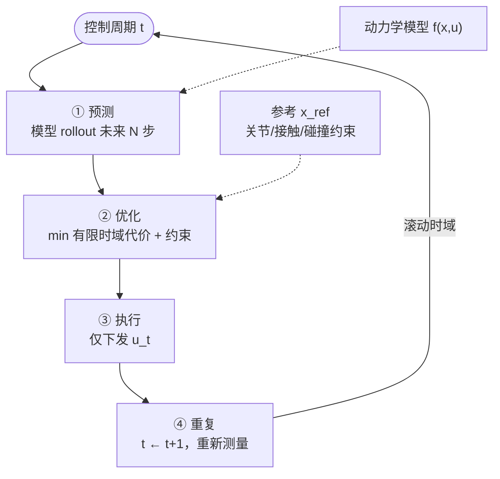

# Model Predictive Control (MPC，模型预测控制)

模型预测控制：一种基于滚动时域优化的控制方法，在每个时刻求解一个有限时域的最优控制问题，只执行第一步，然后重复。

## 一句话定义

不是一次性算出全局最优控制，而是**每一步都在线求解一个有限时域优化问题，只执行当前动作，然后重复**。

## 英文缩写速查

| 缩写 | 英文全称 | 简要说明 |
|------|----------|----------|
| MPC | Model Predictive Control | 滚动时域内优化控制序列 |
| OCP | Optimal Control Problem | MPC 每步求解的有限时域最优控制 |
| QP | Quadratic Programming | 线性化动力学下的常见求解形式 |
| CoM | Center of Mass | 质心轨迹是 loco MPC 核心状态 |
| WBC | Whole-Body Control | MPC 输出参考，低层 QP 跟踪全身 |

## 为什么重要

MPC 是机器人控制中最接近“万能控制框架”的东西——只要你能建模，就能控制。

核心优势：

- 处理约束：关节限位、接触力限制、碰撞避免——都可以自然地塞进优化约束里
- 处理多目标：同时处理平衡、跟踪、能耗等多个目标
- 处理非线性：非线性 MPC 可以处理复杂动力学
- 处理时变系统：每步重新计算，自然适应变化

代价是**计算量大**，实时性要求高。

## 核心工作原理

### 预测模型
首先需要一个动力学模型：

$$\dot{x} = f(x, u)$$

或者离散形式：

$$x_{k+1} = f(x_k, u_k)$$

这个模型不需要很精确（这也是 MPC 的一个优点），但越精确效果越好。

### 有限时域优化
在每个时刻 $t$：

1. 预测：用模型预测未来 $N$ 步的状态序列
2. 优化：求解一个优化问题，找到使代价函数最小的控制序列 $u_t, u_{t+1}, ..., u_{t+N-1}$
3. 执行：只把 $u_t$ 发给机器人
4. 重复：到下一个时刻，重新预测 + 求解

这就是"滚动时域"（receding horizon）控制的核心。下图概括每个控制周期内的闭环：



### 代价函数
典型形式：

$$J = \sum_{k=0}^{N-1} (x_k - x_{ref})^T Q (x_k - x_{ref}) + u_k^T R u_k$$

包含两项：
- 状态代价：状态跟参考值的偏差
- 控制代价：控制输入的大小（防止过于激进）

可以加硬约束（不等式）和软约束。

### 约束处理
这是 MPC 相比 LQR 等方法最关键的优势：

- 关节角度限位：$\underline{q} \leq q \leq \bar{q}$
- 关节速度限位：$\underline{\dot{q}} \leq \dot{q} \leq \bar{\dot{q}}$
- 接触力约束：$f_z \geq 0$（地面反力非负）
- 碰撞避免：作为不等式约束加入

## 主要分类

### 1. 线性 MPC（LMPC）
假设线性系统：

$$x_{k+1} = A x_k + B u_k$$

可以用 QP（二次规划）求解，速度快，适合实时控制。

典型应用：双足行走的 ZMP 控制、轮式机器人轨迹跟踪。

### 2. 非线性 MPC（NMPC）
用非线性动力学模型，需要求解非线性优化问题（NLP）。

计算量比 LMPC 大很多，通常需要：

- 实时非线性优化求解器（e.g. Acados, FORCES Pro）
- 比较好的初值（可以用线性 MPC 的结果做 warm start）

### 3. 凸非线性 MPC
把非线性问题凸化——比如用多面体约束、凸成本函数。

IsaacGym /机器人领域常见。

### 4. 随机 MPC
处理模型不确定性和外界干扰。

加入随机约束或者 robustness budget。

## 在人形机器人中的典型应用

### 行走控制
用 centroidal dynamics + NMPC：

- 预测未来几步的质心/角动量
- 优化接触力分配
- 保持平衡约束

代表工作：
- "Convex Model Predictive Control for Bipedal Locomotion" (C原 Bellicoso et al.)
- ANYmal 的行走控制

### 全身控制
用 WBC 框架下：

- 上层用 MPC 计算 task-space 指令
- 下层用 QP 分配关节力矩

### 足式机器人
四足/双足机器人的站立、行走、跑跳控制几乎都离不开 MPC。

代表：
- MIT Cheetah 的凸 MPC
- Unitree 的 NMPC 控制器

## 关键参数 (详见 [MPC 调参指南](../queries/mpc-tuning-guide.md))

### 预测时域 $N$
- $N$ 太短：来不及规划，响应快但可能不稳定
- $N$ 太长：计算量大，实时性差
- 通常 $N=10\sim 40$ 步（取决于控制频率）

### 控制频率
- 人形机器人典型：1-5 kHz
- 越快越好，但受限于求解器速度
- 高频MPC + 低频 RL 是常见组合

### 模型精度 vs 计算速度
这是一个 trade-off：
- 精确模型 → 更好的跟踪和预测，但计算慢
- 简化模型 → 计算快，但跟踪精度差

常用 trick：用简化模型做 MPC，用更精确的模型做仿真验证。

## 和强化学习的比较

| 维度 | MPC | 强化学习 |
|------|-----|---------|
| 依赖模型 | 必须有模型 | 不需要（model-free）|
| 计算量 | 在线优化，实时要求高 | 离线训练，在线推理快 |
| 泛化能力 | 受模型精度限制 | 可泛化到新任务 |
| 处理约束 | 自然 | 需要专门设计 |
| 超越人类 | 难 | 可以 |

常见组合：
- **RL 训练低层策略 + MPC 做高层规划**
- **RL 训练一个 "policy prior" + MPC 在其中做优化**

## 最小代码骨架

下面这段代码把 MPC 的最小闭环写清楚：
- 每个控制周期枚举几组候选控制序列
- 用模型前向 rollout
- 计算有限时域代价
- 只执行当前第一步控制

```python
import numpy as np

A = np.array([[1.0, 0.1], [0.0, 1.0]])
B = np.array([[0.0], [0.1]])
Q = np.diag([5.0, 0.5])
R = np.diag([0.1])


def mpc_step(x0, candidates):
    def cost(U):
        x = x0.copy()
        total = 0.0
        for u in U:
            total += x.T @ Q @ x + u.T @ R @ u
            x = A @ x + B @ u
        return float(total)

    best_U = min(candidates, key=cost)
    return best_U[0]


x = np.array([[0.2], [0.0]])
candidates = [np.zeros((10, 1)), 0.1 * np.ones((10, 1)), -0.1 * np.ones((10, 1))]
u = mpc_step(x, candidates)
print("apply control:", u.ravel())
```

真正的机器人 MPC 会把这里的候选序列枚举换成 QP / NLP 求解器，并显式加入接触、摩擦锥、力矩限位等约束。

## 方法局限性

- 对计算资源敏感：预测时域一长、模型一复杂，实时性马上成为瓶颈
- 对模型质量敏感：特别是人形机器人接触切换和摩擦建模不准时，预测会漂
- 约束设计很考经验：硬约束和软约束怎么取舍，直接决定求解器稳定性
- 通常还要下层控制器配合：MPC 负责规划得漂亮，但最后还得靠 WBC / impedance / PD 把它落到关节上

## 参考来源

- [wechat_shenlan_robot_control_eight_paradigms.md](../../sources/blogs/wechat_shenlan_robot_control_eight_paradigms.md) — 深蓝八大控制体系：MPC 代表算法
- [wechat_shenlan_ai_ad_planning_control.md](../../sources/blogs/wechat_shenlan_ai_ad_planning_control.md) — 车载轨迹跟踪 MPC 与 PID/LQR 分工
- Bellicoso et al., *Convex Model Predictive Control for Bipedal Locomotion* — 双足行走 MPC 代表论文
- [CMU Optimal Control 2025 策展](../entities/cmu-optimal-control-curriculum.md) — Lec 10 Convex MPC（播放列表归档）
- [Optimal Control 2025 (YouTube Course)](https://www.youtube.com/playlist?list=PLZnJoM76RM6IAJfMXd1PgGNXn3dxhkVgI), Lecture 10: Convex MPC — 理论讲解
- Acados (http://acados.org/) — 开源 NMPC 求解器，实现参考
- **ingest 档案：** [sources/papers/mpc.md](../../sources/papers/mpc.md)、[lqr_ilqr_primary_refs.md](../../sources/papers/lqr_ilqr_primary_refs.md)（LQR 与 MPC 关系）

## 关联页面

- [《自动驾驶核心算法盘点》专栏技术地图](../overview/autonomous-driving-core-algorithms-series.md) — 车载 MPC 在规控组合中的位置
- [八大机器人控制体系分类](../comparisons/robot-control-eight-paradigms-taxonomy.md)
- [滚动优化与 ILC（体系⑥）](../overview/robot-control-paradigm-receding-horizon-ilc.md)
- [Iterative Learning Control](./iterative-learning-control.md)
- [雅可比矩阵](../formalizations/robot-jacobian.md) — 工作点局部线性化的运动学接口
- [Whole-Body Control](../concepts/whole-body-control.md)
- [Locomotion](../tasks/locomotion.md)
- [Reinforcement Learning](./reinforcement-learning.md)
- [LQR / iLQR 算法详解](./lqr-ilqr.md)
- [Optimal Control (OCP)](../concepts/optimal-control.md)
- [MPC vs RL](../comparisons/mpc-vs-rl.md) — 控制范式选型对比
- [π MPC](./pi-mpc.md) — parallel-in-horizon、construction-free ADMM NMPC
- [MPC-RL](../entities/paper-mpc-rl-humanoid-locomotion-manipulation.md) — 训练期 CD-MPC 地标奖励指导 PPO
- [SMPC-to-RL](../entities/paper-smpc2rl-loco-manipulation.md) — 采样 MPC 只做仿真专家，稀疏 RL 上真机
- [Nonlinear MPC](./nonlinear-model-predictive-control.md) — 完整非线性动力学滚动优化
- [Quadratic Programming](../formalizations/quadratic-programming.md) — 凸 MPC / WBC 子问题形式
- [MPC Solver Selection](../queries/mpc-solver-selection.md) — OSQP / Acados 等选型
- [SRL-MPC](../entities/paper-srl-mpc.md) — RL 读取 GSF 在线调形状感知 HOCBF-MPC 参数（arXiv:2608.21175）
- [赛车漂移 RL 开源景观](../overview/racing-drift-rl-open-source-landscape.md) — F1/10 **LearningMPC** 与 **drift-mpc-ackermann** 等非线性/学习 MPC 真机栈

## 推荐继续阅读

- [CMU Optimal Control 2025（课程归档）](../../sources/courses/cmu_optimal_control_16_745_2025_youtube.md) — Lecture 10: Convex Model-Predictive Control
- [Optimal Control 2025 (YouTube Course)](https://www.youtube.com/playlist?list=PLZnJoM76RM6IAJfMXd1PgGNXn3dxhkVgI) - Lecture 10: Convex Model-Predictive Control
- [Convex MPC for Bipedal Locomotion](https://arxiv.org/abs/1709.10219) - Cory (Bellicoso et al.)
- Acados: http://acados.org/ - NMPC solver
