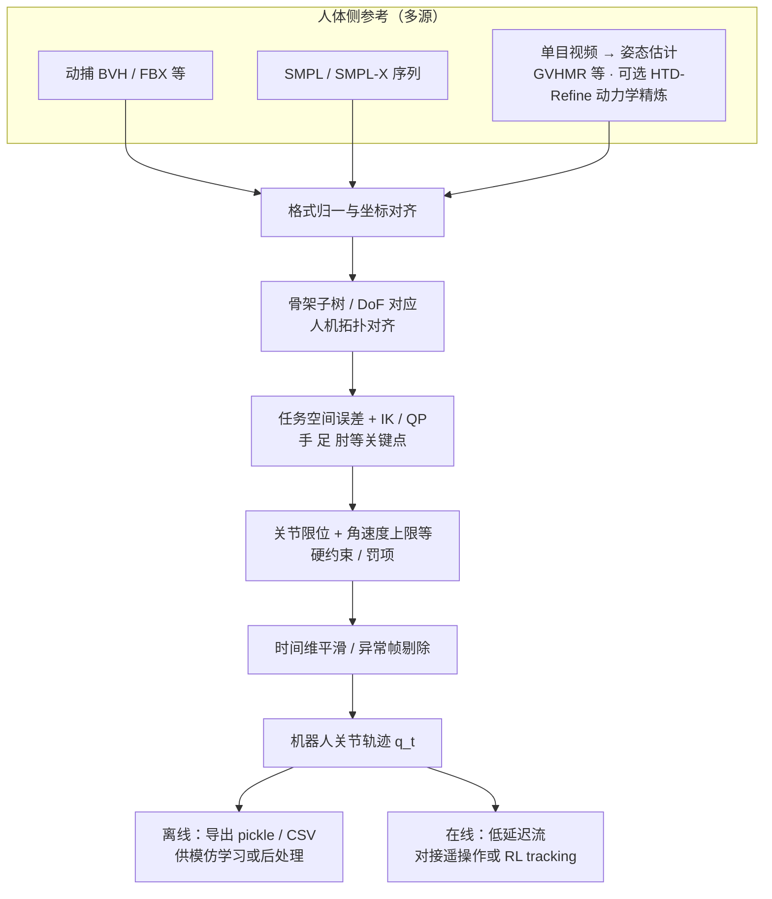
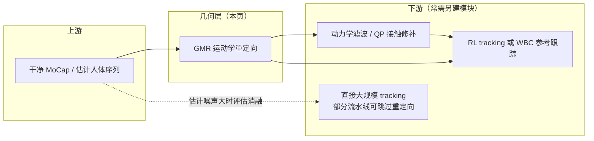

# GMR: 通用动作重定向

**GMR (General Motion Retargeting)** 是运动控制流程中的“前端”模块，负责将人类或其他来源的动作序列转换为机器人可理解的关节角度序列。

> **命名说明**：本知识库中的 **GMR** 默认指 *General Motion Retargeting*（通用动作重定向），与统计学里的 **Gaussian Mixture Regression（高斯混合回归）** 缩写相同但无关。亦勿与 Disney Research 的 [Generative Motion Rig（SIGGRAPH Talks 2026）](../entities/generative-motion-rig.md)（同缩写 **GMR**，Blender 生成式关键帧插件）混淆。

## 英文缩写速查

| 缩写 | 英文全称 | 简要说明 |
|------|----------|----------|
| GMR | General Motion Retargeting | 通用人体→机器人动作重定向方法 |
| MoCap | Motion Capture | 输入运动序列的主要来源 |
| IK | Inverse Kinematics | 满足关节限位与末端约束的求解 |
| SMPL | Skinned Multi-Person Linear Model | 常见人体参数化与重定向源 |
| WBT | Whole-Body Tracking | 重定向产物用于下游跟踪训练 |

## 核心原理

GMR 主要基于**运动学 (Kinematics)** 优化。它不考虑力学项，而是通过最小化几何误差来实现姿态复现。

### 优化目标
1. **关键点位置匹配**：让机器人的手掌、脚掌、肘部等关键点位置尽可能贴近参考轨迹。
2. **关节限位约束**：确保生成的角度不超出机器人的物理极限。
3. **平滑性约束**：减少相邻帧之间的角度突变。

## 单条流水线的结构（Mermaid）

下图概括「人体参考 → 机器人关节序列」在**几何层**上的典型数据流；与具体实现中的 IK 配置、关键点权重、是否滑窗等细节可能略有出入，但便于在工程里对齐模块边界。

## 在整条控制栈中的位置（Mermaid）

GMR 解决的是「**长得像**」；是否「**站得稳、力矩可行**」要在下游处理。

## 主要技术路线

| 模块 | 核心方法 | 关键约束 |
|------|---------|---------|
| **骨架映射** | 关节树匹配 / 重排 | 处理人机自由度不一致 |
| **几何对齐** | 关键点 IK (Inverse Kinematics) | 最小化手/足位置与参考轨迹误差 |
| **数值求解** | 基于 QP 的优化器 | 满足关节限位与角速度连续性 |
| **后处理** | 时间平滑 + 静态稳定性筛选 | 减少高频噪声，剔除极度失稳片段 |

## 开源实现侧的工程要点

官方仓库自述中强调的能力（便于与论文/代码对齐，**不等价**于「已解决动力学可行性」）：

- **CPU 上实时重定向**，面向全身遥操作与在线闭环（例如与 [TWIST](https://github.com/YanjieZe/TWIST) 等管线配套）。
- **多机型、多人体数据格式**：同一套接口切换目标人形机器人；支持常见动捕导出与视频估计链路（仓库持续扩展具体格式与 MJCF/URDF）。
- **与 RL tracking 协同**：README 写明针对 RL 跟踪策略做过工程调参；并提供与 [BeyondMimic](./beyondmimic.md) 等工具链对接的 **pickle → CSV** 等转换脚本思路。
- **默认关节角速度上限等保护**：减少「几何可行但电机跟不上」的极端指令（仍以机器人标定与控制器实测为准）。

论文与报告可优先查阅：[arXiv:2505.02833](https://arxiv.org/abs/2505.02833)、技术报告 [arXiv:2510.02252](https://arxiv.org/abs/2510.02252)；录用信息以官方仓库徽章为准（如 ICRA 2026 标注）。

## 关键局限与避坑指南

根据《开源运动控制项目》文档的点评，GMR 的使用必须注意其“非物理性”：

### 1. 缺乏动力学一致性
GMR 只管姿态“像不像”，不管“能不能站稳”。
- **表现**：重定向后的轨迹可能出现脚悬空、质心超出支撑多边形的情况。
- **后果**：直接把 GMR 输出给底层 PD 控制器，机器人极大概率摔倒。

### 2. 接触不连续性
由于没有建模接触力，GMR 输出的轨迹在脚触地瞬间可能存在穿透或虚位。

### 3. 速度与加速度跳变
几何最优不代表导数最优。

### 4. 何时怀疑「重定向在帮倒忙」
若上游是人体 **估计/生成** 轨迹（全局漂移、脚滑、时序不连贯），几何重定向可能在「对齐人机比例」的同时 **放大** 空间误差；此时应做消融对比「重定向 → 跟踪」与「跳过中间层 → 跟踪」，参见下文 ExoActor 反例与 [SONIC](./sonic-motion-tracking.md) 讨论。

## 工业界最佳实践

**GMR 只是起点，不是终点。** 

一个完整的重定向流水线应为：
$$
\text{Raw MoCap} \xrightarrow{GMR} \text{Kinematic Trajectory} \xrightarrow{\text{Dynamic Filter}} \text{Feasible Trajectory}
$$

- **动力学过滤层**：通过 QP 优化（如 HALO 方式）或全动力学优化，补上质量、惯性和接触力约束。
- **RL 细化**：将 GMR 轨迹作为参考，通过 [BeyondMimic](./beyondmimic.md) 等框架训练具有鲁棒性的 RL 策略。

## 反例：什么时候不该用 GMR

并非所有流水线都从重定向获益。[ExoActor (BAAI, 2026)](./exoactor.md) 在视频生成 → 动作估计 → 动作跟踪的流水线上做了消融：

- **现象**：在估计出来的 SMPLX 轨迹上叠加 GMR / OmniRetarget 后，全身运动确实更平滑、抖动更少，但同时引入了明显的全局空间偏差。
- **原因**：上游动作估计本身有全局位置漂移和脚滑，重定向尝试"修正"这些伪影时反而破坏了原本的轨迹；同时人机肢长比例差异会放大步长与位置积累误差。
- **结论**：在该流水线下，作者选择**直接把人体动作喂给 SONIC**，跳过中间重定向阶段。

这说明 GMR 在 MoCap → 机器人这种"源动作干净"的链路上是收益项，但在"源动作本身就来自上游估计/生成模型"的链路上，需要额外评估它是否会放大上游噪声。

## 互补视角：NMR 把 GMR 放进数据管线

[NMR（神经运动重定向与人形全身控制）](./neural-motion-retargeting-nmr.md) 仍用 GMR 生成**运动学初轨迹**，再通过 **CEPR**（聚类、并行 RL 跟踪专家、仿真 rollout）得到物理更一致的 **人机配对** 监督，最后训练 CNN–Transformer 做整段推断。可将这条路线理解为：**GMR 负责覆盖与几何对齐，仿真 RL 负责把轨迹拉回可行流形，神经网络负责快速、时序一致的前向重定向**。

[ReActor](./reactor-physics-aware-motion-retargeting.md) 则把「参考形变」与「RL 跟踪」放进**同一双层优化**：上层直接优化参数化参考，下层策略在同一仿真环里更新；不依赖单独的前向重定向网络，而是强调**可计算的上层梯度近似**与跨形态（含四足）的参考生成。可与「GMR 先几何、再在别处补物理」对照阅读。

[SPIDER](./spider-physics-informed-dexterous-retargeting.md) 把「几何/运动学参考」之后的修补写成**并行仿真中的采样轨迹优化**，并用**课程式虚拟接触力**处理接触歧义；不强调训练跨数据集通用 RL 跟踪器，而强调**轨迹级搜索**在跨灵巧手与人形数据生成上的外壳作用。

[KDMR](../entities/paper-kdmr.md) 与 [SPARK](../entities/paper-spark-skeleton-aligned-retargeting.md) 均以 GMR 为运动学基线：前者用 **GRF 锚定多接触 TO** 修补脚浮空与速度尖峰；后者用 **human URDF 校准** 降跨机型 IK Empbpe，再经渐进 KDTO 服务高动态（side flip）。二者都接 BeyondMimic 类跟踪，说明「GMR 之后仍需动力学层」在 2026 线的量化证据。

## 参考来源

- [sources/papers/motion_control_projects.md](../../sources/papers/motion_control_projects.md) — 飞书公开文档《开源运动控制项目》总结。
- [sources/papers/exoactor.md](../../sources/papers/exoactor.md) — ExoActor 的重定向消融提供"什么时候不该用 GMR"的反例。
- [sources/papers/neural_motion_retargeting_nmr.md](../../sources/papers/neural_motion_retargeting_nmr.md) — NMR 以 GMR 为 CEPR 前端的神经重定向工作。
- [sources/papers/reactor_rl_physics_aware_motion_retargeting.md](../../sources/papers/reactor_rl_physics_aware_motion_retargeting.md) — ReActor：仿真内双层 RL 重定向与 GMR/NMR 的定位对照。
- [sources/papers/spider_scalable_physics_informed_dexterous_retargeting.md](../../sources/papers/spider_scalable_physics_informed_dexterous_retargeting.md) — SPIDER：采样优化式物理重定向与运动学前端的衔接。
- Ze Y., et al. *GMR: General Motion Retargeting* — [arXiv:2505.02833](https://arxiv.org/abs/2505.02833)；技术报告 [arXiv:2510.02252](https://arxiv.org/abs/2510.02252)。
- [GMR 源码仓库](https://github.com/YanjieZe/GMR) — 功能列表、支持的机器人与数据格式、与 TWIST / MimicKit 等生态链接。
- [sources/papers/egohtr_arxiv_2607_13472.md](../../sources/papers/egohtr_arxiv_2607_13472.md) — EgoHTR Human2Robot 将 GMR 与 OmniRetarget/CoACD 并列。

## 关联页面

- [Motion Retargeting (动作重定向)](../concepts/motion-retargeting.md) — 任务概览。
- [BeyondMimic](./beyondmimic.md) — 动作模仿学习通常以重定向后的轨迹作为输入。
- [ExoActor](./exoactor.md) — 视频生成驱动的人形控制流水线，给出"何时跳过 GMR"的反例。
- [NMR（神经运动重定向与人形全身控制）](./neural-motion-retargeting-nmr.md) — 用 GMR + 仿真 RL 构造监督的学习式重定向。
- [ReActor（物理感知 RL 运动重定向）](./reactor-physics-aware-motion-retargeting.md) — 双层联合优化参考与跟踪策略。
- [NCKU 合成视频人形任务](../entities/paper-synthetic-video-humanoid-tasks.md) — Veo→SMPL-X→**GMR**→RL 跟踪管线（仿真）。
- [SPIDER（物理感知采样式灵巧重定向）](./spider-physics-informed-dexterous-retargeting.md) — 并行仿真采样优化 + 虚拟接触引导的数据生成外壳。
- [KDMR](../entities/paper-kdmr.md) — GRF 多接触动力学重定向；相对 GMR 降跟踪误差。
- [SPARK（骨架对齐重定向）](../entities/paper-spark-skeleton-aligned-retargeting.md) — URDF 校准相对 GMR 大幅降 Empbpe。
- [UMR](../entities/paper-umr-unified-motion-retargeting.md) — 学表面点对，不手写 GMR 式关键点；LAFAN1/BeyondMimic 上难动作成功率与体段误差优于 GMR（arXiv:2609.02134）
- [GMR vs NMR vs Reactor（重定向方法谱系对比）](../comparisons/gmr-vs-nmr-vs-reactor.md) — 三种路线的并排选型对照。
- [DART（DartControl）](./dart-control.md) — SMPL-X 运动学输出经 GMR 等人形执行接口的常见上游之一。
- [SONIC（规模化运动跟踪）](./sonic-motion-tracking.md) — 与「跳过重定向、直接 tracking」路线对照阅读。
- [Gen2Humanoid](../entities/gen2humanoid.md) — HY-Motion 生成轨迹经 GMR 到多机型的端到端胶水管线。
- [EgoHTR](../entities/paper-egohtr.md) — rough-terrain 场景对齐人演示的 Human2Robot 上游之一。
- [HumanTracker](../entities/paper-humantracker.md) — 153 h 光学基准用 GMR 得到 29-DoF `qpos` 参考，再人工剔除漂浮/穿地。
- [X-Morph](../entities/paper-xmorph.md) — 视频链路用 GMR 把 SMPL→G1，再跨形态到非人形腿式机器人。
- [CoRe v0.1.0](../entities/core-retarget.md) — SOMA 输入 + 接触精炼的开源对照；论文 [CoRe](../entities/paper-core.md) / [RMR](../entities/paper-rmr.md)。
