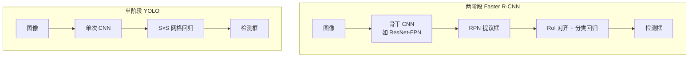

# 目标检测（Object Detection）

## 一句话定义

**目标检测**在给定图像中同时回答 **「有什么物体」** 与 **「在哪里（边界框）」**；在机器人中它为 **抓取、导航、人机交互** 提供 **物体级语义与几何锚点**。

## 英文缩写速查

| 缩写 | 英文全称 | 简要说明 |
|------|----------|----------|
| mAP | mean Average Precision | 检测精度标准指标 |
| R-CNN | Regions with CNN features | 区域 CNN 两阶段检测开山工作 |
| RPN | Region Proposal Network | Faster R-CNN 中的可学习提议子网 |
| YOLO | You Only Look Once | 单次回归实时检测范式 |
| DETR | DEtection TRansformer | 集合预测、无 anchor/NMS 的检测 Transformer |
| IOU | Intersection over Union | 框重叠率，训练与评估核心量 |
| NMS | Non-Maximum Suppression | 去重后处理 |
| FPN | Feature Pyramid Network | 多尺度特征金字塔 |

## 为什么重要

- **操作前置：** 抓取管线常依赖 **6DoF 位姿估计** 或 **候选框**（见 [Manipulation](../tasks/manipulation.md)）；检测质量直接决定后续规划可否启动。
- **实时闭环：** 移动机器人、足球人形（[Humanoid Soccer](../tasks/humanoid-soccer.md)）需要 **>10–30 FPS** 感知；[YOLO v1](../entities/paper-yolo-unified-realtime-detection.md) 确立了 **单次回归** 的可行路线。
- **与分类/分割分工：** 检测输出 **稀疏实例框**；语义分割给 **逐像素类**；实例分割二者兼有——机器人任务按 **延迟与输出形式** 选型。

## 主要技术路线

### 两阶段：区域提议 + 分类

| 阶段 | 代表 | 特点 |
|------|------|------|
| R-CNN | Girshick et al. | Selective Search 提议 → CNN 特征 → SVM；慢 |
| Fast R-CNN | 共享卷积特征 | 比 R-CNN 快，仍依赖外部提议 |
| Faster R-CNN | RPN + RoI | 端到端训练，**ResNet-FPN** 骨干常见；精度高、延迟较大 |

**机器人语境：** 离线标注、高精度抓取、算力充足的服务器侧感知。

### 单阶段：密集预测 / 回归

| 方法 | 核心思想 | 典型性能（论文时代） |
|------|----------|----------------------|
| [YOLO v1](../entities/paper-yolo-unified-realtime-detection.md) | S×S 网格一次回归 | 63.4 mAP @ **45 FPS** |
| SSD | 多尺度 default boxes | 精度与速度折中 |
| RetinaNet | Focal loss 平衡难易样本 | 单阶段逼近两阶段精度 |

**机器人语境：** 机载实时 **球体/障碍/人** 检测；后续 YOLOv5–v8/v11/v26、TensorRT 加速为工程主流——统一入口见 [Ultralytics](../entities/ultralytics.md)。

### 端到端 Transformer：DETR / RF-DETR（无 NMS）

| 方法 | 核心思想 | 典型性能（近期） |
|------|----------|------------------|
| DETR | 集合预测 + Hungarian 匹配 | 精度高、早期训练慢 |
| RT-DETR / LW-DETR | 实时化 hybrid encoder + 轻量 decoder | 接近 YOLO 延迟 |
| [RF-DETR](../entities/rf-detr.md) | **DINOv2 骨干 + weight-sharing NAS**；一次训练后在 Pareto 前沿选分辨率/decoder 深度 | **RF-DETR-L 56.5 AP @ 6.8 ms**；2XL **首破 60 AP**（COCO, T4 TRT FP16） |

**机器人语境：** 需要 **无 NMS 确定性延迟**、**ViT 域迁移**（如 RF100-VL 类垂直数据集）或 **检测+分割统一 API** 时，[RF-DETR](../entities/rf-detr.md) 是 YOLO 之外的工程选项；开放词汇/语言指令仍走 GroundingDINO 等 VLM 路线。

### 车载扩展：2D 四大族与 3D 传感器路线

深蓝AI 专辑将车载 **2D** 划为两阶段 Anchor、单阶段 CNN Anchor（含 YOLO v3–v9）、Anchor-Free、Transformer（含 DETR）四族；**3D** 则按 **单目 / 双目 / LiDAR（含多模态）** 选型——PointPillars 偏量产实时，CenterPoint 衔接 MOT。完整表见 [《自动驾驶核心算法盘点》专栏技术地图](../overview/autonomous-driving-core-algorithms-series.md)；勿把 COCO mAP 直接当成 KITTI/nuScenes 3D 结论。

### 流程总览

### 在感知链中的位置：骨干特征 → 检测头 → 策略输入

检测头并非终点，而是「**骨干特征 → 检测/分割头 → 策略输入**」衔接链的中间环节：上游由 [视觉骨干](../concepts/vision-backbones.md) 提供多尺度特征（骨干族取舍见 [CNN vs ViT 对比](../comparisons/cnn-vs-vit-backbones.md)），检测头将其转成 **结构化的物体框/掩码/ROI**，再作为策略的显式输入——这是与「骨干特征图直喂策略」并列的两条接法之一（见 [视觉表征作为策略输入](../concepts/visual-representation-for-policy.md)）。要结构化物体就接检测头、要整图语义就走表征直喂，三类选型决策树见 [感知骨干/表征选型 Query](../queries/perception-backbone-selection.md)。

## 误差画像与组合

YOLO v1 误差分析（相对 Fast R-CNN）：
- **定位错误** 占比最高——小目标、密集场景尤甚。
- **背景误报** 显著更少——全图上下文的优势。
- **组合策略：** YOLO 对 Fast R-CNN 重打分可 **+3.2 mAP**，利用互补误差结构。

## 常见误区或局限

- **误区：「mAP 高就等于机器人能用。」** 实机还需考虑 **相机标定、延迟、类别开放集、遮挡与运动模糊**。
- **误区：「只换最新 YOLO 就够。」** 数据分布（仿真纹理 vs 真机）、**输入分辨率与 NMS 阈值** 往往比架构版本更敏感。
- **局限：** 纯 2D 框不提供 **完整 6DoF**；操作常需级联 **深度/点云/位姿网络**。

## 关联页面

- [视觉骨干（概念）](../concepts/vision-backbones.md)
- [CNN vs ViT 视觉骨干（对比）](../comparisons/cnn-vs-vit-backbones.md)
- [视觉表征作为策略输入（概念）](../concepts/visual-representation-for-policy.md)
- [感知骨干/表征选型 Query](../queries/perception-backbone-selection.md)
- [ResNet（论文实体）](../entities/paper-resnet-deep-residual-learning.md)
- [YOLO v1（论文实体）](../entities/paper-yolo-unified-realtime-detection.md)
- [RF-DETR（实体）](../entities/rf-detr.md)
- [Manipulation（任务）](../tasks/manipulation.md)
- [Humanoid Soccer（任务）](../tasks/humanoid-soccer.md)
- [Booster RoboCup Demo](../entities/booster-robocup-demo.md)
- [Visual Servoing（方法）](./visual-servoing.md)
- [Query：目标检测模型选型](../queries/object-detection-model-selection.md)
- [Ultralytics YOLO](../entities/ultralytics.md)
- [Tennis-Vision](../entities/tennis-vision.md) — 广播网球：出点率 ≠ 定位精度；更大 YOLO 检人已饱和
- [《自动驾驶核心算法盘点》专栏技术地图](../overview/autonomous-driving-core-algorithms-series.md) — 车载 2D/3D 检测与跟踪上游

## 参考来源

- [YOLO v1 论文摘录（arXiv:1506.02640）](../../sources/papers/yolo_arxiv_1506_02640.md)
- [ResNet 论文摘录（arXiv:1512.03385）](../../sources/papers/resnet_arxiv_1512_03385.md)
- [经典视觉骨干与检测文献簇](../../sources/papers/vision_backbone_detection_classics.md)
- [RF-DETR 论文摘录（arXiv:2511.09554）](../../sources/papers/rf_detr_arxiv_2511_09554.md)
- [Ultralytics 仓库归档](../../sources/repos/ultralytics.md)
- [深蓝AI 2D 目标检测篇](../../sources/blogs/wechat_shenlan_ai_ad_2d_detection.md)
- [深蓝AI 3D 目标检测篇](../../sources/blogs/wechat_shenlan_ai_ad_3d_detection.md)

## 推荐继续阅读

- [YOLO 论文 PDF](https://arxiv.org/pdf/1506.02640.pdf)
- [Faster R-CNN](https://arxiv.org/abs/1506.01497)
- [Ultralytics](../entities/ultralytics.md) — YOLO 工程主仓
- [RF-DETR 文档](https://rfdetr.roboflow.com/latest/)（实时 DETR 微调与部署）
