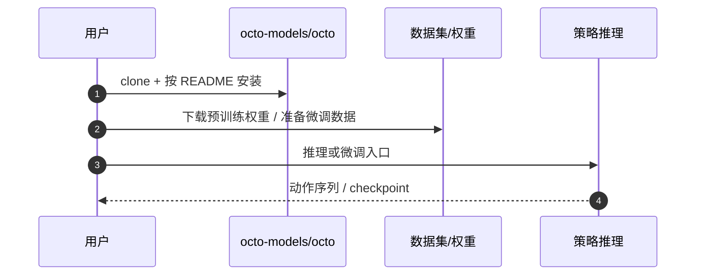

# Octo（开源 Generalist Policy）

**Octo**（[arXiv:2405.12213](https://arxiv.org/abs/2405.12213)，[代码](https://github.com/octo-models/octo)）是开源通用机器人操作策略，常作为跨本体预训练 + 微调基线，并与 RT 系列、OpenVLA、π₀ 等对照。HMI 论文总索引编号 **P056**。论文详情节点见 [paper-octo](../entities/paper-octo.md)（本方法页不再持有 `arxiv`，避免双节点）。

## 一句话定义

**Octo**：开源的通用机器人操作策略，通常基于 Transformer / 扩散式动作头，在 Open X-Embodiment 等多数据集上预训练，支持语言或图像目标，并可在新机器人上做高效微调。

## 英文缩写速查

| 缩写 | 英文全称 | 简要说明 |
|------|----------|----------|
| VLA | Vision-Language-Action | 视觉-语言-动作多模态基础策略方向 |
| OXE | Open X-Embodiment | 跨本体混合演示数据底座 |
| Transformer | Transformer | 共享任务表示的骨干结构 |
| Finetune | Finetuning | 新相机/动作空间上的适配 |

## 为什么重要

- **开源 generalist 模板**：在 [Open X-Embodiment](../concepts/open-x-embodiment.md) 等大混合数据上预训练，暴露动作头与观测适配接口以便迁移到新硬件。
- **社区基线**：降低「规模化预训练 + 微调」试错成本，与闭源 RT / 商用 VLA 叙事并列。
- **HMI 坐标清晰**：在「世界模型、VLA 与 Agent」分组中提供可复现对照点。

## 主要技术路线

- **开源 generalist 模板**：在 OXE 等混合数据上预训练，暴露读出头与观测适配接口。
- **社区基线**：与 RT / OpenVLA / π₀ 对照「规模化预训练 + 微调」。
- **HMI 坐标**：论文总索引 P056。

## 核心原理

块状注意力 Transformer 学习共享任务表示；独立读出头适配新观测与动作维度，避免把传感器和动作写死在主干里。训练数据来自多机构混合轨迹，评测关注少样本迁移而非单域刷榜。

## 工程实践

1. 从官方权重与 README 的微调脚本起步，先固定相机与动作归一化。
2. 新机器人优先改读出头与动作缩放，再决定是否解冻视觉主干。
3. 与 [OpenVLA](../entities/openvla.md)、[π₀](./π0-policy.md) 对比时对齐数据预算与评测任务。

| 检查项 | 建议 |
|--------|------|
| 开源 | **已开源**（octo-models/octo） |
| 数据许可 | 回各源数据集条款，勿假设 OXE 聚合等于统一商用授权 |
| 人形适用 | 末端/操作向通用策略；全身平衡仍需低层底座 |

## 源码运行时序图

## 结论

**Octo 的价值在「可公开复现的通才操作基线」，不是人形全身控制的终点。**

- 先把它当跨本体微调起点，再与任务专用策略比。
- 读出头适配是迁移主接口；不要假设关节级动力学已对齐。
- 数据许可与评测设定决定结论能否外推。
- 人形部署仍需低层 WBC/locomotion 承接平衡与接触。

## 局限与风险

- 通用操作策略不等于全身 loco-manipulation。
- 混合数据域权重不当会造成负迁移。
- 权重与脚本时效以官方仓为准。

## 关联页面

- [Octo 论文实体](../entities/paper-octo.md)
- [Open X-Embodiment（概念）](../concepts/open-x-embodiment.md)
- [Open X-Embodiment（论文实体）](../entities/paper-open-x-embodiment.md)
- [VLA](./vla.md)
- [HMI 论文导读](../queries/hmi-papers-coverage.md)
- [VLA/WM 14 篇阅读路线](../overview/vla-wm-reading-roadmap-14-papers-technology-map.md)

## 参考来源

- [rl_foundation_models.md](../../sources/papers/rl_foundation_models.md)
- [ted_xiao_embodied_three_eras_primary_refs.md](../../sources/blogs/ted_xiao_embodied_three_eras_primary_refs.md)
- [humanoid-motion-intelligence.md](../../sources/repos/humanoid-motion-intelligence.md)

## 推荐继续阅读

- [arXiv:2405.12213](https://arxiv.org/abs/2405.12213)
- [项目页](https://octo-models.github.io/)
- [GitHub: octo-models/octo](https://github.com/octo-models/octo)
