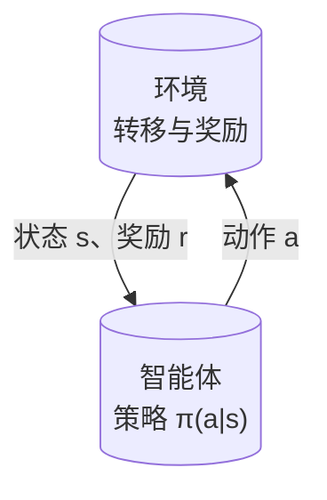
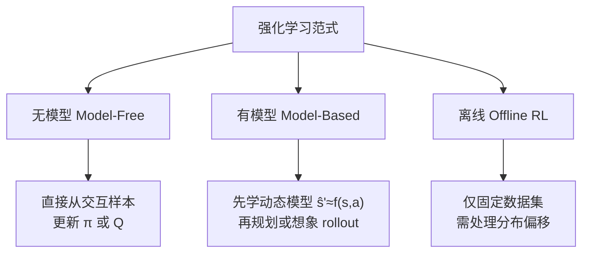
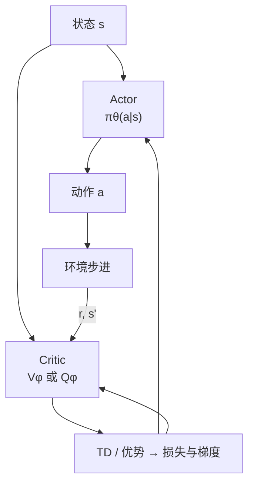
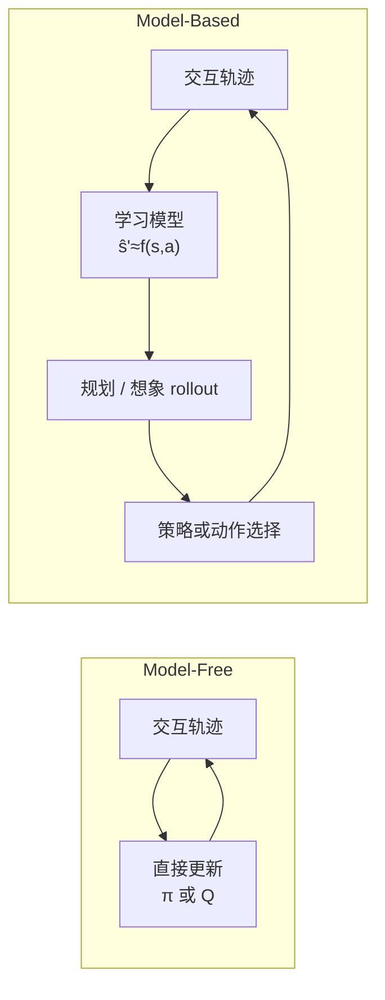

# Reinforcement Learning (RL, 强化学习)

**强化学习 (Reinforcement Learning)**：通过与环境交互，以最大化累积奖励 (Reward) 为目标学习决策策略的机器学习范式。

## 一句话定义

不需要告诉机器人“怎么做”，只需要告诉它“做得好不好”，让它自己从 PPO 等算法中摸索出最优动作序列。

## 英文缩写速查

| 缩写 | 英文全称 | 简要说明 |
|------|----------|----------|
| RL | Reinforcement Learning | 通过与环境交互最大化长期回报的学习范式 |
| MDP | Markov Decision Process | 状态–动作–奖励–转移的标准建模框架 |
| PPO | Proximal Policy Optimization | 人形/足式 loco 中最常用的 on-policy 策略梯度算法 |
| MBRL | Model-Based Reinforcement Learning | 先学环境动态再规划或想象 rollout |
| OFRL | Offline Reinforcement Learning | 仅用固定数据集训练，需处理分布偏移 |
| SAC | Soft Actor-Critic | 连续控制常用的 off-policy 最大熵算法 |

## 核心框架：MDP

强化学习问题通常建模为马尔可夫决策过程 (MDP)：

- **状态** $s$：机器人当前感知到的环境信息
- **动作** $a$：机器人可以采取的行动
- **奖励** $r$：环境给机器人的反馈信号
- **策略** $\pi(a|s)$：在每个状态下选择动作的规则
- **折扣因子** $\gamma$：未来奖励的重要性

目标：找到最优策略 $\pi^*$ 最大化期望累积折扣奖励。

下面用流程图表示 **智能体–环境闭环**：每一步由当前状态选动作，环境返回奖励与下一状态，循环构成 MDP 上的数据流。

## 主要分类

从「是否显式学环境模型」与「是否允许在线与环境交互」两个角度，可把常见 RL 路线粗分为三类（下图与后文小节一一对应）：

### 无模型（Model-Free RL）
不学习环境模型，直接从交互数据学习策略。这是目前人形机器人 Locomotion 最主流的方法。

代表算法：
- **Policy Gradient (策略梯度)**：直接优化策略。
    - **PPO (Proximal Policy Optimization)**：目前工业界和学术界最稳健、最常用的策略梯度算法。
    - **[deepmimic](deepmimic.md)**：经典的显式轨迹跟踪模仿学习。
    - **[amp-reward](amp-reward.md)**：基于判别器的对抗性动作先验学习。
    - **[ase](ase.md) / [smp](smp.md)**：更先进的层次化技能嵌入与生成式动作先验。
    - **BRRL / BPO (2026)**：有界重要性比强化学习，为 PPO 提供理论支撑并提升训练稳定性。
    - **[EFGCL](./efgcl.md)**：训练期外部辅助力 + 按成功率衰减的物理引导课程，加速高动态全身动作的稀疏奖励学习。
    - **REINFORCE**：最基础的策略梯度方法。
- **Q-Learning**：学习状态-动作价值函数 (Q-function)。
    - **DQN**：深度 Q 网络，适用于离散动作。
- **Actor-Critic (行动者-评论家)**：结合两者优势。
    - **PPO**：通常以 Actor-Critic 架构实现。
    - **SAC (Soft Actor-Critic)**：样本效率极高的 Off-policy 算法。
    -     **TD3**：改进的 DDPG。
    - **IER（Instant Episode Repetition）**：[论文实体](../entities/paper-instant-episode-repetition.md) — 交互层 plug-in：新高回报 episode 后立即重放动作序列 RN 次；SAC/TD3+MuJoCo/DMC+真机验证（arXiv:2608.17347；[已开源](https://github.com/UoA-CARES/instant-episode-repetition)）。

**Actor–Critic** 同时维护策略网络与价值网络；Critic 提供 bootstrap / 优势估计，Actor 据此更新策略。信息流可概括为：

### 有模型（Model-Based）
先学习环境动态模型，再用模型做 planning。

代表：
- Dreamer, MuZero, PETS, MBRL
- **解耦式人形工程管线：** [LIFT](../entities/lift-humanoid.md)（大规模并行 **SAC** 预训练 + **物理知情** 可微动力学模型上做 **model-based** 微调）

### 离线强化学习（Offline RL）
从固定数据集中学习，不允许和环境交互。

代表：CQL, IQL, Decision Transformer

## 在机器人控制中的典型应用

- 四足/双足行走
- 人形机器人全身控制
- 机械臂操作
- 多指灵巧手操作

## 优势

- 能处理高维状态/动作空间
- 不需要精确建模
- 能发现人工难以设计的复杂策略

## 局限

- Sample efficiency 低（需要大量交互）
- Reward 设计困难（腿足与人形 locomotion 常占主要调参时间；近年出现 **VLM/LLM 生成可执行奖励代码** 的闭环管线，例如 [E-SDS](../entities/paper-e-sds-environment-aware-humanoid-locomotion-rl.md) 在感知观测上条件化地形统计以支撑复杂地形）
- 安全性难以保证（尤其是真实机器人上）
- 训练不稳定
- **全流式（batch=1、无 replay）** 时，单步梯度尺度噪声无法被 minibatch 平均，价值与策略头易出现过大/过小交替更新；近年工作用 **意图更新（intentional updates）** 在输出空间反解步长以稳定跟踪，见 [Intentional Updates for Streaming RL](./intentional-updates-streaming-rl.md)。

## Model-Free vs Model-Based 对比

| 维度 | Model-Free RL | Model-Based RL |
|------|--------------|----------------|
| **代表算法** | PPO, SAC, TD3 | Dreamer, MBPO, PETS, TD-MPC |
| **样本效率** | 低（需大量真实交互） | 高（模型生成虚拟经验） |
| **渐近性能** | ✅ 理论上最优 | ⚠️ 受模型精度限制 |
| **实现复杂度** | ✅ 低 | ❌ 高（学模型 + 策略） |
| **计算开销** | ✅ 推理直接 | ❌ 推理时需规划 |
| **机器人应用** | Locomotion（高频控制） | 操作任务、真实机器人少样本 |
| **Sim2Real** | 依赖域随机化 | 适配模块（RMA 类） |

两者不互斥：Model-Based 方法（如 RMA Adaptation Module）常与 Model-Free 策略结合。

下图为两种范式的 **数据与决策主干** 对比（省略实现细节；真实系统常混合使用）。

## 和其他方法的关系

- **vs 训练循环编排（Runner）**：RL 算法给出损失；[RL Runner](../concepts/rl-runner.md) 决定数据从哪来、用几次、是否丢掉、要不要改参数（On-policy / Off-policy / Offline / 蒸馏 / 评测等）。读 rsl_rl `OnPolicyRunner` 或 SB3 `learn()` 时先对循环，再对 clip/熵。
- **vs 模仿学习**：RL 自己探索，IL 跟随专家。IL 样本效率高但依赖专家数据；RL 可超越专家但训练难。见 [RL vs IL 对比](../comparisons/rl-vs-il.md)。
- **vs 最优控制**：RL model-free，最优控制 model-based。两者在 [Model-Based RL](./model-based-rl.md) 中逐渐融合。
- **vs 深度学习**：现代机器人 RL 通常用 [深度学习基础](../concepts/deep-learning-foundations.md) 中的神经网络做策略/价值函数逼近。
- **vs WBC**：RL 学习型，WBC 优化型。见 [WBC vs RL](../comparisons/wbc-vs-rl.md)。
- **残差式用法**：已有控制器/先验打底时，RL 只学补偿量 $a=a_{\text{base}}+\Delta a$，样本效率与安全性同时改善。见 [Residual Policy Learning](./residual-policy-learning.md) 及谱系论文（[Residual RL](../entities/paper-residual-rl-robot-control.md)、[RPL](../entities/paper-residual-policy-learning.md)、[ResMimic](../entities/paper-resmimic.md)、[RuN](../entities/paper-notebook-run-residual-policy-for-natural-humanoid-locomot.md)）。

## 参考来源
- [RobotsHub：万字解析运控 PPO](../../sources/blogs/wechat_robotshub_ppo_locomotion_fundamentals.md) — MDP → 策略梯度 → GAE → PPO 的运控教学链
- [sources/personal/rl_runner_types.md](../../sources/personal/rl_runner_types.md) — Runner 类型谱系（On-policy / Off-policy / 蒸馏 / 评测）
- [sources/papers/intentional_streaming_rl.md](../../sources/papers/intentional_streaming_rl.md) — 流式 RL 意图更新（Intentional TD / PG）ingest 档案
- [KungFuAthleteBot](../entities/paper-kungfuathlete-humanoid-martial-arts-tracking.md) — 高动态武术 tracking+recovery（[source](../../sources/papers/kung_fu_athlete_bot.md)）
- [KungfuBot](../entities/paper-notebook-kungfubot-physics-based-humanoid-whole-body-cont.md) — 自适应跟踪容差课程 + 非对称 actor-critic（[PBHC](../../sources/repos/pbhc.md)）
- [Sutton & Barto RL 教材](../entities/sutton-barto-rl-book.md) — RL 标准教材，MDP 框架基础（[一手资料](../../sources/sites/incompleteideas-net-rich-sutton.md)）
- [强化学习史（§1.6）](../concepts/reinforcement-learning-history.md) — 试错 / DP / TD 三线汇合；[sources 归档](../../sources/courses/sutton_barto_rl_book_ch01_sec06_history.md)
- [Richard Sutton](../entities/richard-sutton.md) — RL 奠基人与 incompleteideas.net 一手资料索引
- Schulman et al., *Proximal Policy Optimization Algorithms* — 机器人领域最常用的 policy gradient 算法
- Ao et al., *Bounded Ratio Reinforcement Learning* (2026) — BRRL / BPO，策略优化新进展
- [sources/papers/policy_optimization.md](../../sources/papers/policy_optimization.md) — 策略优化（PPO/SAC/BRRL）ingest 档案
- [sources/papers/locomotion_rl.md](../../sources/papers/locomotion_rl.md) — locomotion RL ingest 摘要（AMP/ASE 等）
- [sources/papers/interprior_arxiv_2602_06035.md](../../sources/papers/interprior_arxiv_2602_06035.md) — InterPrior：模仿初始化后 RL 微调与失败态恢复（HOI）ingest 摘要
- [sources/papers/e_sds_arxiv_2512_16446.md](../../sources/papers/e_sds_arxiv_2512_16446.md) — E-SDS：环境感知 VLM 奖励合成 + 人形地形 RL（arXiv:2512.16446）ingest 摘要
- [sources/repos/boyu_ai_hands_on_rl.md](../../sources/repos/boyu_ai_hands_on_rl.md) — 《动手学强化学习》开源教材与代码（PPO/SAC 等中文实践入口）
- [sources/papers/barkour_arxiv_2305_14654.md](../../sources/papers/barkour_arxiv_2305_14654.md) — Barkour：三专长 PPO + Locomotion-Transformer 通才蒸馏（LeggedGym / Isaac Gym）ingest 档案
- [sources/papers/sim2real.md](../../sources/papers/sim2real.md) — sim2real 与策略迁移相关论文摘录
- [sources/papers/resmimic_arxiv_2510_05070.md](../../sources/papers/resmimic_arxiv_2510_05070.md) — ResMimic：GMT 预训练 + PPO 残差后训练的人形 loco-manipulation（arXiv:2510.05070）
- [sources/personal/residual-policy-reading-list.md](../../sources/personal/residual-policy-reading-list.md) — Residual Policy / Residual RL 九篇论文精读清单（残差谱系编译来源）
- [Locomotion RL 论文导航](../../references/papers/locomotion-rl.md) — 机器人 RL 应用论文集合
- [机器人论文阅读笔记：PPO](https://imchong.github.io/Robot_Learning_Paper_Notebooks/papers/01_Foundational_RL/PPO_Proximal_Policy_Optimization/PPO_Proximal_Policy_Optimization.html)
- [机器人论文阅读笔记：AMP](https://imchong.github.io/Robot_Learning_Paper_Notebooks/papers/01_Foundational_RL/AMP_Adversarial_Motion_Priors_for_Stylized_Physics-Based_Character_Control/AMP_Adversarial_Motion_Priors_for_Stylized_Physics-Based_Character_Control.html)
- [机器人论文阅读笔记：ASE](https://imchong.github.io/Robot_Learning_Paper_Notebooks/papers/01_Foundational_RL/ASE_Adversarial_Skill_Embeddings_for_Large-Scale_Motion_Control/ASE_Adversarial_Skill_Embeddings_for_Large-Scale_Motion_Control.html)

## 关联页面
- [RL Runner（训练循环编排）](../concepts/rl-runner.md) — On-policy / Off-policy / 蒸馏 / 评测等十类循环，算法接到环境上的那一层
- [具身智能高频面试题库](../entities/embodied-interview-qa.md) — 卷二 RL 算法面试速查；腿足落地对照卷六与本库 locomotion 页
- [机器人学习五大范式](../comparisons/robot-learning-five-paradigms-taxonomy.md) — RL 作为奖励信号主线，与 IL / LfV / VLA / 持续学习对照
- [深度学习基础](../concepts/deep-learning-foundations.md)
- [Effective Degree（论文实体）](../entities/paper-effective-degree.md) — 函数空间简洁正则；Procgen 上对 PPO actor 提升未见 level 泛化（ICML 2026）
- [Richard Sutton](../entities/richard-sutton.md) — RL 奠基人与一手资料总入口
- [Sutton & Barto RL 教材](../entities/sutton-barto-rl-book.md) — 理论标准教材
- [强化学习史](../concepts/reinforcement-learning-history.md) — Sutton & Barto §1.6 三线史学框架
- [The Bitter Lesson](../concepts/bitter-lesson.md) — scaling 方法论（search + learning）
- [动手学强化学习（蘑菇书）](../entities/hands-on-rl-book.md) — 中文 RL 教材与 PPO/SAC 章节，适合 Stage 0 打底
- [Intentional Updates for Streaming RL](./intentional-updates-streaming-rl.md) — batch=1、无 replay 时的步长与稳定跟踪
- [Imitation Learning](./imitation-learning.md)
- [Inverse Reinforcement Learning](./inverse-reinforcement-learning.md) — 从演示推断 $r$，再走本页的 RL 内环或再优化
- [InterPrior（论文实体）](../entities/paper-interprior.md) — 模仿初始化 + RL 微调巩固 HOI 先验（arXiv:2602.06035）
- [E-SDS（论文实体）](../entities/paper-e-sds-environment-aware-humanoid-locomotion-rl.md) — 地形统计条件化 VLM 奖励 + 人形感知行走 PPO（arXiv:2512.16446）
- [Fault-Tolerant Locomotion（论文实体）](../entities/paper-fault-tolerant-locomotion.md) — 非对称 actor–critic + latent-alignment 应对执行器功率损失（arXiv:2608.07328）
- [TEMPO（论文实体）](../entities/paper-tempo.md) — VLA 语义/动作双 TD3 环与双频后训练（arXiv:2608.07314）
- [Temporal GRPO（论文实体）](../entities/paper-temporal-grpo.md) — VLA 结果 GRPO 的阶段信用写回（arXiv:2608.13026；未开源）
- [Q-Planning（论文实体）](../entities/paper-qplanning.md) — 冻结 BC + 离策略 Q 吸收失败 rollout 自改进（arXiv:2608.21204；已开源）
- [SRL-MPC（论文实体）](../entities/paper-srl-mpc.md) — RL 调 MPC 参数而非端到端策略（arXiv:2608.21175）
- [TOSS Framework（论文实体）](../entities/paper-toss-framework.md) — 人类教学四维过程模型 + OSF 数据（arXiv:2608.21083）
- [HIL-HARC（论文实体）](../entities/paper-hil-harc.md) — 真机在线 RL：CTDE 混合动作 + HRA 分解 critic（arXiv:2608.09762）
- [SmoothRL](../entities/paper-smoothrl.md) — 异步 chunk 执行环内 value-gradient 在线微调冻结 VLA（arXiv:2608.29768；未开源）
- [ResMimic（论文实体）](../entities/paper-resmimic.md) — GMT 先验 + 物体条件残差 PPO 的两阶段 loco-manipulation（arXiv:2510.05070）
- [REFINE-DP（论文实体）](../entities/paper-loco-manip-161-157-refine-dp.md) — 扩散规划器 DPPO 微调 + 低层 PPO 联合优化（arXiv:2603.13707）
- [Residual Policy Learning（方法页）](./residual-policy-learning.md) — base + 残差统一框架与九篇谱系论文导航
- [RuN（论文实体）](../entities/paper-notebook-run-residual-policy-for-natural-humanoid-locomot.md) — CMG 运动先验 + 轻量残差的 G1 自然走跑（arXiv:2509.20696）
- [TSIL（论文实体）](../entities/paper-tsil-temporal-self-imitation-learning.md) — 长时域操作 PPO：自适应时间目标 + 效率加权自模仿（arXiv:2606.19752）
- [Sim2Real](../concepts/sim2real.md)
- [Whole-Body Control](../concepts/whole-body-control.md)
- [Locomotion](../tasks/locomotion.md)
- [仿生多模态机器人综述（Science Robotics 2026）](../entities/paper-bioinspired-multimodal-robotics.md) — 控制从分立模态控制器迁向学习框架的领域综述
- [WBC vs RL](../comparisons/wbc-vs-rl.md)
- [RL vs 几何控制](../comparisons/rl-vs-geometric-control.md) — 四旋翼跟踪：对称协议后没有总冠军
- [RL vs GC（论文实体）](../entities/paper-rl-vs-gc.md) — Isaac Lab DirectRLEnv + Optuna GC（RSS 2025）
- [MPC-RL](../entities/paper-mpc-rl-humanoid-locomotion-manipulation.md) — 训练期 CD-MPC 地标奖励指导 PPO、部署期纯策略
- [MPC vs RL](../comparisons/mpc-vs-rl.md) — 含训练期 MPC 指导第三条混合轴
- [Model-Based RL](./model-based-rl.md) — 利用世界模型提升样本效率
- [Hindsight Experience Replay (HER)](./her.md) — 解决稀疏奖励任务的技巧
- [过程奖励建模](../concepts/progress-reward-modeling.md) — 稠密进度/过程奖励的接口×范式读法（含 [综述](../entities/paper-progress-reward-modeling-survey.md)）
- [Multi-Agent RL (MARL)](./marl.md) — 多机器人协同与竞争
- [Generalized Advantage Estimation (GAE)](./gae.md) — 优势函数估计标准方法
- [Safe RL](../methods/safe-rl.md) — 满足硬安全约束的 RL 训练
- [RL vs Imitation Learning](../comparisons/rl-vs-il.md)（与 IL 的系统性对比）
- [PPO vs SAC](../comparisons/ppo-vs-sac.md)（on-policy vs off-policy 算法的系统性对比）
- [Curriculum Learning](../concepts/curriculum-learning.md) — 课程学习：解决稀疏奖励和训练效率问题的重要训练策略
- [KungfuBot](../entities/paper-notebook-kungfubot-physics-based-humanoid-whole-body-cont.md) — 双层优化自适应 motion tracking 容差课程（G1 真机武术）
- [EFGCL](./efgcl.md) — 外部力引导课程：用可撤除辅助力提高早期成功体验与 Critic 收敛
- [Query：人形机器人 RL 实战 Cookbook](../queries/humanoid-rl-cookbook.md)
- [Bellman 方程](../formalizations/bellman-equation.md) — 所有 RL 算法的数学根基：最优值函数满足 Bellman 最优方程
- [MDP](../formalizations/mdp.md) — RL 的形式化框架，Bellman 方程定义在 MDP 上
- [POMDP](../formalizations/pomdp.md) — 真机部分可观测场景的标准扩展
- [具身 RL 最小闭环](../concepts/embodied-rl-minimal-closed-loop.md) — 仿真里把 $S,A,R,P$ 跑通再上学習算法
- [人形 RL 策略训练五模块](../overview/humanoid-rl-policy-training-five-modules.md) — MDP → Actor-Critic → PPO → 奖励 → 蒸馏的运控训练闭环
- [PPO](./ppo.md) — 大规模并行运控的默认 on-policy 算法
- [PyBullet](../entities/pybullet.md) — 轻量入门仿真器
- [Gymnasium](../entities/gymnasium.md) — 单智能体 RL 环境 API 标准（`reset` / `step` / `spaces`）
- [HydroGym（论文实体）](../entities/paper-hydrogym.md) — *Nature* 2026 流控 RL 基准平台；Gymnasium 接口 + 通道→翼型零样本迁移（arXiv:2512.17534，已开源）
- [Cartpole 问题](../concepts/cartpole.md) — Actor–Critic 实验原点与 Gym / Isaac 教学环境对照
- [赛车漂移 RL 开源景观](../overview/racing-drift-rl-open-source-landscape.md) — f1tenth_gym / CARLA / GPU 向量化等 **轮式极限驾驶** RL 开源入口

## 继续深挖入口

如果你想沿着 RL 继续往下挖，建议从这里进入：

- [Robot Learning Overview](../overview/robot-learning-overview.md) — 机器人学习全景

### 论文入口
- [Locomotion RL 论文导航](../../references/papers/locomotion-rl.md)
- [Survey Papers](../../references/papers/survey-papers.md)

### 开源框架入口
- [RL Frameworks](../../references/repos/rl-frameworks.md)
- [Simulation](../../references/repos/simulation.md)
