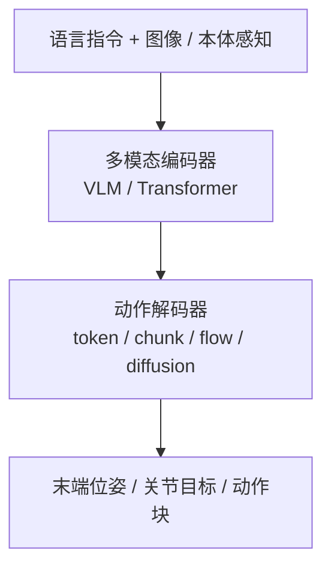

# VLA（Vision-Language-Action）

**VLA**：把视觉、语言和机器人动作统一到同一个模型里，让策略不只“看见状态后输出动作”，还能够显式理解任务指令和语义约束。

## 一句话定义

VLA 可以看成机器人版的多模态 foundation model：输入“看到了什么 + 要做什么”，输出“下一步怎么动”。在 [Foundation Policy](../concepts/foundation-policy.md) 抽象下，VLA 是 manipulation 域最主流的 foundation policy 实例。

## 英文缩写速查

| 缩写 | 英文全称 | 简要说明 |
|------|----------|----------|
| VLA | Vision-Language-Action | 视觉、语言与动作统一的多模态策略模型 |
| VLM | Vision-Language Model | 预训练视觉–语言底座，常经 SFT 适配为 VLA |
| RT-2 | Robotics Transformer 2 | 将 web-scale VLM 能力迁移到机器人控制的代表工作 |
| BC | Behavior Cloning | 监督模仿路线，常与 VLA 预训练/微调组合 |
| SFT | Supervised Fine-Tuning | 将通用 VLM 适配到特定机器人任务与数据分布 |
| VAM | Video-Action Model | 先预测视频潜动力学再解码动作，如 mimic-video |
| UEI | Unified Embodied Intelligence | 同一扩散骨干联合生成视频与动作块的统一架构 |

## 为什么重要

- 它把“任务描述”从手写 reward 或手工 state machine，转成自然语言接口。
- 它是 RT-2、π₀、OpenVLA、Octo 一类通用操作策略的共同抽象。
- 它让一个模型处理多任务成为可能，但代价是更大的数据需求、更高推理延迟，以及更复杂的部署链路。

## 主要技术路线

常见实现：
- **RT-2**：把 web-scale VLM 能力迁移到机器人控制
- **π₀**：在 VLA 上加入 Flow Matching，生成连续动作序列
- **π₀.₇**：在 π 系 VLA 上系统化**多模态提示条件**（子任务语言、片段元数据、控制模态、视觉子目标）以合并异质数据并支持推理时 **steering**；官方报告开箱 dexterity 对标 RL 专精与组合/跨本体泛化迹象（见 [π₀.₇](./pi07-policy.md)）
- **OpenVLA / Octo**：更强调开源数据、跨任务泛化和 fine-tune 流程
- **Arcadia**：把操作 VLA 与 VLN 绑在同一 Qwen2.5-VL 骨干，并用真机反馈写回仿真；公开仓只部分兑现数据生成与训练脚本（见 [Arcadia](../entities/paper-arcadia.md)）
- **Gemini Robotics 2（闭源对照）**：DeepMind 全身人形 VLA + 公开预览 ER 2 agent + On-Device 快速跨本体；**VLA 权重未开源**，ER 编排样例见 [`robotics-samples`](https://github.com/google-gemini/robotics-samples)（[实体页](../entities/gemini-robotics.md)）
- **CapVector**：在 **参数空间** 用 **辅助目标 SFT** 与 **标准 SFT** 两枚同分布 checkpoint 的差 **\(\theta_{\text{ao}}-\theta_{\text{ft}}\)** 抽取 **capability vector**，合并回 **\(\theta_{\text{pt}}\)** 得 **\(\theta_{\text{meta}}\)**；下游仅用 **标准 SFT + 轻量正交正则** 以接近纯 SFT 的开销复现 **Spatial Forcing、LaRA-VLA** 等辅助微调带来的收敛与成功率收益，并在 **LIBERO / RoboTwin** 与多 VLA 骨干上讨论 **跨域与真机** 迁移（见 [CapVector 论文实体页](../entities/paper-capvector-capability-vectors-vla.md)）
- **StarVLA**：证明强 VLM 底座（Qwen3-VL）配合简单 MLP 动作头即可在多项基准上打破 SOTA，代表极简主义路线
- **VLAct**：在 StarVLA 栈上做 **表征中心持续预训练**（多头共监督 + 部分统一跨本体动作布局）；16 GPU 开源数据达 LIBERO-Plus **82.6%**、未见 GR-1 仅 20% 轨迹超全数据 GR00T-N1.6（见 [VLAct](../entities/paper-vlact.md)，arXiv:2608.27550）
- **GIFT / MINERVA / XR-2（2026-09-04 九篇盘点）**：[GIFT](../entities/paper-gift-intermediate-feature-training.md) 用几何/可供性/目标区域监督中间特征（LIBERO-Plus 79.6/72.6/87.8%，代码待发布）；[MINERVA](../entities/paper-minerva-libero.md) 用 0.54M task-ID 策略量 LIBERO 容量下限（约 95%，CPU 5.1 ms/chunk，已开源）；[XR-2](../entities/paper-xr2-bimanual-household.md) 开放 1500 小时双臂家务数据（策略未见）。横切面见 [开源可复现性 9 篇地图](../overview/open-source-reproducibility-9-papers-technology-map.md)
- **FWBC-VLA（浙大 / 上海 AI Lab 等，arXiv:2609.03889）**：无 F/T 的 HSR-Force 残差同时条件化 π₀.₅ 与轮足底盘补偿；M20S 擦白板终段 **64%**、开门 **52%**；**确认未开源**（见 [FWBC-VLA](../entities/paper-fwbc-vla.md)）
- **Pelican-Unified 1.0**：在 Qwen3-VL 上叠 **推理末态潜变量 \(z\)** 与 **Wan 系 UFG**，用 **同一扩散去噪** 联合生成未来视频与动作块，语言 / 视频 / 动作损失回传共享表示；定位为 **统一具身智能（UEI）** 闭环而非 VLA+世界模型流水线拼接（见 [Pelican-Unified 1.0](./pelican-unified-1.md)）
- **mimic-video（Video-Action Model, VAM）**：用 **互联网规模视频扩散骨干**（如 Cosmos-Predict2）在 **潜空间** 形成与语言一致的 **视觉动力学计划**，再以 **流匹配动作解码器** 作 **逆动力学** 输出动作块；论文叙事强调相对传统 VLA 的 **样本效率** 与把瓶颈转移到 **视频表征质量**（见 [mimic-video](./mimic-video.md)）
- **DeFI**：将 **GFDM（SVD 系前向动力学）** 与 **GIDM（DINO+VQ 自监督逆动力学）** 在混合/无标签视频上 **分开预训练**，下游再 **冻结前向 + 扩散适配器** 耦合微调，缓解 2D 预测与 3D 动作的目标纠缠并放大无动作标签人视频（见 [DeFI](./defi-decoupled-dynamics-vla.md)）
- **RLDX-1**：在 Qwen3-VL 与 GR00T 系训练栈上引入 **MSAT** 多流扩散动作头，可选运动模块、时序记忆与触觉/力矩物理流，并配套图捕获与 RTC 的低延迟推理实现
- **Xiaomi-Robotics-0**：**Qwen3-VL-4B + DiT flow matching**；两阶段预训练（**Choice Policies** 扩展 VLM → 冻结 VLM 训 DiT）+ 面向 **异步 action chunk** 的后训练（**Λ 形注意力、前缀随机遮蔽、flow 损失重加权** 等），强调仿真与双臂真机 **吞吐/延迟** 叙事（见 [Xiaomi-Robotics-0](../entities/xiaomi-robotics-0.md)）
- **UCAG-P（小米具身智能 × 澳门大学，arXiv:2608.26058）**：共享 **相机系腕/抓取锚点几何**，翻译器再出 80 维稀疏命令；人手当独立 embodiment 直接监督；单 checkpoint LIBERO **98.3%** / RoboTwin **88.7%/89.2%** / GR-1 **62.0%** / LIBERO-Plus 零样本 **82.0%**；**代码 coming soon**（见 [UCAG-P](../entities/paper-ucag-p.md)）
- **Xiaomi-Robotics-1**：**>100k h UMI 预训练**（VLM **自动状态转移标注**）+ **~10k h 跨本体后训练**；**Qwen3-VL + DiT MoT**（**2B/5B/10B**）；预训练 **数据/模型 scaling** 可预测迁移至 **未见环境开箱** 与 **<10h/任务** 少样本微调（**75%** vs **π₀.₅ 40%**）；**RoboCasa365 / [RoboDojo](../entities/robodojo.md)** 等四基准 SOTA（见 [Xiaomi-Robotics-1](../entities/xiaomi-robotics-1.md)）；通用操纵 **官方 sim-and-real 公益榜** 与 **XPolicyLab** 适配见 [RoboDojo](../entities/robodojo.md) / [XPolicyLab](../entities/xpolicylab.md)
- **Qwen-VLA**：**Qwen3.5-4B + 1.15B DiT flow-matching** 的 **通才** 实例；**操作 + VLN + 轨迹** 同一 checkpoint，**embodiment prompt** 切换平台（见 [Qwen-VLA](../entities/qwen-vla.md)）
- **Perceptron Isaac 0.5（2026-08）**：**36B-A2.5B** 稀疏 Qwen-family 骨干 + **null-expert** 路由；**FAST + Flow/DiT** 双动作接口；用专有未来 percept 自监督把 **1M h** 无动作视频与 teleop 共训，报告达到同一动作损失所需遥操作 **210×** 下降。代码 Apache 2.0；Hub 权重入库日 **COMING SOON**。**不是** NVIDIA Isaac 仿真栈（见 [Perceptron Isaac 0.5](../entities/perceptron-isaac-05.md)）
- **DyPES-VLA（HKUST-GZ / COCO Matrix，arXiv:2608.06374）**：用 **未来帧预测** 学 **共享动力学先验（query）**，再用 **本体特化 MoE** 在 **原生动作空间** 出控，避免手工统一动作格式；LIBERO **98.0%** / RoboCasa-GR1 **59.25%** / RoboTwin **89.02%**，真机三本体均值 **75.6%**（代码 coming soon；见 [DyPES-VLA](../entities/paper-dypes-vla.md)）
- **Qwen-RobotManip**：通义 [Qwen-Robot Suite](../entities/qwen-robot-suite.md) 内 **操作专精** VLA；**80-d 跨本体对齐 + Human-to-Robot 合成 + OOD 榜 north star**，与 Qwen-VLA **同 DiT flow 族** 但分域 scaling 叙事（见 [Qwen-RobotManip](../entities/qwen-robot-manip.md)）；相机系 ΔEEF 对照见 [UCAG-P](../entities/paper-ucag-p.md) 的锚点几何
- **SONIC × GR00T N1.5（NVIDIA 公开演示）**：高层 VLA 与低层 **规模化 motion tracking** 策略经 **统一控制接口** 串联，由同一套 tracking policy 承担快速全身反应；可作为「慢 VLA + 快执行器」分层形态的案例（细节以 [SONIC](./sonic-motion-tracking.md) 与项目页为准）
- **LLM 监督 VLA（Anthropic Embody，2026-07）：** 通用聊天模型不直接出关节，而是对 **MolmoAct** 的 7 维提案做接受/修改/替换。这把操作成功率从直接控制的个位数抬到可用，但 **所有测试模型仍弱于 VLA 单独跑**；过改会伤分，VLA 不会的新场景上最强模型才有净增益。接口抽象见 [LLM 机器人控制接口](../concepts/llm-robotics-control-interfaces.md)，评测床见 [Embody](../entities/anthropic-embody.md)。
- **MotionWAM vs VLA（Mondo / HKUST，arXiv:2606.09215）**：在 **同 Stage 3 演示 + 同 SONIC 低层** 设定下，**视频世界模型隐状态条件** 的 WAM（76.1%）大幅超过 **GR00T-N1.7**（43.9%）等 VLA 微调基线——说明人形 loco-manip 闭环更依赖 **动力学先验** 而非单独加强 **VLM 语义先验**（见 [MotionWAM](../entities/paper-motionwam-humanoid-loco-manipulation-wam.md)）
- **Being-H0.7**：用 egocentric 人视频 + 机器人演示，在**潜空间**用未来观测分支监督 **latent world–action** 先验；测试时不滚未来像素，直接输出动作，并常与 **action chunking**、异步缓冲（UAC）组合部署
- **HumanNet**：百万小时量级 **人中心** 一三人称视频语料 + 策展/标注管线；论文在 LingBot-VLA 设定下给出「**约 1000h** egocentric 人视频持续预训练 vs **约 100h** 真机数据」等受控对比，用于讨论 **人类视频小时** 能否在成本上部分替代早期真机预训练（见 [HumanNet](../entities/humannet.md)；论文 Table 1 相关基准语料索引见 [对照页](../comparisons/humannet-table1-human-video-corpora.md)）
- **EgoScale**：在 **>20k h** 带 **腕 + 重定向高 DoF 手** 标签的 egocentric 人视频上预训练 **流式 VLA**，给出 **人数据规模 ↔ 验证损失（log-linear）↔ 真机灵巧后训练表现** 的实证链条，并以 **小规模视点对齐的人–机 mid-training** 承接 embodiment gap（见 [EgoScale](./egoscale.md)）
- **EgoSteer**：用 **EgoSmith** 策展 **9.6K h** 全标注 egocentric 语料 + **统一 Robot Stack HITL DAgger** + **训练-only DINOv3 世界专家** 的 flow-VLA；**40+** 自由语言双灵巧任务约 **75%** SR，双具身长程 few-shot **75+%**；**代码与权重已开源**（全量处理后数据待发）（见 [EgoSteer](../entities/paper-egosteer.md)，arXiv:2607.09701）
- **T-Rex**：在 EgoScale 同族 **人视频预训练** 之上，用 **100 h 触觉同步 play mid-training** 与 **变频率 MoT + 异步触觉 flow matching** 实现 **毫秒级触觉反应**；**12 项双手灵巧真机任务** 宏平均 **65%**，且 **朴素拼接触觉会损害 π₀.₅**（见 [T-Rex](../entities/paper-trex-tactile-reactive-dexterous-manipulation.md)，arXiv:2606.17055）
- **Green-VLA**：**L0→L1→R0→R1→R2** 五阶段课程 + **DataQA** + **64 维语义统一动作** + flow-matching 专家；**R2** 用 **IQL 轨迹优化** 与 **源噪声分布 actor** 突破 BC 饱和而不直接 RL 穿 flow；主平台 **Green 人形 32 DoF 上身**（见 [Green-VLA](../entities/paper-greenvla-staged-vla-humanoid.md)，arXiv:2602.00919）
- **Vesta（planner VLM，非 VLA）**：在 **Qwen3-VL-8B** 上 **SFT 统一** 定位 / VLN / 具身推理 / **带 memory 的子任务规划**，作 **System-2 planner** 向 **Gr00t-N1.6** 等 actor 输出文本子任务；四轴 benchmark 平均超最强单基线 **>20 pt**，R2R-CE SR **55.5%** 逼近 navigation specialist（见 [Vesta](../entities/paper-vesta-generalist-embodied-reasoning.md)，arXiv:2606.20905）
- **MINT（RSS 2026）**：用 **SDAT** 在 **DCT 频域** 做多尺度动作分词，**Intent token（低频全局）** 与 **Execution token（高频残差）** 显式解耦；策略以 **next-scale 自回归** 做意图→执行推理，**MINT-Zero** 支持 **单演示 Intent 注入** 的 one-shot 迁移；LIBERO / LIBERO-Plus / 真机报告强泛化与鲁棒性（见 [MINT](../entities/paper-mint-vla.md)，arXiv:2602.08602）
- **Evo-1（CVPR 2026）**：**0.77B** 轻量 **InternVL3-1B + cross-modulated DiT flow-matching**；**两阶段训练**（冻 VLM 对齐动作头 → 全量微调）**保持 VLM 语义对齐**；**无机器人数据预训练** 即在 Meta-World **80.6%**、LIBERO **94.8%**、RoboTwin **37.8%** 与 xArm6 真机 **78%**；RTX 4090d **2.3 GB / 16.4 Hz**；**官方 LeRobot 集成**（SO100/SO101，`lerobot-record --policy.path`）（见 [Evo-1](../entities/paper-evo1-lightweight-vla.md)，arXiv:2511.04555）
- **ROS2SmolVLA（arXiv:2608.23320）**：把 **SmolVLA 450M** 接到 **ROS 2 + UR10e** 做 **本地/边缘** 工业轻量臂拾放，而不是再刷桌面 SO-101；349 episode 笛卡尔速度微调，九场景总体 **77.72%**；**Docker + HF 权重已开源**（见 [ROS2SmolVLA](../entities/paper-ros2smolvla.md)）
- **Indi（arXiv:2608.23478）**：冻结教师 VLM 把示范片段的 **局部目标** 蒸馏进动作解码器中间态；部署零教师。GR00T-N1.7 SimplerEnv-Bridge **64.3→84.7%**、真机 **62.0→68.7%**；**项目页未列训练仓**（见 [Indi](../entities/paper-indi.md)）
- **GlanceWAM（arXiv:2608.23927）**：视频 WAM 把想象移出控制关键路径，动作头潜空间 **48 ms**；RoboCasa **72.2%**、LIBERO **99.0%**；**MIT + HF 已开源**（见 [GlanceWAM](../entities/paper-glancewam.md)）
- **M3（arXiv:2608.22419）**：训练期结构化遮蔽腕相机/语言/查询，推理结构不变；RoboTwin Clean **+21.7**，真机长时程完整任务 **+30**；**未开源**（见 [M3](../entities/paper-m3-modality-masking.md)）
- **FabriVLA（arXiv:2607.08575）**：**0.89B** 轻量 **InternVL3.5-1B + gated self-attention flow-matching + shallow VLM layer fusion**；在公开 **Evo-1 Meta-World** 数据上 **单阶段联合微调**（DeepSpeed FP32 master）；MT50 **tier-avg 90.0%** / episode **92.0%**；代码与 93k 权重已开源（见 [FabriVLA](../entities/paper-fabrivla.md)）；多基准相对位次可对照 [VLA SOTA Leaderboard](../entities/vla-sota-leaderboard.md)
- **LaST-HD**：在 **reasoning-before-acting MoT VLA** 上，用 **动作条件世界模型** 把 **非配对人手与机器人轨迹** 对齐到 **共享前向动力学潜空间**，以潜式 **物理推理** 监督动作专家；配套 **OOL Glove** 采集与 **mixed-to-human**（混合共训 + 人手在线纠偏）配方，在 **6 项真机 / 3 本体** 上报告 **仅用人类数据泛化** 与 **约 20 分钟纠偏适应**（见 [LaST-HD](../entities/paper-last-hd-latent-physical-reasoning.md)，arXiv:2606.23685）
- **GaP staging（非纯 VLA，但直接消费 VLA）**：[GaP](../entities/paper-gap-graph-as-policy.md) 在 [变体自动化](../concepts/variational-automation.md) benchmark 上用 **计算图** 做感知/相机位姿等 **结构化 staging**，再 handoff **π₀.₅ / MolmoAct2**；大位姿变化列裸 VLA **~0.20**，**π₀.₅ w/ GaP** 可达 **0.66+**（Pack varied）——说明 **可靠性 gap** 有时靠 **图式工程壳** 而非单点放大 VLA 数据
- **InternVLA-A1.5**：**Qwen3.5-2B MoT VLM + 460M unified expert**；Stage1 **持续 VQA/子任务/FAST** 共训保语义，Stage2 用 **50 foresight token** 查询 **冻结 WAN2.2** 潜式未来 + **flow matching** 连续动作；**1.2M** 机器人 + **3M** InternVLA-M1 预训练；**六套仿真全榜领先**，真机 **组合指令 OOD 绑定** 与 **13 步 MOF** 显著超 **π₀.₅/Motus**；**训练用世界模型、部署不滚像素**（~0.1s/步）（见 [InternVLA-A1.5](../entities/paper-internvla-a15-unified-vla.md)，arXiv:2607.04988）
- **G0.5（星海图）**：**Qwen3.5-2B 单一解码器** 在同一自回归流里发 **CoT + 动作码**（VLM-as-Actor）；跨本体 **RVQ ActionCodec**（27 维）+ 视觉记忆；R1 真机 **76.7%**、LIBERO **98.9%**、RoboTwin **93.3%**；**GitHub + HF 已开源**（Community License）（见 [G0.5](../entities/paper-galaxea-g05.md)，arXiv:2608.11739）
- **JoyAI-RA 0.5（京东 Joy Future Academy）**：**VLWA** = VLM + **LAC-WM** + Flow Action Expert；**隐式 latent-action** 吃无标签人视频、**显式 130-D** 规范动作吃可靠轨迹；**内–外环 RL**；AgiBot G1 seen **92.0** / unseen **75.5**，人视频缩放未见饱和；**未开源**（见 [JoyAI-RA 0.5](../entities/paper-joyai-ra-05.md)，arXiv:2608.05674）
- **RoboInter1.5**：**230k+** episode 稠密中间表示套件（Data / VQA / VLM / VLA）+ **IR 条件世界模型**；三种 plan-then-execute（IC/EC/Modular + F-CoT）；**数据与 VLM 已开源**，VLA 权重与 World 代码待齐（见 [RoboInter1.5](../entities/paper-robointer-1-5.md)，arXiv:2607.18709）
- **RynnBrain 1.1 / RynnBrain-VLA（阿里达摩院）**：**Qwen3.5** 系 **2B/9B/122B-A10B** 具身基础模型 + **接触点 / native 3D**；VLA 用 **81 维统一动作空间 + embodiment mask + flow matching + RTC**，在 **G1 / Astribot / Tianji-Wuji** 上同配方优于 **Qwen-Based-VLA** 与 **π₀.₅ / GR00T N1.7**；**基础模型权重与推理已开源**，VLA 训练栈未见公开（见 [RynnBrain 1.1](../entities/paper-rynnbrain-1-1.md)，arXiv:2607.17977）
- **ACE-Brain-0.5（大晓 Ace Robotics）**：**Qwen3-VL 8B** 统一具身脑，把 **空间感知 / 规划 / 导航·操作 / 进度估计** 收进同一闭环；**SSR+**（含 Reactivate）合并异构接口；LIBERO **98.2%**、SimplerEnv-Bridge VLA 变体 **82.3%**、RBM progress VOC 强；**HF 权重已开源**，训练栈未见（见 [ACE-Brain-0.5](../entities/paper-ace-brain-0-5.md)，arXiv:2607.04426）
- **LingBot-VLA 1.0**：**Qwen2.5-VL-3B + flow 动作头**；**2 万小时**、**9 类双臂** 真机预训练；开源 **4B** 权重（含 depth 变体）、**GM-100** 数据与 **LeRobot v3.0** 后训练范例；RoboTwin 仿真平均 SR 超 **π₀.₅**（见 [LingBot-VLA](../entities/lingbot-vla.md)，arXiv:2601.18692）
- **LingBot-VLA 2.0**：**Qwen3-VL-4B + 稀疏 MoE action expert**；约 **6 万小时** 过滤预训练（**5 万 h** 机器人 ×**20** 本体 + **1 万 h** egocentric 人视频）、**55 维统一全身动作** 与 **Dual-Query 深度/视频蒸馏**；GM-100 / 长程移动操作 **generalist** 评测超 **π₀.₅**、**GR00T N1.7** 与 **1.0**；开源 **6B 权重** 与真机部署脚本（见 [LingBot-VLA 2.0](../entities/lingbot-vla-v2.md)，arXiv:2607.06403）
- **τ₀-VLA**：**分层子任务 + 世界模型引导 TTC**（beam search 比较想象后果）；低层 **Qwen3.5 + MoT flow**、**40 维** 统一动作、**40,115 h** 预训练；长程四任务分层 **45.0%** vs 整任务 **27.5%**；低层 **已开源**、高层 TTC **逐步发布**（见 [τ₀-VLA](../entities/paper-tau0-vla.md)，arXiv:2608.16885）
- **Q-Planning**：**冻结 BC/VLA + 小型离策略 Q-chunking**；推理 **Q 加权平均** N 个 BC flow 采样；在线 **只微调 Q**、吸收失败 rollout；LIBERO-10 **93→99%**、双臂真机 stack-cups **40→90%**；**已开源**（见 [Q-Planning](../entities/paper-qplanning.md)，arXiv:2608.21204）
- **ARLI**：**异步 VLA + 延迟感知 DSRL**——用已承诺中间动作与 VLM 完成后的中间观测恢复近马尔可夫性；真机双臂 UR5e 三任务约 **40%→近 100%**（100–125 episode）；**确认未开源**（见 [ARLI](../entities/paper-arli.md)，arXiv:2608.23831）
- **ForeTime-VLA**：从 **Fast-WAM 教师** 蒸馏 **64-D 未来码** 到因果 **π₀.₅**（4 future + 1 phase token）；传送带真机 **44/90** vs π₀.₅ **23/90**；**未开源**（见 [ForeTime-VLA](../entities/paper-foretime-vla.md)，arXiv:2608.20735）
- **Lumo-2**：**Qwen3.5-4B latent WAM**——**潜空间世界动力学 φ** + **三阶段动作–视觉–语言预对齐**、历史动作记忆与 **BAR 2.71×** 推理加速；**Astribot S1** 上 **22 项** 挑战真机任务全面超 **π₀.₅/Fast-WAM**；人–机共训无需专用迁移机制（见 [Lumo-2](../entities/lumo-2.md)，arXiv:2607.11270）；[Philia](../entities/philia.md) 将其作为 gateway capability 部署
- **Dexmal DM0.5（OpenDM）**：**Gemma3-4B VLM + 680M Flow-Matching Action Expert**；**~60s 历史上下文抽象**、**11 类具身 CoT** 与 **DP 动态轨迹对齐**；**已开源** [opendm](https://github.com/dexmal/opendm) 训练/推理与 **DM05** 系列权重（LIBERO **99.0%**、RoboTwin2 Clean/Rand **93.6%/93.3%**、Table30v2 **43% SR**）（见 [Dexmal DM0.5](../entities/dexmal-dm05.md)）
- **DA-Nav（导航 VLM，非操作 VLA）**：把城市户外导航写成 **商业方向指令 + 图像平面离散网格 grounding + CoT 偏离恢复**（Qwen2.5-VL-7B LoRA）；相对连续 waypoint / 分层 NaVILA，强调 **动作表示对齐 2D 视觉推理** 与 **recovery 数据**；CARLA SoTA 并零样本 Go2/人形（见 [DA-Nav](../entities/paper-da-nav.md)，arXiv:2607.11638；**暂未开源**）
- **FSD-VLN（空中导航双系统，非操作 VLA）**：把 [GR00T N1](../entities/paper-hrl-stack-34-gr00t_n1.md) 的 VLM+DiT 迁到 UAV VLN——慢路冻结 VLM 写 VLSF，快路短视界 DiT 出 8 类离散飞行动作；未见相对自复现 OpenFly SR 5.1%→13.6%，单步 402→176 ms（见 [FSD-VLN](../entities/paper-fsd-vln.md)，arXiv:2607.08359；**确认未开源、无真机**）
- **Green for Go（导航 VLA 推理时 overlay，非新模型）**：SegFormer **绿=可通行 / 红=不可通行** 喂冻结 **OmniVLA**；Grand Tour 最远航点误差 **−27–44%**，但归一化后主要是轨迹缩短约 **30%**；图像目标与 **stop** 几乎无增益（见 [Green for Go](../entities/paper-green-for-go-vla-nav-grounding.md)，arXiv:2607.05122；**确认未开源**）。**勿与** [Green-VLA](../entities/paper-greenvla-staged-vla-humanoid.md) **混淆**。
- **CrossTracer（导航 VLA 跨本体残差，非操作 VLA）**：OmniVLA 改成 **VL-Tracer** 出无本体像素轨迹，**CE-Adapter** 按机器人 ID 做残差；NaviTrace 总分 **45.68**（相对 Gemini-2.5-Pro +28.1%），去 adapter 掉到 22.56；真机相对 OmniVLA 轮式 SR **0.40→0.65**、腿式 **0.45→0.70**（见 [CrossTracer](../entities/paper-crosstracer.md)，arXiv:2608.06688；**宣称开源 / 待核实**）
- **S²-VLA（驾驶 VLA，武汉理工，arXiv:2607.13926）**：针对单流驾驶 VLA 的 **spatial representation collapse**，把 **InternVL3-2B 多尺度语义流** 与 **绕过自回归头的 ViT 空间流**（BEV map / agent 辅助）解耦，经 **Dual-Stream Planning Adapter** 级联融合；NAVSIM 纯 SFT **PDMS 87.1 / NC 98.4**；**未开源**（见 [S²-VLA](../entities/paper-s-squared-vla.md)）

## VLA 与传统策略的区别

| 维度 | 传统 BC / RL 策略 | VLA |
|------|-------------------|-----|
| 任务输入 | 预定义 observation / goal | 自然语言 + 视觉 + 状态 |
| 泛化方式 | task-specific | 多任务/零样本/少样本 |
| 数据规模 | 百到千级演示 | 通常需要数千到数十万演示 |
| 推理开销 | 低，适合高频控制 | 高，常见 50ms+，需异步部署 |
| 适合任务 | 单任务控制 | 通用操作、多任务调度 |

## 核心优势

### 1. 语言条件化
可以直接用“把红色杯子放到左边托盘”之类的任务描述驱动策略，而不是单独写状态机。

### 2. 多任务统一
VLA 常把抓取、放置、开关门、抽屉操作等任务放进一个统一模型，而非每项任务单训一个 policy。

### 3. 语义泛化
Web 知识和视觉语义可以帮助机器人处理训练集中稀疏出现的物体、关系和指令表述。这通常配合 [Data Flywheel](../concepts/data-flywheel.md) 来实现闭环性能提升；进一步地，[LWD](./lwd.md) 把这套闭环重写为车队级 offline-to-online RL，把部署中的失败与人为干预也变成 generalist VLA 的训练信号。

## 算法能力栈 (Algorithm Capability Stack)

根据 [embodied-ai-guide](../../sources/repos/embodied-ai-guide.md) 与 [xbotics-embodied-guide](../../sources/repos/xbotics-embodied-guide.md) 的总结，具身智能的完整算法栈包含：
- **感知层 (Vision & Perception)**: 2D/3D/4D 视觉、视觉提示 (Visual Prompting)、Affordance 学习；在大规模室内场景中，可辅以互联网视频重建得到的 **3D 场景理解** 监督（例如 [SceneVerse++](../entities/sceneverse-pp.md) 支持的 [3D 空间 VQA](../concepts/3d-spatial-vqa.md) / [VLN](../tasks/vision-language-navigation.md) 数据），缓解纯 2D 图文预训练在度量空间关系上的短板。
- **规划层 (Planning)**: 基于 LLM 的任务拆解与逻辑推理。
- **策略层 (Policy)**: VLA 基础模型，通常采用分层双系统架构（慢速高层语义 + 快速低层反应）。**SFT (Supervised Fine-Tuning)** 是将通用 VLM 适配到机器人特定任务的关键步骤。
- **执行层 (Action)**: [action-chunking](action-chunking.md)、[diffusion-policy](diffusion-policy.md) 或关节控制。

## 实战路径建议

根据 [xbotics-embodied-guide](../../sources/repos/xbotics-embodied-guide.md) 的路线图，VLA 的落地建议分为四个阶段：
1. **基础掌握**：熟悉 [lerobot](../entities/lerobot.md) 框架与基础 [imitation-learning](imitation-learning.md) 算法。
2. **数据飞轮**：建立自动化数据采集与标注流水线（[auto-labeling-pipelines](auto-labeling-pipelines.md)）。
3. **模型微调**：对 OpenVLA 或 Octo 等开源模型进行针对性 SFT。
4. **真机闭环**：结合 [action-chunking](action-chunking.md) 解决推理延迟，完成实物部署。VLA 的动作头也常借助 [生成式模型基础](../formalizations/generative-foundations.md) 中的 diffusion / flow / latent variable 视角理解。

## 工程瓶颈

### 1. 推理延迟
VLA 通常不是高频底层控制器，真机上常见 50ms 以上推理延迟，因此更适合输出 action chunk、目标位姿 or 中频命令，再由低层控制器执行。

### 2. 数据规模要求高
想要稳健泛化，通常需要大量多样化演示数据。十几条示教可以做 task-specific BC，但远不足以支撑通用 VLA。除跨机构机器人日志外，**人中心互联网视频**（经策展与交互标注，如 [HumanNet](../entities/humannet.md)）正在成为持续预训练的一种规模化来源，但其分布与真机仍不同，需要与 Sim2Real 与执行层栈联合评估。

「该补哪一层数据」的类目级选型框架见 [具身数据金字塔综述](../entities/paper-data-pyramid-embodied-manipulation.md)（arXiv:2607.24744）：真机 / UMI / Ego-Exo / 仿真 / 通用五层 × 可扩展性、机器人对齐等六维属性，并把 70+ VLA/WAM 的数据配方趋势（异构混合化、规模陡增、ego 数据主料化）统一解读。

另一条被系统讨论的路线是让 **视频模态大模型** 直接提供 **时序物理先验**，把「语义 + 动力学」从静态 VLM 中部分解耦出去，再用轻量动作头吸收机器人轨迹；代表叙述见 [mimic-video（VAM）](./mimic-video.md) 与论文中的 oracle 缩放实验读法。

### 3. 部署链路复杂
摄像头时间同步、图像预处理、prompt 模板、动作反归一化、GPU 推理和安全 fallback，任何一步都可能拖垮真机体验。工程上可把「传感 + 遥操作 + 异步 chunk 推理 + 本体命令」收到可复用的实时 I/O 编排层，例如 [RIO（Robot I/O）](../entities/robot-io-rio.md) 所代表的 **Node + 可切换中间件** 路线，以减少换硬件组合时的重写面（仍以具体任务 profiling 为准）。

**长程任务编排：** 当单段 VLA chunk 不足以覆盖「复位 → 移动 → 多轮操作 → 卸载」时，可用 **行为树** 显式调度策略 `LOAD/RESUME/STOP` 与确定性宏动作（关节/底盘）。开源锚点见 [Cyclo Intelligence](../entities/cyclo-intelligence.md) 与概念页 [行为树 × VLA 编排](../concepts/behavior-tree-vla-orchestration.md)。

**长程记忆增强（模型内）：** 相似观测在不同执行阶段需不同动作时，可在 VLA 视觉侧注入 **稀疏历史证据** 而非稠密帧堆叠或在线 VLM 子任务分解。[KEMO](../entities/paper-kemo-event-driven-keyframe-memory-vla.md)（arXiv:2606.23589）用 **运动学减速峰 + DINOv2 视觉去重** 选事件关键帧，经 **门控 cross-attention** 插拔进 **π₀.₅**，在真机双臂六项记忆依赖任务上相对无记忆基线 **TSR +23.6 pt**。[EventVLA](../entities/paper-eventvla-visual-evidence-memory.md)（arXiv:2606.20092）以 **基础视觉锚点 + 前瞻式 KEM** 在 **QwenOFT** 上端到端预测关键帧并 **拼接原始图像**；发布 **RoboTwin-MeM** 诊断基准，在 17 项仿真记忆任务与 4 项真机双臂任务上相对 SOTA 记忆 VLA 平均约 **+40%**（RoboTwin-MeM **75.2%**）。另一条路线是给时序 latent **显式物理目标**：[TemporalFlow-VLA](../entities/paper-temporalflow-vla.md)（arXiv:2608.26821，港科大广州/浙大/SFU/智元）用离线 **机器人表面时序流** 监督 **π₀.₅** 上两个 chunk 对齐 query（Q₈/Q₁₅），部署 **无几何/流估计**；RoboTwin **H=3** Randomized **87.5%**、LIBERO Long **96.60%**。当阶段变化 **视觉几乎不可见**（重复按键、指定次数擦拭）时，改记 **接触力历史**：[FM-VLA](../entities/paper-fm-vla.md)（arXiv:2607.18231，清华/微软研究院等）用冻结 **Force-VAE** 把整集腕部 wrench 压成 **K=8** token（+短窗状态）注入 π₀.₅ action expert，智元 G1 三项任务平均 **83.3%**、推理仅 **+3.3 ms**，显著优于短窗力（TA-VLA）与视觉记忆（π-MEM）。**3D 多视图路线**：[BridgeVLA++](../entities/paper-bridgevla-plusplus.md)（arXiv:2608.05042，CASIA 等）在 heatmap 对齐底座上加 **时间关键帧记忆 𝒯 + 空间初始几何记忆 𝒮**（patch-token 注入、动作头不变），RMBench **96.0%**（无记忆 base 18.9%）、RLBench **93.7%**，+9.2% 参数；代码与权重已开源。与「往大 VLA 上挂记忆」正交的一条线是 **紧凑全历史策略**：[Chronos](../entities/paper-chronos.md)（arXiv:2606.30318，HUST）把观测历史写成 **SSM 潜状态**（一 token/物理步），再以 **IMLE 粗先验 + 二阶加速度桥** 生成动作；RMBench **73.6%**（相对 π₀.₅ **+62.4 pt**、Mem-0 **+22.8 pt**，约 **0.3B**），真机双臂平均 **78%**，代码与 HF ckpt 已开源。另一条轴是把历史 **压缩进固定大小 fast weights** 而非显式帧记忆：[RoboTTT](../entities/paper-robottt-test-time-training-vla-context.md)（arXiv:2607.15275，NVIDIA GEAR）在 **GR00T N1.7** 内嵌 **TTT 层**，每步 visuomotor token 对 fast weights 做 **自监督梯度更新**，把上下文扩到 **8K 步**（约 5 min）且 **推理延迟不随上下文增长**；相对单步上下文基线报告约 **+87%** 长程装配完成分，并支持 **单次人视频 in-context 模仿** 与 **部署后在线自纠偏**（与 [TTT-Parkour](../entities/paper-notebook-ttt-parkour.md) 的仿真短时微调式 TTT 不同）。**零梯度结构化 ICL** 路线见 [StellaVLA](../entities/paper-stellavla-structured-icl-vla.md)（arXiv:2608.11671）：单次检索 **任务计划 + 子目标 + 2D/3D 运动** 示范，VLA-Arena overall **0.63**。

**测试时纠偏（模型外、免训练）：** 当已有成功 rollout 可复用、又不想更新大 VLA 时，[RTCF](../entities/paper-rtcf.md)（arXiv:2608.04527）用 **PMA** 按执行历史对齐记忆轨迹，再只叠 **低频运动残差** 到冻结 PI-FAST 提案；LIBERO 聚合 **86.4→88.4**、Long **61.6→68.6**，额外延迟中位约 **11 ms（CPU）**。与可训的 [DynaWM](../entities/paper-dynawm-vla-online-correction.md)（流匹配重写）及 [DreamSteer](../entities/paper-dreamsteer-vla-deployment-steering.md)（部署筛选）对照：RTCF 零参数、单次前向，但 **截至 2026-08 无公开代码**。

## 适合放在系统中的哪一层

- **高层任务规划 / 中层动作生成**：适合
- **1kHz 力矩闭环控制**：通常不适合
- **和 WBC / impedance / skill library 结合**：当前更现实的真机方案
- **常见落地方式**：输出 [Action Chunking](./action-chunking.md) 或末端目标，再交给低层控制器和 [Safety Filter](../concepts/safety-filter.md) 执行

## 与 World Action Models（WAM）的关系

综述 *World Action Models*（arXiv:2605.12090）把典型 VLA 写作 **\(p(a \mid o, l)\)** 的语义条件策略，并指出其往往 **不显式滚未来物理状态**。当未来观测预测与动作生成在 **同一策略框架内耦合**、并以联合对象 **\(p(o', a \mid o, l)\)** 为训练目标时，文献中才归类为 **WAM**（含 Cascaded 与 Joint 两族）。入口概念页见 [World Action Models（WAM）](../concepts/world-action-models.md)。闭源产业侧 [Riemann-1.0](../entities/paper-riemann-1.md) 把 Joint 再收成 **动作优先全因果 AR**（先 \(a_t\) 再 \(z_t\)），同一模型兼任策略与仿真；真机对照表里 [G0.5](../entities/paper-galaxea-g05.md) 是其开源 VLA 对手。

*Bai et al., Embodied Robot Manipulation in the Era of Foundation Models*（arXiv:2512.22983）从 **功能角色** 而非模型家族组织操作文献：VLA 落在低层「输入建模 → 策略学习」管线，常与高层 LLM/MLLM 规划器、几何约束或 affordance 模块组合；详见 [基础模型时代具身操作综述](../entities/paper-embodied-manipulation-foundation-models-survey.md) 与配套 [Awesome-Robotics-Manipulation](https://github.com/BaiShuanghao/Awesome-Robotics-Manipulation)。

## 部署经验后训练（post-training from experience）

离线 SFT / BC 往往不足以覆盖真机 **分布偏移** 与 **接触/精细操作** 长尾失败。近年路线在预训练 VLA 之上，用 **自主 rollout + 人类干预 + 价值/优势信号** 做迭代提纯：

- **臂部为主：** RECAP、π\*0.6 等将部署轨迹转为 advantage-conditioned 微调；**[STEAM](../entities/paper-steam-advantage-modeling.md)**（arXiv:2606.29834）用 **专家帧对自监督时序偏移 + worst-of-N ensemble** 无标签估计帧级 advantage，再经 **CFGRL** 提纯 **π₀**，真机四任务较 BC **+16.2%–59%** 绝对成功率，[RLinf](https://github.com/RLinf/RLinf) 提供 LeRobot 三阶段管线；
- **零售人形系统配方（未开源）：** [DEED](../entities/paper-deed.md)（arXiv:2607.20345）在 G1-Edu + GR00T N1.6 薯片补货上，用 Data-Efficient 后训练把 naive SFT 从 **0%→32%**，再以文本 advantage 前缀适配 RECAP 到 **42%**；强调频率对齐/策展/视觉高亮，并警示第二轮自举漂移；
- **车队级：** [LWD](./lwd.md) 把成功/失败/干预统一进 offline-to-online replay；
- **人形全身：** [ROVE](../entities/paper-rove-humanoid-vla-intervention.md)（arXiv:2606.17011）指出 MoCap **全身 + 灵巧手接管** 含 **adaptation 噪声**，需 **三阶段标注 + OVE 状态价值 + 跨 embodiment 人类视频**，避免 HG-DAgger 式直接模仿干预。
- **人形全身 loco-manip 适配：** [HAF](../entities/paper-haf-humanoid-vla-adaptation.md)（arXiv:2608.16837）在冻结 flow-matching VLA 上，用 **HAF-VLA** 三阶段 action flow（locomotion+head → waist → manipulation）与 **HAF-Steer**（flow reversal + **DCT** 潜空间 **SAC**）适配天工 2.0/3.0 七项家庭长程任务，平均归一化任务分 **70.5%** vs π₀.₅ **53.3%**；**确认未开源**。
- **flow-VLA 保守 RL：** [Green-VLA](../entities/paper-greenvla-staged-vla-humanoid.md)（arXiv:2602.00919）在 **R2** 用 **Q 梯度轨迹修正回灌** 与 **初始噪声 actor**，在 WidowX 上较 R1 **+24%** 绝对成功率，适合与 on-policy PG 微调 flow 模型对照阅读。
- **产线真机 PPO on CFM-VLA：** [KinetIQ Ascend](../entities/kinetiq-ascend.md)（Humanoid, 2026）在 **BC 预训练 CFM 操作 VLA** 上用 **解耦 Thor 采样 / 云端 PPO**、**prefix-CFM 正则** 与 **稀疏奖励 + 在线 A/B 基线**，在双臂 **Alpha** 三项生产任务上用 **数天 robot-time** 报告 **42%–2× 吞吐** 与 **10–20× 失败率下降**；强调 **仅 RL 瓶颈阶段** 与 **车队部署后持续学习**。
- **语义–动作双频 RL：** [TEMPO](../entities/paper-tempo.md)（arXiv:2608.07314）冻结 VLM，对 semantic projection / action expert 分设 TD3 环并令动作侧更高更新频率；CALVIN ABC→D **SR5 81.7%**；截至入库日确认未开源。
- **同结果组 quality GRPO：** [Prism-GRPO](../entities/paper-prism-grpo.md)（arXiv:2608.17423）在 success+\(\lambda q\) 下把 all-success/all-failure 组拆成 execution-quality 谱，RoboTwin rollout 最多 **−56%**；基座 [SimpleVLA-RL](https://github.com/PRIME-RL/SimpleVLA-RL) 开源、Prism 补丁未单独发布。
- **阶段条件 GRPO：** [Temporal GRPO](../entities/paper-temporal-grpo.md)（arXiv:2608.13026）修结果驱动 VLA-RL 的**轨迹级信用混叠**——只在进入同一阶段的 rollout 之间比相对优势并写回对应区间；RoboTwin 宏平均 **75.8%**（+7.0 vs SimpleVLA-RL）；**确认未开源**，勿与 TGRPO 混名。
- **Chunk 策略自动接管：** [AutoIntervene](../entities/paper-autointervene.md)（arXiv:2608.07065）用 visual-action 支持分位数校准双向人机切换，把干预段变成选择性 DAgger；九项双臂真机上 R2 平均 **80%** 成功且操作员时间低于人工盯梢。

选型时区分：**数据采集质量**（见 [Teleoperation](../tasks/teleoperation.md)）与 **后训练如何从次优经验中提取策略**（见 [Online vs Offline RL](../comparisons/online-vs-offline-rl.md)）。

## 常见误区

- **误区 1：VLA 的实时性和传统控制器相当。**
  通常并非如此，必须认真处理推理频率和动作缓冲。
- **误区 2：VLA 可以在十条演示上学成通用能力。**
  通用能力依赖大规模、异构、多任务数据。
- **误区 3：VLA = 直接替代所有控制模块。**
  当前更可靠的工程做法仍是“VLA 负责语义与任务层，传统控制负责执行层”。
- **误区 4：LIBERO 高分等于产线可靠。**
  [GaP](../entities/paper-gap-graph-as-policy.md) 的 **VA** benchmark 显示 π₀.₅ 在 **小扰动 LIBERO** 上 **0.96**，在 **大位姿/排列变化** 列可跌至 **~0.20**；工业持久自动化需另看 [变体自动化](../concepts/variational-automation.md) 刻度与 **图式/agentic** 互补路线。
- **误区 5：VLA 端到端分数高 ⇒ System 2 认知完备。**
  [RoboBench](../entities/robo-bench.md) 显示 SOTA MLLM 在 **隐式指令、robot-view 感知、执行失败诊断** 等轴仍远低于人类；且 RoboBench 分与 **CALVIN/LIBERO** 下游 VLA 相关——选型 VLM 骨干时宜同时看 **操纵流水线认知诊断** 与 **控制基准**。

## 参考来源

- [wechat_shenlan_robot_learning_five_paradigms.md](../../sources/blogs/wechat_shenlan_robot_learning_five_paradigms.md) — 深蓝具身智能：机器人学习五大范式中的多模态 / VLA 定位
- [wechat_shenlan_five_embodied_model_taxonomy.md](../../sources/blogs/wechat_shenlan_five_embodied_model_taxonomy.md) — 深蓝具身智能五大模型（VLM/VLN/VLA/VLX/WM）分类与协同链路
- [深蓝具身智能：2025 VLA 开源复现景观（微信公众号）](../../sources/blogs/wechat_shenlan_vla_github_repro_survey_2025.md) — OpenPI、VLA-Adapter、RLinf 等 11 项 GitHub 栈策展索引
- [sources/papers/rl_foundation_models.md](../../sources/papers/rl_foundation_models.md) — RT-1 / RT-2 / π₀ / Octo / TD-MPC2 综述
- [sources/papers/diffusion_and_gen.md](../../sources/papers/diffusion_and_gen.md) — π₀ 与生成式动作建模路线
- [Embodied-AI-Guide](../../sources/repos/embodied-ai-guide.md) — Lumina 社区具身智能百科全书，涵盖能力栈与仿真管线；门户见 [Lumina](../entities/lumina-embodied.md)
- [Xbotics-Embodied-Guide](../../sources/repos/xbotics-embodied-guide.md) — 工程实践导向，包含 VLA 实战路线图与数据飞轮建设
- [embodied-interview-qa](../../sources/repos/embodied-interview-qa.md) — 中文高频面试题库（卷三 VLA/IL）；站点见 [GitHub Pages 归档](../../sources/sites/embodied-interview-qa-github-io.md)
- [SceneVerse++](../../sources/repos/sceneverse-pp.md) — 互联网视频→3D 场景的大规模自动标注与 VQA/VLN 监督（补充空间推理数据来源）
- [RLDX-1](../../sources/repos/rldx-1.md) — RLWRLD 灵巧操作 VLA 仓库与技术报告归档
- Brohan et al., *RT-2: Vision-Language-Action Models Transfer Web Knowledge to Robotic Control*
- Black et al., *π₀: A Vision-Language-Action Flow Model for General Robot Control*
- Ye et al., *StarVLA-α: Reducing Complexity in Vision-Language-Action Systems* (2026)
- [sources/papers/star_vla.md](../../sources/papers/star_vla.md) — StarVLA 极简基准模型
- [sources/papers/being_h07.md](../../sources/papers/being_h07.md) — Being-H0.7 潜空间世界–动作模型
- [sources/papers/ros2smolvla_arxiv_2608_23320.md](../../sources/papers/ros2smolvla_arxiv_2608_23320.md) — ROS2SmolVLA：ROS 2 本地 SmolVLA × UR10e
- [sources/papers/fwbc_vla_arxiv_2609_03889.md](../../sources/papers/fwbc_vla_arxiv_2609_03889.md) — FWBC-VLA：无传感器接触残差 + 轮足全身补偿
- [sources/papers/minerva_libero_arxiv_2609_03715.md](../../sources/papers/minerva_libero_arxiv_2609_03715.md) — MINERVA：LIBERO 容量下限与 CPU 推理成本
- [sources/papers/ld4wam_arxiv_2608_22403.md](../../sources/papers/ld4wam_arxiv_2608_22403.md) — LD4WAM：运动对齐潜动力学 WAM
- [sources/papers/humannet.md](../../sources/papers/humannet.md) — HumanNet 百万小时人中心视频语料与 VLA 受控预训练对比
- [sources/repos/humannet.md](../../sources/repos/humannet.md) — HumanNet 项目页与 GitHub 索引
- [sources/papers/world_action_models_survey_2605.md](../../sources/papers/world_action_models_survey_2605.md) — WAM 综述与 Cascaded/Joint 分类
- [sources/papers/embodied_robot_manipulation_fm_survey_2512_22983.md](../../sources/papers/embodied_robot_manipulation_fm_survey_2512_22983.md) — 基础模型时代操作综述（规划 × 学习双轴）
- [sources/repos/awesome-robotics-manipulation.md](../../sources/repos/awesome-robotics-manipulation.md) — Awesome-Robotics-Manipulation 策展列表
- [sources/papers/pelican_unified_uei_arxiv_2605_15153.md](../../sources/papers/pelican_unified_uei_arxiv_2605_15153.md) — Pelican-Unified 1.0（UEI）技术报告 arXiv:2605.15153
- [sources/papers/pi07.md](../../sources/papers/pi07.md) — π₀.₇ 论文与官方博客归档
- [sources/repos/awesome-wam-openmoss.md](../../sources/repos/awesome-wam-openmoss.md) — Awesome-WAM 论文库
- [sources/repos/xiaomi-robotics-0.md](../../sources/repos/xiaomi-robotics-0.md) — Xiaomi-Robotics-0 官网 / GitHub / arXiv 归档
- [sources/papers/ucag_p_arxiv_2608_26058.md](../../sources/papers/ucag_p_arxiv_2608_26058.md) — UCAG-P 相机系锚点几何预训练（arXiv:2608.26058）
- [sources/sites/xiaomi-robotics-1.md](../../sources/sites/xiaomi-robotics-1.md) — Xiaomi-Robotics-1 品牌站 / 技术报告 PDF 归档
- [sources/papers/xiaomi_robotics_1_arxiv_2607_15330.md](../../sources/papers/xiaomi_robotics_1_arxiv_2607_15330.md) — Xiaomi-Robotics-1 arXiv:2607.15330 论文归档
- [sources/papers/mimic_video_arxiv_2512_15692.md](../../sources/papers/mimic_video_arxiv_2512_15692.md) — mimic-video：Video-Action Model 与 VLA 对照的 arXiv:2512.15692 摘录
- [sources/papers/defi_arxiv_2604_16391.md](../../sources/papers/defi_arxiv_2604_16391.md) — DeFI：解耦前向/逆动力学预训练的 arXiv:2604.16391 摘录
- [sources/courses/nvidia_sim_to_real_so101_isaac.md](../../sources/courses/nvidia_sim_to_real_so101_isaac.md) — GR00T N1.6 + 语言条件操作臂 post-training 官方教程
- [sources/papers/rove_arxiv_2606_17011.md](../../sources/papers/rove_arxiv_2606_17011.md) — ROVE：人形 VLA 干预轨迹 RL 后训练（arXiv:2606.17011）
- [sources/papers/haf_arxiv_2608_16837.md](../../sources/papers/haf_arxiv_2608_16837.md) — HAF：层次 action flow + 频谱潜空间 RL 适配通才 VLA 到人形 loco-manipulation（arXiv:2608.16837）
- [sources/papers/greenvla_arxiv_2602_00919.md](../../sources/papers/greenvla_arxiv_2602_00919.md) — Green-VLA：五阶段 VLA + 统一动作 + R2 对齐（arXiv:2602.00919）
- [sources/papers/last_hd_arxiv_2606_23685.md](../../sources/papers/last_hd_arxiv_2606_23685.md) — LaST-HD：潜式物理推理 + OOL Glove 人手→机器人 VLA（arXiv:2606.23685）
- [sources/repos/cyclo_intelligence.md](../../sources/repos/cyclo_intelligence.md) — ROBOTIS Cyclo Intelligence：BT 编排 LeRobot/GR00T VLA 真机栈
- [sources/papers/lingbot_vla_arxiv_2601_18692.md](../../sources/papers/lingbot_vla_arxiv_2601_18692.md) — LingBot-VLA 1.0：2 万小时双臂务实 VLA（arXiv:2601.18692）
- [sources/repos/lingbot-vla.md](../../sources/repos/lingbot-vla.md) — LingBot-VLA 1.0 官方仓库与 4B 权重入口
- [sources/papers/lingbot_vla_v2_tech_report.md](../../sources/papers/lingbot_vla_v2_tech_report.md) — LingBot-VLA 2.0：6 万小时数据管线 + MoE + Dual-Query 蒸馏（arXiv:2607.06403）
- [sources/repos/lingbot-vla-v2.md](../../sources/repos/lingbot-vla-v2.md) — LingBot-VLA 2.0 官方仓库与权重入口
- [sources/papers/harness_vla_arxiv_2607_08448.md](../../sources/papers/harness_vla_arxiv_2607_08448.md) — Harness VLA：冻结 VLA 作接触原语 + 记忆增强 agentic harness（arXiv:2607.08448v3）
- [sources/papers/embodiedskills_arxiv_2609_01281.md](../../sources/papers/embodiedskills_arxiv_2609_01281.md) — EmbodiedSkills：guarded AgentLoop + 可执行 skill contract（arXiv:2609.01281）
- [sources/papers/fm_vla_arxiv_2607_18231.md](../../sources/papers/fm_vla_arxiv_2607_18231.md) — FM-VLA：Force-VAE 力觉长程记忆（arXiv:2607.18231）
- [sources/papers/chronos_arxiv_2606_30318.md](../../sources/papers/chronos_arxiv_2606_30318.md) — Chronos：全历史 SSM + IMLE + 二阶桥（arXiv:2606.30318）
- [sources/papers/robointer_1_5_arxiv_2607_18709.md](../../sources/papers/robointer_1_5_arxiv_2607_18709.md) — RoboInter1.5 中间表示套件（arXiv:2607.18709）
- [sources/repos/rpent.md](../../sources/repos/rpent.md) — RPent：Harness VLA 官方 agent 运行时
- [sources/papers/lehome_learning_to_fold_arxiv_2606_27163.md](../../sources/papers/lehome_learning_to_fold_arxiv_2606_27163.md) — Learning to Fold：π₀.₅ + AWR/RECAP 异步 RL 叠衣全链路（arXiv:2606.27163）
- [sources/repos/lehome_solution.md](../../sources/repos/lehome_solution.md) — LeHome 方案开源仓与 HF 权重入口
- [sources/papers/deed_arxiv_2607_20345.md](../../sources/papers/deed_arxiv_2607_20345.md) — DEED：G1-Edu + GR00T N1.6 零售补货后训练（arXiv:2607.20345）
- [sources/papers/da_nav_arxiv_2607_11638.md](../../sources/papers/da_nav_arxiv_2607_11638.md) — DA-Nav：方向感知城市尺度 VLN（arXiv:2607.11638）
- [sources/papers/fsd_vln_arxiv_2607_08359.md](../../sources/papers/fsd_vln_arxiv_2607_08359.md) — FSD-VLN：空中长程 VLN 快慢双系统（arXiv:2607.08359）
- [sources/papers/green_for_go_vla_nav_grounding_arxiv_2607_05122.md](../../sources/papers/green_for_go_vla_nav_grounding_arxiv_2607_05122.md) — Green for Go：冻结导航 VLA 绿/红视觉接地（arXiv:2607.05122）
- [sources/papers/crosstracer_arxiv_2608_06688.md](../../sources/papers/crosstracer_arxiv_2608_06688.md) — CrossTracer：像素轨迹残差跨本体导航（arXiv:2608.06688）

## 关联页面
- [Imitator Game](../entities/paper-imitator-game.md) — 字幕条件 VLA vs 人视频条件：L3 功能替代与未见任务零样本都弱（arXiv:2608.22301）
- [HOST](../entities/paper-host-one-shot-human-video.md) — 人视频 one-shot 不改 VLA 权重；先预测机器人未来观测再出动作（arXiv:2607.20033）
- [具身智能高频面试题库](../entities/embodied-interview-qa.md) — 卷三 VLA/IL 面试速查（短答案 + 频次）；深读仍以本页与实体为准
- [机器人学习五大范式](../comparisons/robot-learning-five-paradigms-taxonomy.md) — VLA 作为多模态学习信号主线，与 IL / RL / LfV / 持续学习对照
- [FB / BFM-Zero / INTACT / Mimic / VLA 任务空间表征对比](../comparisons/fb-bfm-zero-intact-mimic-vla-task-space.md) — VLA 作为任务球上的稀疏语义投影；OOD 勿只归因数据量
- [五大具身模型分类（VLM/VLN/VLA/VLX/WM）](../comparisons/vlm-vln-vla-vlx-world-model-taxonomy.md) — 感知→导航→执行→推演递进框架
- [统一机器人学习综述](../entities/paper-unified-robot-learning-survey.md) — 表征–VLA–WM 六种耦合；TMLR 2026
- [Query：具身大模型分类学选型闭环知识链](../queries/embodied-fm-taxonomy-loop.md) — VLA 是五层选型闭环的 **③ 动作执行层**：全模态+本体状态 → 关节/末端控制量，也是「泛化 ↔ 实时带宽」矛盾最尖锐的一层
- [WAM / VLA / 跨本体 9 篇技术地图](../overview/wam-vla-cross-embodiment-9-papers-technology-map.md) — Zero-WAM / StreamPI / UCAG-P / MA-VLA 等接口显式化盘点
- [VLA 开源复现景观（2025）](../overview/vla-open-source-repro-landscape-2025.md) — GitHub 高可见项目按复现目标分组
- [具身 Infra 2026 全景](../overview/embodied-infra-2026-panorama.md) — 闭环周转时间 vs 单点模型分
- [Query：具身时代 SLAM 精华与糟粕](../queries/slam-second-spring-embodied.md) — 深蓝沙龙：VLA 是 BC，Planning 不会随参数自动出现
- [VLN 四范式复现路径](../overview/vln-open-source-repro-paradigms.md) — 导航域 Uni-NaVid 等（与 UniVLA 操作栈区分）
- [Uni-LaViRA](../entities/paper-uni-lavira.md) — training-free 导航 agent：主张导航可落在 MLLM 输出流形内，对照「堆轨迹训导航 VLA」
- [DA-Nav](../entities/paper-da-nav.md) — 城市尺度方向感知 VLN：图像平面网格 + CoT 恢复（对照连续 waypoint / NaVILA）
- [FSD-VLN](../entities/paper-fsd-vln.md) — 空中 VLN 快慢双系统：GR00T N1 骨干 + VLSF（仿真、未开源）
- [Green for Go](../entities/paper-green-for-go-vla-nav-grounding.md) — 冻结 OmniVLA 的绿/红可通行 overlay（对照 Green-VLA；未开源）
- [CrossTracer](../entities/paper-crosstracer.md) — 像素轨迹残差做跨本体导航（NaviTrace；宣称开源 / 待核实）
- [深度学习基础](../concepts/deep-learning-foundations.md)
- [Foundation Policy（基础策略模型）](../concepts/foundation-policy.md)
- [仿生多模态机器人综述（Science Robotics 2026）](../entities/paper-bioinspired-multimodal-robotics.md) — 展望中将 VLA/世界模型等纳入多模态切换与环境适配的计算智能侧
- [π₀ (Pi-zero) 策略模型](./π0-policy.md) — 结合 Flow Matching 的最新 VLA 突破
- [DexHoldem](../entities/paper-dexholdem.md) — 真机扑克：预训练 VLA 领先任务 IL，但 SPSR 仍只有 47.5%
- [π₀.7（Pi-zero 0.7）通才 VLA](./pi07-policy.md) — Physical Intelligence 2026 通才模型与多模态提示条件路线
- [Perceptron Isaac 0.5](../entities/perceptron-isaac-05.md) — 36B 稀疏开源通才；视频小时置换 teleop 的 scaling law（部分开源）
- [StarVLA](./star-vla.md) — 基于 Qwen3-VL 的极简 VLA 基准
- [LingBot-Map](./lingbot-map.md) — 为 VLA 提供几何背景的流式 3D 基础模型
- [LingBot-VLA](../entities/lingbot-vla.md) — Robbyant 务实 VLA 1.0（4B、双臂 2 万小时、GM-100）
- [LingBot-VLA 2.0](../entities/lingbot-vla-v2.md) — Robbyant 务实 VLA 基础模型（6B、全身统一动作、真机部署链）
- [3D 空间 VQA](../concepts/3d-spatial-vqa.md) — 视觉–语言模型的度量空间推理任务
- [RoboBench](../entities/robo-bench.md) — MLLM 作为操纵流水线 **embodied brain** 的五维认知诊断；与 CALVIN/LIBERO VLA 相关
- [视觉–语言导航（VLN）](../tasks/vision-language-navigation.md) — 语言条件下的室内导航基准任务
- [SceneVerse++](../entities/sceneverse-pp.md) — 网页规模 3D 场景理解数据集与自动标注管线参照
- [Embodied Scaling Laws (具身规模法则)](../concepts/embodied-scaling-laws.md) — 数据规模与模型性能的关系
- [RynnBrain 1.1](../entities/paper-rynnbrain-1-1.md) — 具身预训练脑 + 跨本体统一动作空间 VLA
- [ACE-Brain-0.5](../entities/paper-ace-brain-0-5.md) — 统一具身脑：感知–规划–动作–进度闭环 + SSR+
- [Auto-labeling Pipelines (自动化标注)](./auto-labeling-pipelines.md) — 构建大规模 VLA 数据集的基石
- [Foundation Policy Alignment (策略对齐)](../formalizations/foundation-policy-alignment.md) — 跨形态知识共享的形式化
- [Unified Multimodal Tokens (统一 Token)](./unified-multimodal-tokens.md) — 现代 VLA 的架构趋势
- [Action Tokenization (动作分词)](../formalizations/vla-tokenization.md) — VLA 将动作离散化的数学过程
- [Cross-modal Attention (跨模态注意力)](../formalizations/cross-modal-attention.md) — VLA 实现视-语-控对齐的底层机制
- [Manipulation](../tasks/manipulation.md)
- [Loco-Manipulation](../tasks/loco-manipulation.md)
- [DPC](../entities/paper-dpc.md) — 去掉冻结运动接口、直接输出 G1 关节 PD 的产业反对命题（未开源）
- [DyPES-VLA](../entities/paper-dypes-vla.md) — 共享动力学先验 + 本体特化 MoE 跨本体 VLA（arXiv:2608.06374）
- [ReflexVLA](../entities/paper-reflexvla.md) — 延迟感知动态操纵 1B VLA + ReflexBench；代码待开放（arXiv:2608.14379）
- [ARLI](../entities/paper-arli.md) — 异步 VLA 延迟感知 RL 后训练；中间已承诺动作 + 中间观测条件 DSRL（arXiv:2608.23831；确认未开源）
- [SmoothRL](../entities/paper-smoothrl.md) — 异步 chunk 环内 value-gradient 在线 RL 微调 π₀.₅（arXiv:2608.29768；项目页 2026-09-04 已上线，仍未开源）
- [六条路线的窟窿](../queries/embodied-six-routes-holes.md) — VLA 的数据/实时/记忆/最后一毫米卡点与「RL 作后训练」坐标
- [AdvDex](../entities/paper-advdex.md) — 人手/灵巧手 JAAS 统一动作空间；确认未开源（arXiv:2608.14028）
- [PRM-as-a-Judge](../entities/paper-prm-as-a-judge.md) — 冻结 PRM 过程评测套件；工具仓已开源（arXiv:2608.14284）
- [Action Chunking](./action-chunking.md)
- [Diffusion Policy](./diffusion-policy.md)
- [Behavior Cloning](./behavior-cloning.md)
- [RoboTwin 2.0](../entities/robotwin.md) — 具身智能自动化数据生成平台
- [Lumina 具身智能社区](../entities/lumina-embodied.md) — Talks / Guide 社区雷达（与 Embodied-AI-Guide 同源）
- [LeRobot](../entities/lerobot.md) — Hugging Face 具身智能全栈框架
- [LLM 机器人控制接口](../concepts/llm-robotics-control-interfaces.md) — 通用 LLM 监督预训练 VLA 的评测结论（Embody）
- [Embody](../entities/anthropic-embody.md) — Anthropic 对 MolmoAct 的 LLM 监督评测床
- [LW BENCHHUB TOUR](../entities/lw-benchhub-tour.md) — EnvHub 把 SmolVLA 接到光轮双臂厨房仿真；自过滤飞轮对照
- [ROS2SmolVLA](../entities/paper-ros2smolvla.md) — ROS 2 本地 SmolVLA × UR10e；代码/数据/权重已开源（arXiv:2608.23320）
- [Indi](../entities/paper-indi.md) — 行为意图蒸馏进 VLA 解码器（arXiv:2608.23478；未开源）
- [GlanceWAM](../entities/paper-glancewam.md) — 异步 WAM 想象，动作头 48 ms（arXiv:2608.23927；已开源）
- [M3](../entities/paper-m3-modality-masking.md) — 双臂 VLA 训练期模态遮蔽（arXiv:2608.22419；未开源）
- [LD4WAM](../entities/paper-ld4wam.md) — 运动对齐潜动力学桥接人视频与 Joint WAM；确认未开源（arXiv:2608.22403）
- [LAWA](../entities/paper-lawa.md) — 潜动作作测试时未来意图；相对 Joint-WAM 延迟 −42.9%（arXiv:2608.24882；代码待发布）
- [LeTools](../entities/letools.md) — 乐聚 Kuavo 官方 LeRobot/VLA 胶水与技能编排
- [Gemini Robotics](../entities/gemini-robotics.md) — DeepMind 闭源全身 VLA + 可调用 ER 2（GR2）
- [OpenVLA](../entities/openvla.md) — 开源 Prismatic VLA 与 LoRA/OFT 微调
- [Arcadia](../entities/paper-arcadia.md) — 共享 VLN/VLA 骨干 + Sim-from-Real；G1 操作 27/100（部分开源）
- [NVIDIA SO-101 Sim2Real 实验 workflow](../entities/nvidia-so101-sim2real-lab-workflow.md) — GR00T N1.6 教程级 VLA + 四类 sim2real 策略对照
- [RLDX-1](../entities/rldx-1.md) — 多流扩散动作头 + 可选触觉/力矩与 RTC 推理栈的工程参考
- [RIO（Robot I/O）](../entities/robot-io-rio.md) — 跨形态实时采集与 VLA 闭环部署的模块化 I/O 栈（RSS 2026）
- [Xiaomi-Robotics-0](../entities/xiaomi-robotics-0.md) — 小米开源 VLA：异步 chunk 执行与后训练技巧的系统叙述
- [UCAG-P](../entities/paper-ucag-p.md) — 相机系腕/抓取锚点几何预训练；人手直接进共享动作空间（arXiv:2608.26058；代码待发布）
- [Xiaomi-Robotics-1](../entities/xiaomi-robotics-1.md) — 小米 **100k h UMI 预训练** 具身基座 VLA 与 scaling 实证
- [Query：VLA 真机部署指南](../queries/vla-deployment-guide.md)
- [Query：操作 VLA 与视频-动作架构选型](../queries/manipulation-vla-architecture-selection.md)
- [Query：VLA 与低级关节控制器融合架构](../queries/vla-with-low-level-controller.md)
- [Safety Filter](../concepts/safety-filter.md)
- [LWD（Learning while Deploying）](./lwd.md) — VLA generalist 策略的车队级 offline-to-online RL 后训练框架
- [ROVE（人形 VLA 干预后训练）](../entities/paper-rove-humanoid-vla-intervention.md) — 次优 MoCap 接管轨迹的 OVE + advantage conditioning（arXiv:2606.17011）
- [HAF（人形 VLA 层次 flow + 频谱 RL）](../entities/paper-haf-humanoid-vla-adaptation.md) — 三阶段 action flow + DCT 潜空间 SAC 适配天工 loco-manipulation（arXiv:2608.16837，未开源）
- [Green-VLA（分阶段 VLA 与人形部署）](../entities/paper-greenvla-staged-vla-humanoid.md) — DataQA + 语义统一动作 + IQL/噪声 RL 的 R2 对齐（arXiv:2602.00919）
- [JoyAI-RA 0.5（双动作对齐 VLWA）](../entities/paper-joyai-ra-05.md) — LAC-WM + 130-D 规范动作 + 内–外环 RL；AgiBot 真机人视频缩放（arXiv:2608.05674；未开源）
- [Harness VLA（冻结 VLA + 记忆增强 harness）](../entities/paper-harness-vla.md) — 固定原语库编排 `vla_act`；LIBERO-Pro / RoboCasa365 / RoboTwin C2R（arXiv:2607.08448v3，[RPent](https://github.com/RLinf/RPent)）
- [EmbodiedSkills（AgentLoop + skill contract）](../entities/paper-embodiedskills.md) — Qwen3-VL guarded runtime + OpenPI/π₀.₅；RoboTwin **86.20%**、LIBERO **97.40%**（arXiv:2609.01281，[已开源](https://github.com/DCDmllm/EmbodiedSkills)）
- [RoboHarness（异构策略编排）](../entities/paper-robo-harness.md) — VLA+RL+TAMP 能力边界路由与 Memory Bridge；LIBERO-LoHo 95.2%（arXiv:2607.18060；仓暂为项目页镜像）
- [FM-VLA（力觉长程记忆）](../entities/paper-fm-vla.md) — Force-VAE 压缩 wrench 历史注入 π₀.₅；接触计数任务平均 83.3%、+3.3 ms（arXiv:2607.18231）
- [KEMO（事件关键帧视觉记忆）](../entities/paper-kemo-event-driven-keyframe-memory-vla.md) — 运动学峰 + DINOv2 去重选帧插拔 π₀.₅（arXiv:2606.23589）
- [EventVLA（视觉证据记忆）](../entities/paper-eventvla-visual-evidence-memory.md) — 前瞻 KEM + 原始关键帧缓冲；RoboTwin-MeM（arXiv:2606.20092）
- [Chronos（全历史 SSM + 二阶动作桥）](../entities/paper-chronos.md) — 紧凑非马尔可夫策略；RMBench 73.6%、真机 78%（arXiv:2606.30318）
- [BridgeVLA++（3D heatmap + 时空记忆）](../entities/paper-bridgevla-plusplus.md) — 𝒯/𝒮 记忆；RMBench 96.0%、RLBench 93.7%（arXiv:2608.05042）
- [RTCF（免训练检索纠偏）](../entities/paper-rtcf.md) — PMA + 低频残差；LIBERO Long 61.6→68.6（arXiv:2608.04527；无公开代码）
- [DreamWAM（beyond-RGB Joint WAM）](../entities/paper-dreamwam.md) — 训练多视图未来、部署 RGB-only；LIBERO-Plus 75.47%（arXiv:2608.04996）
- [FACT（失败感知因果 WAM）](../entities/paper-fact.md) — 失败轨迹教后果；RoboTwin 87.5%、真机 +scoring 92%（arXiv:2608.10232；已开源）
- [Flex-π（多流算力柔性 WAM）](../entities/paper-flex-pi.md) — RGB/DINO/pointmap 联合；单 ckpt 56 组合 action-only↔full joint；真机 YAM ID 83.0%（arXiv:2608.10860；代码待发布）
- [Neural Introspection Gating](../entities/paper-neural-introspection-gating.md) — logit-margin 门控 VLA KV 缓存；LIBERO-Long 收回盲缓存掉点（arXiv:2608.10824；IROS 2026）
- [RoboInter1.5（中间表示套件）](../entities/paper-robointer-1-5.md) — Data/VQA/VLM/VLA + IR 条件 World；部分开源（arXiv:2607.18709）
- [Learning to Fold（LeHome 2026）](../entities/paper-lehome-learning-to-fold.md) — π₀.₅ + AWR/RECAP 异步 RL 与真机 DAgger；仿真 1st / 真机 2nd；全链路开源（arXiv:2606.27163）
- [DEED](../entities/paper-deed.md) — G1-Edu + GR00T N1.6 零售补货：Data-Efficient + RECAP（未开源，arXiv:2607.20345）
- [KinetIQ Ascend（真机 CFM-VLA PPO 后训练）](../entities/kinetiq-ascend.md) — 产线双臂人形操作 RL 工程栈与三项任务结果（Humanoid, 2026）
- [TEMPO（VLA 双频 RL 后训练）](../entities/paper-tempo.md) — 冻结 VLM + 语义/动作双 TD3 环；CALVIN SR5 81.7%（arXiv:2608.07314；未开源）
- [Prism-GRPO（同结果组 quality）](../entities/paper-prism-grpo.md) — execution quality 回收退化 GRPO 组；rollout −56%（arXiv:2608.17423）
- [Temporal GRPO（阶段条件信用）](../entities/paper-temporal-grpo.md) — 结果 GRPO 按阶段写回优势；RoboTwin 75.8%（arXiv:2608.13026；未开源）
- [AutoIntervene（Action Chunk 自动接管）](../entities/paper-autointervene.md) — 视觉–动作支持校准双向干预；双臂真机 R2 平均 80%（arXiv:2608.07065；未开源）
- [Being-H0.7](./being-h07.md) — 潜空间世界–动作模型与大规模 egocentric 视频训练
- [EgoScale](./egoscale.md) — 人视频规模预训练 + mid-training 对齐
- [EgoSteer](../entities/paper-egosteer.md) — EgoSmith + HITL DAgger + WM 增强 flow-VLA 全栈（arXiv:2607.09701）
- [HumanNet](../entities/humannet.md) — 百万小时人中心视频语料与管线级设计参照
- [World Action Models（WAM）](../concepts/world-action-models.md) — 联合未来–动作范式与 VLA/世界模型分界
- [Riemann-1.0](../entities/paper-riemann-1.md) — 闭源全因果动作优先 WAM；真机开源对照是 G0.5
- [World Action Planner](../entities/paper-world-action-planner.md) — 相对 π₀.₅ / cosmos-policy 的模型基规划对照（arXiv:2607.27599）
- [X-Foresight](../entities/paper-x-foresight.md) — 驾驶 VLA **内嵌** chunk-wise 预测式世界建模（小鹏；未开源）
- [S²-VLA](../entities/paper-s-squared-vla.md) — 驾驶 VLA **语义∥空间双流** 解耦（武汉理工；NAVSIM SFT PDMS 87.1；未开源）
- [X-Mind](../entities/paper-x-mind.md) — Visual CoT：PWM 压缩为 abstract sketch（小鹏；未开源）
- [TuringViT](../entities/paper-turingvit.md) — VLM-native 高效视觉编码器（小鹏；配方公开、资产未开源）
- [Pelican-Unified 1.0（UEI）](./pelican-unified-1.md) — Qwen3-VL 推理潜变量 + UFG 联合扩散（未来视频与动作）
- [mimic-video（Video-Action Model）](./mimic-video.md) — 视频潜计划 + 流匹配动作解码器相对 VLA 的先验分工
- [DeFI（解耦前向/逆动力学 VLA）](./defi-decoupled-dynamics-vla.md) — GFDM/GIDM 分阶段预训练 + 下游扩散耦合
- [LaST-HD（潜式物理推理 + 人手数据）](../entities/paper-last-hd-latent-physical-reasoning.md) — 世界模型对齐跨具身潜空间与 mixed-to-human 训练（arXiv:2606.23685）
- [Cyclo Intelligence（ROBOTIS Physical AI 栈）](../entities/cyclo-intelligence.md) — Docker 化数据/训练/推理 + BT 任务机
- [行为树 × VLA 编排](../concepts/behavior-tree-vla-orchestration.md) — BT 生命周期与 VLA chunk 分层模式
- [LimX COSA（人形大脑 OS）](../entities/limx-cosa.md) — S2/S1/S0 调度 V³-0 VLA + LimX WBT 的产业长程 loco-manipulation 栈（2026-07）
- [FluxVLA Engine](../entities/fluxvla-engine.md) — 逐际开源人形 VLA 训练/推理工程底座（π0.5/GR00T/OpenVLA 等）
- [OAT 有序动作 Tokenization](../entities/paper-oat-ordered-action-tokenization.md)
- [ActFovea](../entities/paper-actfovea.md) — 免训练的 VLA **运行时防护**：时空视觉–动作一致性检测 + 有界安全失败（arXiv:2607.29169）
- [Seeker](../entities/paper-seeker.md) — 无语言 IL 的动作监督视觉瓶颈；对照 VLA grounding 裁剪（arXiv:2608.13422；已开源）
- [WCM 世界模型 Critic](../entities/paper-wcm-world-critic-model.md) — VLA **RL 后训练**的 critic 换成 LeJEPA 世界模型，修单帧价值估计的错配（arXiv:2607.29613）
- [CLIFT 闭环迭代微调](../entities/paper-clift-closed-loop-iterative-finetuning.md) — 闭权重 VLA 只给托管 SFT API 时，把奖励反馈编码成 chunk 级优势 token（arXiv:2607.29172）
- [FlashVLA](../entities/paper-flashvla.md) — 流匹配 VLA 的流式 chunk 解码：交错噪声缓冲 + 因果注意力；LIBERO 异步 2.43×，真机 ≥30 Hz（arXiv:2608.27384，已开源）
- [GSR / ParaVLA](../entities/paper-gsr-paravla.md) — 改写指令崩溃来自 joint routing；冻结 T5 重绑（arXiv:2608.02497，已开源）
- [Ego2Robot](../entities/paper-ego2robot.md) — 第一人称人视频合成 15 形态 18,561 h 预训练数据（arXiv:2608.02580；管线未开源）
- [EATR-Stereo](../entities/paper-eatr-stereo.md) — 冻结 VLM + primary-aligned CVAT + 分段本体路由融合头载双目；33-DoF Omega 全流程 60%/抓取 100%（arXiv:2608.17453；未开源）
- [GIFT](../entities/paper-gift-intermediate-feature-training.md) — 动作足够用的中间特征监督；LIBERO-Plus 79.6/72.6/87.8%（arXiv:2609.04193；待发布）
- [MINERVA](../entities/paper-minerva-libero.md) — 0.54M 闭集容量下限，标准 LIBERO 约 95%，CPU 5.1 ms/chunk（arXiv:2609.03715；已开源）
- [FWBC-VLA](../entities/paper-fwbc-vla.md) — 无传感器接触残差 + 轮足全身补偿（arXiv:2609.03889；未开源）
- [XR-2](../entities/paper-xr2-bimanual-household.md) — 1500 小时双臂家务 + DAgger 修正（arXiv:2609.03591；数据已开）
- [开源可复现性 9 篇技术地图](../overview/open-source-reproducibility-9-papers-technology-map.md) — 2026-09-04 九篇盘点横切面

## 推荐继续阅读

- [POT-VLA](../entities/paper-pot-vla.md) — Persistent Object Tokenization：共享角色化 3D 对象记忆条件化 GR00T-N1.7 并做几何谓词验收；G1 **39/80→71/80**（arXiv:2607.18016）
- [πR²](../entities/paper-pi-r2.md) — GR00T-N1.7 反应式实时 flow 闭环部署（约 25 Hz；代码已开，arXiv:2607.26055）
- [HiFi-UMI](../entities/paper-hifi-umi.md) — 高保真 UMI-only 后训练匹配 teleop；HiFi-UMI-2K 2000 h（arXiv:2607.25895）
- [Patch Policy](../entities/paper-patch-policy.md) — 直接消费密集 ViT patch token 的轻量高频控制策略
- RT-2 / π₀ 原论文或项目博客
- [OpenVLA](../entities/openvla.md) / Octo 开源实现
- [Query：如何在真机上部署 VLA 策略？](../queries/vla-deployment-guide.md)
- [Query：VLA 与低级关节控制器融合架构](../queries/vla-with-low-level-controller.md)
