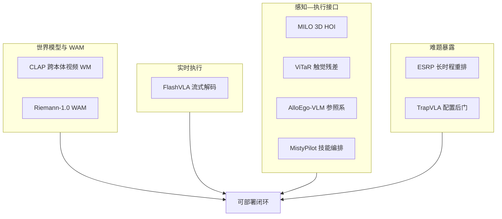

# CLAP / 跨本体 WM / VLA：9 篇论文的阅读坐标

> **本页定位**：为 [具身智能小站 · 9 篇开源盘点](https://mp.weixin.qq.com/s/J62q2IVvvBDyT_8OTR9KZQ)（2026-08-31）提供 **按四类问题组织的阅读坐标**；不复述每篇方法细节。姊妹盘点见 [WAM/VLA/跨本体 9 篇](./wam-vla-cross-embodiment-9-papers-technology-map.md)、[VLA 可执行性 9 篇](./vla-robustness-9-papers-technology-map.md)。

## 一句话观点

**具身系统正从单一动作预测走向可模拟、可流式执行、可诊断并可跨本体迁移的闭环——世界模型扩边界，VLA 修解码与安全，感知层补三维交互与参照系。**

## 英文缩写速查

| 缩写 | 英文全称 | 简要说明 |
|------|----------|----------|
| CLAP | Cross-embodiment Learning for Action-conditioned Prediction | 跨本体视频世界模型 |
| WAM | World-Action Model | 联合未来观测与动作（如 Riemann-1.0） |
| VLA | Vision-Language-Action | 视觉-语言-动作策略 |
| ESRP | Embodied Scene Rearrangement Planning | 本文家具重排任务 |

## 为什么单独做这张地图

- 公众号把 9 篇串在「CLAP 开源 + 跨本体世界模型 + VLA」叙事里。
- **9/9 独立 `paper-*` 节点**：本 ingest **新建 6**、**复用 CLAP / FlashVLA / Riemann-1.0**；**0 重复 arXiv 节点**。
- 需要横切面索引，避免 9 个实体成孤岛。

## 流程总览

## 分组索引

### 跨本体世界模型与 WAM

| # | 论文 | 开源（入库日） | 详情 |
|---|------|----------------|------|
| 02 | CLAP | **已开源** 代码+模型 | [paper-clap-cross-embodiment](../entities/paper-clap-cross-embodiment.md) |
| 05 | Riemann-1.0 | **确认未开源** | [paper-riemann-1](../entities/paper-riemann-1.md) |

### 流式 VLA 与实时控制

| # | 论文 | 开源（入库日） | 详情 |
|---|------|----------------|------|
| 03 | FlashVLA | **已开源** | [paper-flashvla](../entities/paper-flashvla.md) |

### 长时程规划与安全

| # | 论文 | 开源（入库日） | 详情 |
|---|------|----------------|------|
| 04 | ESRP | **未开源** 项目页 | [paper-esrp](../entities/paper-esrp.md) |
| 06 | TrapVLA | **未开源** Pages 站 | [paper-trapvla](../entities/paper-trapvla.md) |

### 感知—执行接口

| # | 论文 | 开源（入库日） | 详情 |
|---|------|----------------|------|
| 01 | MILO | **已开源** MIT（2026-09-05 再核） | [paper-milo](../entities/paper-milo.md) |
| 07 | ViTaR | **待发布** | [paper-vitar](../entities/paper-vitar.md) |
| 08 | AlloEgo-VLM | **已开源** | [paper-alloego-vlm](../entities/paper-alloego-vlm.md) |
| 09 | MistyPilot | **已开源** | [paper-mistypilot](../entities/paper-mistypilot.md) |

## 关联页面

- [生成式世界模型](../methods/generative-world-models.md)
- [VLA](../methods/vla.md)
- [World Action Models](../concepts/world-action-models.md)
- [Manipulation](../tasks/manipulation.md)

## 参考来源

- [wechat_embodied_station_clap_9_papers_open_source_2026-08-31](../../sources/blogs/wechat_embodied_station_clap_9_papers_open_source_2026-08-31.md)

## 推荐继续阅读

- [公众号原文](https://mp.weixin.qq.com/s/J62q2IVvvBDyT_8OTR9KZQ)
