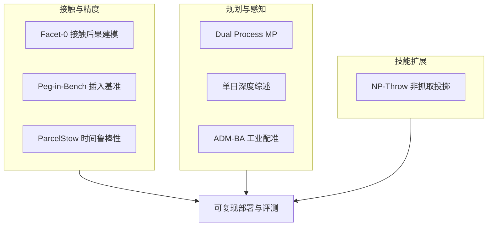

# 接触丰富操作：7 篇论文的阅读坐标

> **本页定位**：为 [具身智能小站 · 7 篇开源论文速览](https://mp.weixin.qq.com/s/v2-G3TNZV5e_Uzm0kHPZEA)（2026-09-02）提供 **按七类问题组织的阅读坐标**；不复述每篇方法细节。姊妹盘点见 [开源系统闭环 7 篇](./open-source-system-loop-7-papers-technology-map.md)、[CLAP 9 篇](./clap-cross-embodiment-vla-wm-9-papers-technology-map.md)。

## 一句话观点

**具身智能正从「单一大模型策略」走向更工程化的开源闭环：接触力、时间尺度、符号推理、几何感知、标准化硬件基准与非抓取技能，一并进入可复现系统设计的核心位置。**

## 英文缩写速查

| 缩写 | 英文全称 | 简要说明 |
|------|----------|----------|
| IL | Imitation Learning | 模仿学习 |
| RL | Reinforcement Learning | 强化学习 |
| BA | Bundle Adjustment | 束调整（ADM-BA） |
| PiH | Peg-in-Hole | 插孔装配基准任务 |

## 为什么单独做这张地图

- 公众号把 7 篇串在「开源入口 + 工程化闭环」叙事里。
- **7/7 独立 `paper-*` 节点**：本 ingest **新建 7**；**0 重复 arXiv 节点**。
- 需要横切面索引，避免 7 个实体成孤岛。

## 流程总览

## 分组索引

### 接触建模、评测与精密装配

| # | 论文 | 开源（入库日） | 详情 |
|---|------|---------------|------|
| 01 | Facet-0 | **部分开源** HF `ManuFacet-1K`；GitHub 仍 Code coming soon（2026-09-03） | [paper-facet-0](../entities/paper-facet-0.md) |
| 02 | ParcelStow | **已开源** `coenwerem/parcelstow` | [paper-parcelstow](../entities/paper-parcelstow.md) |
| 06 | Peg-in-Bench | **待核实** `aistairc/peg-in-bench`（404） | [paper-peg-in-bench](../entities/paper-peg-in-bench.md) |

### 规划与几何感知底座

| # | 论文 | 开源（入库日） | 详情 |
|---|------|---------------|------|
| 03 | Dual Process MP | **已开源** `verayannn/System-1-and-System-2-in-Motion-Planning` | [paper-dual-process-motion-planning](../entities/paper-dual-process-motion-planning.md) |
| 04 | Depth Survey | **已开源** `CVMI-Lab/Depth_Survey` | [paper-monocular-depth-estimation-survey](../entities/paper-monocular-depth-estimation-survey.md) |
| 05 | ADM-BA | **已开源** `YiranZhou-Robotics/ADM-BA` | [paper-adm-ba](../entities/paper-adm-ba.md) |

### 技能空间扩展

| # | 论文 | 开源（入库日） | 详情 |
|---|------|---------------|------|
| 07 | NP-Throw | **已开源** `Abdullah-AIST/NP-Throw` | [paper-np-throw](../entities/paper-np-throw.md) |

## 交叉阅读

- [Manipulation](../tasks/manipulation.md)
- [Imitation Learning](../methods/imitation-learning.md)
- [Reinforcement Learning](../methods/reinforcement-learning.md)

## 关联页面

- [Facet-0](../entities/paper-facet-0.md)
- [ParcelStow](../entities/paper-parcelstow.md)
- [Dual Process Motion Planning](../entities/paper-dual-process-motion-planning.md)
- [单目深度综述](../entities/paper-monocular-depth-estimation-survey.md)
- [ADM-BA](../entities/paper-adm-ba.md)
- [Peg-in-Bench](../entities/paper-peg-in-bench.md)
- [NP-Throw](../entities/paper-np-throw.md)

## 参考来源

- [具身智能小站 2026-09-02 七篇盘点](../../sources/blogs/wechat_embodied_station_7_papers_contact_manipulation_2026-09-02.md)
- [原始抓取](../../sources/raw/wechat_embodied_station_7_papers_contact_manipulation_2026-09-02.md)

## 推荐继续阅读

- [开源系统闭环 7 篇地图](./open-source-system-loop-7-papers-technology-map.md)
- [VLA / 世界模型 14 篇阅读路线](./vla-wm-reading-roadmap-14-papers-technology-map.md)
- [公众号原文](https://mp.weixin.qq.com/s/v2-G3TNZV5e_Uzm0kHPZEA)
